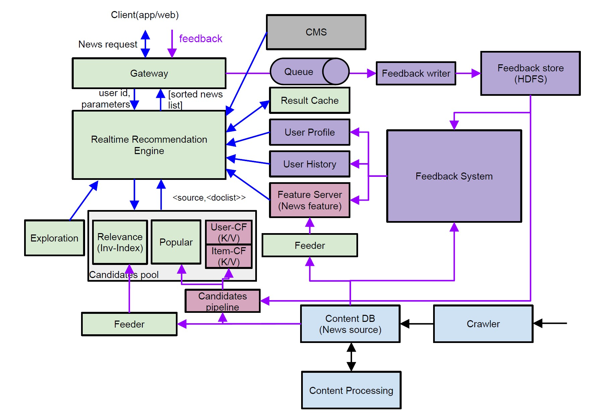
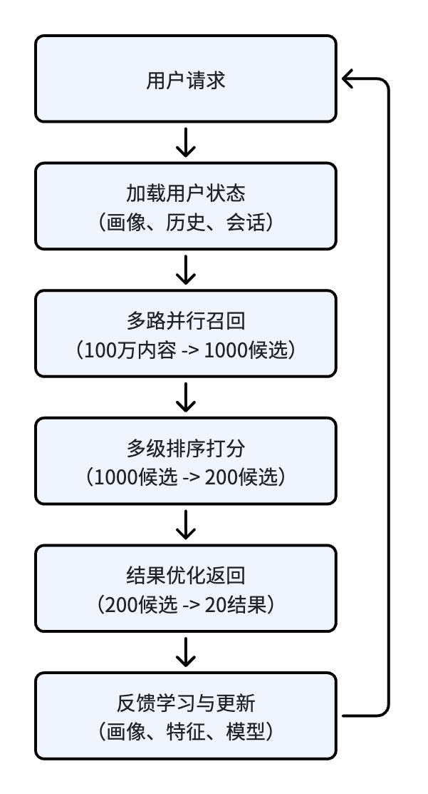

# 推荐系统架构（1）：推荐系统架构全景

推荐系统架构全景：从100万内容到20条推荐结果

## 1. 推荐系统不只是算法模型，而是完整的工程闭环

目前网络上介绍推荐系统的文章，大部分重点都是描述各种各样的推荐算法，有深度学习、有大模型。这些文章对算法的研究都很深入，里面对公式、原理的讲解非常透彻。相比之下，对于推荐系统工程化实践方面讲解的文章相对比较少，怎么划分子系统、划分模块，在线离线架构等方面讲解的不多或者比较碎片化，不成体系。

此外，在实际推荐系统落地的时候，很多研发人员都很关注算法模型的迭代，觉得推荐效果和算法模型直接相关。不少团队用了最先进的模型，最后推荐效果方面却不太理想。他们思考问题找原因的时候，习惯性的从模型入手，而没有注意到可能是工程实现不正确或配套链路缺失而引起的。

我曾经做过十多年的搜索、内容分发和推荐系统，结合之前的经验，我觉得一个推荐系统，不只是算法和模型，而是一套完整的工程链路。

算法模型是推荐系统的大脑，它能决定系统智能化上限。但这个大脑要发挥作用，需要配套的工程体系、完整的数据链路来支撑。例如：在线服务、内容治理、反馈计算、用户建模等等分布式工程，构成一个完整的闭环体系。从架构师视角来看，推荐系统本质上是一个工程化的智能匹配系统。在这个系统中，各工程化模块的建设、模型迭代，具有同等重要的地位。

算法和工程这两者相辅相成，缺一不可。如果没有良好的工程化支撑，算法只能是理论方案，是纸上谈兵；而没有先进算法的应用，推荐系统就不是真正的智能化。

## 2. 推荐系统的目标：给人推送合适的内容

推荐系统的目标是从海量的内容中，快速找到一个人感兴趣的条目。模型升级和策略优化，都是为了能高效地完成这个目标。为了达到这个目标，推荐系统需要解决的问题是：推荐什么、给谁推荐、怎么高效推荐。

### 2.1 推荐什么：理解内容

推荐系统的原材料是内容，所以系统要产出优质的结果，一定要先理解内容，这也就要求有一个结构化、标准化的内容资产体系。作为内容资产体系的一部分，内容理解的目标是把原始的内容，包括纯文本和多模态的音视频等，转换为模型可以使用的特征数据。

一般内容体系包含以下几大类信息：

- **内容基础特征**：内容固有的一些属性，例如分类、关键词、实体、发布时间、地域属性等，在内容的冷启动阶段起重要作用。

- **内容行为特征**：用户对内容的行为反馈，例如文章的点击率、完读/完播率、热度、趋势分等属性。这些特征会随着内容传播持续积累，是推荐系统进行内容评估与分发的重要依据。

- **内容质量特征**：包括权威性、原创度、情感倾向、合规性、综合质量分等属性，这些特征用于识别优质内容、限制低质低俗内容，保证平台内容生态健康。

**内容标准化处理**：所有内容需经过一系列的流水线，接入、解析、清洗、去重、标签生成、语义向量编码等，最终存入内容库，形成统一的内容资产，后续为在线服务（召回、排序）和离线流程（模型训练、反馈流程）提供稳定的数据。

结合实际落地经验，我们会发现，有一部分推荐效果不好的问题，是内容理解质量不足引起的。

### 2.2 给谁推荐：理解用户

理解内容之后，要把内容推荐给人，所以系统要理解用户。所有的个性化逻辑都需要基于精准的用户建模体系。成熟的推荐系统不会只用一个维度来描述用户兴趣，而会区分用户长期兴趣爱好和短期浏览偏好，从而搭建出一套标准化的用户画像体系。

- **长期兴趣**：基于用户长期的历史行为，例如点击、浏览、停留等正负反馈，学习到能代表用户相对固定的兴趣，是个性化推荐的基础。

- **短期兴趣**：基于用户一定时间窗口内的行为，例如实时点击、快速滑动等反馈，精准捕捉用户临时的兴趣偏好，能很好适配用户当前的场景化浏览需求。

- **用户画像整体构成**：包括基础属性、历史行为标签、兴趣偏好标签、行为序列向量、用户Embedding等多个维度数据，为推荐全链路各节点提供完整的用户数据。

### 2.3 高效推荐：多目标综合决策

把内容推荐给人的过程，是从海量的内容中逐级筛选，最终选出合适的条目。每一次的筛选都是一个打分和排序过程。在推荐系统初期，一般打分排序都是以最大化点击率为目标。随着系统的发展，用户越来越多，需求也变复杂，此时点击率不是一个好的目标。用户留存、停留时间、互动率等，和点击率一起，都是系统的优化目标。这也要求系统能够兼顾用户体验、平台生态和业务诉求等多个目标，在不同目标之间做出均衡决策。

- **用户体验目标**：重点是提高点击率、停留时长、互动率这类正向指标，同时保障内容多样性与新鲜度，减少重复内容、低质量内容的曝光。

- **平台业务目标**：长期业务诉求包括新内容冷启动、垂类内容生态建设、平台合规管控、流量公平分发等，实现用户短期体验和平台长期生态价值的平衡。

从这个角度来看，推荐系统的本质，是在用户、内容、场景三者之间，持续完成多目标平衡的智能匹配系统。

## 3. 工业级推荐系统架构总览

成熟的工业级推荐系统，设计的时候都会考虑分层解耦、职责单一、离线在线协同、数据链路迭代。

上图是一套实际使用的推荐系统整体架构，设计的时候遵循原则：分层解耦、职责单一、离线在线协同、数据链路迭代。整套系统逻辑上可以划分为四大类模块，从上游内容接入、中层数据计算、在线服务到末端反馈进化，各模块环环相扣，形成完整的业务与技术闭环。

### 3.1 第一大类：内容生产与治理

对应架构图中的 Content DB、Crawler、Content Processing。内容治理模块位于推荐系统的最上游，是所有推荐能力的数据源基础。该模块的主要功能包括：

- 全渠道内容接入。对应 Crawler，从全网抓取内容，接入到系统中。在实际系统中，内容源不一定是外部，可以通过结构化的内部对接，完成 Data Ingestion。

- 标准化统一存储。对应 Content DB （或称为 Content Pool），把系统内使用到的内容，都集中、标准化存储，供其他模块使用。

- 自动化加工治理。对应 Content Processing，这是一系列的流水线（Pipeline），对内容进行自动化的处理和加工，清洗、解析，生成对应的特征。

从以上几点可以看出，内容模块的价值，就是将原本杂乱无章、非结构化的原始内容，转换为机器可以识别，算法可以使用的标准化资源。很多推荐效果不好、内容质量不佳的问题，都是内容理解和治理体系的不完善造成的。后续会有专门的篇章对内容理解和治理做深入展开讨论。

### 3.2 第二大类：用户反馈闭环

图中的 Feedback、Queue (Kafka)、Feedback writer、Feedback Store、Feedback System，都属于实时反馈闭环大类。用户反馈是内容推荐出去之后，用户对内容的一次响应，也能直观反映出用户对内容的喜好程度。如果没有反馈闭环，推荐系统只能是静态的一次性输出，做不到持续的迭代优化。所以用户反馈闭环是推荐系统中非常重要的一个模块，它让系统有了感知和进化的能力。

用户的浏览行为，可以分为正负两种反馈：

- 正向反馈：点击、停留、完读、点赞、关注、收藏等，都代表用户对这个内容感兴趣。

- 负向反馈：快速跳过、点击不感兴趣、退出浏览、举报等，这些代表用户不喜欢这个内容。

用户的反馈行为会通过消息队列异步采集，随后存入反馈数据库。后续的离线流程会对反馈数据进行处理。处理之后的数据进入内容特征、用户画像、优化模型，再上线推荐。最终形成“请求 -> 推荐 -> 反馈 -> 优化 -> 再推荐”的完整用户反馈闭环。

### 3.3 第三大类：离线数据与特征

严格意义上来说离线数据流程也属于反馈闭环，但离线数据模块承担的工作非常多，一般都会单独划分成一个逻辑大模块。对应架构图中的 Feedback System、User Profile、Feature Server、Feeder、Candidate Pipeline 等。离线数据模块不直接承接线上用户的请求，但它的产出直接决定线上服务怎么计算和推荐。

离线数据模块主要的工作包括：

- 全量用户行为日志处理：接收到用户反馈数据，进行数据的清洗、标准化等处理。

- 正负反馈数据聚合：用户行为原始数据和其他相关的数据，例如用户基础属性、内容特征等连接，聚合成后续模块方便使用的数据。

- 用户建模：根据正负反馈，学习用户的兴趣爱好。批量 Pipeline 产生长期兴趣，实时 Pipeline 产生短期兴趣。

- 更新内容的行为特征：如之前所述，内容的点击率等行为特征，是由用户反馈产生，经由离线数据模块计算得出，再更新至内容库。

- 模型迭代训练：正负反馈数据，结合其他特征，生成模型训练样本，然后进行模型训练。

这里引出来一个离线系统的模式：批量计算 + 实时/近实时计算。这种模式的目的是为了兼顾全量数据的准确性和短期行为的时效性。小时级、天级的批量任务负责处理海量数据，更新速度较慢但数据更加全面；分钟级甚至秒级的实时计算更新用户短期行为，保证能对用户短期浏览进行快速响应。

### 3.4 第四大类：在线推荐服务

架构图中的 Gateway、Realtime recommendation engine、Exploration、Candidates pool、Feeder 等模块都属于在线推荐服务。在线推荐服务是直接面向用户的模块，它们 7x24 小时承接用户流量，在极短时间内响应请求推荐内容。在线服务单个模块的处理时间都是在毫秒或者数十毫秒级内完成，整体请求一般最多在百毫秒级别返回。

一次在线请求的链路大概是：用户发起请求 -> 网关路由和流量管控 -> 加载用户画像和会话状态 -> 多路并行召回 -> 融合精排 -> 规则微调 -> 结果返回。后续章节会详细描述这个请求的生命周期，此处从设计角度说明一下在线系统设计的几个设计重点：

- 高性能，一次请求端到端控制在百毫秒级别。要达到这个要求，对于动态推荐内容，系统一般会采用多级缓存、预计算、数据压缩、负载均衡等策略来处理推荐等动态请求。而静态请求处理起来相对简单，基本都是借助 CDN 服务来满足要求。

- 高可用，7x24 小时服务不能中断。在线系统的可用性大多数都是在 99.9%+，设计上要避免单点依赖，考虑多可用区部署、故障自动转移、熔断降级等策略，辅助健康检查来快速发现问题。

- 扩展性高。计算类模块采用微服务、无状态架构，结合容器和负载均衡技术，实现流量增大时候自动扩容。存储模块（缓存、索引等）采用分片和多副本读写，防止单点故障的同时提高整个系统的吞吐量。

- 模块化设计。召回、粗排、精排、重排等解耦，每个阶段都支持多种不同的算法，可以互相组合进行 A/B Test；各模块之间接口协议标准化，便于新业务的接入以及已有业务的升级迭代。

- 安全性与合规。防护推荐欺诈、数据泄露、越权访问等问题；模型输出也要避免歧视性或敏感内容。

- 成本和效率权衡。模型精度越高效果越好，但推理速度会变慢，因此模型精度和性能之间需要权衡；缓存命中和推荐效果也是一组权衡。在系统设计中需要平衡用户体验、工程实现难度和成本之间的矛盾。

- 可观测性和监控。全链路的调用追踪、指标埋点、日志聚合、异常告警等，都是在线系统设计时候需要考虑的，防止线上发生异常突变。

### 3.5 离线学习和在线决策

很多工程师在学习推荐系统的时候，觉得全景架构很难掌握，主要原因是没有理清离线和在线部分的分工逻辑。推荐系统是从海量的数据里面，找到适合用户当下浏览需求的那几十条内容。如果全部在线处理，响应时间会变得非常长。并且一个系统服务的对象也是海量用户，吞吐量叠加响应时间，是单一架构系统没办法处理的。因此形成了现在行业通用的“离线学习、在线决策”分工方式。

-  **离线系统负责“学习”**：离线系统负责那些数据量非常大、计算非常耗时的工作，例如全量日志的处理、海量特征产出、用户画像构建、模型训练迭代、批量候选集的生成等工作。离线系统负责这类计算，产出的内容反哺给线上系统。

- **在线系统负责“决策”**：在线系统基于离线系统预计算的结果，负责低延迟、高并发的响应用户请求。例如用户画像加载、多路召回、粗排精排、业务规则微调等等。这些工作的输入都来自离线系统的预计算结果，因此在线系统能够高效完成处理。

这样整套架构通过数据流转实现各模块之间的协同联动，这个联动的过程就是之前说过的用户反馈闭环。数据流转的效率与质量，直接决定了推荐系统的迭代速度和线上稳定性。

### 3.6 一个真实工业案例

我曾深度参与一套千万级 DAU 新闻推荐系统的建设与全周期迭代，这个系统完全遵循上面章节描述的工业级标准架构，主要业务指标与技术规模如下：

- DAU：3000万+

- 峰值QPS：30000+

- 内容储备规模：百万级

- P95延迟：300ms以内

整套系统的分层架构、数据流转逻辑、服务设计方案，均与本文拆解的工业级架构一致，也是本系列文章的实战依据。

## 4. 一次推荐请求的完整生命周期

理解整体架构之后，我们再从一次真实用户请求的视角出发，看看推荐系统内部到底发生了什么。

以用户打开 App、下拉刷新推荐流的常规场景为例，系统会在几十毫秒内完成一整套标准化流水线操作，完整流程如下：

图2 展示了一次推荐请求从用户访问到反馈学习的完整生命周期，也是推荐系统持续优化的主要链路。

**Step1：请求接入与流量管控**：用户发起请求，带着用户 ID、设备信息、场景标识、A/B Test 参数等。请求到达网关，在这里会完成鉴权、限流、降级、流量路由等动作，保证整体服务的稳定性和可控性。作为面向用户的第一个在线系统，用户的推荐请求、内容详情点击、用户行为上报等都会经过网关。所以系统对网关的要求是吞吐量要大、服务稳定。

**Step2：用户状态加载**：网关把用户请求往后传递，在线推荐引擎会根据请求中的用户 ID 获取到用户的状态，包括用户长期画像、历史行为序列、当前的会话信息等。这个步骤一般要求在毫秒级完成。

**Step3：多路并行召回**：继续往后，取到用户状态之后，从海量内容里面找候选集。目前行业主流推荐系统一般都采用多路召回策略，例如分别会从匹配用户长期兴趣、平台热门内容、相似用户偏好、实时场景需求这些数据源中获取数据。召回阶段一般从海量内容（例如100万）中找到1000级别的小批量的候选集。

**Step4：多级排序融合打分**：召回出来的候选集，经过融合去重，然后依次经过粗排、精排、重排等多级排序处理。有的系统粗排是在召回阶段处理完，有的系统在召回之后进行一次粗排，目的主要是快速过滤掉那些低质量内容，然后进入精排。精排现在一般使用深度学习模型进行精准打分排序，结果再结合业务规则（例如多样性、新鲜度等）进行重排。经过多级排序融合之后，内容条目数量级从1000减小到200级别。

**Step5：结果优化与返回**：上一步出来的结果，会进一步经过历史去重、过期内容过滤、多样性校准等最终优化，得到20条（或者其他配置值）结果，写入缓存然后返回客户端。至此，完成一次推荐的响应。

**Step6：实时反馈闭环成型**：推荐结果分发到用户端，用户后续的浏览、互动等所有行为被实时采集，进入用户行为反馈闭环，给后续的数据、特征、模型迭代提供输入，优化下一次推荐行为。

## 5. 工业级推荐系统的主要工程挑战

从上面章节的描述可以看出，推荐系统的主要难点并不在于算法理论，而在于一整套复杂的工程体系的实现和迭代。在工程化的过程中，可能会遇到一些挑战，例如：

**第一，高并发低延迟压力**：一个推荐平台如果有3000万 DAU，那么在线服务最高需要支撑数万 QPS 的流量峰值，在这个并发下还要保证每个请求延迟稳定在百毫秒级别。这个高并发低延迟的压力，迫使系统采用多种工程优化的方法，例如：无状态服务动态扩容、多路召回并行化、最终结果和中间结果的缓存、模型推理加速等等。

**第二，特征一致性难题**：离线训练使用的特征和在线推理特征必须对齐。如果出现偏差，出现训练和服务不一致问题，会导致模型打分错乱，最终导致推荐效果下滑。

**第三，实时响应要求变高**：除了长期稳定的兴趣爱好，用户还可能临时对某个事物感兴趣。还有热点内容的实时爆发。这些用户临时兴趣需求、热点内容检测，都要求系统在分钟级别内捕捉到，然后对推荐结果进行快速的调整。

**第四，冷热启动适配难题**：新用户没有历史行为、新内容没有交互数据，怎么在这种没有有效数据支撑下提供优质的推荐结果，也是架构设计必须要解决的一个问题。

**第五，可迭代、可解释性要求高**：一个内容为什么会出现在推荐结果中？这样的原因要能解释，同时这个推荐结果要能追溯。另外为了提升推荐效果，模型和系统都需要不断迭代，每次新迭代的效果要和已有模型和系统做线上的 A/B Test，才能知道这次迭代是不是有效。这样的可解释性要求、A/B Test 平台，都需要系统做相应的架构设计。

## 6. 总结和下一篇预告

结合多年实战经验来看，工业级推荐系统的核心，是**工程体系支撑算法能力，算法能力赋予系统智能化思想**。

算法是效果优化的核心手段之一，而完整的分层架构、畅通的数据流转、稳定的工程基础、持续的反馈闭环，是推荐系统能长期迭代、持续创造业务价值的根基。

推荐系统最容易被低估的往往不是算法，而是工程体系。模型决定效果上限，工程决定模型能否真正落地并产生业务价值。

过去十多年里，我深度参与过搜索、新闻推荐、内容分发、社区推荐等多个千万级、亿级流量系统的建设与全周期迭代，遇到过大量工程落地、业务适配、效果优化等方面的真实挑战。

我撰写这个系列的初衷，不是重复教科书上的算法原理科普，而是结合真实工业实战经验，从架构设计、工程实现、系统演进、线上落地的真实角度，详细介绍推荐系统背后的设计思路与实战沉淀。

看完本篇文章，大家对工业级推荐系统的主要架构与运行机制应该有了基本了解。目前行业成熟的召回、排序、多目标优化体系，都是在长期工程实践中逐步迭代完善的。这个工程实践完善的过程，也是算法迭代升级驱动的体系升级过程。

因此，下一篇文章，我们一起回顾推荐系统从规则时代一直发展到大模型时代的历程——《推荐算法的工程演进》，敬请期待。

