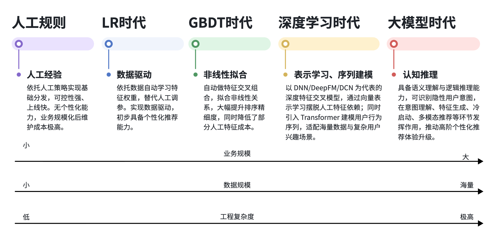
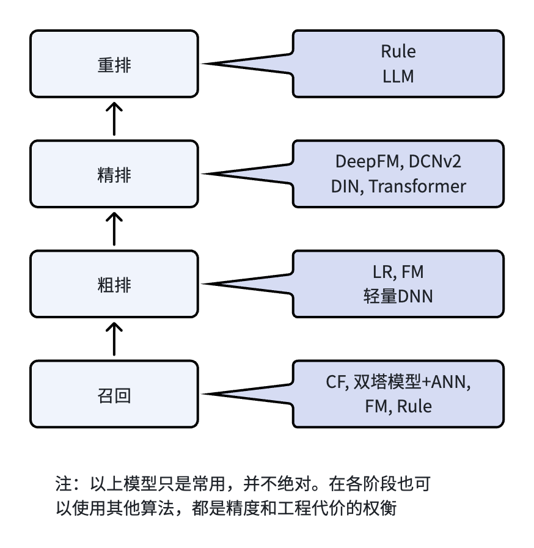

# 推荐系统架构（2）：推荐算法的工程演进，从人工规则到大模型时代

## 1. 算法迭代和系统工程的适配升级

当前行业的主流推荐算法，是以深度学习模型为主，例如 DeepFM、DCN、DIN 和 Transformer 等。一些大团队还会辅助以大模型来做少量的精排和重排序。看到这么多精巧的算法模型，很多刚接触推荐技术的同学就会觉得，推荐结果优化，就要使用最新模型，把推荐结果优化和模型前沿性等同起来。

我从事推荐行业多年，从最早的规则时代开始接触，到最后的深度学习模型算法，陆陆续续参与过多套从 0 搭建的推荐系统。总结过去这么多年的经验，推荐效果的优化，不仅是追求算法的复杂性、先进性，而是在算法模型迭代演进的过程中，让整套推荐系统工程能力同步升级。只有当现有算法满足不了业务需求，遇到瓶颈的时候，才考虑升级到新的算法，并且迫使配套工程体系一起迭代。

模型是推荐系统里的计算核心，它的能力要得到发挥，需要有高质量的数据输入，也就要求特征体系、工程链路、业务场景的配套建设。所以说算法负责提供智能能力，工程保证落地可行，两者共同支撑业务的增长。

回到算法的迭代，我们先思考一个基础问题：纯规则架构为什么不能支撑业务长期扩张？

业务初期，用户数量不多，内容也少，场景简单。这个时候人工规则开发快，能很好的完成基本的内容分发。但随着业务增长，用户和内容的数量都快速增长，业务场景变得复杂。这时候如果继续使用规则，多场景下的规则冗余，不同业务的规则策略冲突，导致最后规则没办法维护。

所以规模化的发展，要求算法进行升级，机器学习正是为了解决这样的问题引入。机器学习要发挥它的作用，必须要有配套的数据处理系统，要有特征选择和产生的机制，要进行模型的训练和参数调优，上线之后需要配套系统来运行模型推理。因此，一个算法的升级，配套的工程体系也需要一起完善。

下面我们来看一个图，里面呈现了五代推荐方法的演进过程，随着业务规模变化、数据规模变化，算法不断演进，随之同步的工程复杂度也在上涨。

图中的 “五代” 只是根据我过往经验进行划分，可能和业界的标准不完全一致。例如，LR、GBDT 应该都属于传统机器学习时代，但里面特征工程的变化，让我把它们分成了两个阶段。本文就先跟着我这个思路，也不涉及具体的数学公式和学术推导，纯以工程落地的视角，来描述每一代算法的价值，适应的场景，相应的工程架构改造和取舍，梳理出模型和工程共同演化的路径。

## 2. 算法在推荐全链路里的位置

在分析每一代算法之前，我们先看一下算法在推荐系统里面都会用在哪些地方？

广义上来讲，每一个模块的计算，都是算法。不管是离线数据处理，例如用户画像的生成，需要算法来支撑画像的抽取，兴趣衰减和融合等也需要算法；内容特征的提取会用到 NLP 算法，等等多个环节。这篇文章先抛开离线数据处理部分，着重讨论在线服务系统中用到的算法。上一节讲的五代算法演进路线，也是说的在线推荐的算法演进。

不过就算是在线推荐服务，整个链路也比较长。根据第一篇的架构总览介绍，一个线上用户请求链路我们可简化为：

用户请求 -> 召回（多路内容召回） -> 粗排（内容聚合 + 粗排过滤） -> 精排（模型打分） -> 重排（精细化调整）-> 结果返回

前面提到的规则、LR、GBDT、深度学习、大模型 五代算法，会覆盖全部召回、粗排、精排、重排这几个重要环节。需要注意的一点就是我们提到 “五代” 算法，但他们并不是新旧替代关系，而是长期共存、分层复用的关系。即便现在已经迈入大模型推荐阶段，但规则、LR、GBDT 等经典方案还会出现在推荐系统多个环节中。

这个图描述了推荐链路中算法都会怎么作用在各环节，我们明白一点，每一个环节用什么算法，是精度和工程代价的权衡。现在召回阶段可能只能用双塔模型 + ANN 从海量内容中快速找到 1000 条候选，未来某个时候如果硬件性能跟得上，可能召回阶段就直接用了复杂的深度学习模型来处理。

## 3. 初代方案：人工规则

推荐系统发展的起点，都是人工规则。因为初期的时候，平台没有积累太多用户数据，团队的技术储备也可能不具备模型训练的条件。这个阶段，依靠业务经验和人工规则配置的方法，实现简单，运行起来快速，是最有效的方法。现在深度学习、大模型已经普及，但线上依然存在人工规则作为兜底策略。

### 3.1 具体落地方式

规则推荐的逻辑比较简单直接，就是人工根据经验，提前写好筛选的规则，把人和内容按规则进行匹配，完成内容分发。行业最常用的规则主要有以下几种：

- 第一是**热度排序**：统计内容的点击、浏览、互动数据，让热门内容优先展示，靠大众的爱好来吸引普通用户，保证内容分发的基础体验；

- 第二是**维度筛选**：按照频道、类目、地域、发布时间等有限维度，做精准筛选，保证把对应内容分发给合适的用户，做到分维度的“个性化”；

- 第三是**人工权重干预**：对人工或自动判定的优质内容、平台需要扶持的内容、或热点运行内容，手动调节排序的权重，同时对低质量、违规内容进行打压，保证平台的内容生态质量。

- 第四是**基础标签匹配**：根据用户的基础静态标签，例如年龄、性别、地域、设备等，匹配对应类目的内容，实现最简单的个性化分发。

- 第五是**人工权重融合**：例如首页的排序可以考虑综合多个维度，点击率、新鲜度、类目匹配度、地域匹配度，把这几个维度按固定公式，例如**内容总分 = 点击率 × 0.4 + 新鲜度 × 0.3 + 类目匹配度 × 0.2 + 地域匹配度 × 0.1**。靠人工的固定权重，融合多个维度指标进行综合排序。

### 3.2 适用场景与实际价值

规则模式适合推荐业务刚开展的初期。早期冷启动时，用户数量不多，内容也不多，每天的行为反馈数据也不多，统计意义不是很大。这个阶段的业务场景也比较单一，可能就是首页的内容展示。人工规则有以下优势：

- 开发成本低、迭代快：研发实现的成本低，规则从制定到上线，开发的代价很低，提取相关的属性，线上融合计算即可。规则需要变更时，只需要改少量代码，可以快速迭代上线。

- 线上运行高效：人工规则上线的运行，不需要复杂的模型推理，只需要简单的数值计算，硬件成本需求很低。单次请求的响应时间，整个系统的吞吐都能做到很好。

- 可控性强：人工规则都是人工制定，可以按需快速的更改规则，人在里面参与度、控制度都很高。

- 结果可解释性强：内容的分发都是基于规则，一个内容为什么排前面，一看规则就能很好解释其原因。

我早期参与新闻网站、资讯平台，最开始都是用纯规则做推荐。最开始的做法是做热门排行榜，首页直接按点击率和互动量排序，靠热点内容吸引普通用户点击浏览。迭代的第二步是叠加地域规则，例如给北京用户推送本地资讯，给上海用户推送同城内容，实现最简单的地域差异化分发。我参与的其中一个资讯平台，后面的迭代用到了多维度按权重综合打分，首页的排序综合点击率、用户显式声明的喜欢类目匹配、运营加权，总分=点击率 x 0.5 + 类目匹配 x 0.4 + 运营加权分 x 0.1。这个规则运行了大概有两三个月的时间。

### 3.3 架构短板与扩容局限

业务初期，上述人工规则的优势非常明显。但随着业务的发展，用户、内容量增大，业务需求变得更复杂。例如首页的内容展示，不止要求热门，还需要兼顾用户的个性化、时间段（工作日和节假日）等维度。并且热门的定义也不只是用户点击，还要考虑停留、点赞、评论数量等反馈。这些需求叠加之后，人工规则的优势反而限制了业务的发展。

人工规则架构在这个阶段，会暴露出如下问题：

- **规则越堆越多**：业务需求变复杂，例如首页内容不止考虑热门，还要考虑时间段、地域等维度。为了达到目的，只能增加规则。随着需求、场景越来越复杂，规则数量也会变得越来越多。

- **规则互相冲突**：接前一条所述，规则变多之后，规则之间就不好控制，可能会导致规则之间互相冲突。还是首页内容举例，最开始只有一个热门规则，现在要叠加一个时间段规则，节假日旅游类内容是热门，但在工作日就不是。规则之间会产生冲突，导致推荐的结果时好时坏。

- **做不到千人千面**：对所有人来说，或者对一群人（设定地域等分类规则）来说，一套固定会应用到覆盖的所有人，没办法对不同的用户推送差异化的内容，做不到真正的个性化。

- **权重无法调到最优**：内容排序如果要兼顾多个维度，只能按前面说的公式，把多个维度分数按权重组合。但这些权重都是人工设定，没有数据支撑。在很多场景下，人工没办法配置到最合适的权重，导致最终效果达不到预期。

- **维护成本持续飙升**：业务越复杂，规则就叠加越多，规则之间的维护成本随之上升。到后期很多规则怎么来调度，规则之间怎么排优先级，这类维护非常困难。

因此，从经验上来看，规则系统在业务从 0 到 1 起步阶段非常合适，但支撑不了业务从 1 到 100 的个性化发展。如果想要优化这个阶段的体验，只能从数据出发，用数据驱动来代替人工的经验。机器学习的方法正是这个时候引入的。

## 4. 二阶迭代：LR线性模型

如之前所说，业务进入规模化增长的阶段，人工规则会出现各种问题，导致系统无法迭代。数据驱动的机器学习方法正式登上舞台。最开始尝试进入推荐系统的机器学习模型是 LR 逻辑回归。LR 逻辑回归有稳定的建模能力，训练和在线推理实现都不算太复杂，能适应这个阶段的业务需求。

### 4.1 为什么一定要从规则迭代到LR

人工规则的问题，不是推荐结果不对，而是随着业务的增长，数据量的增大，人工经验不能让业务快速发展。

举个例子，前面说的打分公式，内容总分 = 点击率 × 0.4 + 新鲜度 × 0.3 + 类目匹配度 × 0.2 + 地域匹配度 × 0.1，这个规则已经考虑了多个维度。但这个公式最大的问题是权重是人工凭经验写死的。如果用户量上去，看的人多了，用户反馈行为变多，整体的偏好可能会和之前设定权重不匹配。刚开始100人看，点击率权重占比最高，大家都爱看热门内容。现在用户涨到了5000、10000级别，一些人显式的声明了他喜欢的类目，这个时候类目匹配度可能是最优先的排序维度。但这个变化，人工凭经验学习不到，只能通过分析用户反馈行为数据才能得出来。

所以，用户数量变大，带来的用户反馈行为变多，行业需要一套数据驱动的方法来代替人工经验。这时候 LR 模型就是一个很好的选择，完美解决人工规则这个能力短板。LR 逻辑回归的原理在这里不做深入探讨。简单来说，LR 就是根据大量的反馈数据，用一条曲线来拟合用户对一篇内容点击的概率。这个概率就是内容打分排序的依据。

### 4.2 LR模型的价值

LR 模型最大的价值就是把之前人工经验权重的方式变成了由数据说话。数据驱动调权是机器学习的核心，给推荐系统带来一次质变升级。

下面举几个 LR 能发挥优势的例子：

- **适配不同场景**：不同时间段用户喜欢看的内容不一样。例如早上时间段，用户喜欢看新闻、资讯类内容，晚上喜欢看的就变成了休闲、娱乐类。 LR 模型可以自动学习到时间段的权重差异，从而可以动态调整内容排序分数。

- **适配不同用户**：LR 模型可以把用户兴趣和内容热度结合起来打分排序，对于新用户来说，没有行为反馈，没有兴趣爱好数据，此时通用热门内容的分数自然变高。当用户阅读一段时间之后，兴趣爱好建立起来，LR 模型会调整用户兴趣的权重，自动适配。这种精细化的调整，人工规则很难做到。

- **适配热点变化**：当出现突然爆发的热点内容时，短期会有大量用户的互动。LR 模型从行为数据中能学习到这种趋势，自动抬高热点内容权重。这种处理不用依赖人工手工调整。此处要说明的是，这个时期数据处理基本都是批量，热点内容的检测不会像后来的实时反馈处理那么快速精准，但对比人工规则，这种数据驱动的热点学习是一个很大的进步。

除了上面几个业务优势之外，在工程上也有不少优点， LR 模型结构比较简单，是多个维度特征分数加权融合。所以：

- 训练复杂度低。LR 模型训练时候，只要抽取出对应特征，确定正负样本，训练能很快开始，收敛速度也很快。

- 线上速度快。LR 模型本质上一个加权公式，推理速度快，单次请求响应时间不会太长，整体吞吐量也会比较大。

- 可解释性强。LR 模型的可解释性很好，一篇推荐出去的内容，通过分数、单维度分数、权重，就能很快速的看出来它为什么排在这个位置。

因此，LR 模型的这些优点，让它能很好的满足业务规划发展初期的要求，开始数据驱动时代，也是模型能力和工程落地的完美平衡。

### 4.3 LR带来的整套工程升级

人工规则升级到 LR 模型架构，不是简单的一次算法迭代，而是配套的工程体系重构。

之前人工规则时代，不需要对用户反馈数据做处理，没有专门的数据处理流水线。LR 模型是数据驱动，用户反馈数据的存储、清洗、预处理、样本数据生成、模型训练等离线数据体系开始产生。这个阶段，推荐系统就不只是单纯的一个在线业务，而是开始了离线学习+在线服务的模式。后续的推荐系统，大方向也都是这种模式。

LR 模型权重是机器学习出来，新训练的模型效果怎么样不能拍脑袋决定，需要上线做实验才能知道。因此，这个阶段对在线系统也有新的要求，A/B 实验体系和配套的模型版本管理、推理模块化设计理念开始引入。

整体的推荐系统架构，是现代推荐体系架构的雏形，有了离线和在线，有数据清洗、离线特征生产、在线服务、模型版本管理、A/B实验体系等等。从此让推荐系统脱离人工运营的粗放模式，进入数据驱动的迭代阶段。也再次印证了：模型提供智能建模能力，工程体系提供落地支撑，两者协同助力业务增长。

## 5. 三阶迭代：GBDT树模型

LR 模型完成了从人工规则到数据驱动的突破，让推荐系统开始用数据说话。但 LR 是线性模型，表达能力天然有限制，推荐后期的精细化需求没有办法满足。此时，GBDT 决策树模型被提出用于替代 LR 模型，升级模型的非线性建模能力。

### 5.1 线性模型的短板

LR 模型是线性模型，只能学习单个特征的独立权重，没有办法学习特征之间的关联关系，也做不到非线性拟合。

这个阶段模型的效果非常依赖人工特征工程，应该设计哪些特征，要不要把一些特征组合成为一个新的特征，都是 LR 模型阶段，研发人员日常要处理的问题。

举个真实的业务例子：一个用户很喜欢体育类内容，长期浏览的都是篮球文章，近期也频繁关注NBA赛事内容。然后晚上下班回到家，有一篇内容是最新篮球资讯，这时候要不要给用户推荐这篇内容？这篇内容被这个用户喜欢的概率有多大？我们人工一眼能看出，这篇内容对于这个用户在这个时间段，几乎是最优的选择。

如果是 LR 模型，通过长期浏览篮球文章、近期看 NBA 赛事内容，可以得到用户的兴趣是篮球、NBA。然后根据当前上下文特征，晚间休闲时段，结合内容的特征是篮球资讯。LR 模型能把这几个单维特征通过权重融合在一起，能得到一个很好的推荐分数。但因为还有其他维度特征存在，例如热门、地域等特征，这篇文章最终组合分数有可能不会是最高。 所以这种高维度组合的优势，在 LR 模型阶段，只能靠我们人工手动设计，把这几个单维特征拼接在一起成为一个组合特征，来达到最优解。不过这种人工组合特征，成本极高，也没办法列举所有的组合。

### 5.2 GBDT的突破

GBDT 的最大价值，恰好是让模型有非线性拟合的能力，它可以自动挖掘特征和特征之间的非线性关联，自动完成高阶价值特征的交叉组合，从而大幅降低人力成本。

上面说的篮球兴趣、晚间休闲时段、篮球资讯内容，在 LR 模型阶段需要工程师手动设计组合特征，而 GBDT 可以从大量的数据中自动挖掘，对这种组合自动加权。这样就能发现用户复杂的兴趣规律，提升排序的精度。在自动学习的过程中，GBDT 模型还能自动区分特征的重要性，抓住那些优质特征，弱化无效特征，非常适合变得更复杂的业务场景。

从 GBDT 阶段开始，模型的自主特征学习能力提升，特征工程也开始变成推荐系统最有价值体系之一。

### 5.3 迭代带来的工程代价

GBDT 模型的表达能力更强，为了发挥它的这种能力，配套的工程体系也需要迭代升级，工程落地代价加大，主要有以下这几个方面：

- 训练与推理成本上升。训练的时候，GBDT 需要串行构建多棵决策树，每棵树都依赖前序残差，没有办法像 LR 那样高效并行，所以迭代轮数增加、训练时间更长。推理的时候，需要遍历多棵树，单次请求的延迟是 LR 的几十或百倍。

- 内存与存储开销大。GBDT 模型里面包含多棵树，模型的体积随树的数量和深度指数级增长，在训练和推理时候都比 LR 占用更多的存储，在线推理加载到内存占用量比 LR 模型大得多。

- ‌特征工程虽简化但部署复杂。GBDT 能自动学习非线性和交叉特征，和 LR 相比减少人工特征工程。但在具体的工程化落地时，需要叶节点编码、one-hot 转换、特征对齐等流水线，工程链路的复杂度变高。

- 调参与调优成本高。GBDT 模型树的数量、深度，训练时候学习率、子采样率等，超参数搜索空间远比 LR 复杂。并且 GBDT 的训练对数据分布敏感，经常需要重新训练。

- 线上服务难伸缩。LR 模型是一个打分公式，线上服务可直接内嵌到服务引擎中。而 GBDT 通常需要专门的推理引擎（例如 XGBoost、LightGBM C++等），资源消耗高，一般都是单独部署，导致线上扩容会相对麻烦一些。

整体来看，GBDT 模型的能力更强，解决人工特征组合的效率问题，但是也迫使工程体系需要完成对应升级，让整个系统的运维成本变得更大，迭代难度也增加不少。

## 6. 四阶迭代：深度学习

GBDT 仍然属于传统机器学习方法，它虽然把结构化特征的拟合效果做到了极致，但当业务继续发展，数据量增长更快时候，传统机器学习的能力就会有很大的限制。由于 GBDT 在这个阶段没办法适应更复杂的业务场景，深度学习也就成了新的研究迭代方向。

### 6.1 传统模型的瓶颈

推荐发展后期，业务复杂度继续提升，此时有以下几个特点：

- 用户和内容量级增长。用户到达千万级，内容到达百万、千万级量级，需要处理的候选内容、用户行为数据都是指数级增长。

- 稀疏的 ID 特征越来越多。用户 ID、内容 ID、场景 ID 等特征引入模型，传统模型难以高效处理。

- 用户长短期兴趣分化。用户的长期兴趣相对稳定，而短期瞬时兴趣一般多变，之前那种单一建模方式满足不了用户当前浏览需求。

- 多模态内容出现。除文本之外，图片、音频、视频、直播等内容形态出现。

- 场景逻辑越来越复杂。不同时段、设备、使用场景，对应的分发需求不同，场景逻辑划分越来越细。

这个时候，传统机器学习的方法模型的能力已经处理不了复杂的业务。海量稀疏特征、复杂语义关联、动态变化的用户兴趣，都是 LR、GBDT 模型的短板。简单来说，就是人工设计特征的速度，跟不上业务增长的速度。而深度学习这种不依赖人工，能自主学习深层规律的方案，也进入了大家视线。

### 6.2 深度学习的价值

从工程落地的角度来看，深度学习对推荐系统最重要的贡献是突破了传统模型在表达能力上的上限。深度学习模型通过表示学习可以自动挖掘用户、内容、上下文之间的深层关联，这让推荐系统的建模重心，从“人工主导的特征构造”转变为“模型自主完成稠密表征和深层交互学习”。

结合实际的落地场景，我认为深度学习的价值主要有：

- 稀疏特征的高效处理。推荐系统中的用户 ID、内容 ID 都是高维稀疏特征。如果特征量级到达千万，即使 GBDT 模型有一定程度的稀疏特征处理能力，但模型体积会急剧膨胀，过拟合风险也急剧上升。而深度学习模型，可以使用 Embedding 方式把稀疏 ID 映射成低维的稠密向量，这样保留语义信息同时又控制了模型规模。

- 特征组合自动化。传统模型 (LR, GBDT 等) 依然需要人工来交叉、组合、离散、挖掘高阶交互，人力成本非常高，并且有一些复杂隐性关联挖掘不出来。深度学习依靠端到端的表示学习，可以自主学习用户、内容、上下文稠密向量，天然就有高阶非线性的拟合能力。例如“夜间 + 年轻用户 + 美食浏览”这类组合模式，模型可以自主学到，不需要人工介入。

- 非结构化内容的端到端建模。CNN、RNN、Transformer 这些结构天然适配图片、语音、视频这些非结构化数据。这些模型可以直接从多媒体数据中提取特征，不需要过多的预处理。以短视频为例，深度模型可以直接分析画面、音频、字幕，从中提取特征供排序使用。传统模型对于这类数据，通常需要大量预处理工作，效率很低。

- 长短期兴趣的区分建模。Transformer 引入带来了用户行为序列建模方法，这种方法可以通过短时间窗内的行为序列分析，找到用户的短期浏览偏好，能很好缓解之前用户长期兴趣不能满足当前浏览需求的问题。举个例子，一个用户长期关注数码产品，但近期经常浏览健身内容。模型能识别到这个短期信号，在接下里的推荐中会加大健身内容的权重。而传统模型缺乏类似机制，不能满足临时兴趣捕捉要求。

- 多目标联合优化。实际的推荐业务中，点击率高可以让平台收益变大，但留存率高可能是用户体验好的一个表现。所以推荐算法需要同时兼顾这样的多个目标，而目标之间有的可能会存在冲突。深度学习算法可以用一个模型来对多个目标联合建模，这样就能相对较好的平衡用户体验和平台商业化指标。

- 泛化能力与表示学习。深度学习模型学到的是分布式稠密表示，特征是在一个连续的语义空间中。所以，对于一些没有出现在训练数据中的特征组合（例如“雨天+周末+居家休闲”可能没出现过），模型也可以基于已有规律做出推测。而 GBDT 模型虽然能做到二阶甚至三阶特征组合，但对于这种没有出现的组合，没有办法得到一个很好的预测效果。

- 预训练与迁移能力。深度学习支持大规模预训练（如 BERT、ResNet 等等），通过微调，就可以快速适配新场景，迁移成本很低。传统模型在切换到新场景时，往往需要从零开始重建特征体系，并且重新训练模型。

### 6.3 深度学习带来的体系升级和工程代价

深度学习算法突破了传统模型的效果上限，能做到真正的千人千面精细化分发。但同时也要求整套工程体系要大幅度重构。从这个时候开始，推荐系统变成了“表示学习 + 大型工程平台驱动”的模式，工程复杂度大幅度提升。

第一，算力体系的升级。深度学习需要处理非常大量的数据，需要分布式计算集群。模型训练还需要 GPU 算力资源，整个离线训练的资源和运维成本大幅上涨。

第二，特征体系的升级。和传统特征体系不同，深度学习需要建设单独的向量特征、序列特征、多模态特征等治理平台，特征治理的难度上升。

第三，线上推理压力增加。深度神经网络比传统机器学习模型计算量更大，单次请求的延迟变得更高。为了保障线上服务的高性能和吞吐量，需要增加模型压缩、推理加速、链路优化等多种策略，工程代价巨大。

第四，运维和迭代难度上升。深度学习处理数据量巨大，离线在线特征一致性、模型的监控、推荐结果归因解释、版本迭代和管理方面的问题，也都随之而来。传统简单的模型运维体系没办法使用，需要搭建专门的模型监控、效果复盘、版本灰度等体系。

也就是从深度学习开始，推荐团队彻底平台化，算法、特征工程、训练平台、在线推理、工程基建都拆分成独立的方向，都需要独立的平台来支撑。

## 7. 五阶迭代：大模型时代

深度学习让推荐系统具有自主学习、自主建模的能力，能很好支撑业务的规模化发展，目前是行业推荐算法的主流。不过进入到现在大模型时代，随着各类 AI 应用的流行，用户对推荐平台体验要求也越来越高，也希望推荐平台能像 AI 应用那样更理解自己，给自己更好的内容。因此，大模型也开始融入推荐排序体系，让模型的能力再一次升级。

### 7.1 传统深度模型的能力边界和大模型能力

行业主流的 DeepFM、DIN 等模型属于基础深度推荐模型，靠业务样本从零训练出来，它们具备很优秀的拟合和匹配能力，但在下面一些方面，做的还不是很好：

- 基础深度推荐模型本身只能学习 ID、统计特征之间的隐关联，但没有对原生的文本、图像语义解析。即使接入了 BERT、CLIP 这些预训练深度模型得到语义向量，模型也只能通过分布概率来判断情绪和主题，没有人类层面的认知理解。

- 常规的深度学习模型（DeepFM、DIN、Transformer 等）本质都是模式匹配，没有符号化的逻辑推理能力。比如说人可能能想到“用户看了篮球鞋 -> 大概率还需要运动袜”这种逻辑关系，而常规深度学习模型做不到。

- 如果没有预训练模型辅助的深度学习模型，泛化能力不足，新内容、小众内容冷启动的表现不是很好。目前行业一般引入 ResNet、BERT、多模态预训练等方法，通过知识迁移提升泛化能力，这也是目前工业解决冷启动的有效方法之一。

而大模型的认知和推理能力，刚好能补齐上面说的这几个传统深度模型能力的不足，实现体验升级。

把大模型融入到推荐排序中，可以让模型升级有“认知推理”能力，可以做到：

- 真正读懂内容：可以理解内容的核心语义和情绪，不再只是向量模糊匹配。
- 理解隐性意图：结合用户画像和浏览行为，推测用户的真实浏览需求。例如上面那个例子，“用户看了篮球鞋 -> 大概率还需要运动袜”。
- 泛化能力更强：大模型自身具备的泛化能力，对于新场景和冷启动有相对不错的结果。
- 调试迭代更灵活：可以用自然语言提示词定义排序方法和业务规则，迭代效率远高于传统模型调参。

### 7.2 大模型落地的工程取舍与现状

大模型能给推荐带来认知能力，但它本身的复杂度、算力成本都极高。如果把大模型应用到推荐系统全链路，硬件成本急剧上升。大模型上线还需要配套提示词工程、语义打分、大模型治理等工程模块，对团队技术能力要求很好。此外还有大模型还存在幻觉，打分区间不稳定等问题。

所以目前行业的通用做法，不会使用大模型替换全量精排，而是采用“深度学习精排为主、大模型重排微调为辅”的策略。在最后阶段用大模型来提升用户的体验，这也是在效果、成本、系统稳定性之间找权衡点。

还有一种做法是离线利用大模型做预处理，例如用大模型对内容标题、评论、多模态内容（图片视频等）进行语义理解，生成稠密向量作为推荐系统特征，供后续的深度学习模型训练使用。这种方法可以生成用户/内容的知识性增强描述，补充ID稀疏场景下的语义信息，提升冷启动阶段体验。

不管使用方法怎样，大模型融入推荐系统的原则还是用成熟的传统模型保证稳定性和性能，然后用大模型辅助体验升级，这样能兼顾模型能力和工程落地复杂度和成本。

## 8. 五代推荐算法全景对比

为了方便大家直观理解每一代算法的模型能力、适配场景和工程适配差异，下面从核心能力、解决问题、工程复杂度、适配阶段四个维度，做了一个全景对比：

| 算法阶段                  | 核心能力                 | 解决的核心问题                               | 工程复杂度 | 适配业务阶段                  | 当前使用情况 |
| --------------------- | -------------------- | ------------------------------------- | ----- | ----------------------- | ------ |
| 规则推荐                  | 人工可控、规则约束、快速兜底       | 快速上线、业务强管控、冷启动兜底，弥补早期无模型能力的空白         | 低     | 业务冷启动、早期小规模系统           | 必备     |
| LR逻辑回归                | 数据驱动、自动学习特征权重        | 解决人工调权主观性问题，用基础模型能力实现初步个性化排序，替代粗放人工规则 | 中     | 业务规模化初期、基础个性化场景         | 广泛使用   |
| GBDT模型                | 非线性拟合、自动特征组合         | 升级模型表达能力，降低人工特征成本，挖掘高维特征关联，提升排序精度     | 中高    | 结构化特征丰富、需要精细化排序的场景      | 广泛使用   |
| 深度学习（DNN、Transformer） | 表示学习、序列建模、多模态建模      | 突破传统模型能力上限，解决海量稀疏特征、复杂用户兴趣、多场景适配难题    | 高     | 业务成熟期、海量数据与高并发场景        | 主流方案   |
| 大模型                   | 语义理解、逻辑推理、认知打分、零样本泛化 | 补齐传统模型浅层语义、无推理、泛化弱的短板，实现高阶个性化体验升级     | 极高    | 存量精细化运营、高阶体验升级、复杂内容生态场景 | 探索中    |

## 9. 架构选型：适配业务，远比追逐新技术更重要

结合多年的工程化落地经验，我最大的感受是：算法选型并不是为了比谁的技术更先进、谁的模型更强大，而是在业务效果、工程能力、时间等方面做权衡。推荐系统里面没有万能的算法，只有最适合当前团队当前场景的模型和工程方案。

人工规则、LR、GBDT 诞生时间比较久远，很多人认为这些技术已经落后。但在实际的工业化推荐系统中，人工规则还是作为系统兜底方案存在，是所有模型失效的系统最后保障。LR 在广告 CTR 预估、简单召回粗排、特征融合（例如与 Embedding 拼接）场景下仍在使用。GBDT 在中小规模业务、特征稀疏且交互不复杂、计算资源受限的情况使用，它的自动特征组合能力有时候也会用于生成辅助特征输入大模型。

深度学习模型是现在推荐的主流算法，在精排阶段使用例如 DeepFM、DCN、DIN、Transformer 类算法，能得到比较好的效果，工程实现的代价也可控。不过在召回、粗排、重排阶段，也会有其他算法的身影出现。

大模型目前阶段不是用来替代传统模型的工具。大模型具备更强的认知能力，适合在精细化运营、追求用户体验升级的一些场合下，适用于那些有充足算力和工程能力的团队和公司。

所以，顶级的工程架构设计，从来不是盲目的追求新技术新模型，而是在当前的业务发展模式、当前团队能力、当前能承担的成本之下，找到最合适、最匹配的技术和模型，然后把配套的工程体系设计好，精准落地实现，这样才能让整个推荐系统的能力最大化，达到最优目标。

## 10. 总结和下一篇预告

本文讨论了推荐算法演进的路线：**人工规则（经验驱动）-> LR（数据驱动权重学习）-> GBDT（非线性特征自动组合）-> 深度学习（深度表示学习建模）-> 大模型（认知理解与推理排序）**。

整个演进路线，模型的结构越来越复杂、算法能力越来越强，同时工程体系也在同步进化演变。工业推荐系统的发展，不是模型替代工程，而是模型升级，带动数据体系、特征体系、工程架构的升级，从而使整套体系迭代完善。每个团队选择什么样的推荐架构，需要结合业务规则和自身能力以及成本，找到权衡点，找到最适合的技术方案。

模型是推荐系统的智能化核心，但它依赖输入数据源，也就是特征，来发挥自身的强大能力。特征工程如果做的不好，整体的推荐效果也不可能上去。所以下一篇我们来介绍《特征工程》。