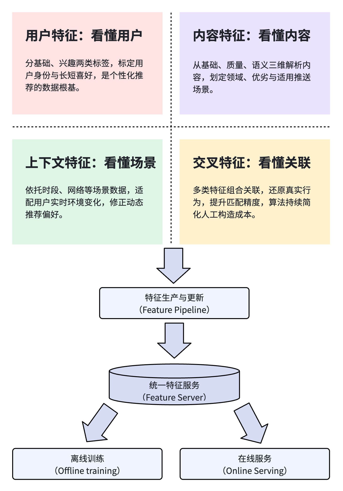
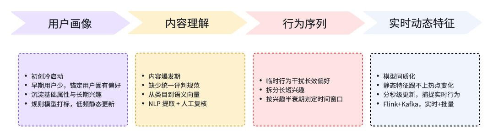

# 推荐系统架构（3）：特征工程，决定推荐效果的核心关键

## 1. 特征体系概览

### 1.1 一个问题：为什么有些团队模型很强，效果却平平无奇

有些团队在做推荐系统的时候，会遇到一个有代表性的问题：团队用了很多先进的算法、模型等技术，例如 DeepFM、多目标优化、序列模型或者大模型重排等。团队也在模型的参数优化上做了很多工作，上线很多实验进行迭代。但最终的结果，却是整体的推荐效果达不到预期，CTR、用户留存等等短期长期指标，都提升的非常有限。

在排查问题、分析原因时，大部分人都会先考虑是模型层面的问题。例如怀疑模型的选型是不是不合适，亦或是参数模型调优不到位。他们基本上不会排查特征对效果的影响。这些年在新闻推荐、内容分发和社区推荐等项目的落地过程中，我们发现这一类算法、模型方面技术实力比较强，但最终效果欠佳，核心的影响因素就在于特征质量上。

在一个推荐系统中，特征体系是整个系统的唯一输入源，模型是推荐系统的计算中心，负责对输入源也就是特征进行理解、加工。所以在推荐系统中，特征和模型是相辅相成的，两者缺一不可，它们共同影响最终的推荐效果。

我们可以用机器生产的逻辑来比喻一个推荐系统，整个系统是一台精密的机器，其中模型就是加工流水线，负责输入数据的加工、运算。而特征就是流水线的原材料。模型的计算、打分、排序逻辑只能依赖特征输入来完成。

所以回到前面那个问题，如果特征数据本身就存在错误、偏差或其他质量问题，那么依赖特征数据的模型，肯定发挥不了它应有的能力，根据错误数据运算的结果本身肯定是错误的。也即是最后的推荐结果会产生偏差，从而导致业务指标无法提升。这也是我们多年工程化落地总结出的核心结论：**模型确定推荐效果的上限，而特征守住推荐效果的下限**。很多团队喜欢不断升级模型，却忽略了特征建设。而在实际工程落地中，我们见过更多的情况是：模型已经足够先进，但特征体系还不够完善。

我们可以来看这样一个例子：在一个商品推荐的系统里面，发现某些商品经常排在前面，点击率比较高。但实际上，列表靠前的位置，因为视觉优先，天然就会有更高点击概率。如果我们没有考虑位置偏差特征，模型就会错误的把这个“位置优势”当成是“兴趣爱好”，从而会导致模型推荐一些经常靠前但实际无关的商品。这个例子中，模型没问题、迭代没问题，但特征缺失导致效果不佳。后续不论是持续调整模型结构，还是不断做线上A/B实验，只要这个关键特征缺失，模型就会学偏，指标就没办法提升。

目前不管是学术研究还是行业技术分享，很多人都将重心放在了算法、模型层面，对理论、公式原理研究的非常深入，同时在模型的迭代、参数调优等方面也投入很多的精力和时间。但从上面的例子，结合我们多年以来工程化落地的经验来看，模型确实是推荐系统的基础计算能力支撑，但真正能拉开业务的差距、优化用户的体验的核心原因是特征体系。所以长期沉淀、计算精确、支持实时迭代的特征体系，也是整个推荐系统核心组成部分之一。高质量的特征体系也是各个互联网大公司、推荐平台的核心竞争力之一。

### 1.2 特征工程永远不会消失

随着深度学习、大模型的普及，很多人都觉得端到端的建模能代替人工特征工程，觉得研发人员不需要再投入精力到特征精细化、优化等工作。

但真实的工程落地完全不是这样。深度学习和大模型，确实大幅减少了人工拼接、组合特征这类低效、重复性的机械工作。但它却不能脱离特征独立来完成全套的特征工程。模型和人工这两者是相互依存关系，而非替代关系。

在实际工程化落地中，仍然有大量的工作模型没办法自主完成，还需要人工来定制设计。下面举几个例子：

- **样本筛选规则**：界定正负样本的范围、冷启动用户的样本处理逻辑，这些直接决定模型的学习目标；

- **行为序列切分**：用户长短期兴趣的时间窗口划分，比如7天、30天、单会话维度，都会直接影响序列兴趣建模的最终效果；

- **实时特征更新策略**：区分秒级/分钟级实时更新、天级批量更新，需要在效果实时性和研发成本、计算成本之间做权衡；

- **特征预处理**：包括多量纲特征的归一化、缺省值方案等，保障模型输入数据的稳定性和可靠性；

- **用户反馈量化**：对点击、短暂停留、深度浏览、拉黑、卸载等行为，区分不同强弱的正负反馈权重；

- **特征降噪与时效处理**：用户过期兴趣的衰减规则、异常行为的过滤逻辑，确定整体推荐内容的质量。

大模型虽然能自主生成语义特征，但上面这些真正决定特征质量的环节，依然完全依赖人工的精细化工程设计。如果没有工程层面的兜底，大模型产出的语义特征将会杂乱无序，没有办法提供优良的推荐效果。

简单来说，深度学习和大模型淘汰的只是低端、重复的特征加工工作，但不是特征工程本身。模型负责信息的理解和数据规律拟合，精细化的特征工程负责提供高质量的数据源，两者双向配合、互相成就。

现在的行业处于模型内卷阶段，各家的模型方案都趋向于成熟统一，想要拉开产品推荐效果差距，就要靠精细化的特征治理与定制化工程能力。

### 1.3 特征体系全景

推荐里用到的特征不是零散的数据，需要从用户、内容、场景、关联四个方向，把推荐过程所需要的信息完整描述清楚。上图是一个典型的工业落地特征体系全景图，整体特征划分为用户、内容、上下文、交叉四大类；依靠统一 Feature Server 做特征存储、查询和一致性管理，分别给离线模型训练、在线服务推理提供统一、标准的特征数据。

下面分开聊聊这几类特征的具体内容

## 2. 推荐里的特征，到底是什么

我们不看具体的学术定义，只从工程化落地的视角出发，我们很好理解：**特征是机器读懂用户、内容和实时场景唯一的数据来源**。

人可以凭主观感受来判断喜不喜欢一个内容，但机器它没有主观意识，只能依靠这些结构化的特征数据，对内容和人的匹配度来打分，判断这个内容适不适合这个人。所以推荐系统的底层逻辑不复杂，依靠各种特征做相似度匹配、打分排序，选择最优结果。我们不断地迭代推荐架构，一方面是优化这个打分的逻辑，另一方面就是不断优化获取信息的途径、提升数据质量。

在工业化落地时，特征不会随意堆砌，基本可以划分为四大类，覆盖推荐全链路的各个场景。

### 2.1 用户特征：看懂用户

首先是怎么看懂用户，怎么表示用户？所以第一类特征是用户特征，主要用来标识用户的身份、挖掘用户兴趣爱好、识别用户当前的状态。用户特征可以分为基础属性和兴趣属性两部分。

- 基础属性：包括年龄、性别、地域、设备类型、用户活跃度、账号生命周期等信息。这一类数据在一定时间内基本不变，是区分不同用户的基础标签。例如，一个用户是 男性、35-40岁、北京地区、互联网行业，那这个人很可能就会对技术类文章感兴趣。

- 兴趣属性：包括有用户的长期兴趣爱好标签、近期的浏览兴趣、互动倾向、负反馈记录以及用户兴趣的向量表示等数据。例如上面这个人，长期兴趣是互联网、服务端架构，最近浏览 AI 类文章比较多，但对模型公式方面的文章表示明确不感兴趣。那这个人是可能是架构师，近期关注到了 AI 热点，想学习 AI 方面的知识，不过他大概率是做工程落地方向，对算法原理了解不太多。

个性化推荐的推荐的基础之一，就是来源于这类特征。如果对用户描述的不够准确，用户特征不够完善，千人千面的推荐目标也就无从谈起。

### 2.2 内容特征：看懂内容

除用户之外，内容是推荐系统另一大核心。内容特征的作用就是让系统能理解内容，定义内容的主题，判断内容的质量，匹配合适的场景和人群，是内容分发的关键依据。内容特征主要包括以下属性：

- 基础属性：类别、关键词、实体、所属话题、发布时间等等，用来确定内容所属领域。例如，一篇报道NBA季后赛马刺进入决赛的文章，所属的类别一二级分类为 “体育”、“篮球”/“NBA”；关键词包含 NBA、决赛、马刺；实体拆分出 球队（马刺、雷霆），球员（文班亚马、亚历山大），城市（圣安东尼奥），比赛日期（2026年5月31日）；绑定话题如“新老交替与王朝更迭”。

- 行为属性：描述内容发布之后，用户对这篇内容的反馈属性，包括点击率、停留时长、完读/完播率、互动率等指标。举个简单计算的例子：一篇内容1000次曝光，得到72个点击，对应点击率是 7.2%，同时统计用户在这篇文章停留的时间平均40秒。这类数据汇总成为内容推荐的权重之一。

- 质量属性：包括权威性、原创度、新鲜度等等方面，主要用来识别内容的好坏，保证分发优质内容。例如同样是一篇 NBA 的文章，新浪新闻战报和普通自媒体博主稿件，权威性天然存在有明显差距。

- 语义属性：通过 Embedding 向量对文章做向量化表示，这样可以跳出关键词、实体的局限，从更深层次理解文本含义。同样是篮球相关的内容，关键词可能不一样，但可能都是描述季后赛比赛战况，向量空间距离就很近，和使用关键词召回相比能得到更高的分数。在工程落地时，语义向量一般由大模型或预训练模型批量生成，存入向量检索系统，在召回阶段能很好的补充关键词匹配覆盖率不完全的短板，也是内容冷启动依赖的一类特征。

### 2.3 上下文特征：看懂当下场景

推荐系统开发的初期，很多团队都会忽略场景的重要性。大家都觉得用户的兴趣是固定不变的，同一套用户的兴趣爱好、偏好设定，用在所有场景所有的时段。

随着系统运行，上线运营一段时间之后，就会发现，用户的爱好是会随着场景、时间变化的。同样的用户，对于同一条内容，在不同的时间段、不同的网络环境或者不同的状态下，喜好的程度完全不一样。上下文特征的价值也就体现在这里。

上下文特征描述的场景包含时间段、节假日、网络环境、所在页面、会话状态、地理位置等。很多细微的个性化体验，都是靠这些上下文特征来补齐的。

举一个很简单的例子，在工作时间内，一个互联网从业者，会喜欢阅读技术类的文章、关注行业的前景动态。但在周末或者节假日，这个用户可能就会关注娱乐类信息、或者旅游类文章。

### 2.4 交叉特征：看懂复杂关联关系

前面解释的用户、内容、上下文这些单维度的特征只能表示零散的信息，对于用户真实、复杂的行为逻辑，还原的不是很好。因此想要做到精准的个性化匹配，很多时候需要依赖特征交叉来实现。

举个简单的例子：用户平时喜欢浏览 NBA 相关内容、当前处于晚间休闲时段、内容是最新赛事集锦。单独拆开来看，用户爱看篮球、晚上空闲、内容是新集锦，每一个都不算是十分强的信号，但是三项特征交叉组合之后，就能计算出这个用户和这篇内容匹配度极高。

短视频晚间分发也是一个非常典型的落地场景，除了用户的兴趣之外，系统还会叠加当日时段、使用场景、用户近几日交互行为、内容发布新鲜程度、内容热度等多个特征，交叉组合。对比只使用用户的兴趣爱好来做推荐，结果会更符合当前用户的需求。这些都是提升晚间时间段点击率经常使用的手段。

特征交叉组合，早期一般都依赖研发人员人工梳理、构造。发展到 GBDT 模型阶段，这些模型可以自动发现一些特征组合，节省了大量的人工枚举筛选工作。再发展到深度学习阶段，模型一般能在网络内部完成隐式的特征交叉，自动学习高维度的组合关系，进一步解放了人工工作量。这个算法的演进过程中，目标都是减少人工构造交叉特征的工作量，让研发人员把更多的精力投入到特征治理、业务规则优化等更有价值的工作中。（关于各代算法在特征交叉上的能力，可以参考第2篇第5、6节。）

## 3. 特征是推荐效果的核心底牌

前文已经讨论过模型和特征之间的关系，简单回顾一下：模型负责计算、思考和决策，特征是输入数据源。

所以很多团队投入大量精力用于打磨模型结构、微调超参数，但却忽略了特征层面的建设。并不是模型没用，而是当模型能力达到行业平均水平之后，此时真正影响效果的原因，就变成了特征。

### 3.1 特征决定模型的信息边界

模型能学到什么信息、学到多少，完全依赖于输入的特征数据。没有对应的特征输入，模型就没有判断的依据，再先进的结构也无从发挥。

最典型场景就是用户兴趣的瞬时漂移：用户平时喜欢看美食内容，但在某天集中浏览了很多数码测评内容。如果系统只有长期美食特征、缺少短期行为特征，就算最顶尖模型也只能持续推荐美食相关内容，完全顾不上用户当前的数码测评需求。

这就是当春算法优化很解决的缺陷，模型再强大，也只能基于已有信息做判断，没办法凭空创造出缺少的特征信息，这也是特征和模型需要相互配合的主要原因。

### 3.2 特征粒度决定个性化精细度

不少人会认为个性化的精细度是单纯靠模型计算出来。但我们结合实际的工程落地经验，会发现模型只能提供精细化拟合的能力，真正决定个性化上限的主要原因是特征粒度。所以各大推荐平台在迭代推荐系统时，在升级模型能力的同时，都会细化特征维度。

推荐初期的业务规则简单，只用大类别特征就能达成业务目标。例如内容分发，给喜欢看体育的人推送体育新闻、给喜欢科技的人看科技类文章。这样实现简单、快速。但缺点就是颗粒度太粗，只能做到千人十面这样的效果。

随着用户量变大，内容数量也变多，很多团队开始加入关键词、实体、话题等特征，取代最开始的类别推荐，这样能更好的匹配用户的兴趣。例如同是体育类文章，足球和篮球就可以分类推送给不同用户。同样是 NBA 篮球，可以把火箭队的文章推给喜欢火箭队的用户，把马刺队的文章推荐另一批喜欢马刺队的用户。

后续的迭代演进，加入了会话行为、实时序列特征，系统开始能区分用户的长短期兴趣，响应用户的瞬时兴趣变化，这时候是真正的千人千面个性化体验。

这个资讯平台推荐的演进过程，很好的佐证了特征精细化这个规律。从大类别粗粒度分发，演进到细粒度关键词、话题匹配，再到会话级别的个性化。这个体验的持续升级，就是特征粒度细化和模型能力同时迭代配合的结果。

### 3.3 特征时效性：系统从"静态"走向"动态"的关键

特征时效性，是推荐系统工业化中另一个关键的点。当前业界的模型能力逐渐统一，没有太大差异，此时普通团队和大的推荐平台之间的差距，就在于特征实时性工程化建设上。

在推荐初期，一方面由于实现的代价，另一方面也因为业务的需求，很多团队一般都不考虑特征更新速度对推荐结果的影响。这个阶段，用户的兴趣、内容的特征变化都相对比较平缓，一天一次离线的更新速度基本够用。

随着内容数量变多、热点事件频发、用户兴趣经常切换，这个架构就会带来很多问题：模型的参数、代码逻辑和之前一样，但推荐的效果却比以前更差，原因就是推荐滞后、跟不上用户节奏。热点已经全网爆发、用户兴趣已经变化，系统却还在使用前一天的老旧特征打分推荐，这样结果自然错位脱节，效果出现明显的倒退。

这里面其实藏着一个典型的工程取舍逻辑：特征更新频率越快、实时性越高，就越能适应用户动态兴趣变化。但与此对应的计算成本、存储成本、数据一致性维护难度，都会同步大幅上涨。

一味的追求实时性，会带来巨大的工程负担和资源消耗；完全依赖离线更新，又会丢失用户动态兴趣、热点内容快速检测的推荐能力。所以工业化落地一般的方案，基本都会采用折中的离线+实时的混合策略：用户核心行为、热点内容这一类高动态的特征，做到秒级、分钟级别的更新；用户的长期兴趣、内容的静态特征，保持天级或低频的离线更新。通过这样的方式，在推荐效果和成本之间找到一个平衡点。关于特征时效性带来的各种工程问题，包括特征的生命周期管理、兴趣衰减等策略内容，在后续的章节会逐渐展开。

## 4. 工业级特征体系迭代

早期的推荐系统，特征都是零散的，不成体系，这个阶段要求特征能用、能跑就可以。随着业务体量扩大，用户和内容规模双双上涨，零散的特征模式不能适应业务发展。搭建分层、可长期迭代的特征体系，也就成了推荐系统规模化发展的必经之路。

上图展示了特征体系随业务发展的四阶段演进路径，下面将展开介绍各套特征体系的逻辑和价值。

### 4.1 用户画像特征体系

用户画像是行业最早成型、最基础的一套特征体系。主要作用是刻画用户长期稳定的固有偏好，守住推荐体验的基本盘。

整套体系主要包括用户的基础属性、长期兴趣标签、各垂直类兴趣的权重、用户静态向量等内容。这类特征变化不会太频繁，稳定性很强，更新频率相对较低。用户体系能有效的保证推荐内容基本符合用户的喜好，避免推荐内容严重偏离。

**落地要点**：用户画像的核心难点在于标签准确率。工业落地的典型方案是采用“规则+模型”两层结构：性别、年龄这些基础属性，结合规则和模型推理来生成；各类细分的兴趣标签和权重，根据用户的历史行为数据，通过对应的模型计算得出。同时也要建立标签置信度评估的机制，低置信度的标签不参与后面的精排打分，这可以一定程度上避免噪声数据干扰模型结果。

### 4.2 内容理解特征体系

当平台的内容数量快速上涨之后，团队面临的另一难题就是怎么来表示内容，定义内容的好与坏。内容特征体系就是为了解决这个问题而诞生的。

内容特征体系，从最开始的类别，到关键词、实体、话题，到结合用户行为反馈特征，到内容质量、语义向量等，一直在精细化的迭代。这也让机器对于内容的理解，从粗放逐渐升级到详细，到最后的深层次语义理解。不论是资讯、短视频还是图文内容业务，都依赖这套内容特征体系来实现稳定、标准化的内容分发。

**落地要点**：内容特征的落地难点，在于覆盖率和准确率的平衡。NLP模型可以自动提取话题、实体这些信息，但长尾内容、低质量的内容识别效果普遍不是很好。行业上通用采取的策略是“模型自动提取 + 人工审核兜底”：高置信度的内容标签自动入库，低置信度的内容要进入人工审核队列，由人工确认之后才能入库。这样可以最大限度的保证内容特征的质量。

### 4.3 行为序列特征体系

行为序列是推荐系统第三个重要的特征体系，它也是平台迭代中必须完成的一次升级，也是大量团队踩坑后总结出来的宝贵经验。

早期推荐系统对行为数据的处理比较直接，所有的历史数据统一进行计算，不区分用户兴趣的事件属性、不区分行为类型。这样就可能带来一个问题，没有办法区分偶发性行为和稳定偏好，容易出现“一次点击、长期刷屏”的体验问题。例如用户不小心点击了一篇娱乐内容，就可能会被系统统计进去用户兴趣，后续会持续推送这一类内容。长期的兴趣爱好，会被这个临时偶然的行为覆盖，造成后面推荐越来越偏。

在系统的持续迭代中，大家发现用户的兴趣天然就分为两层。一层是长期的兴趣爱好，它决定推荐内容的基本风格；另一层是短期兴趣或称为临时兴趣，用户偶发的，突然对某一类内容感兴趣，临时兴趣会影响用户接下来一段时间内的浏览体验。

行为序列特征体系，应运而生，它是深度学习模型的基础。相比传统的统计特征，行为序列特征有以下几个能力：
第一，捕捉用户的动态兴趣。用户的静态画像只能记录固有的兴趣标签，行为序列可以实时处理用户近期的点击、停留等行为，能快速发现用户的突发兴趣，让推荐结果具备动态适配能力。
第二，天然区分长短期偏好。通过时间窗口拆分，将用户的历史行为划分为长期兴趣偏好和短期动态兴趣。解决前面说的“短时行为覆盖长期偏好”经典问题。
第三，增强模型表达能力。在 DIN、GRU、Transformer 等深度推荐模型中，原始行为序列不再简单做均值或求和池化，而是作为完整时序输入。模型可以通过注意力机制，根据当前候选内容动态激活对应的历史行为。例如候选内容是“手机”，模型会自动重点关注用户近期浏览手机、对比机型、查看数码测评的相关记录，弱化无关行为干扰，实现真正的目标感知个性化匹配，这是传统统计特征完全做不到的。
第四，支持负反馈与多行为类型‌。完整的行为序列体系，既有正向行为，还会纳入曝光未点击、浏览跳出这些负向反馈行为。通过融合这些正向负向行为，模型可以识别更细腻的用户特质：例如频繁浏览商品但不下单、反复比价的用户，很可能是价格敏感型用户；多次曝光不点击，代表用户对类别不感兴趣。因此，可以对用户进行更细致的刻画，提升推荐体验。

简单总结来说，用户画像是“用户大概喜欢什么”，行为序列特征描述“用户当下正在喜欢什么、为什么喜欢、哪些内容需要规避”，是现代个性化推荐实现精细化体验的关键之一。

**落地要点**：行为序列特征的工程落地，包含几大维度的精细化设计：第一是长短期时间窗口划分，这个时间窗口没有统一标准答案，一般都和业务形态有关。第二是行为时序筛选，对行为做去重、噪声过滤等处理，保证序列是干净有效的。第三是多行为权重选择，对正负反馈的行为，设置差异化的权重和衰减参数，区分行为的强弱。第四是序列长度截断和采样优化，序列过长会带来资源成本上涨，序列过短可能会丢失有效行为，因此需要兼顾模型的效果和训练推理成本。

### 4.4 实时动态特征体系

业务进入到推荐系统中后期，行业的主流模型架构和算法能力都已经基本优化到同一水平，此时单靠模型迭代很难拉开差距。这个时候，精细化、高实时的特征体系以及其工程化建设，是实现产品化差异、拉开体验差距的关键。

实时特征包括：实时点击率、实时内容热度、用户实时行为偏好、会话级即时兴趣等特征，它们可以支持分钟级、甚至秒级更新，可以快速响应全网热点爆发、用户兴趣漂移、场景切换这些动态变化，很好的满足用户当前的真实需求。

电商推荐是实时特征应用的最经典场景：用户在短时间内搜索或者浏览某一类商品，实时特征体系可以精准快速的发现用户的这个临时购物需求，在接下来的推荐中，对应品类的商品权重提高；用户退出会话，终止浏览之后，相关的特征会快速衰减，避免这一类内容被过度的推送。这样的逻辑能完美适应动态变化的购物行为。

**落地要点**：实时特征的引入，会给工程框架带来不小复杂度，也会使成本快速上升。例如秒级更新一般需要流式计算框架（如Flink）和消息队列（如Kafka）一起配合，保证数据从产生到入库的全链路延迟在秒级。整个链路对于工程复杂度、硬件资源、计算成本都有不小的挑战。但并不是所有的特征都需要实时，行业一般只对实时收益高、计算成本可控的核心特征，例如实时CTR、会话行为特征做秒级更新，其他特征可以分钟级、或者小时级的小批量更新。这些措施都是在推荐效果和成本之间做取舍。

## 5. 特征工程的工程挑战与常见踩坑

很多推荐行业研发人员都会有这样的疑惑：为什么早期简单的特征就能满足业务，而现在却需要复杂的工程体系来支撑？这个问题的原因很简单，业务体量（用户和内容）在不断上涨，业务规则在不断变复杂。这样就迫使特征工程不断升级迭代，同时也让一些隐藏的技术问题、运维难题不断的暴露、放大。

### 5.1 特征规模爆炸

早期规则时代只有十几或几十个统计特征，到LR、GBDT时代的几百维特征，再到深度学习时代上万维的稀疏特征、向量特征，特征规模在持续扩大。所以特征数量的爆炸，是模型演进必然要遇到的问题。

特征维度越多，模型拟合能力和个性化精度确实越高。但同时也会带来特征冗余、数据噪声同步增加等问题。这些问题不仅让模型训练难度提高，训练收敛速度变慢，也会让数据存储、离线计算、在线推理的成本快速上涨。

这也是推荐工程中非常经典的取舍问题。特征规模不存在绝对最优解，团队需要在模型精度、数据噪声、资源成本三者之间不断权衡，寻找最适合的动态平衡点。

### 5.2 离线在线一致性

随着推荐规模变大，离线特征和在线特征一致性问题，是系统避无可避一定会遇到的难题。不一致问题也是很多线上效果波动、指标下跌等事故的主要原因之一。

特征数量较小的时候，离线和在线逻辑差异很小，人工就能很快核对、校验，基本保证数据的对齐，问题不突出。但当特征维度突破到万级别，同时迭代的频次变快之后，离线和在线计算逻辑差异问题就会被放大，导致一致性问题集中爆发。离线逻辑和在线逻辑不一致会出现一个典型的诡异现象：离线训练效果非常完美，拟合效果也很好，但一旦发布到线上，整体效果却提升有限甚至下跌。

分享一个真实案例：在某个业务场景下，离线统计"近7天点击次数"用的是自然日窗口，而线上却使用滚动7天窗口。算法上线之后，就这么一个细微的统计差异，导致模型打分错乱，线上点击率平均下跌2%。团队排查好几天之后，最终才定位到是特征计算逻辑不一致导致的问题。

**防范建议**：防止这类问题发生的原则是"一套代码，两处运行"，也即是离线训练和在线服务的特征计算逻辑尽量复用同一份代码。业界常用的做法是将特征计算封装成Feature UDF（用户定义函数）离线训练和在线推理调用同一个UDF。或是采用 FFI （Feature Factory Interface），离线训练和在线服务都调用同一套 FFI。同时也定期抽取线上特征快照与离线计算结果对比，如果发现有偏差自动告警。线上效果发生异常时，要优先考虑排查特征一致性问题，再排查模型问题。

### 5.3 特征时效性与有效期

在4.4节中我们介绍了实时特征体系的价值，它能让推荐系统快速捕捉用户兴趣变化和热点内容，实现动态推荐。但在实际的工程化落地中，真正的难点并不是在“快速跟上热点”，而是在于“热度消退之后怎么快速收尾”，这就是特征的时效性和有效期精细化处理问题。

热点事件爆发时候，会有大量用户同时关注和互动，实时特征捕捉到这类行为，让相关的内容的权重增大，贴合用户的短期需求。但热点事件的生命周期结束，热度开始下降，系统也要快速响应。如果没有相应机制，同样的热点内容就会持续被推送，霸占正常推荐流量，挤压优质内容。这样会给用户带来负面的体验。

**防范建议**：工业化推荐系统中，热点特征一般会采用“有效期约束、动态衰减”的策略，来控制热点特征的生命周期。一个通用的办法是给热点特征配置“时间衰减因子”，权重随时间进行指数函数衰减（例如 w(t) = w_peak * e^(-λt)，其中 λ 根据热点类型动态调整）。另外，也可以建立热点监控看板，如果热点内容的互动率增长下降时，自动触发衰减策略，避免人工干预的不及时性。

### 5.4 语义特征工程

以前的特征依赖曝光、点击、停留等行为反馈数据，结合结构化的内容特征，能很好的对内容行为特征、用户兴趣进行计算，对模型进行更新。然而，当前行业的内容除结构化的纯文本之外，还有视频、语音、图像等非结构化的数据。这些数据不能使用传统规则来提取标签，需要使用 LLM、 CLIP 等预训练模型抽取语义特征，然后再进行计算。

同时，从 LR 到深度网络、序列模型的算法演进，也要求模型能深度理解用户和内容。这两大需求共同要求语义特征成为标准配置。语义特征在用户和内容特征里面的表现即用户向量和内容向量。

语义特征更新延迟是一个线上经常出现的问题。例如用户向量更新延后，会导致新兴趣没办法及时同步，从而导致用户兴趣得不到及时更新。内容向量的更新延后，导致新内容没有同步，造成冷启动困难。这些向量更新不及时，都可能导致推荐内容越来越单一。

短视频推荐中，如果新内容向量更新不及时，系统就没办法识别它的语义特征，导致没办法匹配到合适用户。结果就是优质内容得不到推荐曝光，只能依赖人工规则或其他方式来分发，冷启动基本失败。

**防范建议**：向量更新延迟的解决办法是“预热 + 增量更新”。新内容发布时，先用轻量级模型快速生成初始向量，保证新内容有基本的语义特征。后续的流程，再用完整模型生成高质量向量。对于用户向量，一般采用在线增量更新策略，也即是用户每次行为触发后，用增量方式调整用户向量，而不是等待批量的离线更新。

语义特征的引入，还可能带来以下几类工程问题：
第一，工程链路变得复杂。语义特征的提取通常比较耗费时间，之前的工程实现，是一个特征管道，现在变成了认知建模流水线。流水线的设计、工程调度，复杂度比之前高出很多。
第二，特征质量不好管控。语义特征提取存在准确度不高的情况，特别对于小众、冷门内容，预训练模型的表现欠佳。对于提取之后的结果，目前缺少成熟通用的质量审核手段。
第三，整体成本上涨。语义特征提取所用的大模型或预训练好的模型，部署需要高算力的硬件资源。加上更复杂的链路，硬件和运维成本都有所提升。两者叠加，显著提高了整体的资源成本。

### 5.5 长短期兴趣融合挑战

用户兴趣建模的主要目标，就是通过用户的历史行为，计算出用户的兴趣爱好，让系统能精准的理解用户，推荐合适的内容。在实际的工程落地过程中，兴趣建模有几个经典的问题存在：短期行为污染长期画像、长短期兴趣的合理区分、用户兴趣的动态衰减、新旧兴趣的融合等。

第4.3节介绍了行为序列特征，它已经解决长短期兴趣划分、短期行为污染长期画像的问题。下面我们补充一下长短期兴趣融合迭代的逻辑。

用户的短期行为，被行为序列特征捕捉，实时反馈到推荐系统中。同时短期的行为反馈也是历史反馈中的一部分。长期兴趣计算流水线，会读取用户全量历史行为数据，对老旧兴趣做衰减，然后融合近期行为反馈，生成新的长期兴趣。

这是一套天然的兴趣迭代机制：如果一个用户只是偶然浏览了某一类内容，例如只是不小心点击了一篇旅游的文章，后面再无后续阅读。那么这个行为会短暂影响推荐结果，但这一次的行为会迅速衰减，不会沉淀到长期兴趣中。如果用户持续阅读某一方面文章，例如连续三天看露营类的文章，这个临时偏好会通过长期兴趣计算流水线，被吸纳为长期兴趣。整个过程不需要额外的开发适配，依靠长短期兴趣体系就自动完成了兴趣融合和迭代。

用户兴趣建模是推荐系统最复杂的问题之一，后续规划有专门的专题深入讨论。

### 5.6 特征平台化治理

随着系统迭代，会堆积大量临时、废弃的特征，最终造成繁重的技术债。这些特征没有版本管理，没有责任人，也没有监控告警，线上效果变化无法排查，模型迭代效率也因此变慢。

Feature Server 特征平台的诞生，就是为了解决这类问题。Feature Server 提供的功能包括有特征注册、版本迭代、质量监控、下线回收等。这套完整的体系，让团队的特征开发模式，从零散方式转变为平台化、标准化。

## 6. 全文总结

本文在描述了推荐系统算法演进的过程中，从规则、LR、GBDT、DNN到LLM，一方面模型能力在升级，另一方面是整套特征体系在不断的变化、完善。
模型的迭代，是系统核心决策大脑的能力升级；特征是模型感知世界的窗口，是高质量信息的来源。所以模型和特征不存在谁更重要，谁替代谁的问题，而是互相绑定，相互配合的整体。

简单总结一下：**特征决定模型能看到什么信息，模型决定系统如何理解、利用这些信息，工程落地能力则保障整套体系稳定迭代**。这三者相互协作一起构成完整的工业级推荐能力。

所以工业级推荐的竞争，并不是拼模型复杂度，也不是只重特征建设，真正的优势，是有精准稳定的特征体系，搭配高效的模型算法能力，两者一同优化，构建一个工业级推荐系统的核心。

## 下一篇预告
本文介绍了特征体系的分类、演进与工程挑战。

但特征从产生到最终进入模型，中间还需要经历采集、计算、加工、存储、同步等复杂流程。

下一篇《离线系统总览》，将正式进入推荐系统的数据基础设施部分，详细介绍用户行为、内容数据、画像数据如何在离线系统中流转，并最终支撑整个推荐系统运行。
