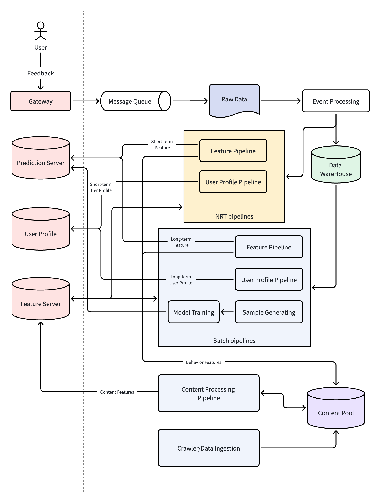
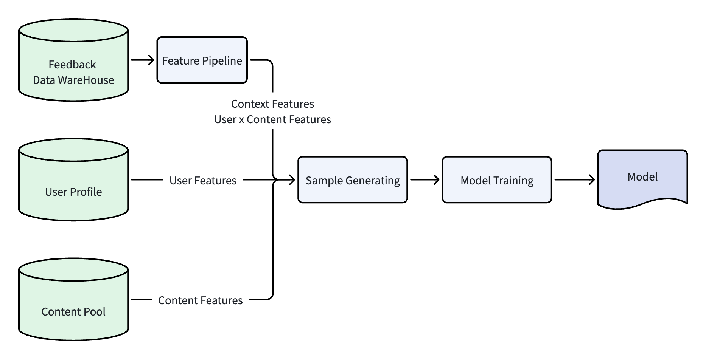

# 推荐系统架构（4）：离线系统总览，推荐系统的生产工厂

## 1\. 前言：推荐不只是线上那几十毫秒的排序

很多人接触推荐系统，看到的是App或者网页，打开界面或者刷新一下，在几十毫秒内，就能看到一批推送过来的内容。

因此，有不少刚入门的研发人员，都是从在线服务开始了解推荐系统的架构。接收到用户请求后，在线系统在几十毫秒内完成召回、粗排、精排、重排等等多个操作。在人的直观感觉里，就是一瞬间完成整个推荐操作。

但这几十毫秒的精准推送，背后有一整套的系统来支撑。在线服务，是推荐系统的展示出口，而看不到的离线生产体系，承担着庞大、复杂的数据计算，来支撑所有的推荐效果，也是个性化能力和智能决策的核心。

我们可以把推荐系统类比为工业产品体系：线上服务负责对接用户，展示成品；离线系统是工厂，负责生产加工。

因此，离线系统负责推荐系统所有的数据处理和沉淀工作，覆盖用户行为采集、日志处理、特征生产、画像构建、样本生成、模型训练等全部流程。整套离线系统各模块之间相互合作，持续处理和学习。没有离线系统的支撑，线上模型和排序逻辑将没办法运行。

本篇文章主要就是介绍工业级推荐系统离线系统的完整架构，带领大家从离线体系开始走进整个推荐系统世界。

## 2\. 离线系统整体架构总览

在本系列文章的第一篇第3.5节，我们讨论了在线系统负责决策，离线系统负责学习的分工逻辑。离线体系的目的是从海量的数据里面学习规律，让整个系统变聪明。离线系统的数据包括内容，以及用户行为反馈日志。在现在的推荐系统里面，内容的数量一般都在百万级别，而用户行为反馈日志，每天可能会有50亿到100亿条之多（取决于反馈埋点粒度），每天占用的存储空间一般在几十TB左右。

根据处理的数据流转和业务逻辑，我们把整个离线处理架构划分为这几大类模块：内容理解和处理(Content Processing)、行为反馈数据采集(User Event Collecting)、用户画像(User Profile Pipeline)、特征处理流水线 (Feature Pipeline) 、模型训练(Model Training)。

上图展示了一个典型的离线体系整体架构，完整覆盖了之前所述的五大模块。每一模块的主要职责参考下表：

| 模块                    | 职责                                                                         |
| --------------------- | -------------------------------------------------------------------------- |
| Content Processing    | 把结构化的文本、非结构化的图片音频视频等，转换为系统能理解的特征数据。                                        |
| User Event Collecting | 接收用户的行为反馈日志，进行简单的清洗和处理之后，存入到行为反馈数据库，供后续模块使用。                               |
| User Profile Pipeline | 根据用户的历史行为反馈，计算用户的长期兴趣和短期兴趣，把一个用户表示成系统能理解的特征模式。                             |
| Feature Pipeline      | 根据用户的历史行为反馈，处理内容、用户x内容相关的特征，给在线系统提供特征方面的支持。                                |
| Model Training        | 综合用户行为反馈日志、用户画像、内容特征（后两者可以从 Feature Server 中获取），生成训练样本，随后运行模型训练程序得到更新后的模型。 |

需要注意的是，本文中描述的架构并不是哪一本教材中的标准答案，而是基于我过去多年在新闻推荐系统中的实际工程经验总结而来。不同公司、不同阶段的推荐系统实现方式会有所差异，但整体思路大致相同。后续章节中，我们也会结合近年来推荐系统的发展，讨论一些新的架构演进方向。

下面我们继续分章节开始探讨各大模块的细节。 

## 3.  内容理解和处理

推荐系统的目的是把合适的内容推给合适的人，要做好推荐，首先要理解内容。在推荐系统的最开始，内容的理解和处理流程就一直存在。在初代的人工规则时代，系统也需要知道一篇内容是属于什么类别，它的热度分数是怎么样的。这些处理，都属于内容理解和处理流程的范畴。

### 3.1 内容相关的模块

上面架构图中的 Crawler/Data Ingestion, Content Pool, Content Processing Pipeline，都是内容理解和处理这一大类的。

- Content Pool，是整个推荐系统的内容资产中心，存储内容所有相关的数据。原始内容 (Raw Content)、内容特征 (Content Features) 等，都存在 Content Pool 中。

- Crawler 或 Data Ingestion，是获取内容的模块。对于外部数据，使用爬虫（Crawler）按规定来爬取；内部数据根据一定的合作方式来进行数据接入（Data Ingestion）

- Content Processing Pipeline，是内容处理流水线。这个 Pipeline 从 Content Pool 读取 Raw Content，抽取基础特征、计算更为复杂的质量特征等，结果再存入 Content Pool 中。

### 3.2 内容的表示

机器无法直接理解人类的文字、图片或视频，因此需要将内容转换成结构化的信息进行处理。

这些结构化信息通常统称为内容特征（Content Features）。

从工程实现角度来看，内容处理流水线会持续对原始内容进行分析和加工，生成各种内容特征，并存储到 Content Pool 中，供召回、排序、用户画像和模型训练等模块使用。

内容特征的具体形式很多，例如：

- 内容属性（类别、发布时间等）
- 内容语义（关键词、实体、主题等）
- 内容质量（质量分、新鲜度等）
- 内容行为（CTR、完读率等）
- 内容向量（Embedding）

在本篇中，我们只需要理解：Content Processing Pipeline 的职责，就是不断丰富和更新这些内容特征，让机器能够更好地理解内容。

关于各种内容特征的提取方法、质量评估机制以及 Embedding 等内容，我们已经规划了后续专题文章《内容理解与内容处理》，在那里进行详细介绍，敬请期待。
 
## 4. 行为反馈数据采集

内容是推荐系统最开始具备的数据，系统冷启动时候也只有内容数据。当内容分发给用户，用户有浏览行为，此时开始就会有用户的行为反馈数据。本节说的行为反馈数据采集（User Event Collecting）主要功能就是接收用户的行为反馈数据，存储到相应的数据库，供后续模块使用。

我们先简单解释一下用户的行为反馈是什么。当用户在App或网页端浏览分发下来的内容时，一般看到的是一个列表形式。对于可能感兴趣的内容，用户会点击进去浏览，不感兴趣的内容会跳过不点击。点击去浏览的内容如果是真的感兴趣的会看完再返回，如果点进去发现不感兴趣会快速退出。

用户的这些行为通过埋点，上报到服务端，这些行为就是 User Event。根据不同的维度，用户的行为可以进行不同类型的划分：

- 显式反馈和隐式反馈：用户主动的点赞、收藏或者点不感兴趣、举报，都属于显式的反馈；而用户浏览行为产生的反馈，例如点击、停留、完读、快速划走、主动退出属于隐式的反馈。

- 正向反馈、负向反馈和中性反馈：一般来说，表示用户喜欢内容的反馈属于正向反馈，例如点赞、收藏、点击、停留、完读等；而不喜欢内容的反馈属于负向反馈，例如：点不感兴趣、举报、快速划走、主动退出等。

关于反馈数据的更多内容细节，可以参考后续的专题文章《用户反馈系统》。

反馈数据是用户直接产生的，会由在线服务系统里面的网关 (Gateway) 接收到，然后把内容发送到消息队列 (Message Queue, 一般是 Kafka)，原始的数据 (Raw Data)  经过简单的处理 (Event Processing)，产出的结果一方面发送到实时或者近实时的流水线(NRT Pipelines) 去处理，另一方面就是存入到数据仓库 (Data Warehouse) 中。数据仓库集中存储所有用户所有的历史行为反馈，它是后续的批处理流水线 (Batch Pipelines) 最重要的数据源之一。

## 5. 用户画像建模

从特征体系上来说，用户画像也是特征的一种，归类于用户特征（参考第3篇《特征工程》）。单独拆分出来流水线，是因为用户画像的诞生比传统意义上的特征工程更早，是早期推荐系统最重要的两类特征之一。从工程角度来看，用户画像 (User Profile) 关注的是用户本身，而特征流水线 (Feature Pipeline) 更多关注内容特征、用户和内容交叉特征以及上下文特征。

推荐系统要给用户推送个性化内容，就必须要理解用户。因此，有了类别、关键词等内容特征，再结合用户反馈日志，就可以开始构建用户画像。早期的用户画像是标签-权重键值对结构，例如：
[<category:体育, 0.8>, <category:娱乐, 0.5>, <keyword:NBA, 0.8>, <keyword:CBA, 0.7>, <keyword:金鸡奖, 0.5>] 
这里面的数值表示用户对这个标签喜欢的程度。用户侧的兴趣画像，和内容侧的内容特征，可以采用余弦相似度算法计算匹配关系。这样系统就能把感兴趣的内容推送给用户，实现初步的个性化。

推荐系统发展到现在，用户画像从开始的标签-权重键值对表示的兴趣爱好，发展到多维度。用户画像中的基础属性包括人口统计学特征、行为特征标签、性格属性标签；兴趣偏好标签包括长期偏好标签、短期偏好标签、泛化偏好标签等。

因此，用户画像建模流水线 (User Profile Pipeline) 拆分出来，逻辑上更独立，工程实现更方便，更新节奏也可单独控制。用户画像中的长期偏好和短期偏好，分别由批量 (Batch) 和 近实时 (NRT) 两个不同的 Pipeline 处理构建。

Batch Pipeline 读取全量的用户历史行为反馈，用传统的统计方法或者深度学习建模方案，学习用户长期稳定的兴趣爱好。Batch Pipeline 一般是天级更新，输出稳定，保证推荐结果在大方向满足用户兴趣不发生偏离。

NRT Pipeline 一般处理近期（资讯类可能是7天，电商类是单次会话）内的用户行为反馈数据，计算用户的短期临时兴趣爱好。这种方式能很快地捕捉到用户临时突发的兴趣，然后把兴趣反馈到在线系统，对推荐结果进行调整满足用户临时兴趣需求。NRT Pipeline 一般是分钟级或者十分钟级运行一次，用滑动窗口的方式处理数据。

关于用户画像处理中的画像聚类、人群分层、用户 Embedding 向量等更多细节的内容，后续专题文章《用户画像》会进行更深入的探讨。

## 6. 特征处理

为了架构上的解耦，用户画像由 User Profile Pipeline 来处理，本节讲述的特征处理流水线 (Feature Pipeline) 主要负责：内容的用户行为特征、用户和内容交叉的特征以及上下文特征的处理。这几类特征是在线推理提升精度的关键。

在推荐系统早期，初创小团队，数据量不大，特征维度少。此时研发人员一般采用零散的脚本 (Shell, SQL) ，按任务需要运行来计算特征。这样开发的速度很快，能快速实验一个特征的产生和效果，效率很高。

但随着业务规模的发展，用户行为反馈数据变得多起来，特征维度也从十几个涨到几百、几千的级别。零散脚本和临时任务不能得到很好的管理，一些计算逻辑、版本控制等问题可能会导致线下训练和线上服务不一致，导致模型的效果大打折扣。这个阶段，流水线 Pipeline 慢慢成型，统一管理特征的处理，形成生产工厂的模式。

初始的 Feature Pipeline，都是基于用户全量历史行为来进行计算，每天固定时间全量计算并更新线上系统。这样能做到数据比较完整，没有遗漏。这种 Batch 的模式能保证数据的完整性、覆盖全面，正是业务发展到这个阶段所需要的。

随着规模的继续发展，业务希望能快速追踪热点、满足用户的临时突发兴趣，Batch Pipeline 的天级更新满足不了要求，因此引入了近实时流水线 (NRT Pipeline)。NRT Pipeline 以分钟级或十分钟级为时间窗口，把窗口期内的行为数据单独建模计算，能很好地满足热点追踪、实时兴趣捕捉的需求。

目前，行业的典型做法都是两层 Feature Pipeline。Batch Pipeline 负责全量数据批量计算和更新，也是模型训练基准数据的来源。NRT Pipeline 捕捉热点和实时兴趣，作为用户当下浏览需求的补充。

特征在迭代过程中会产生很多的版本，特征的计算逻辑也可能变化。为了保证迭代和变化不影响训练服务一致性，行业中越来越多公司开始使用 Feature Store 对特征进行统一管理。Feature Store 不仅负责特征数据的存储和查询，还会管理特征的元数据（Metadata）、Owner、版本、生命周期以及线上线下一致性等问题。前面提到的 Feature Server 可以理解为 Feature Store 体系中的一个在线服务组件，负责向在线系统提供低延迟特征查询能力。

关于 Feature Store 与 Feature Server 的关系，以及现代推荐系统中特征基础设施的演进，我们会在后续《特征处理 Pipeline》中进一步讨论。

## 7. 模型训练

模型是推荐系统里面的智能计算核心，它赋予了系统智能化能力。模型是基于大数据在离线系统下训练出来的。本文讲的是推荐系统的工程化实践，对模型的原理和公式不做讨论，下面从工程角度来快速总结一下模型训练的流程。

从宏观上来说，模型训练的数据输入包括：用户基础数据、内容基础数据、用户行为反馈。不过模型训练程序是机器运行的二进制代码，它只能认识特征，所以这些数据都被转换成特征，输入到模型训练程序中。用户数据转换为用户特征，存在 User Profile 系统；内容数据转换之后的特征存在 Content Pool 中，行为特征经过 Feature Pipeline，输出上下文特征 (Context Feature) 和 用户内容交叉特征 (User x Content Features)。所以整个训练流程大概如下所示：

有了这几类输入数据，样本生成模块 (Sample Generating) 会根据用户行为，生成带标签的样本。标签会根据模型的目标来定义，例如如果目标是点击率，点击事件就是一个正样本（例如标签是1），而曝光没有点击是一个负样本（例如标签是0）。

对于一个多目标优化的模型，一个样本的标签就会是多个，一条样本数据大概是这样的：
（用户特征、内容特征、上下文特征、交叉特征），是否点击 (1/0)，是否转化 (1/0)，是否点赞 (1/0)
这里面的举例的标签都是二分类标签，如果目标是停留时长、预估GMV等数值型，那么标签直接保留原始连续值即可。模型会自动读取，从样本中学习对应关系。

样本数据生成出来之后，进入模型训练之前，整个样本集划分成训练集、验证集和测试集。集合划分的时候，会采用一些策略来保证各集合的样本均衡性。但这个策略一定不会是随机打散，因为样本数据具有时间顺序性，打乱的话可能会造成时间穿越问题。采用的策略一般会有：时间切分法、分层采样法、基于用户/内容划分法等。

有了样本数据，后面就是模型训练 (Model Training) 程序运行，得到模型的过程了。

本篇只是一个离线系统的概览，给大家快速总结一下这个流程，关于更多细节，后面也规划了专题文章《模型训练的工程化流程》。

## 8. 工程挑战

### 8.1 数据延迟与特征新鲜度的时效矛盾

这个矛盾也是 Batch, NRT 两层 Pipeline 框架引入的原因。如果只有批量处理，特征的新鲜度只能天级更新，满足不了热点追踪、临时兴趣捕捉的要求。所以 NRT Pipeline 引入正是为了解决这个问题。

现在的推荐系统，有的业务要求更高，NRT 也换成更实时 (Realtime) 的 Pipeline，甚至能在秒级响应。但这种实时的 Pipeline 会有更多的问题和挑战，例如：复杂的链路应对实时请求、模型推理速度受影响、可靠性和扩展性要求高、反馈信号质量要求高等等。实时确实能带来快速响应的能力，推荐精度变高，但稳定性和工程代价会急剧变大。

所以是选择 NRT 还是 Realtime，或者 Realtime 的响应时间粒度，需要在数据延迟、特征新鲜度、成本之间权衡，找到一个平衡点。

### 8.2 数据质量与容错

用户行为日志、上游数据经常存在缺失、脏数据、格式错误，如果严格校验过滤会导致大量数据无法使用，样本量不足；如果不校验直接使用，又会导致模型训练效果变差。

为了解决这个问题，我们采用的方法一般是：

- 分层容错策略：核心特征（如用户ID、内容ID）缺失直接过滤样本，非核心特征（如冷门标签）缺失用默认值/均值填充，平衡数据质量和样本量。

- 数据质量监控：对每个数据源做完整性、准确性监控，当脏数据占比超过阈值自动报警，回滚到上一版本数据。

### 8.3 超大规模数据的存储计算成本挑战

如果是日活3000万，每天的行为反馈日志可能会在数十TB到百TB级别，对于行业的头部互联网公司，日活上亿，每天数据量会在 PB 级别。全量存储和计算会消耗大量存储、CPU资源，成本极高。但如果压缩裁剪数据，又会损失信息导致模型效果下降。

对于这种挑战，一般的做法包括：

- 冷热数据分层存储：近期7天热数据存高速SSD供频繁计算，超过30天的数据换成成本更低的存储，只有当模型需要全量重新训练的时候使用。

- 负样本下采样+缓存复用：对大量的负样本按比例抽样，减少计算量；重复使用已经计算完成的特征，避免每天全量重算。

- 弹性调度计算资源：用云原生弹性扩缩容，高峰时自动扩容，闲时释放资源，降低闲置成本。

### 8.4 跨业务跨模型特征复用性

在不同的推荐场景中，例如同一个用户的不同使用场景，首页推荐、搜索推荐、商品的购物车推荐等，用到的用户特征都类似。如果每一个场景都重复计算，会浪费计算、存储资源，也可能会导致多版本特征不一致的问题。

因此，这类的用户特征，都会集中存储，线上都会存放在 Feature Server 中。所有业务使用的公共特征（例如用户基础属性）使用同一份，场景特有的特征，统一格式命名，方便管理。

### 8.5 多版本特征管理

不仅是不同场景会有不同的特征，同一个场景，模型迭代时候也会产生多个版本的样本和特征。如果不对特征版本进行管理，有可能出现“新版本特征训练旧版本模型”、“回溯实验找不到对应版本特征”等问题，从而导致迭代效率下降。

这个问题的解决办法就是前面说的 Feature Store。Feature Store 来统一管理特征的元数据、版本、生命周期等。这样一个体系化的管理，可以避免版本不一致的问题。同时，每次模型训练结束之后，对特征、样本做一个快照，以后回溯时候就能很好的恢复重放。

## 9. 总结

本篇对离线体系做了一个大概的介绍，让大家对推荐系统的离线部分有一个宏观上的认识，对各大模块的功能和作用也有基本了解。

推荐系统分在线和离线两大部分，离线系统是整个推荐系统的数据生产工厂，它持续运转、持续生产、持续进化。可以说，在线系统的效果好不好，取决于这个离线工厂的产品质量高不高。

## 下一篇预告

本篇作为离线系统总览，只介绍了架构框架，没有深入细节。从下一篇开始，会对各大模块更多的细节进行探讨。下一篇会先从内容开始，详细描述《内容理解和内容处理》。

