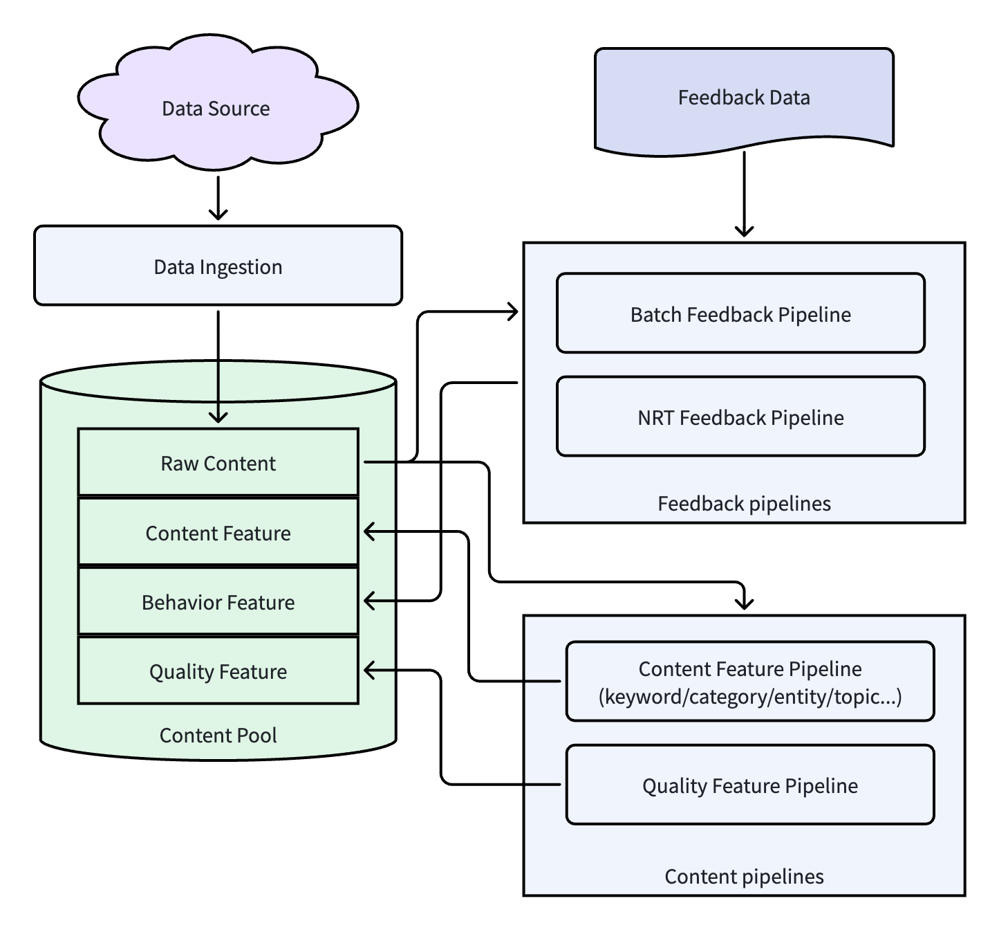

# 推荐系统架构（5）：内容资产体系，系统认知能力

## 1. 内容资产体系的整体架构

### 1.1 内容处理流程的重要性

在第4篇《离线系统总览》中，我们简单介绍了内容理解和处理模块的主要价值和大概流程。本篇将把内容处理流程扩展并加深，把整个推荐系统的内容资产体系介绍给大家。

内容是推荐系统最先具备的资产，有了内容才能开始推荐。内容资产体系，就是负责管理整个系统的内容数据，对内容进行理解转换为系统能理解的特征，然后把合适的内容推送给合适的用户。

业务初期，没有任何的用户行为数据，或者是新内容刚进入系统，没有对应的用户反馈。此时系统需要依赖内容体系产生的内容基础特征来进行内容分发，把相对合适的内容推送给用户，让优质的内容能得到快速的数据反馈。也就是说，如果没有内容资产体系，内容生态无法进入良性循环。

在业务发展到一定规模之后，场景变多、用户的需求也更精细化。此时系统需要依赖内容资产体系进行更精细化的特征产出，进行精细化的内容分发。

所以，内容资产体系的能力会决定推荐系统的上限，是整个系统的核心部件之一。 

### 1.2 内容资产体系整体架构

我们先来看一下内容资产体系的整体架构是什么样的：

这是一套典型的内容资产体系整体架构，如果对图里的专业术语感到陌生也不用担心，后面章节会展开讲解。我们先看整个架构，分为以下这几个部分组件：

- 内容池  (Content Pool) ：内容资产核心存储。
- 内容接入 (Content Ingestion) ：把内容接入到推荐系统中。
- 内容基础特征生产 (Content Feature Pipeline) ：内容的基础特征（静态特征）生产流水线。
- 行为特征生产 (Behavior Feature Pipeline) ：用户行为特征流水线。这部分其实也属于用户反馈系统，在后续的专题文章中会更详细的介绍。
- 质量特征生产 (Quality Feature Pipeline) ：内容质量特征生产流水线。

以上组件相互配合，组成我们推荐系统的内容资产体系。下面的章节，将分组件给大家详细介绍。

## 2. 内容数据接入 (Data Ingestion)

推荐系统中的所有内容，不管是图文资讯、音视频内容、直播、商品等，都不可能是系统自己生成出来，都需要从外部的数据源接入。数据源一般分为两大类：外部数据源和内部数据源。

### 2.1 外部数据源

外部数据源指的是不属于公司/企业内部创作生产的数据，而是从外面渠道引入的内容。对于资讯类平台，外部数据源占推荐内容的大部分。根据接入场景，外部数据源一般有以下几类：

第一类，全网抓取内容。系统采用爬虫 (Crawler) 技术，合规采集全网公开的内容，然后经过一定的过滤、去重规则，存储到内容资产体系中。具体的爬虫技术我们不展开，此处只介绍这类数据源。

第二类，RSS 订阅。很多的正规媒体或者资讯站点会开放专门的 RSS 接口，推荐系统可以使用 RSS 接口来同步这些媒体或平台的最新数据。这种方式比较成熟，可以做到全自动实时同步，不需要人工干预。

第三类，媒体和创作者合作。推荐平台可以和一些官方媒体、自媒体创作者合作，合作方采用协商好的方式定期推送内容。这一类的内容原创度比较高、质量比较好，是推荐系统优质内容的来源之一。

外部的数据源相对来说格式多变，系统需要对不同的数据源做相应的适配。对于热点内容和普通内容，系统也需要定制不同的策略去获取，工程实现的成本相对较大。不过外部数据源内容数量巨大，是推荐系统尤其是资讯类推荐平台最好的内容补充。

### 2.2 内部数据源

内部数据源和推荐平台属于同一家公司/企业，处于同一个内容生态。这类数据源的特点是可控性强、同步方便、场景的适配度很高，是推荐平台的另外一个优质内容来源。

关于内部数据源，下面我们举几个例子，说明几个应用场景。这些应用场景的数据源，都非常适应这个场景下的推荐。

第一，社区的用户发帖。例如贴吧、微博等内容社区，每天都有海量用户发布很多内容。这一类的内容因为参与的人数非常多，每天产出内容数量非常大。但因为发布人员分布比较广，所发布的内容质量良莠不齐，需要筛选出优质内容进行推荐。

第二，专业创作者内容。例如知乎、小红书等平台，有签约作者、垂直领域博主等。这些创作者专业化程度相对较高，发布的内容也会经过精心撰写打磨，所以质量更高。这一类的内容，是推荐平台优质内容来源之一。

第三，短视频平台的短视频。例如抖音、快手这样的短视频平台，有大量创作者发布短视频。这类内容和第一类内容比较相似，只是第一类是图文居多，本类型主要是短视频。发布的内容也是质量有高有低，需要筛选。

第四，电商平台的商品。淘宝、京东等电商平台，商品类目就是这一类型推荐的内容主要来源。上架的商品图文介绍、视频详情，以及购买人员的评论，都是推荐数据来源。这是电商类个性化推荐的典型场景。

### 2.3 内容同步机制

不管是外部数据源还是内部数据源，都需要同步到系统内部的内容池，才能进行后续的处理和推荐。怎么把这些数据完整、高效的同步，是需要解决的问题之一。目前行业通用的办法是批量全量同步、实时增量同步两种模式结合，根据数据的规模、属性、时效等要求来选用。

- 批量全量同步。对于外部数据源的爬虫方式，一般只适用于某个网站或者某个模块的全量重新抓取。对于内部数据源，一般是把业务数据库内容的批量一次性全部同步到推荐平台。全量同步的所涉及数据量巨大，同步耗时比较多，一般只在特定时候或者特定要求下进行。
- 实时增量同步。例如外部数据源的增量爬取、RSS 增量同步。内部数据源一般使用消息队列，对内容变更、商品条目的新增/修改做实时同步更新。这种模式能很好的适配热点的新闻、实时赛事、全新短视频等时效性很高的内容。

## 3. 内容池 (Content Pool)

内容池也叫内容资产中心，是整个内容资产体系的核心存储组件。推荐系统中所用到的所有内容相关数据，都存储于内容池中。这也是和之前系统零散、混乱的内容素材最大的区别。

内容池主要存储数据包括：原始内容数据、内容基础特征、用户行为特征、内容质量特征。

### 3.1 原始内容数据

原始内容数据是从数据源（外部和内部）接入进来，没有经过处理之前的内容，它完整保留最初始信息，是后续所有的处理和计算的来源。原始内容存储的目的是保存一份最开始状态的数据，后面的算法如果要迭代变化，都能基于这份最原始的数据来进行重新计算。原始数据一般会有以下字段：

- 标题：标题一般是作者或者编辑指定的，标题把文章的主题浓缩在一句话之内，信息密度非常高。所以标题是后续的算法处理最重要的属性之一。
- 正文内容：内容的完整主体。例如图文、资讯类的内容，文字全部都在正文，信息量很大。后续的关键词提取、实体识别、话题聚类等等一系列的特征提取和计算，大部分都是基于正文内容来做的。
- 内容类型：表示内容类型：图文、音频、短视频、长视频、直播、商品等。不同类型的内容处理方式不一样，例如纯文字用传统 NLP 来处理，而图片视频等其他形式的内容，需要深度学习模型来理解语义。
- 作者：标识发布这篇内容的人。可以根据作者的一些信息，例如：认证资质、历史质量、影响力等，来辅助识别内容质量，进行分层分发。
- 发布单位：用以区分发布单位是官方媒体、权威机构、平台运营还是自媒体等，辅助来判断内容的权威性和可信度。
- 发布时间：内容发布的时间。用于计算内容新鲜度、失效衰减等。
- 图片、音频、视频素材：把内容中的多媒体素材（图片、音频、视频）单独提取存放，方便后续用模型来理解这些多媒体素材的语义，结合文字类信息一起进行后续的内容分发。
- 原始状态标记：记录这条内容的状态：刚接入、已生成特征、待审核、下架等状态。后续的流程基于这个状态对内容进行处理或者过滤。

### 3.2 内容基础特征数据

原始内容接入到推荐平台之后，需要经过处理才能被系统所理解而后进入分发环节。第一步的处理就是抽取内容基础特征，作为在线推理模型的输入。内容基础特征可以让系统知道：这条内容分类是什么、有什么关键词，然后可以匹配到合适的用户，进行分发。内容基础特征包括：

- 分类：表示内容所属的粗粒度类别，一般采用一级二级分类。例如：体育-篮球、娱乐-明星八卦、财经-基金等，这实现了内容的基础归类和分层。
- 关键词：从内容中提取出来，能代表内容的词汇，这些词汇可以一定程度上表示内容的细节，在上面粗粒度分类下更详细的描述这篇文章。例如：2026NBA总决赛、总决赛G4、逆转等。
- 实体：识别内容中的人物、地点、组织等具体对象，例如：球队-纽约尼克斯队、球队-圣安东尼奥马刺队、赛事-2026NBA总决赛等。
- 所属话题：将零散的关键词、实体聚合为一个完整主题。例如：#2026NBA总决赛#。
- Embedding 向量：用深度学习模型，将整篇内容抽象为深度语义向量，突破传统的字面匹配局限。
- 多模态内容基础特征：一般包括图像/视频视觉特征、音频语义特征等。

### 3.3 用户行为特征数据

用户行为特征是指用户通过真实的浏览行为，给内容打上的动态标签属性，例如曝光、点击、CTR等。这一类特征属于内容的动态特征，3.2 节所说的基础特征属于静态特征。静态特征能表示内容“是什么”，而动态特征能反映出内容“受不受用户欢迎”。

这一类动态数据一般都会实时更新，然后调整后续内容分发权重。这样能让优质内容更快推送给更多人，而劣质内容慢慢减少展示机会。

需要说明的是，用户行为特征在不同的推荐系统实现中归属并不完全一致。早期推荐系统中，Feature Server 还没有普及，用户行为特征直接存储到 Content Pool 中，作为内容资产的一部分参与模型训练。随着 Behavior Feature Pipeline 和 Feature Store 的发展，实时行为特征在线部分慢慢都迁移到 Feature Server 中。而离线训练则根据系统架构的不同，可以从 Content Pool 或 Feature Server 中读取。 

本文采用的我实际参与建设的新闻推荐系统架构方案，因此将行为特征当成内容资产的一部分进行介绍。

### 3.4 内容质量特征数据

内容质量特征和用户无关，属于内容自有的一类特征，是属于内容基础特征的扩展。内容质量特征一般用来评判一个内容的可信度、观感质量，是平台推荐风格的一个保障。

内容质量特征可能会有：账号权威性、内容丰富性、原创度、可读性以及综合质量分等。

### 3.5 Content Pool 特征多版本管理

Content Pool 中存储有多种特征，特征由算法计算得出，算法的迭代就可能会使一个特征存在多个版本。本节主要来介绍一下 Content Pool 中特征多版本管理方面的策略。至于 Content Pool 中的原始内容，这部分数据基本不会变化，不涉及多版本问题。

在 Feature Store 出现之前，或当前 Feature Store 技术已经成熟，但有些中小团队还保持轻量级方案，没有引入 Feature Store。对于这个阶段来说，特征多版本管理的策略是多字段+配置绑定。

- 不同版本的特征用不同字段表示，例如对于所属话题，采用 topic_v1, topic_v2 两个字段表示两个不同版本。
- 配置中写好一个模型对应的特征版本、字段是什么。模型训练和在线服务都要读取同一个配置，然后读取相应字段进行处理。

这种方式优缺点：

- **优点**：实现成本低，不需要搭建 Feature Store，能很快实现。架构简单易懂，运维成本低。方案能一定程度上解决版本不一致、实验回溯的问题。
- **缺点**：缺乏统一的元数据管理，版本变更、多人协作容易混乱。版本迭代多了之后，字段多了，维护成本上升。快照回溯不是那么灵活，实验复现成本相对较高。

当前中大型推荐平台，一般都会采用 Feature Store 的 Content Pool 特征多版本管理方案。Content Pool 里面的每一个特征，都在 Feature Store 中注册。每一次特征计算算法的迭代变更，会自动生成一个带唯一标识的新版本，此时会自动映射到特征的元数据（负责人、特征描述等）。例如，话题模型从 v1 迭代到 v2，特征主名字还是 topic，后缀带 v1 或者 v2。

到 Content Pool 存储层面，和上面的轻量化方案类似，会采用多字段来存储，也是 topic_v1, topic_v2。和轻量化方案不同的是，通过 Feature Store 与模型注册表的关联，自动完成版本映射，减少人工维护成本。这样靠 Feature Store 的能力从根本上解决版本不一致问题。

对于超大规模的内容池，单表多版本特征字段的方式可能会造成存储浪费，因为不一定所有的内容都会有新版本特征，对于没有新特征的内容条目，保存占位符会造成空间的浪费。所以对超大规模内容池，一种可优化的方案是分维度多表存储特征。内容基础信息存储在主表，然后新建一个内容特征版本表，存储如下内容：

| Content ID | Feature_ver | Topic_value |
| ---------- | ----------- | ----------- |
| 10001      | V1.0        | NBA 赛事      |
| 10001      | V2.0        | 2026NBA总决赛  |
有对应版本特征的内容才插入到特征表，这样可以节省存储空间。在模型训练时，需要把两个表 join 之后获取正确数据。在线推理时，离线模块把数据预先处理连接好，推送到线上，不增加额外的线上服务延迟。

### 3.6 Content Pool 的价值

Content Pool 是内容资产体系的核心存储，把所有的内容集中统一存放。它可以解决以下几个推荐系统工程化中的问题：

- 第一，解决内容分散存储问题，保证全链路数据一致性。如果没有 Content Pool，内容将会分散存储，图文存在 MySQL、视频存在对象存储。后续的计算需要从各个地方取数据，架构复杂，也容易导致不一致问题。集中到 Content Pool 之后，所有的离线系统（特征生成、模型训练）、在线系统（召回、排序）的数据源头都是同一个，保证了全链路数据的一致性。
- 第二，提升特征复用效率，减小工程冗余。Content Pool 中的内容基础特征、用户行为特征、内容质量特征，可以集中一次性处理生成。在不同的应用场景下，不需要重新去处理这些内容特征，直接取用即可。这样减小了多团队之间重复计算的资源浪费，整体迭代效率能得到很大提升。
- 第三，支持高效实验迭代和问题排查。推荐系统需要做频繁的模型迭代，A/B 实验。Content Pool 结合特征版本管理，可以保留不同版本的内容特征，实验回溯时可以快速恢复到对应版本 ，缩短实验周期。线上推荐出现问题时，也可以从 Content Pool 里面找到对应的特征版本，快速定位是特征问题还是模型问题，排查效率比分散存储高。

## 4. 内容特征体系

前文已经介绍过 Content Pool 中存储有内容特征，包括基础特征、用户行为特征和质量特征，本节对这些内容体系做个更深入的介绍。

### 4.1 内容基础特征

内容的基础特征是内容自有特征之一，不依赖用户反馈，一般在内容接入到系统之后，就可以开展内容基础特征提取流程。基础特征包括如下：

#### 4.1.1 分类 Category 

分类是推荐系统最早开发实现的内容特征，是内容的最基础也是稳定性最强的特征。最早的分类是单级分类，把所有内容分类成：体育、财经、娱乐、美食、科技等等这样的大类。然后随着业务的发展，逐渐发展成二级分类，例如体育分类下面再细分为篮球、足球、跑步、健身等类目，形成：体育-篮球、体育-足球、体育-跑步这样的二级分类体系。

现在有一些系统会细化到三级甚至四级分类，例如：体育-篮球-NBA-NBA总决赛。这都是为了更精细化表示内容。

但类别的特征整体来说，还是过于粗放，不能很好地区分更细节的内容差异。例如就算细化到四级分类，NBA总决赛，但还是不能知道这篇内容是赛事直播，还是球星采访。所以，分类特征作为最早最基础的内容特征，只适合用于大类推荐，满足不了用户细分兴趣。

分类特征的提取，早期一般会使用 SVM，后续迭代到 FastText 算法，目前行业主流大都是采用 BERT 类预训练模型。

#### 4.1.2 关键词 Keyword

最早的分类特征粒度太粗，没办法满足细分需求，因此引入关键词特征作为精细化的补充。关键词提取算法，从标题、正文中选取辨识度高、贴合主题的词汇，作为关键词，来描述这篇内容的细节信息。

举个例子，一篇NBA总决赛第四场赛事报道，可以提取关键词：NBA总决赛、总决赛第四场、纽约尼克斯队、圣安东尼奥马刺队、布伦森、文班亚马等。这些关键词一定程度上代表这篇文章的细节内容。

关键词特征这种精准捕捉内容细节的性质，让推荐从开始的分类粗匹配转变为关键词细节匹配，能更好的满足用户精细化兴趣的需求。不过关键词也有碎片化、零碎化的特点，同主题的不同内容，关键词组合也可能有比较大的差异，对于兴趣聚合匹配没办法高效满足。

#### 4.1.3 实体 Entity

实体特征的引入是为了解决关键词特征零散、语义模糊的问题。实体是指内容中真实、具体的客观对象，例如可能划分：人物实体、地点实体、组织实体、事件实体、时间实体。

继续上一节的例子，NBA总决赛赛事报道，实体可能是：人物-布伦森、人物-文班亚马，地点-麦迪逊广场花园，组织-NBA联盟，赛事-NBA总决赛，时间-2026年6月10日（当地时间）。

实体特征引入的意义，就是为了让关键词的语义更为清晰，能精准的把对应内容推荐给真正感兴趣的人。举个简单例子，如果只有关键词“小米”，系统不知道这是公司小米还是农产品小米（同样的例子还有“苹果”）。而有实体特征之后，就可以知道是“公司-小米”，这样对内容的理解更准确。

由于其精准的特性，实体特征会广泛用于召回阶段，例如用户明确表示喜欢球星布伦森，召回时就能精准根据实体“人物-布伦森”来召回内容，而不是其他含有“布伦森”同名内容。

#### 4.1.4 话题 Topic

分类太粗、关键词太细，话题刚好是一个中间的粒度，它的引入正是为了解决“分类太粗不够准，关键词太碎不聚合”的问题。

例如上面那篇文章，所属话题可能是“2026NBA总决赛”，同类型的文章都属于这个话题，用户看了一场比赛，就会继续推荐话题系列中的其他文章。这样基于内容聚合的推荐，能更好满足用户阅读延伸的需求。

话题也天生适应与热点内容推荐。当有热点内容爆发时，相关的内容聚合到一个话题中，所有新增内容能很快通过话题来召回，这样能很好解决热点内容的流量承接。

基于话题的推荐也能一定程度上延伸用户的兴趣。例如用户关注“2026NBA总决赛”，系统推荐话题中不同场次的内容，让用户阅读范围可以延伸到其他的实体，提升推荐的多样性。如果用户正好对其他场次或者某个球员感兴趣，这样也正好扩展了其兴趣。

#### 4.1.5 Embedding 向量

Embedding 向量中文是 嵌入向量，是对一篇内容的深度语义分析得到的向量表示。上面说的分类、关键词、实体、所属话题都是传统的离散标签。而 Embedding 向量是把一段内容语义，转换为稠密向量表示。语义越接近的内容向量，它们在向量空间中距离越近。

Embedding 向量引入的主要作用：

- 语义级别的精准表示。例如两篇文章，都有“布伦森34分”的表达，但一篇是赛事报道，一篇是技术分析。离散标签不能很好地表示这两篇内容，而 Embedding 向量从深度语义出发，能很好的区分。这种精准的表示，在召回阶段，比关键词召回更精准。
- 提升冷启动效果。新增内容没有用户反馈，此时只能依靠 Embedding 向量，通过向量的相似性，推送给兴趣类似的用户，这样的效果比仅依赖离散标签的冷启动更好。
- 支撑高阶推荐。现在主流的深度学习推荐模型，不管是召回还是排序阶段，很多都依赖 Embedding 作为基础输入。所以 Embedding 向量是这个阶段推荐系统最基础的特征。
- 补全离散标签不足。Embedding 向量一般和关键词、实体、话题搭配使用，离散标签负责粗粒度的召回，Embedding 向量负责细粒度语义匹配，这两者结合，效果比单一使用更好。

简单来说，Embedding 是现代深度推荐模型的最基础特征之一。在工程落地上，Embedding 向量的检索通常依赖 ANN（Approximate Nearest Neighbor）向量检索系统，具体实现会在后续召回系统章节展开。

### 4.2 用户行为特征

用户行为特征是用户的真实浏览行为反馈产生的，能反映内容的真实用户口碑，能精准判定一条内容的真实分发价值。

#### 4.2.1 行为信号的信任分层

在系统中，我们通常会记录用户对一条内容的十几种行为，但不是所有行为可信度都一样。我们在工程实践中，一般对用户行为进行分层，示例如下：

第一层：**高信任隐性正反馈**。例如停留时长、完读/完播率、浏览深度、二次回访率。这些行为大部分都是用户自然反应产生的浏览行为，不方便进行恶意刷量。如果一条内容的平均停留时长或者完读/完播率高，那就表示用户愿意看，并且能看完，也就说明这篇内容质量很高。但在工程落地时我们要注意：停留时长要剔除一些边缘情况，例如极短误触和极长挂机等。

第二层：**中信任显性正反馈**。用户的主动行为：点赞、收藏、转发、评论、点击率，是用户主动表达的认可。但这些行为可能容易被诱导，例如“点赞过万更新”、“收藏备用”等引导。这些行为的使用，需要配合频次限制和用户粒度异常检测（比如短时间内大量点赞同一作者、评论模板化）。点击率属于这一层而不是最高层，也是因为 CTR 受标题党和封面影响大，不能完全代表内容真实质量。

第三层：**高信任显性负反馈**。这也是用户的主动行为：不感兴趣、举报、屏蔽作者、负面评论占比。这类行为误操作概率很低，用户一般不会闲着没事乱点“不感兴趣”或举报。一旦触发，可以直接参与限流或降权决策。

第四层：**低信任间接反馈**。例如：曝光量、普通播放率。曝光量是流量分配的结果，不是原因，不适合直接当反馈。至于“播放完成率”，在短视频场景下，用户随手点开又快速退出也会算一次“播放”，容易误导。这种情况建议结合视频时长和真实停留时长做交叉判断，比如 15 秒的视频播放只停留 3 秒，其实是跳出。

#### 4.2.2 用户行为特征计算和使用

用户行为特征由 Behavior Feature Pipeline 计算生成（参考第4篇《离线系统总览》），结果写入到 Content Pool 中。

Content Pool 中的用户行为特征，一般直接用于离线系统的模型训练，或热点发现等流程。在线服务中用到的这类特征，需要单独同步到在线系统中。如果系统已经引入 Feature Server，那么这类特征将会同步到该服务。如果系统还没引入 Feature Server，一般会同步到在线的 Redis 等缓存中。

用户行为特征和内容的基础特征，是互相补充，共同生效。新内容入库，依靠基础特征完成冷启动，进入小流量池。系统收集到用户反馈之后，如果没有出现明显负反馈，则会逐渐加大分发流量，如果负面影响严重，则会快速收缩流量。这种协同机制，高效完成内容从入库到冷启动到正常分发的过程。

### 4.3 内容质量体系

在推荐系统里，Content Pool 不光要有用户行为信号，还需要一套独立于实时反馈的内容质量体系。因为有些内容用户喜欢点、喜欢看，但不代表它就是高质量的；反过来，真正优质的长尾内容，可能因为曝光不足导致行为信号稀疏。质量体系的作用，就是在行为信号之外，给内容一个更稳定的基准分。

下面我从工程落地的角度，讲几个我们常用的质量特征。

#### 4.3.1 权威性

权威性解决的是信任问题。在很多个领域，用户一般不轻易点击低信源内容，行为数据天然稀疏。所以系统引入权威性这个质量特征来缓解这一类问题。

工程上通常用作者维度特征和发布平台实现，例如作者资质等级、专业领域资质绑定、发布平台权威性、作者和发布平台外部影响力等。举个例子，人民日报发布的一篇内容，权威性肯定超过一个自媒体博主发布的同类型内容。

权威性可以作用在不同阶段，例如召回时过滤掉权威性低于阈值内容、排序时根据权威性分数加权、热点事件优先推荐高权威性内容等等。

#### 4.3.2 新鲜度

新鲜度 (Freshness) 和内容发布的远近 (Doc Age) 是两个概念，发布时间距离现在近的内容比较“新”，但是“新鲜度”分数不一定高。套用一个定义，新鲜度是“内容在当前内容池中的信息增量”。举个例子，如果一个事件被 100 个人报道了，刚发布的内容新鲜度高，用户喜欢看；后发布的内容新鲜度就比较低，用户可能就不喜欢。新鲜度就是辅助系统从一堆类似的内容中，找到那个最新或更独特的那篇。

新鲜度在工程实现中，一般综合内容首次出现的时间、同主题内容的密集程度（相似内容在过去N小时内出现的次数）、内容指纹去重后的剩余信息量这些因素进行计算。在在线服务阶段，新鲜度低的内容也不一定在全部场景下会被直接打压，但在热点场景或冷启动阶段肯定会被降权。

#### 4.3.3 原创度

原创度特征引入的作用是维护平台内容生态健康、保护创作者权益。现在网上很多人对原创内容进行搬运、改写或洗稿后重新发布。这一类内容有时候标题诱人，抄袭的内容质量也比较高，行为模型短期内识别不出来，但长期会损害用户体验。所以需要引入原创度这个特征来表示一篇内容的原创程度分数。

当前业界一般用内容指纹来对比实现，所有内容生成统一的指纹（SimHash 或 Embedding），新内容入库时和已有内容池进行对比。通过内容指纹和语义相似度计算找到类似文章，发表时间最早的记为原创，赋予更高的原创分，其他内容赋予低原创度分。

如果因发表时间记录错误而导致的原创内容标记错误，平台为原创作者开放申诉渠道，经人工审核后修正标注结果。

#### 4.3.4 内容丰富性

内容丰富性是用来区分一篇内容是否具备足够信息量的特征。这个特征能给信息充足的干货内容更多的权重，而对于那些空洞凑数的低质量内容进行降权甚至过滤。

内容丰富性一般会从下面几个维度来综合判定：

- 基础信息密度：核心观点、案例、数据这些属于有效信息，这些有效信息在文中占比越大，丰富性分数就会越高。而对于那些有太多套话、重复观点或者凑字数的文章，丰富性分数就越低。
- 内容结构：如果内容有很清楚的逻辑框架，例如分点论述、有引言、有总结，搭配对应的配图、表格等，就会有更高的丰富性分数。
- 深度延展：文中除了讲述基础的事实，还有延伸的分析和个人观点等，丰富性分数会更高。例如一篇NBA赛事，不仅有比分和赛事过程，还分析了战术、球员等，它的丰富性分数肯定更高。
- AI 内容识别：现在 AI 生成内容流行之后，系统会增加识别 AI “空话套话”、“模板化内容”的方法。举个例子，一个讲“推荐系统”的文章，如果大部分都是“推荐系统很重要”、“能提升用户体验”这种正确的废话，而没有具体的落地方案，那这篇文章丰富性分数就会降低。

#### 4.3.5 综合质量分以及质量特征的使用

业务开发前期（或中小团队），系统一般以加权融合或其他方式，把上面几个质量特征融合为一个综合质量分。单维度的综合质量分作为模型的输入，从模型训练到在线推理会简单，也能达到质量控制的目的。

有能力的大团队，会分开使用。每个分数都作为独立特征，同时也会把综合质量分作为辅助，一起输入到模型中。这样可以让模型自己学习不同场景、不同用户群体的质量特征权重。举个例子：热点新闻场景下新鲜度权重高一些、医疗知识场景下权威性权重高、而泛娱乐内容原创度权重更高。这样比预先把质量特征加权成一个综合质量分的方式更灵活。不过这样的设计，要求更复杂的模型、更多的训练数据、特征维护成本也更高。

质量分还可以用在一些特殊的场景，例如有的平台，对于综合质量分前20%的内容会增加曝光，而对综合质量分后10%的内容减少曝光。这样做的目的是为了正向引导创作者产生更多更优质内容。

#### 4.3.6 其他特征

除了以上五个特征，还有一些可选特征也可以作为质量特征体系候选，例如：

- 情感倾向：标识内容是正向还是负向还是中性，在一些场景对负向内容降权。
- 可读性：一个技术指标和体验指标综合体，例如语句的通顺性、特殊字符密集度、排版等方面综合考虑，生成一个可读性分数。
- 内容完成度：有一些低质内容开头写得好，但后面烂尾或明显凑字数，这可以引入内容完成度特征来标识。

总体来说，内容质量特征是用来标识一篇内容的质量是好还是不好，不同团队根据不同的业务场景和技术能力，可以选择不同的特征来处理。没有最好的质量特征，只有最合适的。

## 5. 内容处理流程详解

有了以上关于 Content Pool、各类特征的详细讲解，大家对内容资产体系应该有了一个初步的了解。下面我们以一个真实的例子，带领大家把整个内容资产体系中的生产过程完整的走一遍。

我们还是以这篇“2026 NBA总决赛第四场，尼克斯绝杀马刺”的报道为例。我们假设这篇文章是公司内部编辑写的，通过 Kafka 方式通知推荐系统接入。

### 5.1 内容接入

内容接入是初始入口，对于内部的平台内容，推荐系统监听 Kafka 消息队列。在有新内容发布时，Data Ingestion 模块收到这条消息，从 Kafka 队列中把内容的完整信息读取出来。这篇报道包含标题、正文、内容类型、发布时间、作者、发布平台，然后 Data Ingestion 从中把图片素材单独整理出来，存入到 Content Pool 中。

此阶段只是快速收录，保存原始数据，存入的这条记录标记为“未处理”。接入过程不做复杂的高阶特征计算，能最大限度的保证内容接入的效率和稳定性。

 这里介绍的实时接入过程，批量全量接入可以启动另外的批量同步任务，把业务数据库内容全量读取一遍，然后一条一条写入到 Content Pool 中。全量接入代价巨大，只有在极少数情况下，才需要做全库的刷新。

### 5.2 内容基础特征生产

Content Feature Pipeline 会定期扫描 Content Pool，找到那些“未处理”的内容，然后进行处理。

此时，Content Feature Pipeline 扫描到这篇“NBA报道”，把相应的内容读取出来。在实际的工程实现中，这时会先对内容做预处理，主要包括：基础格式标准化、内容去重与脏数据过滤、合规性审核与过滤等。

这些预处理，有的系统会在 Content Ingestion 阶段，也有的团队选择在 Pipeline 中做处理。没有标准答案，都可以选择。此处以我之前的实际经验为例，我们选择在生成 Feature 之前完成这些预处理工作。Pipeline 经过预处理后，发现文章合规，继续后面的特征提取工作，提取如下特征：

- 分类：体育-篮球
- 关键词：2026NBA总决赛、总决赛G4、逆转
- 实体：球队-纽约尼克斯队、球队-圣安东尼奥马刺队、赛事-2026NBA总决赛
- 所属话题：#2026NBA总决赛#
- Embedding 向量

生成的特征写回到 Content Pool 中，然后把这条记录标记成“基础特征完成”。内容的这些基础特征，相对比较稳定。只有当算法迭代升级，会存储多个版本特征，而已经生成的特征基本不会变化。

有了基础特征，这篇内容就可以进入到线上进行分发。可以通过这些基础特征和 Embedding 向量进入召回、排序阶段。而后得到用户反馈。

### 5.3 质量特征生产

Quality Feature Pipeline 扫描 Content Pool 中内容，找到那些“基础特征完成”的条目，进入 Quality 打分阶段。

- 权威性：合作平台、签约作者发布的内容，权威性分数高。
- 新鲜度：同质内容第一批，新鲜度分数高。
- 原创度：原创内容非转载，原创度分数高。
- 内容丰富性：有文字、有图片，符合用户阅读习惯，内容丰富性分数高。
- 综合质量分：综合上面特征分数，综合质量分高。

所以这篇“NBA总决赛”报道是一篇高质量文章。Pipeline 会把相关特征写回 Content Pool，然后标记状态为：“基础特征完成、质量特征完成”。

### 5.4 用户行为特征生产

这篇报道分发到线上10分钟之后，用户反馈数据收集上来，进入 NRT Feature Pipeline（这是 Behavior Feature Pipeline 一种实现方式，参考第4篇《离线系统总览》），开始进行用户行为分析，生成对应特征。

Pipeline 对采集到的日志进行清洗，然后进行统计、计算，把点击率、停留时长、完播率、互动率等等特征计算出来，写入到 Content Pool 中。

用户行为特征生产出来之后，一方面写入 Content Pool，另一方面会同步到线上（Feature Server 或者 K/V Cache），参与后续的召回、排序。如果内容的行为特征分数比较高，通过在线的服务框架，它能得到更多的曝光机会，自然被推送给更多的用户。如果特征分数不好，召回、排序就可能被过滤掉，流量会衰减。

NRT Feature Pipeline 从这个角度来看既属于内容资产生产体系的一部分，也属于特征 Pipeline 。鉴于它更多和特征相关，具体的介绍参考后续的专题文章，此处不过多展开。

经过如上的多个 Pipeline 接续处理，这篇“NBA总决赛”报道内容会快速经历冷启动，积累足够的用户行为反馈，进入内容的常规分发阶段。

## 6. 内容生命周期管理

内容进入推荐系统，开始分发流程，一段时间之后热度慢慢消退，这就是一个内容的整个生命周期。不同类型的内容，它的生命周期不一样，管理的策略也不太一样。

### 6.1 不同类型管理策略
#### 6.1.1 热点时效性内容

代表类型：突发新闻、实时赛事、当日热搜、临时热点等。这类内容的特点是**爆发快、衰退也快**。它们的生命周期也极短，一般都是数小时。

热点刚出现时，用户对热点类的内容需求极大，希望看到很多这个热点相关的内容。这个时期系统在召回和排序阶段需要主动调权，给予更多的曝光和流量。当热点到达流量峰值时，需要适当控制，避免用户大量看到同一件事相似内容。等数小时后热度快速回落，相关内容的价值就会急剧下降，系统需要对这类内容逐步降权，减少推送，避免过时热点内容打扰用户。

#### 6.1.2 长效经典内容

有一些内容生命周期极长，可能数月甚至数年，例如美食教程、知识干货、行业科普和通用常识。这一类的内容用户可以反复观看、长期推送。

对于这一类的内容，首先要解决的问题是要长期分发，不要让这一类内容因发布时间过久而衰减影响分数。当出现相关话题，或者新用户时，这一类内容也和普通内容一样，一起进入召回和排序。不过要注意，虽然内容不变，但用户对它的评价可能会变化，需要定期重新计算质量分和行为反馈特征。

#### 6.1.3 普通日常内容

这是内容池中占大部分的内容，对这类内容就是常规操作，不需要额外的扶持或者打压。

### 6.2 内容类型的识别

一篇内容是属于哪个类型，一般不会是人工标注（量太大、时效性跟不上），而是采用规则+轻量模型方法来自动判定。

#### 6.2.1 热点内容识别

热点内容的特点是短时间内流量、互动爆发式增长。一般依赖实时动态特征就能识别出热点内容。在工程实践中，一般采用两种方法配合：

- 基于增速阈值识别。计算内容在短的时间窗口内指标的增速，如果超过阈值则标记为热点。例如，一篇内容在1小时内的互动量增速超过平均值的10倍，就可以标记为热点内容。有的系统也会区分层级：突发热点（例如增速50倍）、常规热点（例如增速10倍），不同层级热点策略也可能不一样。
- 基于话题聚类的热点识别。把相同主题的内容聚合在同一话题内，按话题整体的数据来判定。如果整个话题新增内容、总互动量快速增长，也会标记为热点。例如NBA总决赛话题，单篇内容可能不是热点，但这个话题互动快速增长，那么这个话题就被标记为热点。

#### 6.2.2 长效内容识别

长效内容的特点是内容发布之后长期有流量，能满足用户的长期需求。基于这个特点，可以从下面两个维度来识别长效内容：

- **根据内容基础属性来预分类**。有一些内容分类，例如知识科普、经验教程、通用常识，这些分类下的内容天生就适合当成长效内容，不会短期失效，所以可以预标记为“长效内容”。而有的分类，例如日常随拍、短期活动等类别的文章，天然不是长效内容，预标记为“非长效内容”。
- **长期流量验证**。对于预标记为“长效内容”的内容，用发布后的流量验证。如果发布一个月之后，文章流量还能保持峰值30%以上，就正式标记为长效内容。如果一周之后文章流量掉到10%以下，就会调整为非长效内容。

> **注意**：有些内容虽然有一定长尾流量，但只在特定时期活跃，这类内容称为“周期型内容”，与长效内容不完全一样。例如“高考志愿怎么选专业”每年高考前后集中爆发流量，平时几乎没人看；而“Python 列表怎么用”、“红烧肉怎么做”这类实用教程，一年四季都有流量。系统在处理时需要将两者区分开来，看情况给予不同的分发策略。

#### 6.2.3 普通内容

不满足热点条件、也不满足长效条件的，就是普通内容。占内容池主体，大多数走常规流程即可。

在实际的工程落地时候，需要注意一篇内容可能在生命周期内变更类型。比如一篇科普内容平时是长效内容，突然因为某个新闻事件可能就会成热点内容。所以对于这种内容类型，需要动态更新，而不是一次性打标。

## 7. 内容资产体系的工程挑战

经过前面的介绍，大家对内容资产体系有了了解，整体包括的组件很多，工程实现链条很长。在工程落地过程中，会遇到一些工程挑战，例如：

### 7.1 内容识别准确率 （内容歧义和语境依赖）

算法抽取内容特征、打标签的过程中，很容易出现识别错误，比如把“小米手机”误识别为农产品“小米”。也有没有结合语境导致的识别不准确问题，例如系统识别不了“苹果降价”是水果苹果降价，还是苹果手机降价。

现在的模型识别率比之前有很大幅度的提升，不过就算整体识别准确率做到 99%，对于亿级别内容池，也会有百万级条目出错，绝对数量依然很大，对用户体验有很大影响。

当前业界解决这个问题的办法，一般是 大模型识别语义、结合上下文语义、多特征交叉消除歧义等方法结合使用。例如上面的例子，“苹果降价”如果结合“供应链、产地”则大概率是水果苹果降价，而如果搭配“处理器、系统”那肯定是苹果手机降价。全局再使用 Embedding 向量做语义消歧，准确率远高于传统的关键词匹配。

### 7.2 新内容冷启动问题

新内容入库之后，没有任何的用户行为数据，推荐系统没办法判断内容质量，很容易出现“高质量内容没有曝光、低质量内容胡乱推送”的问题。这也是内容分发经典的问题。

对于这个问题，业界有很多研究和尝试，综合起来，一般会采用下面的方法：

- 内容探索机制：把新内容放入到一个探索池中，选取小流量进行随机探索性分发，积累用户行为数据，来判断内容质量的好坏。但随机探索效率很低，后续的迭代改进是做定向探索，即按内容特征来进行预分类，推送给预分类目标。
- 内容特征匹配：靠内容本身的实体、话题、Embedding 向量，和用户兴趣进行精准匹配或模糊匹配，能一定程度上获取到一些流量，然后通过这些流量累积用户反馈，来判断内容质量。

以上两种方法，现在的推荐系统一般把第一种用作基线或者兜底方案，把第二种作为主要使用的冷启动方案。因为实体、话题、Embedding 向量，天然就具有兴趣延伸的作用，对新内容冷启动的帮助很大。

### 7.3 低资源/小众内容的泛化问题

一些小众垂直类的内容，例如天文科普、传统手工工艺，内容本身的质量很高。但因为缺少足够多的标注训练数据，模型学不到这类内容的特征规律，导致无法准确打标签做匹配。最终可能导致这类优质内容得不到很好的曝光机会，也可能使这些小众创作者们没有办法成长。

对于这类问题，当前解决办法一般是大模型迁移和跨兴趣层级泛化。利用大模型预训练好的通用语义能力，搭配少量标注数据，就可以把通用大模型迁移到小众垂类，实现泛化。然后做实体、话题层级的挂靠，让小众内容对接上层大类的用户兴趣，这样就可以依赖上层大类的实体、话题特征来进行匹配分发。

### 7.4 热点爆发适配问题

前面在内容生命周期章节描述了热点内容怎么检测的方法，这里主要讲一下工程化适配的难点。有突发的热点事件时，短时间内可能会有万级别甚至十万级别的相关内容，以及相对应的大量用户行为反馈数据涌入系统。系统怎么能在很短时间内快速对这些数据进行计算，识别热点，同时也要过滤掉那些低质量蹭热点的内容。这种瞬时流量冲击，对系统的响应速度、容量都是极大的挑战。

对于这个问题，一般采用分层的处理方案：
 - 首先是快速识别热点。通过前面说的“增速阈值识别”、“话题聚类”方式快速识别到热点内容和话题。识别之后，系统给这些核心热点内容和话题创建高优先级计算队列，优先分配算力。
 - 然后是快速弹性扩容。系统需要预留一些云弹性计算资源，在检测到突发热点时自动扩容，然后在热点回落时缩容，兼顾性能和成本。

### 7.5 内容去重与相似内容聚合问题

热点爆发时，往往会出现大量重复性的内容，有的是抄袭搬运，有的是同主题创作。还有常规的内容，也存在抄袭搬运等情况。对这些内容如果不做处理，会给用户推荐重复或者类似的内容，体验变差。

对于这些内容的去重，前面在内容质量特征-原创度分数部分有过简单讲解。这里说一下具体的工程实现：

- 粗筛：每篇内容生成 SimHash 指纹。新内容入库时，也生成 SimHash 值，然后从数据库中查找 SimHash 相似内容（通常是 Hamming 距离<=3），从而找到一批候选内容。
- 细筛：上一步粗筛找到的候选，再通过 Embedding 向量做细粒度的对比，计算出相似度有多少，然后根据相似度打上对应的相似度分。原始内容打相似度分 0，其余内容与之对比得出相似度分值，此分值同时用于原创性判定。
- 在线打散：根据内容分发策略，在线端把相似度分数同步过去之后，在一定阈值之上的相似内容可以直接过滤。对于阈值之下的内容，系统按预定策略进行打散，保证不给用户连续推送类似内容，但也会保留一定相似度的不同观点内容。

### 7.6 多模态内容理解难度

当前系统内部不仅有纯文本，还有大量的图文、音频、视频、直播等多种形态内容。一些内容例如带文案的美食短视频，需要看懂文字含义、理解视频画面、听懂音频内容，三者结合在一起，才能抽取特征表示出这篇内容。这种多模态的内容理解，复杂度远高于纯文本内容理解。

目前主流的解决方案，一般都是多模态大模型统一编码，加上模态权重适配。内容处理时，使用预训练多模态大模型，如 CLIP（图文）、VideoCLIP（视频）等，直接对文字、图片、视频做统一编码，抽取统一的多模态 Embedding 向量。这种效果比传统单模态特征抽取然后再拼接更好。然后再根据不同的内容类型做权重调整，例如对视频内容重点加权视频、音频特征，图文内容加权文字、图片特征等。

## 8. 总结和下一篇预告

本文内容篇幅相对比较长，比较详细的介绍了推荐系统中的内容资产体系。内容资产体系是推荐系统最核心的部件之一，决定推荐系统上限。我希望大家看完本文之后，能对这句话有更深的理解，也对内容资产体系全链路有更深的认识。

文中描述了一些工程实现和挑战，基本上都是我在落地推荐系统时遇到的实际问题。文章的描述，如果大家有觉得不合适或者错误的地方，欢迎和我一起交流探讨。

内容资产体系对内容进行处理，是推荐系统的认知能力。系统有认知之后，开始内容分发，然后会收到用户反馈。用户反馈体系，是推荐系统的感知能力。认知和感知双向完善，才能让推荐系统真正实现精准优质的个性化分发效果。本篇已经讲完认知能力，下一篇就给大家介绍推荐系统的感知能力：《用户反馈体系》。

