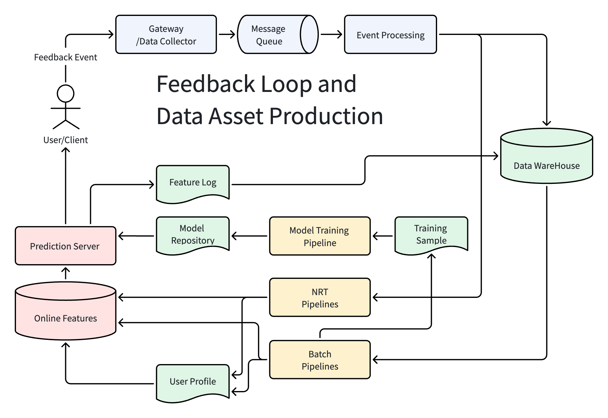
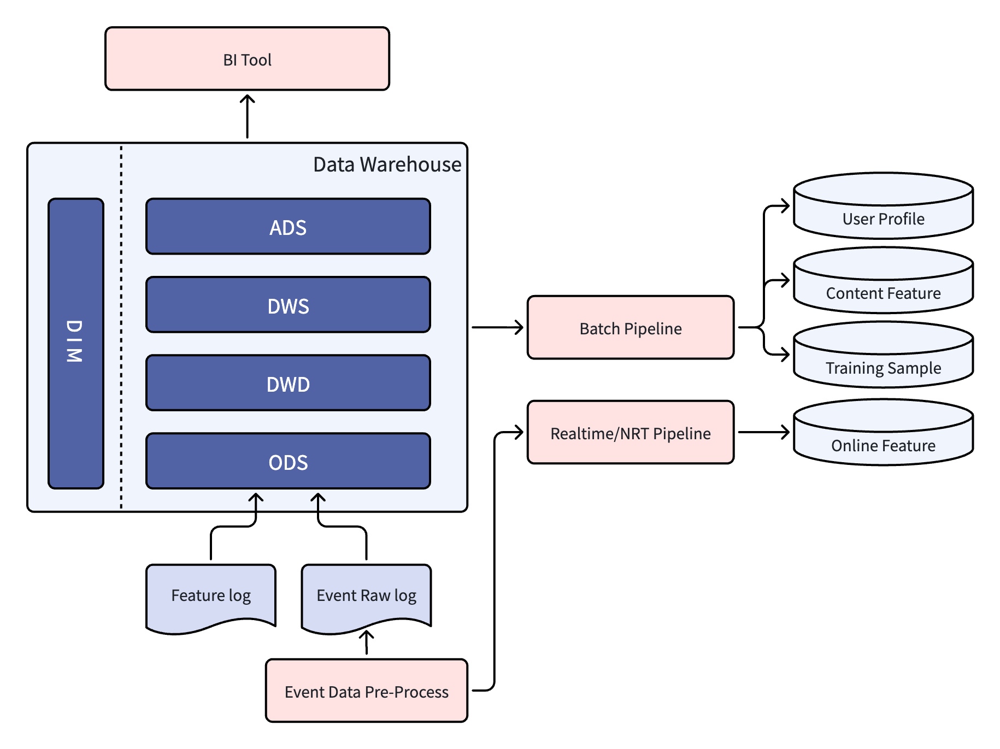

# 推荐系统架构（6）：用户反馈闭环，系统感知能力


## 1.  反馈闭环整体架构

### 1.1 反馈闭环的重要性

上一篇文章我们详细描述了推荐系统中的内容资产体系，内容是离线系统这个推荐系统生产工厂的原材料之一。有了内容，系统就可以给用户分发。用户看到分发下来的内容之后，会有浏览行为，产生一系列动作，这些就是用户行为反馈。用户的行为反馈是离线工厂中市场反馈回来的质检数据。原材料和质检数据，构成了离线工厂赖以运转的两大生产资料。

用户的行为反馈，隐含着用户对内容的喜好程度，点击浏览、停留观看、看完全文、点赞收藏，或者快速划走、点击不感兴趣等等行为，分别代表着用户喜欢或者不喜欢这个内容。这些行为是后续抽取特征、构建用户画像的基础数据。

如果没有这些行为反馈的支撑，系统只是一个单方面内容分发的平台。而有了行为反馈，就能形成一个闭环。反馈闭环让系统能回答三个问题：分发得准不准？内容本身质量高不高？用户真正想要的是什么？根据这些问题答案，系统可以调整下一次的分发策略，形成“分发->反馈->再分发”的闭环。

反馈闭环是推荐系统动态调整策略、适配用户需求的依据，也是系统持续迭代优化的核心数据源。没有反馈闭环，推荐就只是一次性的静态内容分发；有了反馈闭环，系统才真正具备了学习和进化能力。

### 1.2 反馈系统全景架构

下面是一张典型的反馈系统闭环和数据资产架构图：



整个闭环流程可以简单描述为：用户 -> 客户端埋点 -> Gateway 数据接收 -> 消息队列 -> 数据预处理 -> 数据仓库 -> NRT/Batch Pipeline -> 用户画像/内容特征/模型训练 -> 在线特征/用户画像/模型 -> 线上服务 -> 个性化推荐结果 -> 用户再次产生行为反馈

这个架构可以划分为下面几大部分：

- 客户端埋点系统：客户端记录用户的行为，形成用户行为事件，上报到服务端。
- 反馈数据的接入和预处理：接收行为反馈日志，进行预处理。
- 数据仓库和数据资产：保留原始行为反馈日志，并经过后续流程处理，形成数据资产。
- 反馈数据的处理和应用：NRT/Batch 处理流水线，包括内容特征、用户画像、在线排序特征、模型训练样本、生成模型等 Pipeline。

工业级成熟推荐系统和普通推荐系统核心差距，不仅在于模型结构的复杂程度，还在于反馈闭环的工程化程度。反馈闭环的响应速度、数据精度、运行稳定性和噪声降噪能力，对推荐结果质量的提高非常重要。下文我们将逐一分析各个环节的功能和作用。

## 2. 客户端埋点系统

App、网页端都是用户接收内容进行浏览的触点，下面文中统一用“客户端”来描述。在使用埋点方式来记录用户行为上面，App 可以拿到系统权限，能记录例如滑动轨迹、后台停留时长等等更精准数据，而网页端依赖运行它的浏览器，有些情况下记录的数据维度会相对少一些。然后离线情况下，App 可以本地缓存埋点数据，等有网络时统一上报，但网页一般做不到。

不管是 App 还是网页客户端，核心目标都是一致的，都是为了采集用户行为数据，基础类的埋点数据都能记录并且上报。

### 2.1 客户端埋点重要性

所有用户行为反馈的源头，都是来自客户端的交互场景。服务端的离线系统处理，依赖客户端上报上来的行为数据。客户端对于用户行为，都是通过埋点方式来记录。

例如收到内容客户端渲染展现在用户眼前，就记录曝光事件并上报，滑动、点击等操作在发生的时候上报埋点。如果客户端的埋点出现缺失或者记录错误，服务端收到的信息就不完整或者是错误的，那么基于这样的数据进行的特征、模型都是不正确的。客户端埋点的完整性、准确度和稳定性，是反馈闭环最重要的基础。

以“停留时长”为例，埋点记录是否准确，直接影响后续对内容质量的判断：

- 埋点记录正确。用户进入内容详情页，客户端记录开始时间戳 T1，用户阅读完成，退出页面，记录时间戳 T2，并且记录停留时长 Δt = T2 - T1 （假设是1分50秒）。服务端收到行为日志：“用户 U 在内容 D 上停留了 1分50秒”。特征 Pipeline 根据此判定用户对这个内容感兴趣，生成对应画像标签，同时这篇内容也是一个高质量内容，训练样本为正样本。
- 埋点记录错误。客户端只记录了进入页面的时间戳 T1，但是退出时候没有记录或者记录丢失没有上报。服务端收到停留时长为 0 的日志（或默认为 0）。这条本来应该标记“停留时长 1分50秒”的内容，被特征 Pipeline 根据停留 0 而判断成了快速退出，表明用户对此不感兴趣，训练样本也变成负样本。（此处先不考虑其他对错误日志的修正策略，只为了让大家明白埋点记录不正确带来的影响）


### 2.2 主流埋点事件

目前行业主流会对客户端的交互行为做标准化埋点设计，涵盖用户的浏览、互动等全部场景。下面列举一些常用的埋点事件：

- Impression / Exposure： 内容曝光。客户端把内容渲染，并且显示给用户的时候记录。需要注意的是，曝光事件需要确保这个内容已经显示在用户可见屏幕范围内，只是接收到了内容但没显示，或者只显示了 1/3 ，都不能计算曝光事件。
- Click：用户点击内容，进入详情页。这个动作一般在内容列表记录，当用户点击对应条目，就记录点击事件。
- Read_start / Play_start：进入详情页开始阅读、或者视频开始播放时，记录这样一个阅读/播放开始事件。
- Read_end / Play_end：退出详情页，或者视频播放结束时，记录阅读/播放结束事件。
- Stay / Dwell：在内容详情页停留的时间，一般可以 T(Read_end) - T(Read_start) 两个时间戳相减得来。有的系统，把停留时间合并到 Read_end/Play_end 事件一起上报。
- Scroll：页面滑动事件
- Like：点击“喜欢”按钮记录
- Share：点击“分享”按钮记录
- Dislike：点击“不喜欢”按钮记录
- Report：点击“举报”按钮记录


### 2.3 核心关键字段设计

一条孤立的行为日志，没有实际的算法价值。在对分析的时候，基本上都是将行为日志关联具体场景、请求和实验版本，然后多条日志一起分析，才能得出有效的特征、样本数据。因此，每条上报的事件需要携带完整的上下文字段。以下是一些常见的关键字段：

- 公共字段：user_id（用户标识）、device_id（设备标识）、session_id（会话标识）、item_id（内容标识）、event_type（事件类型）、event_time（事件发生时间）、page_id（所处页面）、position（内容所处位置）
- 行为特有字段：duration（停留时长）、play_progress（播放进度）、scroll_depth（滚动深度）
- 行为归因字段：request_id、trace_id、experiment_id。它们组合在一起可以串联同一次推荐下的所有用户行为。详细逻辑在后面 3.4 Trace 体系我们展开讲解。


### 2.4 客户端本地行为计算逻辑

客户端本地在记录用户行为的时候，并不是机械式记录，而是具有一定的计算逻辑。有的行为埋点需要客户端结合业务场景、阈值规则或者页面状态完成二次加工。下面举一些例子说明：

1. **有效曝光判定**
 
客户端收到服务端下发的内容，并不是收到就能记录曝光，而是需要把内容数据渲染成可视化页面，并且展现给用户才能算一次有效曝光。

例如，一次请求，客户端收到了 10 条内容条目，客户端根据内容类型渲染成可视卡片。但客户端一页只能显示 3 条多一点点，所以第一屏显示3条，真正展现给用户，那么计算这三个条目的曝光事件。第四个卡片只显示了不到 1/3，不计算为有效曝光。然后用户快速滚动，第二屏是第4-6条内容，但快速划过了，显示了最后的8-10条内容。中间快速划过的 4 - 7 条内容，没有真正展现给用户，也不能算有效曝光。

总结一下，有效曝光计算需要满足两个条件：**可视区域展示**和**有效停留**。

2. **停留时长计算**

页面停留时长是从进入页面开始计算，退出页面结束。不过有一些情况，例如用户进入了详情页阅读内容，但忽然把 App 或者页面放到后台，做其他事情去了。这时候就需要把这段后台挂起的时间剔除。具体实现的办法，对于 App 来说，监听 App 的 onPause（切后台）和onResume（切回前台）事件，把后台时间剔除；对于网页，监听 visibilityChange 事件，hidden 状态是放到后台，visible 状态是切回前台显示。

还有一些例如页面卡顿、长时间静置不操作的场景，同样需要采用一定规则剔除这类虚假时长（例如最大静置阈值、超过截断），具体办法此处不再详细展开。

3. **视频播放时长计算**

视频播放时长这个指标的目标本义是统计有效观看时长，所以在统计的时候，需要剔除暂停、缓冲、页面后台挂起时间。

在 App 中播放时候，因为有 SDK 的支持，相对比较容易，绑定 SDK 的 onPlay、onPause、onBufferingStart/End、onCompletion 等原生回调，仅在播放时候才计时。然后结合上面说的 App 的 onPause、onResume 事件，把后台挂起时间剔除。

对于网页播放器，需要监听 HTML5 video 事件，绑定 play、pause、waiting（缓冲）、playing（缓冲结束）、ended 这些事件，再配合页面可见性 API visibilityChange。网页端统计时相对麻烦一些，因为不像 App SDK 那样原生支持，需要更细致的边界情况处理。不过现在的网页端处理逻辑，基本能达到和 App 原生一样的业务效果。

4. **滚动深度计算**

滚动深度这个埋点指标，是衡量内容消费的程度所用的。一般是屏幕往下滑动开始准备，然后停止时记录当前滚动的最大深度。

在 App 中，一般监听 ScrollView/RecyclerView 滑动回调，每次滑动停止时，记录最大滚动深度。为了避免频繁上报，可以定时或者页面退出或销毁时候再上报。

在网页中，一般监听 Scroll 事件或使用  IntersectionObserver API ，不过依赖浏览器 API 的兼容性和性能。

以上是几个客户端本地行为计算逻辑的例子，此处不再罗列其他各类反馈指标的计算逻辑。能不能把这些用户行为记录准确，过滤掉无效的噪声，是客户端工程实现是否精细的标志，这也是推荐系统能不能进行后续准确智能化计算的基础。


### 2.5 客户端全埋点方案

在客户端记录用户埋点时，全埋点是一种曾流行的方案。全埋点的主要实现是用一个 SDK，在 App 或者网页中嵌入，然后自动记录用户所有的交互行为，进行上报。设计这个方案的初衷，是想利用它记录的全面性，把所有用户行为上报，这样不用提前定义事件，上线之后也能很方便的回溯历史行为，能很好的降低埋点开发的成本。

但这个方案的局限性也很明显，全量采集用户的所有交互，会产生非常大量的数据，一方面浪费用户的流量，另一方面浪费服务端的带宽。全量用户行为也存在很多的噪声，例如误触、后台挂起、无意义滑动这些操作，都会产生上报数据。这些数据都传到服务端之后，清洗、处理起来非常的困难。

还有像上一节介绍的那样，一些客户端本地优化计算逻辑，在全埋点方案中无法实现，也没办法定制业务字段。这样的数据在服务端进行处理效率极低。

因此，这种方案曾经兴起过一段时间，但现在的推荐系统基本不使用，原因就是无效数据、数据噪声太多，服务端处理不方便。不过客户端全埋点方案在一些数据分析产品（例如 GrowingIO、神策等）中仍然常用，原因是这些数据分析产品分析的是宏观行为，而推荐系统需要每条反馈都精准有效。


## 3. 反馈数据接收和预处理

客户端埋点数据计算完成后上报到服务端，需要服务端接收并进行预处理，然后存入到数据库中供后续流程使用。整个数据链路是：Gateway/Data Collector -> 消息队列 -> 数据预处理 -> 数据仓库。

### 3.1 Gateway / Data Collector 统一入口层

Gateway 是服务端的统一流量入口和出口。推荐请求经过 Gateway 路由到推荐服务，推荐结果经过 Gateway 返回给客户端；用户的反馈数据上报请求也是由 Gateway 接收。在实际大规模的推荐系统中，推荐请求和数据上报会物理分离，采用不同服务承接，Gateway 负责推荐请求，Data Collector 负责数据上报链路。本文为了简化架构，把 Data Collector 作为 Gateway 的一个子模块来介绍。

作为服务端的统一出入口，Gateway 承担通用的流量管控和数据校验功能：

- 鉴定合法请求，拦截非法请求。内容分发请求、数据上报接口，使用统一的请求鉴定算法，例如对 URL 和数据做签名校验，合法的请求才能进入，不合法的请求直接丢弃。
- 流量管控和熔断。根据请求类型做流量管控，防止突发流量冲击。一般是按 API path 做限流，数据上报也当成其中一类 API。

Data Collector 子模块，在此基础之上还负责数据接入的专有功能：

- 协议解析和格式转换：上报数据可能是 ProtoBuf、JSON 或自定义二进制格式，需要转换为统一的内部标准格式。
- 校验关键字段是否存在：校验关键的 user_id, item_id, event_type, event_time 等字段是否存在，拦截那些不规范或者关键字段缺失的数据，避免脏数据进入系统。
- 服务端信息注入：补充服务端接收时间戳（server_receive_time，用于延迟监控和数据乱序处理）、服务端机房标识、数据格式版本号（schema_version，用于兼容不同上报数据版本）。
- 数据采样和分流：有的系统数据上报量十分巨大，为了缓解系统压力，对一些非关键事件（例如滚动）按比例采样。同时也可以按时间类型，把不同的反馈日志写入到消息队列不同的 Topic 中。
- 基础反爬过滤：识别并丢弃来自异常 IP、异常设备或者明显刷量等可疑数据。


### 3.2 消息队列

从 Gateway/Data Collector 收到的上报数据，写入到消息队列（一般都是 Kafka）。采用消息队列作为数据中转站，主要从以下方面考虑：

- 核心解耦：Gateway/Data Collector 的作用是为了快速响应用户的请求，它们不适合直接对接后面的处理模块或者数据仓库。用消息队列可以把流量接收和下游数据处理完全解耦，从架构上保证线上服务的稳定性。
- 流量削峰：用户行为有很强的波动性，例如晚间都是活跃高峰，以及热点事件和批量推送等场景出现，也会瞬间产生极大流量高峰。消息队列可以快速接收 Gateway 的这种流量高峰，平滑流量波动，让后续的数据处理流程能稳定的消费数据。
- 多消费者复用：消息队列支持一对多消费，同一个 Topic 允许多个业务场景一起来消费，这样避免客户端重复采集和上报带来的资源浪费以及数据不一致性。但需要注意，不同消费者组的消费速度差异可能导致积压，需要根据实际情况为各消费者组独立配置资源或按业务重要性做 Topic 隔离。
- 高可靠和可回放：消息队列支持数据持久化存储、offset 记录功能，让历史数据可回放。如果要进行模型复盘、场景复现等工作，都可以从消息队列中回放历史数据来完成。

### 3.3 轻量数据预处理

数据从消息队列读取出来后，还不能直接写入数据仓库，需要经过轻量数据预处理流程。因为原始数据可能存在格式不统一、字段缺失、重复上报等问题。预处理流程的目的就是把原始数据中的这些问题解决，避免形成脏数据影响后续的特征计算和模型训练。

#### 3.3.1 数据格式规范化

Data Collector 可能会接收到不同版本的数据上报请求，然后打上对应版本号。在数据预处理流程中，需要把不同版本的数据规范化成标准内部格式。

例如旧版本客户端上报的是 `item_id`，而新版本是 `content_id`，需要统一为 `item_id`。又或者曝光事件，不同版本不一样，有的是 `IMPRESSION`，有的是 `VIEW` 或者 `EXPOSURE`，需要统一到一个枚举值。

写入数据仓库的数据一定要做到规范化，才能方便后续的特征、模型流水线解析处理的逻辑统一。

#### 3.3.2 数据去重

在实际的系统中，由于一些原因，例如客户端网络重试、Kafka 消息重复消费等，用户行为日志可能会存在重复。如果不做去重，后续的 Pipeline 计算可能会出现问题，例如 IMPRESSION 重复上报，会导致 CTR 偏小；训练样本数据因为重复上报导致出现重复记录，影响模型效果等。

在数据预处理流程中，一般会采用 (user_id, item_id, event_type, event_time) 这样的组合键，在时间窗口内（例如 Flink 的 1 - 5 分钟滚动窗口）去重，避免产生重复脏数据。

#### 3.3.3 异常数据过滤

以下几类异常数据需要重点处理：

- **必填字段校验**：user_id、item_id、event_time 等核心字段为空的数据，直接丢弃并记录异常日志。
- **时间戳异常**：event_time 在未来时间（超过服务端当前时间5分钟以上）、或过于陈旧（例如30天以前），这样的数据也可以判定为异常，需要丢弃。
- **明显刷量行为**：例如同一个 user_id，在秒级上报了大量的行为，超过了人类正常行为频率。这类日志应该判定为机器人刷量，需要过滤并记录异常告警。注：此处是规则级过滤，更深度的算法级异常检测会在后续的清洗过滤 Pipeline 处理。
- **非法数据范围**：例如 position 是负数、duration 为超大值（例如单次停留超过24小时），类似的值明显不符合正常逻辑，可以丢弃或者改为默认值。
- **字段补充与默认值填充**：对于非必填但下游需要用到的字段，如果缺失则填充默认值，减少后续处理中的空值判断。例如 platform 如果缺失，可以填 unknown。

#### 3.3.4 预处理模块的工程化实现

预处理模块一般用 Flink 或者 Spark Streaming 来实现，读取消息队列的数据，进行预处理。在实际实现时候，预处理流程会将上面说的这些异常处理，记录对应的日志指标，最后形成 dashboard，方便观察各种异常占比。

预处理结果的下游包括：数据仓库的 ODS 层、实时/近实时特征 Pipeline、实时监控系统。具体的工程实现，预处理结果一般写入 Kafka 对应 Topic，由下游系统分别订阅消费，这样既能解耦上下游，又便于故障隔离和数据重放。

### 3.4 Trace 体系

前面说了，单条孤立的行为日志实际价值不大。离线的 Pipeline 需要把一个用户的所有行为串联起来，才能进行分析。而服务端收到的日志是离散的，需要有一种策略把所有离散日志关联起来，也就是 trace 体系。

我们还是以一个例子开始，一个用户 U1 第一次请求收到了5条内容 D1 - D5，第二次请求收到了5条内容 D6 - D10。他把 10 条内容都浏览了一遍，觉得第2、3、5、6、8、9篇都挺有意思，点进去了。其他几篇都挺好，但第 8 篇是标题党，点进去看了一下内容和标题无关，就退了出来。这个系列的动作，关于这个用户的行为日志上报到服务端，大致如下（其中，T01/T22 是事件发生的时间戳，DT2/DT8 是停留时长值）：

```
U1, Device1, Session1, REQ1, TRACE1, EXP1, IMPRESSION, T01, HOMEPAGE, POS1, D1
U1, Device1, Session1, REQ1, TRACE1, EXP1, IMPRESSION, T02, HOMEPAGE, POS2, D2
U1, Device1, Session1, REQ1, TRACE1, EXP1, IMPRESSION, T03, HOMEPAGE, POS3, D3
U1, Device1, Session1, REQ1, TRACE1, EXP1, IMPRESSION, T04, HOMEPAGE, POS4, D4
U1, Device1, Session1, REQ1, TRACE1, EXP1, IMPRESSION, T05, HOMEPAGE, POS5, D5
U1, Device1, Session1, REQ1, TRACE1, EXP1, CLICK, T06, HOMEPAGE, POS2, D2
U1, Device1, Session1, REQ1, TRACE1, EXP1, READ_START, T06, DETAIL, D2
U1, Device1, Session1, REQ1, TRACE1, EXP1, DWELL, T07, DETAIL, D2, DT2
U1, Device1, Session1, REQ1, TRACE1, EXP1, CLICK, T08, HOMEPAGE, POS3, D3
U1, Device1, Session1, REQ1, TRACE1, EXP1, READ_START, T08, DETAIL, D3
U1, Device1, Session1, REQ1, TRACE1, EXP1, DWELL, T09, DETAIL, D3, DT3
U1, Device1, Session1, REQ1, TRACE1, EXP1, CLICK, T10, HOMEPAGE, POS5, D5
U1, Device1, Session1, REQ1, TRACE1, EXP1, READ_START, T10, DETAIL, D5
U1, Device1, Session1, REQ1, TRACE1, EXP1, DWELL, T11, DETAIL, D5, DT5
U1, Device1, Session1, REQ2, TRACE2, EXP1, IMPRESSION, T12, HOMEPAGE, POS6, D6
U1, Device1, Session1, REQ2, TRACE2, EXP1, IMPRESSION, T13, HOMEPAGE, POS7, D7
U1, Device1, Session1, REQ2, TRACE2, EXP1, IMPRESSION, T14, HOMEPAGE, POS8, D8
U1, Device1, Session1, REQ2, TRACE2, EXP1, IMPRESSION, T15, HOMEPAGE, POS9, D9
U1, Device1, Session1, REQ2, TRACE2, EXP1, IMPRESSION, T16, HOMEPAGE, POS10, D10
U1, Device1, Session1, REQ2, TRACE2, EXP1, CLICK, T17, HOMEPAGE, POS6, D6
U1, Device1, Session1, REQ2, TRACE2, EXP1, READ_START, T17, DETAIL, D6
U1, Device1, Session1, REQ2, TRACE2, EXP1, DWELL, T18, DETAIL, D6, DT6
U1, Device1, Session1, REQ2, TRACE2, EXP1, CLICK, T19, HOMEPAGE, POS8, D8
U1, Device1, Session1, REQ2, TRACE2, EXP1, READ_START, T19, DETAIL, D8
U1, Device1, Session1, REQ2, TRACE2, EXP1, DWELL, T20, DETAIL, D8, DT8
U1, Device1, Session1, REQ2, TRACE2, EXP1, CLICK, T21, HOMEPAGE, POS9, D9
U1, Device1, Session1, REQ2, TRACE2, EXP1, READ_START, T21, DETAIL, D9
U1, Device1, Session1, REQ2, TRACE2, EXP1, DWELL, T22, DETAIL, D9, DT9
```

在日志中，

- REQ1, REQ2 是请求 id，客户端每一次发起请求，由客户端生成，标识用户的这次请求。 

- TRACE1, TRACE2 是 trace id，这个 id 是服务端 Gateway 收到用户请求，生成的一个唯一标识。这个标识会从 gateway 一致往后传递，到达各个模块，例如召回、排序、在线 Feature 服务等。它的作用是把这次请求的全链路串起来。

- EXP1 是 experiment_id，是这个用户落在哪个模型实验的分桶标志。在一个稳定的实验中，同一个用户在同一实验层中会落在同一个实验分桶中，但不同层级的实验可能会命中不同的实验分桶，互不影响。experiment_id 用来统计实验级别的相关指标，来衡量不同模型版本的效果差异。关于实验框架，后续会有专题文章来详细描述。

回到上面这个例子，在这个用户请求推荐内容时，TRACE1 会贯穿整个调用链：传递到召回服务，召回的时候，召回服务记录该请求用户上下文特征（例如用户实时兴趣标签）以及召回结果列表；传递到排序服务，排序服务会记录该请求排序阶段所用到的特征以及排序打分。这些日志记录统称 Feature Log。如果没有 Feature  Log，那么 Pipeline 只能处理行为反馈日志时候从快照中再取一遍，有可能和当时请求发生时不一致（用户画像和内容特征在几小时内可能发生变化）。所以 Feature Log 记录最能还原当时请求发生时的上下文。

通过 trace_id 把 Feature Log 和行为反馈日志连接在一起，就能形成一条完整的带特征信息的训练样本。提供给后续的特征分析、用户画像建模、内容行为特征计算所用。例如：内容 D2 的停留时长 DT2 比较长，表示 U1 对 D2 这篇内容比较感兴趣。而内容 D8 的停留时长 DT8 很短，表示这是一篇标题党，用户点进来立刻退出，是对内容不感兴趣。这两者在样本中的标签正好相反，正是 trace_id 把行为日志和 Feature Log 拼接在一起，才让这条样本能有完整的特征和标签。

简单总结一下：

- request_id，表示用户看的是什么，关联曝光和行为。
- trace_id，表示请求在系统里面经历了什么，可以关联推荐全链路日志，包括 Feature Log。
- experiment_id，标识这次请求在哪个实验版本中产生，用于生成不同版本实验的指标。

三者在使用中互相配合，拿到一条行为日志，通过 `request_id` 知道用户点击了哪篇内容、来自于哪个位置；通过 `trace_id` 来关联请求的 Feature Log，构建完整的带特征样本；通过 `experiment_id` 将这条日志归属到对应实验版本。这三个 ID 一起构成反馈数据的完整 trace 体系。


## 4. 反馈信号定义和规范

用户的行为有很多种类，在推荐系统初期，研发人员一般都把“用户点击”作为唯一有效的正向信号，CTR 也就成了衡量内容的指标，也是平台优化目标。但随着业务的发展，很多人都已经了解 CTR 作为优化目标，最终只会导致标题党、低俗内容等占据头部，对用户体验、对平台生态有很大的负面影响。

因此，现在的工业化推荐系统中，都在研究其他用户行为信号，提取作为平台优化目标。用户浏览行为很多很复杂，系统需要根据这些行为来理解意图，找到哪些行为适合用作正向训练样本，哪些是负向样本。

本节从下面几个维度，对用户行为做一些归类。

### 4.1 反馈类型

根据用户发起的交互行为方式，是主动还是非主动发起的反馈，分为：

- 显性反馈：用户主动发起的交互行为，直接表达用户对内容的态度。例如：主动点击、点赞、收藏、转发、关注作者、评论互动、点击不感兴趣、内容举报等行为。这些行为信号强度高，语义上没有歧义。但问题是很多反馈类型数据稀疏，例如收藏、转发，比例能有点击的 5% - 10% 就很不错了。虽然这一类反馈是很强的信号，但没办法覆盖全用户、全场景的要求。

- 隐性反馈：用户非主动表态的行为。例如：曝光、停留时长、完读/完播率、快速划走、重复观看等行为。这些行为能覆盖全部用户基本上全部的场景，数据量也很大。但问题在于它们噪声量大、语义模糊，导致解读起来难度比较高。原始的这些行为，需要经过预处理，做意图还原之后，才能用来做后续的特征、模型学习。

### 4.2 反馈倾向

前面一个分类是按用户是主动还是非主动方式发起的反馈，显性反馈里面有正向也有负向，隐性反馈里面也有正向和负向。下面我们按反馈的倾向对行为做一个划分。

- 正向反馈：很容易理解，就是用户对一篇内容是喜欢的反馈就是正向反馈。例如主动打开一篇文章并正常阅读。从反馈信号类型来看，正向反馈的行为包括：点赞、收藏、转发、关注、评论、停留、完读/完播率高、重复观看等。这些都表示用户喜欢这篇内容。

- 负向反馈：用户对内容不感兴趣的反馈就是负向反馈。例如：显式的点击不感兴趣、内容举报、点击之后快速退出、完读/完播率低等，都是负向反馈。

- 中性反馈：这类反馈信号，用户对内容没有明确的偏好指向，属于中性反馈，不好直接判断正负。例如：页面短暂停留3秒、误触点击之后返回、被动刷到内容没有其他操作等。

上面说的是一般情况下的分类，在实际工程落地时候，需要注意：

- 点击不等于正反馈：例如用户被标题党吸引，进来之后立刻退出，其实是负反馈。
- 长停留不等于正反馈：例如用户打开一篇内容，但是放在那里没有任何动作，会造成虚假的长停留，不一定是喜欢这个内容。
- 曝光没有点击不等于是负反馈：用户快速刷到一批量内容，可能场景匹配度低或者标题写的不够清楚，用户没有点击，不一定代表用户不喜欢。例如一个喜欢前沿AI知识的用户下班回家，看到一篇介绍 AI Agent 内容的文章，但用户此时没注意，没有点进去看。
- 快速划走不等于负反馈：和上一条类似，高峰期快速刷内容，列表有的内容直接刷走了，不一定是对内容不感兴趣。

所以在用户行为反馈数据处理时，要过滤噪声，合理归因，还原用户真实的意图。这样处理之后的数据，才能用于特征更新、样本生成、模型训练等后续流程。

### 4.3 反馈信号的可信度

在《内容资产体系》文中相关章节（第4.2节），我们已经介绍过信任分层概念以及怎么利用这些反馈信号构建内容特征。这里简单快速回顾一下：

- 高信任的隐性正反馈：停留时长、完读/完播率、浏览深度、二次回访率等，用户自然产生的正向反馈行为。
- 中信任的显性正反馈：点赞、收藏、转发、评论、点击率等，有被诱导可能性的、用户主动表达的认可。
- 高信任的显性负反馈：不感兴趣、举报、负面评论等。
- 低信任度间接反馈：曝光、播放等，需要结合其他信号一起做判断。


## 5. 行为反馈数据仓库


### 5.1 行为反馈数据仓库结构

和通用的数据仓库一样，行为反馈数据仓库也是分层设计。



上图是一个反馈数据仓库与数据资产架构图，从中可以看出反馈数据仓库分层架构。

反馈日志经过第 3.3 节描述的轻量预处理流程，然后存为 HDFS 上的 raw log 文件，然后接入到数据仓库的 ODS 表。Feature log 也同样接入到数据仓库 ODS。

数据仓库中各层简要描述以及对应反馈数据：

- ODS: Operational Data Store，操作数据存储层，现在一般称呼为贴源层。接入的原始数据直接写入，不做复杂加工（最多做编码、文件格式等极轻量处理），保留原始数据格式，作为以后数据追溯的基准。反馈数据仓库 ODS 一般保存原样日志，比如 `ods_event_feedback_log_di` 表的 line 字段存储整条未解析用户行为，按日期分区存储。
- DWD: Data Warehouse Detail，数据仓库明细层，对 ODS 层数据做清洗过滤处理，保留和 ODS 类似的记录粒度，是数据仓库最重要的基础数据。DWD 数据加工的时候，一般会关联 DIM 维度表，将用户、内容、实验的常用属性冗余到表中，避免后续使用重复关联。反馈数据仓库的 DWD 是解析之后的明细事实表。例如：`dwd_event_feedback_detail_di` 存储解析之后的反馈日志、`dwd_rec_request_feature_detail_di` 存储解析之后的推荐特征日志等。
- DWS: Data Warehouse Summary，数据仓库汇总层，根据 DWD 的数据，按一定的主题做聚合汇总，成为宽表。聚合的目的是把一些常用的数据提前计算，避免多个流程重复计算、以及不一致情况。例如：`dws_user_day_feedback_wide_di` 存储一个用户一天的全量反馈数据，包括曝光次数、点击次数、总停留时长、点赞数等等。
- ADS: Application Data Store，应用数据服务层，更高层次的业务聚合，一般直接面向业务，可以给报表、看板等提供定制化数据。例如 `ads_content_ranking_report_di` 存储每天的热门内容榜单、低质量反馈内容等，给运营后台提供数据。
- DIM: Dimension Table，维度表。这是数据仓库中存储业务实体描述属性的表。例如 dim_user_info 存储用户的基础属性。dim_user_info 这样的表，一般会从 ods_user_info_df 这样从业务数据同步过来的表整理标准化得来。DIM 表会用于 DWD、DWS、ADS 等层级表的维度信息补齐等作用。推荐系统数仓一般会有用户、内容、作者、实验配置等，都是从对应业务 ODS 表清洗标准化生成。这些表每天会做全量快照，支持历史数据回溯。

> 注：以上表名后缀 `_di` 表示是 Day Increment，表示每天增量。类似的后缀还有： `_df` Day Full 每日全量、`_hi` Hour Increment 小时增量、`_hf` Hour Full 小时全量、`_mi` Month Increment 月增量、`_ri` Recent Increment 最近 N 天增量等。

### 5.2 DIM 公共维度表

DIM 层的表是整个数仓各层表的基础维度信息，存储业务实体的静态/准静态属性。在推荐系统中，一般会有下面几类 DIM 表：

- 内容维度表（dim_item_info）：内容的 ID、类别、作者、发布时间、内容类型、内容长度/时长等基础信息。
- 用户维度表（dim_user_info）：用户的 ID、注册时间、地域、年龄性别等基础信息。注意，这个只是用户基础信息表，不是用户画像。
- 实验维度表（dim_experiment_info）：实验 ID、实验名称、实验层、分桶规则等。
- 其他维度：例如场景信息（scene_id -> scene_info）等，按业务需要。

与行为日志来自客户端埋点上报不同，DIM 表一般都是来自于业务系统数据库同步。业务系统数据库同步到数仓的 ODS 层，保存为：ods_item_info_df、ods_user_info_df、ods_experiment_info_df 等表，每天全量同步一次。同步完成之后，从 ODS 表中读取数据，做清洗转换（例如统一 ID 格式、默认值处理、枚举值规范化等），得到 dim_xxx 系列表。

### 5.3 ODS -> DWD  数据清洗过滤

这个 Pipeline 读取 ODS 数据，然后进行处理，生成 DWD 数据。DWD 生成 Pipeline 的处理逻辑和前面 3.3 节说的数据预处理不一样，前面的数据预处理相对比较轻量级，都是单条记录级别的处理。而此处的生成 Pipeline，会累积一定时间窗口、或者会话级别，做批量数据的清洗过滤和修正。以下介绍两个典型的 Pipeline 处理逻辑。

#### 5.3.1 行为乱序问题

用户行为在客户端有缓存，因为网络抖动或者别的因素，有可能会导致数据上报的顺序和发生的顺序不一致。

例如，用户在 14:00:00 点击进入详情页阅读内容，然后在 14:02:01 退出页面。按正常上报顺序，会先报进入页面 READ_START 事件，然后是 READ_END 事件上报。但因为进入页面时候网络抖动，READ_START 事件没有上报成功，然后 READ_END 事件上报成功。后来重试时候，READ_START 事件上报成功。在服务端，收到顺序变成了 READ_END、READ_START。如果不做处理，看到 READ_END事件时，前面没有对应 READ_START 事件，会造成计算失败。

对于乱序问题，解决的策略有：

- **客户端携带时间戳**：每条日志带的时间戳 event_time 都是客户端本地的，对于同一个用户的行为日志，按 event_time 来排序，而不是服务端接收日志的时间。
- **服务端做事件窗口排序**：累积一段窗口时间内的事件，同一 user_id/session_id 批次内部按 event_time 排序。注意这个时间窗口阈值，太大会带来额外数据延迟，太小覆盖不了乱序延迟，一般可能在几分钟级别。
- **窗口内的延迟处理**：对于超过窗口的延迟数据，按业务需求，两种处理办法：一是直接丢弃，适合实时性要求比较高的场景；二是写一个延迟队列单独处理，适合需要完整回溯场景。根据每个业务要求，可以进行不同的选择。

#### 5.3.2 数据缺失问题

客户端上报的数据，难免存在数据缺失的问题。有的因为网络原因，整条缺失，有的是埋点代码实现问题，导致部分字段缺失。预处理流程需要对数据缺失相应的处理：

- **关键字段缺失**：Data Collector 会做一些基础关键字段的缺失校验，此处会做更深层次业务逻辑校验，例如页面停留字段缺少了停留时间字段。这种关键字段缺失会导致这条日志没办法使用，只能丢弃，然后记录监控。当缺失比例太高时，系统需要告警，人工介入排查原因。
- **客户端上报数据不完整**：例如详情页停留，客户端只报了 READ_START，退出时候的 READ_END 或 DWELL 因网络丢包没报上来，造成了数据不配对情况。这种情况的处理策略需要根据业务需要来，例如用这个内容的平均停留时长做补充，并标记数据为“估算”。也可能直接把这类数据直接丢弃。

关于数据缺失的问题，都需要人工先分析影响范围，然后参考业务需要，来进行丢弃或是补充默认值，或者是其他处理的办法。

数据仓库的细节很多，本文不做太多展开，只解释和行为反馈相关的部分内容。如果大家对数据仓库感兴趣，可以查阅相关资料，也欢迎和我一起探讨。


## 6. 数据资产及应用

前面章节介绍了用户行为反馈如何被采集、传输和存储。但原始反馈日志本身并不能直接用于推荐决策。推荐系统真正依赖的是由这些反馈数据加工形成的数据资产。用户画像、内容特征、训练样本以及在线特征，都是在反馈数据基础上不断演化形成的核心资产。本节开始，我们分别介绍这些资产的生成和应用方式。

### 6.1 数据资产全景一览

从 5.1 中的架构图中可以看出，用户行为反馈日志经过计算，会形成一系列的数据。这些数据形成了推荐系统中核心的数据资产。推荐系统中核心数据资产如下所示：

- **用户资产**：用户画像（User Profile），描述用户的兴趣爱好。用户画像主要是分析用户每日行为，结合基础信息计算得出。用户画像是推荐系统看懂用户的基础。
- **内容资产**：内容资产的概念在上一篇《内容资产体系》已经做了比较详细描述，此处简单引用一下，内容资产包括内容基础属性、行为特征和质量特征。
- **特征资产**：在线特征（Online Feature）。特征资产严格意义上来说也包括用户的兴趣偏好、内容的行为特征等，但业务逻辑上一般把用户、内容看成独立资产。此处的特征资产就是在线特征，是模型打分的输入。
- **样本资产**：主要表现是训练样本（Training Sample）数据。训练样本是通过行为反馈日志和 Feature Log 关联拼接生成。根据对应特征下，用户的反馈是什么，然后打上对应的样本标签。后续的模型训练的主要输入就是样本数据。
- **模型资产**：基于上述的训练样本数据，迭代训练出来的模型，统称为模型资产。模型是用户行为反馈的算法产出物，用来给内容打分，实现个性化分发。

用户行为反馈数据经过数据仓库的处理，清洗、聚合之后，产生的这几大类资产，最后再作用到线上推荐服务，流转到用户然后再产生新的反馈，这样形成一个完整的闭环。

### 6.2 用户资产

用户资产的核心就是用户画像，是线上推荐服务进行个性化推荐的依据。目前行业典型的用户画像分为长期兴趣和短期兴趣。其数据来源：

- 长期兴趣：用户的基础信息（dim_user_info），加上 DWS 层的用户日汇总宽表，包括历史（30天、半年等）的曝光、点击、停留等行为数据，计算用户长期稳定的兴趣爱好。
- 短期兴趣：用户的基础信息（dim_user_info），加上基于 Flink 等的实时计算 Pipeline 直接消费的用户行为数据（3.3 轻量数据预处理的结果），一般累积几小时内的用户行为，来计算短期临时的兴趣。

用户画像也包括负向标签，用户主动的反馈（不感兴趣、举报）和隐性行为（点击之后快速退出、多次曝光无点击），会形成用户的负向标签。对于用户的负向标签，分类权重依规则进行下调。

长期兴趣通常由 Batch Pipeline 更新，短期兴趣通常由 NRT Pipeline 更新，最终同步到线上存储。线上的各环节（召回、排序、重排），都会结合长期兴趣和短期兴趣进行相关计算打分，最终组装适合用户当前浏览需求的内容。

### 6.3 内容资产

上一篇《内容资产体系》完整讲解了内容资产相关信息，本节主要从反馈数据闭环角度，补充一下用户反馈怎么持续修正内容的行为特征和质量特征，也即是“内容分发 -> 用户反馈 -> 内容资产更新”的闭环。

- 行为特征计算
内容行为特征更新也分为批量和实时两种不同的方式。批量更新的数据来源是 DWS 层的内容汇总宽表，Pipeline 读取历史所有的内容反馈数据，计算长期累计的特征值。实时更新 Pipeline 直接消费轻量数据预处理生成的行为数据，动态计算短期的特征。

- 质量特征修正
内容的质量分数（新鲜度、内容丰富性等）初始是根据内容的静态内容计算得出，上线分发之后，用户反馈可以一定程度上修正质量分数：
    - 高点击、短停留、快速退出等，表示内容质量不高，降低静态质量分；
    - 低点击、高停留、多次阅读等，表示内容质量比较高，提升静态质量分；
    - 大量“不感兴趣”、“举报”等，直接把内容标记为低质量，限制后续分发；

- 内容生命周期动态切换
实时热度飙升，标记内容为热点内容；长期热度较高，标记为长效内容。内容生命周期根据用户反馈动态来调整，不是一次性写死的。


### 6.4 特征资产

本节的特征资产主要聚焦在实时的“在线特征”，都是由实时 Pipeline 产生的。在线特征有以下几个维度：

- 用户特征：短期兴趣权重、负向打压标签等；
- 内容特征：实时热度、实时质量分、内容互动量等；
- 交叉特征：用户对内容的实时反馈（是否点击、是否完读、浏览次数等）。

此处注明一下，从业务视角来看，用户特征属于用户画像、内容特征属于内容资产。从在线服务实现角度来看，它们都以特征形式出现，一般存储在 Feature Server 或者 Redis 之类的 KV 存储中。

下面举几个例子来说明在线特征的计算和应用：

- 短期兴趣：短期兴趣属于用户画像的一部分，也是在线特征的一部分。实时 Pipeline 根据用户短期连续看的内容，计算得出临时突发兴趣，例如近期看美食内容比较多，接下来算法给美食类内容更高权重等。
- 实时打压：用户主动点击“不感兴趣”、“举报”，或者类似的内容有曝光无点击、快速退出，那么对相应的分类按反馈权重来进行打压。例如一个用户主动表示对足球类内容不感兴趣，接下来数天内同类内容大幅度降权；另一个用户看到美妆类内容不点击，那么对这类内容触发轻度降权，如果持续再加大降权权重。如果同一篇内容被多人举报，则会更新质量分，标记为低质量，减少对其他用户的分发。
- 热点提升：内容的热度短期内突增，该内容会被标记为热点内容。排序模型对热点内容附加更高权重，快速增加热点分发。
- 去重特征：记录一个用户对单条内容、同一作者或同一分类的曝光。后续对类似内容，基于已有曝光，打分排序时降权，避免推送重复或者类似内容。
- 实时场景适配：例如用户定位到火车站，实时特征后续提升“候车厅餐饮”、“当日发车动态”等内容的权重。
- 实时 A/B Test 校正：实时特征可以统计不同实验组的用户行为数据，动态调整分组的流量偏差，让 A/B Test 效果统计更精准。

### 6.5 样本资产

训练样本是通过 Trace 体系把推荐请求生成的 Feature Log 和用户行为反馈数据关联拼接在一起生成的。每一条候选内容打上训练样本标签，提供给后续模型训练使用。

训练样本拼接流程：

- 一次推荐请求生成 trace_id，召回、排序阶段特征记录到 Feature Log，存储到 DWD 明细表；
- 用户后续产生的曝光、点击、完读等等所有行为反馈，带上同样的 trace_id 存入 DWD 行为明细表；
- 离线 Pipeline 或实时 Pipeline （若有实时需求），通过 trace_id 关联两张表，把用户请求时的特征和用户行为绑定，完成拼接。

结合第4节描述的反馈信号规范，区分样本标签和样本权重：

- 强正样本（高权重）：完读、长停留、点赞、收藏、分享等行为，模型训练时加大这些样本的损失权重，强化正向偏好学习。
- 弱正样本（低权重）：普通点击、正常停留等，赋予基础的权重，作为常规学习的信号。
- 中性样本：一次曝光无点击、短暂划走，一般不作为训练主样本，或者以比较低的权重参与训练。
- 负样本：点击快速退出、点击不感兴趣、举报等，作为负样本参与训练。

样本生成一般都是基于全量的完整行为日志进行，量级比较大，可能用于粗排、精排各种模型全量训练迭代使用。有的推荐系统有分钟级的实时样本生成，一般是用实时 Pipeline 拼接最近一段时间窗口内的数据，供在线学习、增量模型更新所用。

训练样本是连接用户反馈与模型训练的桥梁，也是推荐系统持续学习能力的核心基础设施。


### 6.6 模型资产

模型资产是反馈闭环最终产出的核心数据资产，它由模型训练 Pipeline 基于训练样本得出。模型上线接收特征数据生成个性化的内容，分发给用户，最后再次产生行为反馈，形成完整的闭环。

模型资产包括线上各阶段使用模型：召回模型、粗排模型、精排模型和重排模型。每一类模型的复杂度和目标都不一样，召回模型要从海量数据快速召回一批候选集，把不相关内容快速排除掉；粗排模型侧重匹配用户长期兴趣，从召回候选集中选出来最有一小批数据；精排模型是最核心最复杂模型，会综合用户、内容、交叉特征等，精准预估用户的点击、停留或其他目标概率；重排模型优化最终结果的多样性和用户体验，前面举的几个在线特征应用例子，有一些就是作用在重排阶段。

模型训练之后，经过评估，可以发布到线上，一般采用灰度方式，和主模型做 A/B Test ，效果如果有提升，逐渐加量到全量上线。

在有些推荐系统落地实现时，会采用在线增量学习的方式，更新线上模型。例如 LR、FTRL，最少单条样本就能更新权重，其他能支持在线更新的 GBDT （如 Hoeffding Tree）、Wide&Deep 的 Wide 侧、小维度物品/物品 Embedding 层、极简用户行为序列模型等，都可以在线增量更新，不需要全量学习。是否需要在线增量学习根据业务需求选定，如果需要，一般会由分钟级的样本生成 Pipeline 生成数据，发送给在线增量学习服务，单条/小批量完成计算，更新模型。在线增量学习虽然响应快，但对样本质量和特征稳定性要求更高，因为坏样本一旦被学习，纠正的代价更大。


## 7. 工程挑战

### 7.1 反馈噪声

客户端埋点上报，用户行为都可能存在很多无意义的虚假信号。例如 用户页面长时间停留造成的虚假长停留时间、误触点击、网络重试日志等等。这样的噪声混入真实行为反馈中，会导致用户的兴趣产生偏差、模型学习规律不正确等问题。

反馈噪声的处理方式，首先在客户端需要预处理，把明显无效的行为剔除（例如后台挂起的虚假停留）；其次在数据预处理层按规则过滤异常数值和刷量行为（例如长停留和明显机器流量）；第三在样本生成阶段对可能的噪声降权，中性、低信任度信号也降权使用；最后可以搭建反刷量等算法模型，识别异常流量数据进行过滤。噪声过滤的"度"需要把握好，过滤太激进会丢失有效信号，过滤太保守噪声残留太多，通常通过离线实验来验证过滤策略的效果。


### 7.2 曝光偏差（Exposure Bias）

曝光偏差指的是系统生成的曝光内容分布和实际真实用户偏好可能不一致的问题。典型行为包括：只有曝光的内容才有行为数据、未曝光内容无数据；热门内容反馈多，冷门小众内容反馈少；列表靠前位置更容易点击，可能带来虚假正向信号。

对于以上几种曝光偏差现象，一般解决办法有：

- 召回链路采用多路召回，重排阶段保证结果多样性，甚至小流量随机分配给未曝光或冷门内容进行探索，增加未曝光内容的展示机会。
- 样本生成时采用 IPS 逆向加权：每条样本权重乘以“1/该内容曝光概率”，修正曝光次数不一样带来的偏差。
- 建模时引入位置特征，让模型学习到位置带来的偏差，推理时能一定程度上消除位置带来的影响。

### 7.3 行为归因困难

仅凭单条用户行为反馈，不好确定用户真实意图，例如点击之后立刻退出，不确定是标题党还是用户对该类内容失去兴趣；还有内容有曝光无点击，不确定是用户快速滑屏还是对内容不感兴趣。

所以对于用户的行为反馈，需要把多条行为反馈综合在一起。一般通过 trace_id, session_id（若有）把用户的会话级别反馈聚合在一起，多信号联合归因。例如前面的有曝光无点击，如果多个不同内容都是有曝光没有点击，并且间隔时间很短，那么就是用户快速滑屏。如果是普通曝光，同一类别的内容都有曝光没有点击，大概率是用户对这一类内容不感兴趣。

业界也有一些基于因果推断的方法（如反事实推理）来更好地归因用户行为，但在工业级系统中还不算普及。


### 7.4 反馈延迟

客户端因为网络问题、或者缓存原因，可能会导致行为日志延迟一定时间才能上报到服务端。这种延迟对实时 Pipeline 的影响最大，特征、模型没有及时收到反馈，不能及时感知到用户兴趣变化等。

对于反馈延迟，首先从客户端层面，把点击、不感兴趣等高优先级的行为立刻上报，滚动这类低优先级行为可以延迟批量上报。实时 Pipeline 设置乱序延迟窗口，容忍窗口期的延迟，对于窗口期外的延迟再设置单独的 Pipeline 来修正。

### 7.5 全链路一致性

行为反馈链路比较长，从客户端到网关、Kafka、实时计算、数仓、在线存储，有很多个模块组成。版本迭代时很容易造成字段不统一或者特征和行为不匹配等线上线下数据不一致问题。

对于这个问题，需要全局定义同一套数据规范，包括字段定义和枚举等，一般情况下都是新版本要兼容旧版本。有特大变更时候，更改数据规范版本号，在预处理或者数仓清洗时候统一到内部标准格式。

对于反馈日志，还可以做离线数据对账，对比实时和离线反馈的指标，如果差别超过阈值告警人工介入。

除了字段规范，还有注意特征计算逻辑的一致性。训练时使用的特征计算逻辑必须和线上推理时一致，否则会出现"训练-推理偏差"（Training-Serving Skew）。工业级系统一般引入 Feature Store 来对特征进行版本管理。可以参考第4篇《离线系统总览》第6节。


### 7.6 长短期反馈冲突

用户画像有长期兴趣和短期兴趣，有些时候短期兴趣和长期兴趣是不一样的。例如一个用户长期喜欢科技类内容，而当前会话浏览了很多美食类内容。系统通过实时 Pipeline 能捕捉到用户的临时美食类兴趣，但接下来是给用户推荐更多美食类内容还是科技类内容，系统不太能做到平衡。

对于这类冲突，首先画像已经分隔开长期兴趣和短期兴趣两层，模型在学习时候需要区分两类信号。然后模型可以引入注意力机制，能更好的区分会话级短期兴趣和长期兴趣的权重。如果需要，在重排阶段，也可以动态调整长短兴趣内容占比，平衡用户的长期兴趣和临时需求。

### 7.7 实时更新性能

如果推荐系统的 DAU 到达了千万级，每秒产生的行为日志很可能达到百万级别，实时 Pipeline 要处理这么大的数据量，更新在线特征会带来很大的计算和存储压力。如果有在线学习机制，占用的计算资源将更多，在线推理的延迟也会增加。

对于这种体量数据，一般会把行为事件分级，强反馈信号才会触发特征更新，类似滚动、普通曝光等信号不直接实时更新线上。实时 Pipeline 也会聚合一个短时间窗口，例如窗口内用户聚合，所有行为合并成一条数据更新线上。如果用户数量更大，可以做冷热数据分层，只对活跃用户保持在线更新，低活跃用户还是离线或小批量离线处理。活跃用户的判断标准可以动态调整，比如过去7天有登录/行为即为活跃。

对于在线增量学习架构，在线学习的资源和推理服务要做到物理隔离，保证在线服务的稳定性。

### 7.8 多模态反馈

图文、音频、视频、直播等多种形式的内容，用户反馈的定义会不太一样。例如短视频 10 秒播放完成就等于 3 分钟长文阅读完成。如果所有形式内容复用同一套反馈规则，处理起来会比较复杂，样本和特征也会相对混乱。

所以系统一般会按内容模态设定不同的反馈规则、标签体系。模型也会增加模态特征来区分不同形式的内容在相似行为反馈下的权重差异。内容资产中的特征，一般也是分模态来计算，那样更精准。多模态的召回、排序也会有一定的差异性。

### 7.9 隐私合规

个性化推荐要求采集用户的相关信息，例如用户设备、地域、浏览行为等数据，来进行用户建模。这些数据都是用户隐私，各地的安全法规规定不一样，但共同原则一般都包含数据最小采集、用户授权、脱敏存储等。

在不得不采集用户敏感信息的情况下，需要获得用户的授权，然后把敏感数据单独存放。这类数据仅有少数 Pipeline 可以读取使用，且要记录访问审计日志。

对于通用的用户行为，客户端仅采集需要的字段，不收集额外没有字段。例如在进行普通内容分发，不需要采集用户手机上安装了哪些 App 等。采集上来的数据，存储时对 user_id, device_id 做脱敏处理（例如单向 Hash），数仓和实时链路中都不保存明文标识。

最后，数据需要配置生命周期，行为日志需要按法规要求自动过期清理。


## 8. 总结和下一篇预告

本文完整的把推荐系统中用户反馈闭环链路给大家讲解了一遍，从业务价值、工程实现、算法这几个方面进行了总结。文中也列举了一些工程中落地难点和解决办法，不过实际实现时，各团队各平台遇到的问题可能不太一样，需要架构师和研发人员对整个反馈闭环原理了解透彻，结合实际的业务规则，进行问题分析，找到最适合的解决办法。

本文和上一篇《内容资产体系》，把推荐系统的两大生产资料（内容原材料、用户行为反馈质检数据）都介绍完了。这两者是整个推荐系统的数据基石，相互配合支撑整套离线系统稳定运转，生产的各种数据资产给在线服务提供依据。简单来说，用户反馈体系，把用户的每一次行为，都转换为可读取的信号，让系统能更好读懂用户、更好理解内容质量。

文章中介绍了很多数据资产，但这些资产具体是怎么生产出来的，怎么对资产的生产过程工程化的实现和调度，怎么处理其中的一些工程挑战。这些问题我们将在下一篇《特征 Pipeline 与 Feature Store》中详细解答。
