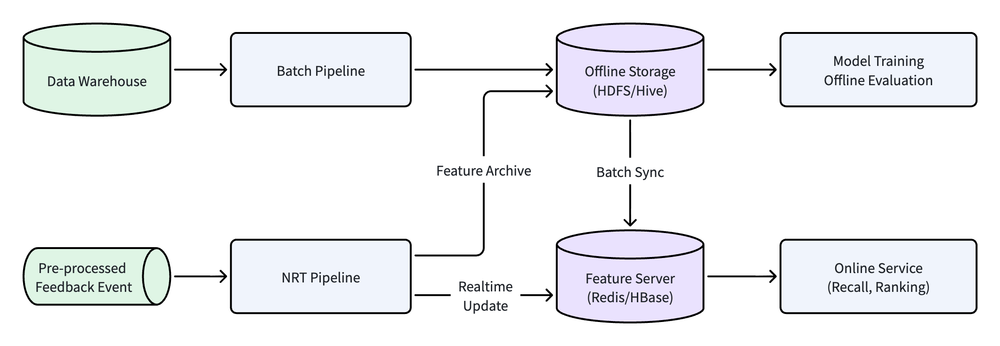
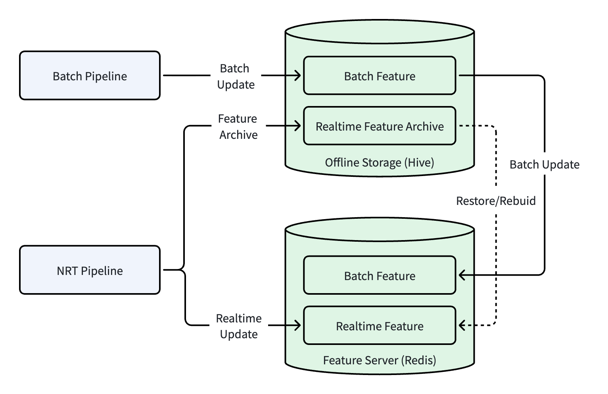
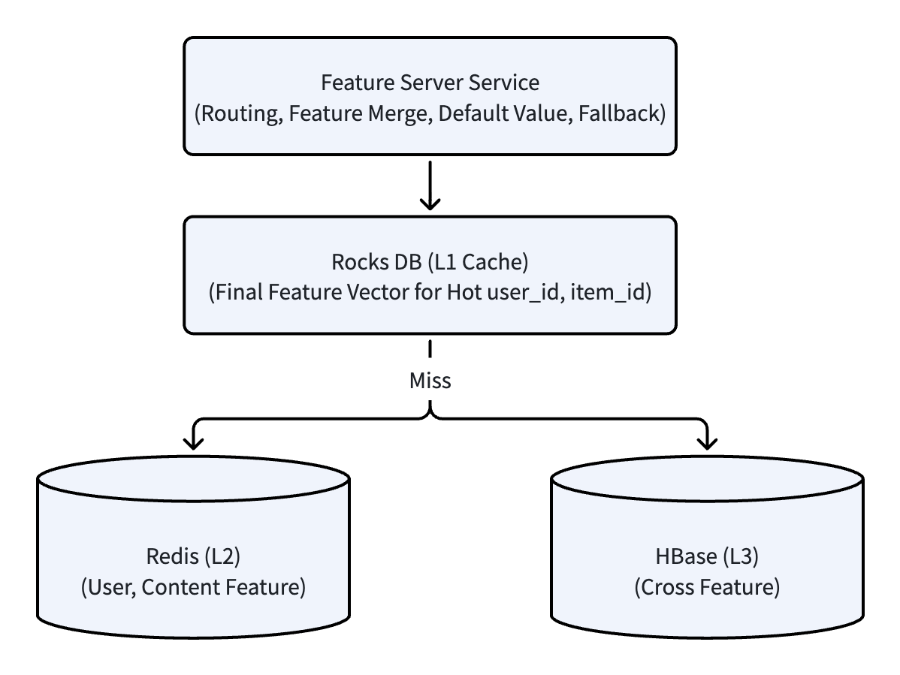
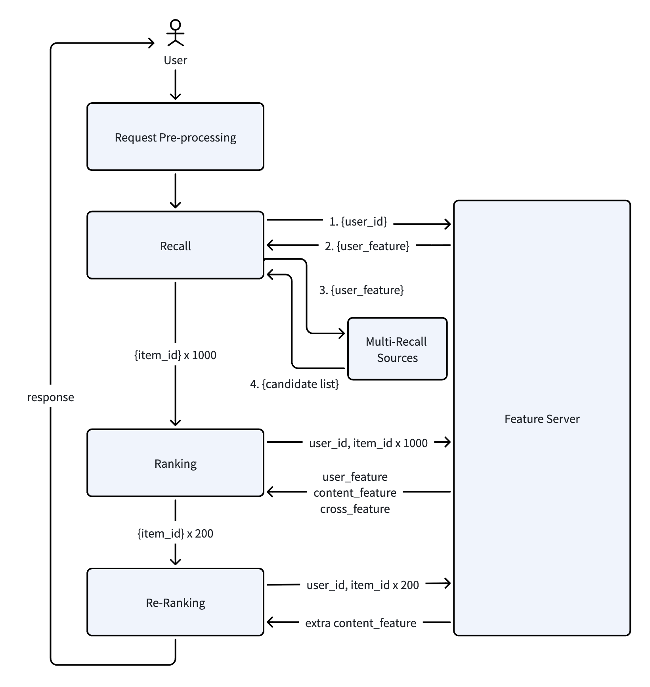
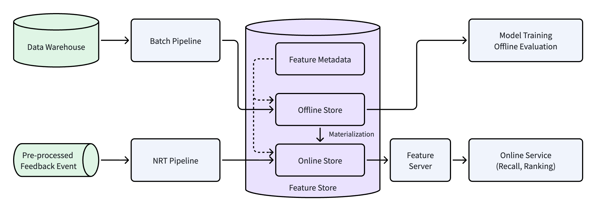

# 推荐系统架构（7）：特征 Pipeline 和 Feature Store

## 1. 特征 Pipeline 全景

在上一篇《用户反馈闭环》中，我们把反馈全链路，从客户端埋点、上报、预处理，到数据仓库，最终形成用户、内容、特征、样本和模型等资产。这条链路也是反馈数据不断加工、逐步沉淀为推荐系统资产的过程。

原始的用户行为日志，是一串文字或者描述，例如有一篇文章“曝光”了，然后用户“点击”，在页面“停留”了30秒。这些“曝光”、“点击”、“停留”是一个事件的描述。所以原始用户行为日志没有办法直接发送给模型进行消费，中间需要一个数值化、标准化的过程。这个过程就是特征生成流水线（Feature Pipeline）。Feature Pipeline 把行为日志、用户信息、内容信息等经过清洗、归一化、聚合、统计、拼接等工作，转换为标准化特征。




上图是一个 Feature Pipeline，以及它的输入、输出资产相关的架构图。图中输入源是用户行为反馈，沉淀在数据仓库中的数据送入 Batch Pipeline，生成的离线特征数据写入离线存储（Offline Storage, HDFS/Hive）中，然后定期同步到在线的 Feature Server；经过预处理的行为反馈数据，直接输入到 NRT Pipeline，生成的实时特征直接写入 Feature Server，同时也会同步归档到离线存储。离线存储中的特征一般用于生成训练样本然后进行模型训练，也会用于离线评估等作用。在线的 Feature Server，支撑召回、排序等在线服务。

以上的这个架构图和相关模块，就是本篇文章的主要内容。在阅读完本篇之后，你将详细了解：

- 推荐系统的特征从哪里来、到哪里去。
- Batch 和 NRT 两条 Pipeline 如何分工协作。
- 生成的特征怎么在线上服务使用。
- 工业级特征工程的核心设计模式和工程挑战。
- Feature Store 如何解决训练-服务不一致的经典难题。

> **注：** 本文主要内容以我之前经历过的系统设计为例，讲解在没有 Feature Store 服务情况下的 Feature Pipeline 系列架构。第 6 章专门讲解当前工业化推荐系统引入 Feature Store 之后的架构演进。

## 2. 特征全景图（Pipeline 产出物）

### 2.1 Pipeline 产出的资产

工业级 Feature Pipeline 的产出就是特征（Feature），会涵盖多个维度，支持推荐服务的离线和在线链路中的多个环节。

下面表格综合展示了所有产出的特征资产：

| 产出物类型        | 典型特征示例                        | 更新频率  | 主要使用方 |
| ------------ | ----------------------------- | ----- | ----- |
| 用户长期特征       | 用户基础信息、长期兴趣标签 TopN            | 天级    | 召回、排序 |
| 用户实时特征       | 短期兴趣标签、实时打压、当前会话行为            | 秒/分级  | 排序、重排 |
| 内容静态特征       | 内容标题、内容、长度、作者、发布时间等           | 准静态   | 召回、排序 |
| 内容动态特征       | 曝光、点击、CTR、停留时间、完读/完播率、质量分等    | 小时/天级 | 召回、排序 |
| 交叉特征         | 用户-内容、用户-类别、用户-作者 等交叉特征       | 天级    | 排序模型  |
| 统计聚合特征       | 类别曝光和点击、滑动窗口均值、7天CTR          | 小时级   | 召回、排序 |
| Embedding 特征 | User Embedding、Item Embedding | 小时/天级 | 召回、排序 |
| 训练样本特征快照     | 带标签的特征向量（含负样本）                | 天级    | 模型训练  |

关于每一类特征的具体定义和应用，可以参考前面相关文章，包括第3篇《特征工程》、第5篇《内容资产》。其中的训练样本是模型训练需要的带标签的特征向量，它是把用户行为反馈日志和 Feature Log 拼接得到，在上一篇《用户反馈系统》中有简单描述，后续还会有专题文章对样本生成、模型训练做更深入探讨。

### 2.2 特征的三层分类

为了方便理解和治理，我们可以从以下几个维度对特征进行分类：

**按更新频率分**

- **静态特征**：那些基本不变的特征，例如内容长度、作者、内容发布时间等。这些特征生成之后基本不会变化，可以长期复用。
- **准静态特征**：变化频率比较低的特征，例如用户的注册信息、内容分类等。这些特征变化不是很频繁，一般通过 Batch Pipeline 每日计算更新。
- **动态特征**：变化非常频繁的特征，例如内容 CTR、实时热度、用户实时兴趣。这一类的特征一般由 NRT Pipeline 计算，分钟级甚至秒级更新。

**按作用域划分**

- **用户侧特征**：只描述用户的特征，和内容变化无关，例如用户的基础属性、兴趣爱好等。这一类的特征计算好之后，通过 user_id 来查询。
- **内容侧特征**：只依赖内容本身的特征，例如内容基础特征、热度、质量特征等。这些特征计算好之后，按 item_id 查询。
- **交叉类特征**：同时依赖用户和内容的特征，例如“用户对该内容分类的历史 CTR”，这样的特征既和用户相关，又和内容相关，特征量级大、计算成本高。但这一类的特征所包含的信息量大。
- **上下文特征**：用户发起请求时的场景特征，例如时间段、所用的网络环境等，一般在请求时动态获取。

**按生产方式分**：

- **离线预计算特征**：通过 Batch Pipeline 按天级计算好的特征，存储在离线存储中，大部分供离线训练、评估使用，也有一部分需要同步到在线 Feature Server 做推理使用。
- **实时计算特征**：通过 NRT Pipeline 分钟或秒级更新，直接写入 Feature Server，供在线推理使用。
- **模型生成特征**：通过 Embedding 模型生成的稠密向量，例如 User Embedding、Item Embedding，一般天级频率更新，存入向量数据库。


> **理解这些特征分类的目的**：不同的特征类型对应不同的存储、更新和容灾策略。例如，静态特征基本不变可以很方便进行缓存；实时特征必须要保证低延迟更新；交叉特征数量很大，需要兼顾存储和高效查询。

### 2.3 特征存储

前面介绍了特征的类型和分类方式，接下来看看这些特征是如何存储的。一般来说，特征存储需要同时支持离线和在线两种方式，对存储系统的要求也不同：

**离线存储方案**：

- **Hive/Iceberg**：这是表格类存储，存储容量大，一般用于存储全量的特征数据，按日期来分区。这类存储供后续的训练样本生成、模型训练，或者离线效果评估等批量任务使用。Iceberg 是新的开源表格存储系统，它支持时间旅行和增量读取，让离线特征快照管理更加灵活。
- **HDFS**：一般用于存储训练样本文件（例如 TFRecord 格式），供深度学习框架直接读取使用。 

**在线存储方案**：在线存储需要支持低延迟、高并发，一般都采用 KV 类存储，常见的有：

- **Redis**：最常用的 KV 存储，支持毫秒级甚至微秒级延迟的随机读取，适合单 key 查询类特征，缺点是全内存存储，成本高。
- **HBase**：支持大规模数据的随机读取，理论上能达到 PB 级，适合存储特征维度比较多、key 数量很大的场景，例如交叉特征存储。缺点是运维比较复杂，系统参数需要优化来避免单次请求的延迟毛刺高峰。
- **RocksDB**：嵌入式的 KV 存储，一般会作为本地缓存使用，搭配其他存储实现系统内的多级缓存。
- **自研KV**：有能力的大团队，通常会自研定制化的 KV 存储，例如针对 批量读取、部分更新等方面优化。

我之前经历过的推荐系统，在线存储使用的是 Feature Server，它包括对外的服务，也管理内部的 Redis 存储，定制化开发了 Redis 的分片和副本机制。具体的细节参考第4章。

有关存储部分的架构图可以参考：


图中的在线存储使用 Feature Server，内部实际存储方案是 Redis。存储的数据包括批量特征（Batch Feature）和实时特征（Realtime Feature），提供给在线推理服务使用。离线存储 Offline Storage，存储的内容包括离线批量特征和实时特征归档。此处的实时特征归档，在现在工业界一般会存储两类数据：原始流式明细日志、带时间戳的实时特征快照。实时特征归档用于线上服务 Feature Server 灾备恢复使用，一般可以拉取最近时间戳实时特征快照快速恢复，然后再通过 NRT Pipeline 重放部分日志恢复到最新状态。有的系统对特征精准度要求很高，可以直接从起始点流式明细日志全部重放一遍。

## 3. Pipeline 架构：Batch 离线流水线 & NRT/Realtime 实时流水线

### 3.1 整体设计理念

如上节所述，特征的更新频率存在不一致的情况，有的天级、有的实时。这两类特征的生成不能混在一个 Pipeline 中进行处理，所以一般都需要拆分批处理和实时两类 Pipeline 来处理。

Pipeline 拆分之后，带来另外一个问题，即批处理和实时两个 Pipeline 怎么保证特征处理的一致性？此时需要采用一个核心的设计理念，即**流批一体**，也就是同一套特征处理和生产逻辑，同时用在批处理 Pipeline 中，也会用于实时 Pipeline 中，这两者处理必须保持一致。

在实际的工业化实现中，两层 Pipeline 的分工协作如下：

- Batch Pipeline：负责全量数据的批量计算，生产长期统计特征和全量的特征快照。Batch Pipeline 一般是天级或者小时级更新，特征存储在离线存储中。
- NRT Pipeline：负责增量数据的实时计算，生产短期动态特征和实时信号。产生的特征直接写入在线的 Feature Server 中，一般分钟级甚至秒级更新。

这两类 Pipeline 不是替代关系，而是互补。Batch Pipeline 负责全量数据，相对比较准确；NRT Pipeline 负责实时计算，快速响应。两者结合在一起，既保证了系统长期稳定可靠的基准特征，也照顾了瞬时的热点、临时兴趣等变化需求。

### 3.2 Batch Pipeline（离线流水线）

Batch Pipeline 处理的是全量的历史数据，是推荐系统中最全面、最准确的特征来源。它的产出包括长期稳定的各类特征，是系统用于推荐的最基础数据。

**数据源**：

Batch Pipeline 会从数据仓库的 DWD/DWS 层表中读取数据。DWD 提供明细级别的用户行为日志和 Feature Log，DWS 层提供按用户、内容或者其他维度预聚合的宽表。Batch Pipeline 会读取全量（一般30天）的历史数据，进行计算。关于数仓的分层，可以参考上一篇《用户反馈系统》的第 5 章。

> 注：我当时实际参与过的推荐系统建设，DWD/DWS 还没有明显分层，数仓只有 ODS、DW、ADS 三层，DWD/DWS 合称为 DW（Data Warehouse 表）层。

**计算引擎**：

Batch Pipeline 的计算引擎一般选用 Spark，实际工程中，大部分特征任务都是 Spark SQL，少量复杂逻辑会使用 UDF 或 DataFrame API。Spark 的批处理能力很强，生态比较成熟。用 Spark 框架能很方便的处理 TB 级的行为数据，是批量处理流水线的最佳选择。

Batch Pipeline 处理的数据量比较大，一般是每天处理一次。有的系统架构会细分，小时级别也会运行稍小批量的任务。

**产出内容**：

Batch Pipeline 的产出包括以下部分：

- **用户长期兴趣**：例如有的用户喜欢“科技”，有的喜欢“娱乐”。
- **用户历史行为统计**：过去一段时间用户全量交互，例如过去30天用户的总点击次数、平均停留时长等。
- **内容长期的行为特征**：例如内容的曝光、点击、CTR、停留等特征
- **全量聚合统计特征**：平台全量用户统计特征，例如全量用户平均每日点击、不同分类内容占比等。
- **训练样本集合**：把用户行为反馈和 Feature Log 拼接，带特征快照的训练集

Batch Pipeline 产出内容一般会保存在离线存储中，例如用 Hive 表保存

**Batch Pipeline 的完整链路**：

```
客户端埋点 -> 上报预处理 -> 入数仓 ODS -> DWD明细层 -> DWS汇总层 
    -> Batch Pipeline (Spark聚合计算) -> 离线特征表 (Hive) 
    -> 模型训练 / 离线评估 / 同步至在线存储
```

**计算逻辑示例**：

下面是一个 Spark SQL 示例，从数据仓库 DWD 表中读取数据，然后计算7日 CTR 特征。注意一下这段 SQL 只是为了演示 CTR 核心计算逻辑，没有做生产环境优化，所以不建议直接在线上运行：

``` sql
-- 内容7日CTR特征计算
INSERT OVERWRITE TABLE dws_feature_item_7d_ctr_di PARTITION(dt='2026-01-15')
SELECT 
    item_id,
    SUM(CASE WHEN event_type = 'click' THEN 1 ELSE 0 END) AS click_cnt_7d,
    SUM(CASE WHEN event_type = 'impression' THEN 1 ELSE 0 END) AS imp_cnt_7d,
    SUM(CASE WHEN event_type = 'click' THEN 1 ELSE 0 END) * 1.0 
        / NULLIF(SUM(CASE WHEN event_type = 'impression' THEN 1 ELSE 0 END), 0) AS ctr_7d,
    COUNT(DISTINCT user_id) AS user_cnt_7d
FROM dwd_event_feedback_detail_di
WHERE dt BETWEEN '2026-01-08' AND '2026-01-14'
  AND event_type IN ('impression', 'click')
GROUP BY item_id;
```

### 3.3 NRT/Realtime Pipeline（近实时 / 实时流水线）

Batch Pipeline 天级或者小时级运行一次，更新批量/全量特征。对于内容热度、实时兴趣等特征，如果等待 Batch Pipeline 小时级甚至天级更新，会导致热点发现滞后。因此这类特征更适合通过NRT Pipeline 实时计算。NRT 即 Near Real Time，近实时，有的系统直接叫 Realtime Pipeline，本系列文章统一采用 NRT Pipeline。

**数据源**：

NRT Pipeline 的数据源是经过轻量预处理之后的用户行为反馈日志（参考上一篇《用户反馈系统》第3.3节）。

**计算引擎**：

NRT Pipeline 的计算引擎一般选用 Flink。Flink 的流式处理能力很强，低延迟、窗口计算丰富，是 NRT、Realtime Pipeline 的首选。工业级推荐系统中 NRT Pipeline 一般是分钟级计算更新，也有部分系统采用秒级更新策略。

**产出内容**：

- 用户实时兴趣：短期或者会话级别的用户喜好。
- 内容实时热度：在短期窗口内容的曝光、点击、CTR等。
- 实时打压：用户浏览过程中明确表示的不喜欢内容或类别。
- 实时场景特征：例如地理位置变化触发的场景切换。
- 短期统计特征：时间窗口内的统计特征，例如过去5分钟内点击次数等。


**NRT Pipeline 完整链路**：

```
客户端埋点 -> Gateway/DataCollector -> Kafka -> 轻量预处理 
    -> NRT Pipeline 实时聚合 -> 写入 Feature Server ->  对外提供线上推理
```

**Flink 窗口计算类型**：

- 滑动窗口（Sliding Window）：每隔固定时间（例如若干秒）滑动一次，窗口的长度固定。一般用于计算“最近N分钟”这样的特征。上面说的实时热度、用户临时兴趣等都是基于滑动窗口来计算的。
- 滚动窗口（Tumbling Window）：窗口长度固定，不重叠，例如每10分钟一个窗口，00:00 - 00:10、00:10 - 00:20，窗口结束时统一计算输出。例如用于计算内容“每10分钟曝光”这类特征。
- 会话窗口（Session Window）：用的比较少，一般只用于对用户会话级别行为建模，不会全局大规模使用。

以上几种窗口类型，一般 NRT Pipeline 都会实现滑动窗口、滚动窗口两种方式，其中滑动窗口使用频率最高，滚动窗口次之。而会话窗口类计算需要启动单独 Pipeline 来进行，用的很少。

### 3.4 流批联动机制

Batch Pipeline 和 NRT Pipeline 之间有一套联动机制来协同工作。这个协同的方式就是“离线兜底、实时补新”，即每天 Batch 全量刷新，当天 NRT 实时增量修正。

- Batch Pipeline：负责全量数据计算，生成长期特征（7/14/30日），解决冷启动、长周期指标计算的问题。
- NRT Pipeline：负责计算当天增量数据，捕捉瞬时动态变化，满足热点内容、用户临时兴趣等需求；

下面用一张时间线来示意这种协同联动方式：

```
T日 00:00 Batch Pipeline 计算 T-1 日全量特征，写入 Offline Storage，同步到 Feature Server 中 Batch Feature 部分。
T日 00:00 NRT Pipeline 从 T-1 日 23:59:59 之后开始消费增量行为，产出实时特征写入 Feature Server 的 Realtime Feature 部分。
T日 全天 在线特征读取 = Batch Feature + Realtime Feature
T+1日 00:00 新一轮 Batch Pipeline 运行，覆盖前一日 Batch Feature；NRT Pipeline 开启新一日的增量数据消费，滚动刷新 Realtime Feature。
```


**解读：** 
每天 00:00，Batch Pipeline 产出的是截至前一日 23:59:59 的全量统计特征。而 NRT Pipeline 从零点开始，消费当天的增量行为数据，实时更新特征值。线上推理时，特征服务器返回的值 = Batch Feature（反映历史长期表现）+ Realtime Feature（反映当前瞬时变化）。
次日零点，Batch Pipeline 重新产出包含前一天全量数据的特征，覆盖前一日的基准。NRT Pipeline 基于当日新行为重新滚动计算短时窗口指标，开始新一轮循环。

这套机制保证了长期稳定的基准特征（Batch Feature 兜底），也能快速响应最新的用户行为（Realtime Feature 补新）。

### 3.5 特征生产模式

Pipeline 内部对特征的计算方式不同，可以分成几种不同的生产模式。

| 生产模式             | 说明                      | 具体例子                                           | 典型引擎                    |
| ---------------- | ----------------------- | ---------------------------------------------- | ----------------------- |
| Aggregation 聚合特征 | 对历史行为进行Count/Sum/Avg等聚合 | 7日点击次数、30日曝光次数、7日CTR                           | Spark SQL / Flink 窗口    |
| Window 窗口特征      | 基于时间窗口的滑动聚合             | 最近5分钟点击数、最近1小时曝光量                              | Flink 滑动窗口              |
| Join 关联特征        | 多表关联拼接得到组合特征            | 用户画像+内容画像拼接、用户-内容交叉特征                          | Spark Join / Flink Join |
| Embedding 模型生成   | 通过神经网络模型生成稠密向量          | User Embedding、Item Embedding、Author Embedding | 模型训练Pipeline            |
| UDF 自定义逻辑        | 复杂业务逻辑的特征计算             | 内容质量分（综合多信号加权）、用户活跃度等级                         | Spark UDF / Flink UDF   |


## 4.  Feature Server

前面我们详细讨论了 Batch Pipeline 和 NRT Pipeline 怎么生产 Batch Feature 和 Realtime Feature，以及这些特征的存储。在线部分的 Feature 存储在 Feature Server，这是在线部分最重要的一个组件之一，让召回、排序等组件能高效低延迟的获取特征。

### 4.1 Feature Server 是什么

Feature Server 是一个专门面向在线推理场景设计的低延迟、高并发特征查询服务。在 Feature Server 出现之前，在线部分的 Feature 一般存在 KV 存储，例如 Redis 中。但随着特征数量越来越多，查询逻辑越来越复杂，Feature Server 应运而生，把特征的存储和查询封装在一个独立服务。

**Feature Server 的职责**：

- **特征统一查询入口**：对上层服务（召回、排序等）提供统一的 API 接口，让上层服务不用关心底层存储是 Redis、HBase还是其他存储。
- **特征多版本管理**：有的特征可能会有多个版本，Feature Server 把这类多版本存储封装在内部，上层服务不用关心多版本的存储管理。
- **特征组合和拼接**：将来自不同存储系统的特征组合成一个完整的特征向量给上层调用方。
- **高性能和高可用**：单次请求在毫秒级，单集群可支撑数十万 QPS（具体取决于部署规模），内部实现高可用，例如管理 Redis cluster 和分片，或者封装 HBase 接口达到高可用目的。

因此，我们可以看出 **Feature Server 和普通 KV 存储的区别**：

| 能力     | 普通 KV 存储            | Feature Server                        |
| ------ | ------------------- | ------------------------------------- |
| 查询接口   | get(key) 返回原始值      | 按用户ID/内容ID返回组装好的特征向量                  |
| 特征融合   | 不支持，需调用方自己合并        | 自动融合 Batch Feature + Realtime Feature |
| 版本管理   | 不支持，需要调用方自己拼装版本 key | 支持特征版本，可回滚                            |
| 默认值/降级 | 不支持                 | 封装降级和默认值填充策略                          |
| 批量查询   | 部分支持                | 支持批量 get，减少 RPC 次数                    |

结合我们第一节中架构图，Feature Server 处于离线系统和在线系统联接的核心位置，它接收 NRT Pipeline 的实时特征写入和 Batch Pipeline 批量特征的同步，然后给线上组件（召回、排序等）提供实时查询服务。

### 4.2 一种典型的 Feature Server 设计方案

#### 4.2.1 特征数量级估算

如果一个推荐系统 DAU 在 5000 万级，Feature Server 存储的特征容量将可能在 TB 或 10 TB 级别。各类 Feature 容量占比大概是：

| 特征类型        | Key 数量 | 单 Key 大小 |     总数据量 |
| ----------- | ------ | -------: | -------: |
| 用户侧特征       | 5000万  |    ~2 KB |   100 GB |
| 内容侧特征       | 1000万  |    ~1 KB |    10 GB |
| 用户Embedding | 5000万  |    512 B |    25 GB |
| 内容Embedding | 1000万  |    512 B |     5 GB |
| 合计          |        |          | ~ 140 GB |

交叉特征最常见的是 user_id x item_id，交叉之后的 Key 数量很容易能到达 50亿 量级，假设每条交叉特征 100 字节，总容量在 500 GB。如果加入更多维度交叉特征（例如 user x category, user x author 等），很容易能到 3 ~ 5 TB。

>**注**：以上容量估算仅作为工程量级示例，不同业务的数据规模会有较大差异。

#### 4.2.2 多级存储架构

TB 级的数据如果全放到内存，需要的机器数量将会非常大。一台机器 128GB内存，算上 Redis 存储额外消耗 （指针、元数据，体积膨胀 1.5 ~ 2倍），实际有效存储在 80 GB 左右。3 TB的特征，就需要将近 38台机器，加上2副本，需要76台机器。

所以对于这样的量级的特征，一般采用分层存储。下面是一个典型 Feature Server 存储架构：



上图中的各个模块：

- Feature Server Service 层提供对外 API 服务（ RPC 或者 RESTful 接口），中间处理特征路由、融合、默认值处理和降级逻辑。
- RocksDB 提供最终结果的缓存，把热门的用户、内容相关特征缓存，一般数据量在几十 GB 量级，缓存命中率能达到 60% 左右。命中缓存时，该次请求延迟能在 1ms 级别返回。
- Redis 存储用户侧和内容侧特征，按上表估算，数据量大概在 140 GB左右，如果一台 128 GB内存机器，有效存储在 80 GB量级，两台机器能存一份全量数据。如果按 2 副本策略，一共只需要 4 台机器。
- HBase 存放所有的交叉特征，容量在 TB 级别。HBase 也可以把所有用户和内容侧特征一起存储进去，万一 Redis 故障，可以将 HBase 做为降级数据源。HBase 搭配 SSD 存储全量数据，内存进行缓存，对于大部分的请求能很快返回。HBase Row Key，可以设计为 `user_id_hash(4B) + user_id(8B) + item_id_hash(4B) + item_id(8B)`，这样可以让同一个用户的所有特征在 HBase 中物理相邻，批量查询时可以利用 HBase 的范围扫描功能，减少随机读取开销。

这样设计的目的，利用 RocksDB (L1)、Redis (L2)、HBase (L3) 的三层存储，兼顾效率和成本。这套设计方案需要额外注意几个问题：

- HBase 的延迟毛刺 （Tail Latency）：HBase 的 GC、Region 分裂、Compaction 等操作可能会带来不可预测的延迟突增。这些需要有专业的研发或运维人员对 HBase 集群进行参数调优、监控，避免问题发生。一旦发生，在 Feature Server Service 层做降级处理。
- RocksDB 层：监控缓存命中率，保持在 50 ~ 70%，能很大降低后面 Redis、HBase 的压力。如果命中率低，适当增加内存或者增大 TTL。缓存的一致性问题，当 Realtime Feature 更新时，怎么保证 RocksDB 缓存的一致性？这时需要权衡缓存命中率和一致性问题，对 TTL 进行优化。

#### 4.2.3 更新策略

Feature Server 中保存的 Batch Feature 和 Realtime Feature，它们的生成方式不一样，更新到线上的策略也不一样。

**Batch Feature 更新策略（全量刷新）**：

Batch Pipeline 每天凌晨生产全量的长期特征，这些特征生成之后，通过批量同步任务写入到 Feature Server 中。更新的方式即每天用新生成的全量特征替换前一天版本，全量覆盖。更新窗口一般选择凌晨流量低谷期（例如凌晨2点到4点），避免影响在线服务。

进行更新时，Feature Server 内部存储维护两个版本的特征，一个对外服务，另外一个进行更新，全量更新完之后，做原子切换到新版本，旧版本等待一段时间之后，淘汰删除。

对于 Redis，可以采用双集群，一个集群对外服务，一个集群接受更新，切换时做流量切换即可。这种方案成本是直接翻倍，但如果按上面的估算，4 台机器能提供全量服务，翻倍也只是 8 台机器，成本还能接受。如果数据量更大，机器数量变多，那么可以在一个集群内部，使用不同版本 key 进行更新，旧版本 `v1:user:{uid}`，新版本 `v2:user:{uid}`，全量更新完进行读取前缀切换。如果全量更新占用空间还是太大，可以采取按用户 hash 分片更新，一片更新完之后删旧数据，然后再处理下一个分片。

对于 HBase 的全量更新，可以采用双表和原子表名切换，这种切换方式天然适合全量覆盖。feature_v1 对外提供服务，feature_v2 接受更新（使用 BulkLoad 方式，避免大量 Put 操作带来 Compaction 压力），更新完之后表名切换。

如果要进行回滚，在旧数据删除之前，Redis/HBase 做原子切换即可，旧数据删除之后无法回滚。所以一般旧版本数据会保留一段时间，等业务指标监控没有明显下降时再进行清理。

全量更新之后，要注意此时 RocksDB 缓存问题。一般情况下 RocksDB 如果采用 TTL 自然淘汰，问题不是很大，新版本缓存会逐渐建立，只是建立过程中 RocksDB 缓存可能和 Redis/HBase 不一致。如果要求强一致性，需要主动把 RocksDB “清空”（用类似上面的读取版本号切换方式进行逻辑清空），“清空”时需要用离线数据对 RocksDB 进行预热（生成新版本缓存），防止大量请求穿透到 Redis/HBase 造成缓存雪崩。预热期间 RocksDB 存储量最坏情况下可能会变为原来的两倍。

**Realtime Feature 更新策略**：

实时特征的更新，逻辑上是直接覆盖，但最大的挑战是在极高的吞吐下保证读的一致性和稳定性。所以需要考虑以下方面问题：

- Redis：实时特征和批量特征在 key 命名上是分开的，例如 `realtime:user:{user_id}:short_term_interest` 表示用户短期兴趣，`batch:user:{user_id}:long_term_features` 表示用户长期兴趣。对于 Redis 中实时特征的写入，就使用 Redis 提供的原子写入操作：SET、HSET、INCR、ZADD 等即可。写入时需要控制一下写入的频率，例如单个用户每秒写入不超过5次，超出部分在写入之前（NRT Pipeline 或 Feature Server 中间层）做聚合。
- HBase：HBase 的实时特征表和批量特征表也是分开存储，但要注意 HBase 不适合高频小数据频繁写入（容易引发 Compaction、GC等），一般做法是做小批量聚合提交，可以在 Feature Server 中间层增加一个缓冲队列，积攒一批数据之后再写入，具体工程上可以基于 HBase 的 BufferedMutator 来实现。

Redis 的实时特征 key、HBase 的实时特征表，都可以设置 TTL，过期会自动清理，不需要手动删除。

### 4.3 在线 Feature Fetch 流程




上图是在线模块和 Feature Server 交互流程图。

- Request Pre-procssing：请求预处理。用户请求经过网关，到达在线推理引擎，会对请求做鉴权、限流、参数解析、生成 request_id 等操作。
- Recall：召回。召回阶段，会把 user_id 发送给 Feature Server，获取用户特征，包括：用户兴趣标签（长期、短期）、用户 Embedding、用户实时行为序列等。然后进行多路召回（CF、热门、兴趣、实时行为召回等），得到一个候选集，一般在 1000 量级。
- Ranking：排序。有的系统会分粗排和精排，此处简化只做精排，在线引擎把 user_id，1000个候选 item_id 发送给 Feature Server，获取到 用户特征、内容特征、交叉特征、实时特征等。Feature Server 会把这些特征融合成一个大的 Feature 集合，一次性返回。在线引擎再把特征送到 Prediction Server（图中未画出），模型打分返回，排序截取前 200 个进行下一阶段。
- Re-Ranking：重排。对精排结果进行多样性打散、业务规则处理等，此时可能会需要少量额外特征（例如历史曝光记录等）。

以上流程主要说明在线部分组件和 Feature Server 的交互，更多在线架构，后续会有专题文章进行讲解。

从流程中可以看出，一次用户请求，会和 Feature Server 进行多次交互，读取的特征数量在几千的级别。所以要求 Feature Server 的性能（延迟、并发）都要足够强，才能支持高并发的用户推荐请求。

### 4.4 Feature Server 降级策略

如果内部的存储组件出现问题，例如 Redis 宕机、HBase 因为 GC 或者 Region 分裂等原因导致延迟突增。因此 Feature Server 需要实现多级降级策略：

- **第一级，缓存降级**：当 Redis 读取超时（Redis 集群问题或网络问题），Feature Server 降级到本地 RocksDB 缓存。如果本地缓存也未命中，返回预先配置的默认特征值。这种降级保证请求能得到响应，但返回的特征质量可能有所下降。
- **第二级，特征裁剪**：当系统整体压力过大，例如 QPS 超过设定阈值，Feature Server 可以主动裁剪特征集合，例如只读取用户 Embedding、内容 Embedding 等核心特征，而忽略交叉特征和实时特征。有核心特征的情况下模型仍然可以工作，只是精度会有所下降。
- **第三级，降级推荐**：当 Feature Server 完全不可用时，需要在线引擎端做降级策略，可以考虑拉取全局热门内容，或者用户最近一次有效会话的缓存，这时的兜底策略需要和业务方共同决定，保证系统服务不中断，但分发内容质量会大幅度降低。

当发生降级时，需要记录详细的日志，在严重情况下（例如 Feature Server 完全不可用时），需要发出告警，人工介入排查恢复服务。

## 5. 工业级关键设计细节和挑战

通过前面几章的架构描述，相信大家已经基本了解特征 Pipeline 和 Feature Server 怎么支撑起一个推荐系统特征相关部分的运转。但随着业务的复杂提升和团队规模的扩大，在具体的工程实现过程中会有不少的细节和问题需要考虑，下面来列举一些实际的场景：

### 5.1 训练 - 服务一致性

训练服务不一致是推荐系统最隐蔽但也是影响最严重的问题之一。这个问题的根源在于模型训练时候的特征、计算逻辑，和线上推理时存在差异，导致离线评估效果和在线推荐效果有很大的差距。

训练服务不一致来源可能有：

- **计算逻辑不一致**：离线特征计算采用 Spark SQL 实现，而线上的特征拼接用 Java 代码实现，两套代码可能由不同的团队维护。例如之前文章举过的例子，“7日点击率”，离线训练时按自然日滚动来统计，而线上按滑动窗口来计算；又如离线对缺失特征设置默认值为0，而线上可能填充为全局平均值。
- **特征取值时间不一致**：训练样本用的是 T-1 日生成的特征快照，而线上推理时 Feature Server 含有 T 日实时更新的特征值。T 日实时特征相对 T-1 日批量特征可能会存在偏差，这可能会导致训练特征和线上特征不一致，预测的结果可能会漂移。
- **存储实现策略不一致**：离线特征全量计算，但线上 Feature Server 存储有限，可能会有数据截断等问题。例如用户在30天内对一个小众内容（例如古书画）有互动，离线能计算出用户对古书画分类兴趣度 0.2。但这部分兴趣属于长尾数据，在线上存储时可能截断不存储。在线推理时，遇到这个古书画分类特征，系统给它填充默认值0，和离线模型不一致，导致推理结果产生偏差。

对这些不一致的问题，可能的实践方案如下：

- **特征计算逻辑抽取为公共库**：把特征计算的业务逻辑抽取成独立代码库，用 Java 编写。这样在特征 Pipeline，可以通过 PySpark UDF 方式调用这样的库，线上 Feature Server 也可以直接引用同一份 Jar 包。这样保证两个系统执行同一套代码。
- **特征快照、特征日志排查**：训练样本生成的时候把对应的特征快照也保存一份，线上服务记录特征日志（Feature Log）。离线监控任务对比样本对应的特征快照和线上 Feature Log 的分布差异。如果分布差异超过阈值触发告警。这样的机制可以主动发现不一致的情况，提前暴露问题。
- **离线特征回溯**：当发现某个特征计算逻辑有问题需要修复时，先修复离线逻辑，然后重新训练模型；同时更新在线特征生产逻辑，上线新模型。此时需要人工协调离线同步和线上发布时机。
- **长尾特征处理**：用户长尾兴趣线上被截断的问题，有几类解决方法：首先是模型训练时，对长尾兴趣做截断，保证和线上特征取值一致；其次是长尾特征进行特殊存储，对于这类长尾特征单独存放为一类特征（区别于用户兴趣），线上推理时优先取用户兴趣，当有精度要求且存在长尾内容时，再从单独特征区取长尾兴趣。

### 5.2 数据延迟和乱序

NRT Pipeline 面临一个比较大的问题就是反馈数据延迟和乱序。用户行为日志从客户端发出到服务端接收，因为缓存、网络重试等问题，可能会造成时间差和乱序。例如一个 10:00 发生的点击事件，在 10:05 才到达 NRT Pipeline。如果窗口时长 5 分钟，那这个事件只能被归类到下一个窗口，会导致实时特征计算不准确。

对于这种延迟、乱序的问题，一般会采用 Flink 的事件时间（Event Time）和水印（Watermark）机制来解决。Flink 以客户端时间 Event Time 作为处理的依据，而不是服务端收到的数据时间。Watermark 是 Flink 用来标记事件时间流推进情况的特殊时间戳。Watermark 是当前事件最大时间戳减去允许延迟时间，当 Watermark 到达时间窗口边界时，Flink 才开始对这个窗口数据进行计算。举个例子，假设允许延迟是 2 分钟，时间窗口是 10:00 - 10:05。

- 第一个10:02 发生的事件到达，此时 Watermark 是 10:02 - 2min = 10:00。
- 下一个 10:05 发生的事件到达，Watermark 推进到 10:03。
- 下一个 10:02 发生的事件到达，它时间戳小于当前最大时间戳 10:05，Watermark 不推进，把这条数据缓存下来。
- 下一个10:08 发生的事件到达，Watermark 推进到 10:06，超过时间窗口边界 10:05，触发 10:00 - 10:05 这个窗口的计算。

所以只要事件在允许延迟的窗口内到达，都能被缓存，然后集中进行处理。在 Flink 中，还有一个允许延迟（Allowed Lateness）设置，即超过时间窗口一定时间内的事件也能再进入这个窗口继续计算。如果一个事件超过了上述所有时间点，那它会被放入一个专门的“迟到数据”队列，进行单独计算补偿。

### 5.3 特征爆炸、维度膨胀优化

随着业务复杂度的提升，特征的复杂度也在提升。以前是用户侧 U、内容侧 C 特征，特征数量是 O(U+C) 量级。后来加入了交叉特征，特征数量变成了 O(UxC) 量级。在千万级用户、百万级内容规模下，交叉特征理论上变成了万亿级别。其他的例如用户行为序列越来越长、内容分类越来越细，也会使特征规模增长。

下面把特征维度膨胀来源总结到一个表格中：

| 来源        | 说明                                       | 量级影响                   |
| --------- | ---------------------------------------- | ---------------------- |
| 高基数分类特征   | 用户 ID、内容 ID、地理位置等单独做 one-hot 编码          | 单特征就能达到千万甚至亿维          |
| 交叉特征      | user_id x item_id、user_id x category 等组合 | 50 亿以上 Key 量级，见前面的容量估算 |
| 行为序列      | 用户历史行为按时间窗口保留，序列长度从几十到几千不等               | 每次推理需要处理大量向量           |
| Embedding | 各类实体、关系都生成 Embedding                     | 乘数效应，对象越多向量越多          |

针对这些问题，一些常用的优化方法包括：

- **Embedding 代替 One-hot**：对于高基数分类特征，可以采用 Embedding 方式把高维稀疏特征映射为相对低维的稠密向量。例如用户 ID、内容 ID 等原始 one-hot 编码可能会有几百万维，Embedding 变换之后可以降低到 128 维。

- **交叉特征优化**：如前所述，理论上的交叉特征会到万亿级别。实际工程落地只保存“用户对内容有交互”的交叉特征，量级可能会降低到十亿级别，并且可以设置 TTL 自动淘汰旧数据。另外还可以利用特征哈希（Feature Hash）将高维交叉特征映射到固定维度空间。

- **特征选择与裁剪**：可选特征数量有非常多，但并不一定所有特征都是有效的。在模型训练之前，可以使用一些方法（统计、基于模型）来把有效特征筛选出来，把噪音大或者区分度低的特征过滤掉，这样特征集合可以大大减小。

- **共享嵌入表示**：不同实体之间共享 Embedding 空间。例如，用户 Embedding 和内容 Embedding 可以在同一个向量空间中学习，不需要单独维护两套完全独立的向量表，这样既能减少存储，又能让模型更好地学习到用户和内容之间的匹配关系。

- **序列压缩**：用户的长期行为序列非常长，如果全部传入模型，计算开销很大。常用的做法是对序列进行采样（例如最近 50 次有效行为），但要注意序列采样会丢失早期行为信息，如果业务对长期兴趣建模有强需求，可以考虑'滑动窗口 + 池化'的组合方式，或使用 DIN/DIEN 等模型架构自动学习序列权重。

**工程上的权衡**

特征优化本质上是一种以精度换效率的权衡。在实际落地时，需要不断评估 "特征压缩带来的精度损失" 和 "性能提升带来的业务收益" 之间的关系。一般做法是先做线上压测，找到当前系统的真实瓶颈，再有针对性地选择优化手段，这样可以避免一开始就全面做压缩。

### 5.4 特征生命周期管理

特征是有生命周期的，例如下面是一个特征的生命周期各阶段以及它的可见性：

```
开发中 -> 灰度验证 -> 全量上线  -> 下线废弃
   ↓        ↓         ↓           ↓ 
仅离线可见  在线可见   全量可见     停止更新
```


开发阶段，只是在离线环境进行计算和验证，对线上无影响。开发测试通过之后，开始到线上灰度验证，分配小流量进行实验。如果小流量验证通过，推送到全流量，覆盖范围更广，需要配套相应的常态化监控。在后期，如果这个特征失效，需要下线，相关的计算、存储都要进行清理。

在没有系统性解决方案的情况下，一般会采用特征登记表格的方式来管理特征。在一个中心化的地方，记录特征的相关信息，包括特征名字、描述、计算方式、所有者、状态、上线时间等等。这些记录需要配套完整的版本记录、操作日志等。各模块的实现，需要代码级别遵守这个中心化文档的约定。

### 5.5 流批数据一致性校验

Batch 和 NRT Pipeline 是采用流批一体的方式来设计的，即两个 Pipeline 使用同一套特征处理和生产逻辑。理论情况下，同样的数据在 Batch 和 NRT Pipeline 中计算出来的结果应该是一样的。在实际的工程化落地中，需要采取一定的方法对两者结果进行对比校验。

这种结果校验的方式就是每日定期对账。例如每天凌晨，Batch Pipeline 跑完一批数据之后，会选取若干时间段（低峰、高峰）的数据，用 Batch 方式和 Flink 回放方式对相同的特征进行计算。例如统计一个小时内的内容 CTR。计算完之后，对比两者产出的特征值差异，如果差异超过设定的阈值（例如 5%），则认为计算出现差错，触发告警，或者停止后续的批量特征同步到线上。

另外一种可行的办法是对比离线特征和在线特征一致性。例如可以每天抽取 1000 个用户和 5000 个内容，分别从 Hive 表中读取批量特征，以及线上 Feature Server 中读取同样的特征的融合值（批量+实时）。然后计算这两类之间的 Spearman 相关系数和均方误差。如果相关系数低于阈值（例如 0.95）或者均方误差不一致时任务计算有差错。

### 5.6 特征监控和告警

系统上线之后，一般都是 7x24 小时长期运行。为了保证服务的稳定性，一般都需要配套相应的监控和告警体系。特征 Pipeline 的链路很长，有离线、在线多个组件，不管哪个组件出现问题，对最终推荐的结果都有可能会造成影响。因此，我们需要多方面、多维度的对系统进行监控。

在实际工程落地时，下面几个维度是监控中比较常见的：

| 监控维度  | 关键指标                                      | 告警触发条件                                         |
| ----- | ----------------------------------------- | ---------------------------------------------- |
| 数据延迟  | Batch Pipeline 运行时间、NRT Pipeline 窗口计算执行时间 | 执行时间超过预定阈值，例如 Batch Pipeline 执行超过 8 小时仍未完成需要告警 |
| 数据质量  | 特征缺失率、特征值空值率                              | 缺失超过阈值（如 > 5%），或突然出现大量空值需要告警                   |
| 分布稳定性 | 特征分布漂移（PSI、KL 散度）                         | 和基线比较，分布差异超过设定阈值告警                             |
| 系统性能  | Feature Server 延迟、QPS、错误率                 | P99 延迟超过 50ms，或者错误率超过 0.1% 等需要告警               |
| 一致性   | 离线特征和在线特征的一致性                             | 两者分布对比差异超过阈值，触发对账告警                            |
| 存储利用率 | Redis、HBase 内存使用率、磁盘使用率                   | 超过 80% 触发预警                                    |

对于以上监控，如果发生告警，需要第一时间人工介入，排查问题出现原因。故障越早发现，可以越早定位问题、修复问题，保证整个系统长时间稳定运行。

## 6. Feature Store

前面章节描述的架构，在业务系统越来越复杂的时候，会带来一些问题：

- 特征计算逻辑散落在各个组件中，没有统一的注册和发现机制。
- 不同团队可能会重复开发相同或相似的特征，最后造成资源浪费。
- 训练和服务一致性没有系统性的保证，只能凭一些约定来处理。
- 特征的生命周期管理相对比较麻烦，各团队同步、历史特征清理等都有困难。

因此，现代的工业化推荐系统，会引入 Feature Store 来解决这些问题。

### 6.1 Feature Store 是什么

Feature Store 是一套专门用于管理机器学习特征的全生命周期服务平台，核心职责包括：**特征统一注册、存储、版本管理、一致性保障和在线服务**。

一句话概括：Feature Store 让特征成为可复用的基础设施资产，而不是散落在各个 Pipeline 和代码中的临时产物。

| 能力 | 说明 |
| ---- | ---- |
| 特征注册 | 特征在线注册，统一命名，记录类型、计算逻辑、依赖关系 |
| 离线存储 | 历史特征快照存储，供模型训练和离线评估使用 |
| 在线存储 | 最新特征的低延迟查询，供线上推理使用 |
| 版本管理 | 特征多版本支持，允许回滚和灰度 |
| 血缘追踪 | 记录特征上下游依赖，便于排查和审计 |
| 一致性保障 | 统一提供流批处理框架，从计算逻辑层面减少训练-服务差异 |

### 6.2 引入 Feature Store 之后的架构



可以对比第一章架构图，引入 Feature Store 之后，特征元数据、特征的存储，都由 Feature Store 来统一管理。

首先 Feature Store 提供统一注册中心，所有特征都需要注册在其中，后续的生产、消费都可以通过注册中心发现和使用，保证了特征的一致性，也避免了重复开发。

其次是 Feature Store 提供统一的特征计算 SDK， Batch 和 NRT Pipeline 中复用这同一套 SDK，从根本上解决一致性的问题。

然后 Feature Store 的 Online Store，代替了之前 Feature Server 直接管理的 Redis/HBase。此时 Feature Server 演变成只有服务层，内部存储直连 Feature Store 的 Online Store。

### 6.3 Feature Store 存储设计

Feature Store 的存储设计可以同时满足离线训练和在线推理两种场景：

**离线存储（Offline Store）**

- **数据格式**：通常采用 Parquet/Feather 等列存格式，存储按时间分区。推荐使用 Iceberg 或 Delta Lake 这类支持 ACID 和增量读取的表格式。
- **存储位置**：一般存储在对象存储（S3、OSS）或分布式文件系统（HDFS）上。
- **访问模式**：主要面向批量读取，模型训练时需要按时间窗口读取大量特征，对读取吞吐量要求高，延迟要求相对宽松。

**在线存储（Online Store）**

- **存储介质**：Redis（热数据）、RocksDB（本地缓存）、HBase（大规模低访问频率数据）。
- **数据组织**：支持点查询（Point Query）和小批量查询（Batch Get）。典型的 key 设计是 `entity_id:feature_name -> value`。
- **一致性要求**：在线特征需要保证低延迟，Batch 全量更新时采用双写双读或原子切换的方式，避免影响在线服务。

Feature Server 的存储设计，和 Feature Store 的 Online Store 设计原理其实是一样的。Feature Store 把 Online Store 当成子模块，是为了保证系统的完整性。逻辑上把离线在线存储作为同等重要的资产存储，然后这种设计也能保证特征的一致性，最后还让特征生命周期管理能同时触及离线和在线两类存储。

### 6.4 Feature Store 解决的问题

#### 6.4.1 特征治理

没有 Feature Store 时，特征是散落在各个工程代码和数据仓库表里的"私产"。一个特征的定义可能在三份文档、两个团队的代码里各自维护，时间一长就会出现歧义。

Feature Store 通过特征注册中心，强制每个特征必须登记元信息：名字、类型、计算逻辑、更新频率、负责人、依赖表。这些信息形成统一的特征目录，所有团队通过查询目录来使用特征，而不是各自重复开发。

#### 6.4.2 特征一致性

这是 Feature Store 最核心的价值。前面反复提到的训练-服务不一致问题，Feature Store 从系统设计层面给出了解法：

- **统一 SDK**：离线特征变换和在线特征变换共用同一份代码库，通过 Feature Store 的 Transformation 能力保证逻辑一致。
- **PIT 正确性**：模型训练时按时间点查询特征，线上推理时也按同一时间点的特征状态进行查询，避免 T 日实时特征和 T-1 日训练特征的时间错位问题。
- **持续监控**：Feature Store 内置特征分布监控，定期对比离线和在线特征的统计分布差异，自动发现不一致。

#### 6.4.3 特征复用与协作

在统一的注册中心中，一个团队产出的特征可以被其他团队发现并使用。例如，用户组产出了"用户 7 日活跃度"特征，推荐算法团队可以直接在推荐模型中使用，不需要重新计算一遍。这种复用机制大大降低了全公司的特征开发总量。

### 6.5 开源 Feature Store 方案与选型

工业界已经有一些成熟的开源 Feature Store，可以供技术团队选择：

| 方案                      | 厂商/社区               | 特点                                             | 适用场景                   |
| ----------------------- | ------------------- | ---------------------------------------------- | ---------------------- |
| Feast                   | Linux Foundation/社区 | 最活跃的开源社区，支持 Spark/Flink 离线+在线，与 Kubernetes 集成好 | 技术团队有能力二次开发，希望灵活定制     |
| Tecton                  | Tecton 公司           | 商业化方案，功能完善，支持实时特征、血缘追踪、版本管理                    | 企业级团队，预算充足，希望开箱即用      |
| Hopsworks               | Logical Clocks      | 基于 HopsFS，适合 Hadoop 生态团队                       | 已部署 Hadoop/Spark 大数据平台 |
| Vertex AI Feature Store | Google Cloud        | 云原生方案，和 GCP 生态深度集成                             | 使用 Google Cloud 平台的团队  |

**选型建议**：

如果团队规模不大、特征量级在百万级以下，直接采购 Tecton 等商业化方案可能更划算，省去自研成本。如果特征量级大、团队有较强的平台研发能力，Feast 是目前社区最成熟的选择。

对于大部分中等规模团队，更务实的路径是：**先治理好现有特征，等特征数量和团队规模达到一定体量，再引入专门的 Feature Store 平台**。过早引入 Feature Store，往往会增加系统复杂度，而无法真正发挥它的价值。

## 7. 全文总结和下一篇预告

本文主要讲解了特征计算的全过程，从行为反馈日志收上来，然后进入数据仓库到 Batch Pipeline 计算全量特征，或者进入 NRT Pipeline 计算实时特征。这两层 Pipeline 把之前讲的特征工程具象化、工程化，为后续的算法模型提供有效的输入。

前半段主要讲解我之前参与的系统实际架构，以及后半段 Feature Store 的引入，来解决一些特征工程中典型的难题。不管有没有 Feature Store 的存在，特征工程基建都要满足业务需求。对于这个基建，一般我们会从三个方面来衡量其成熟度：

- **时效性（Latency）**：从用户行为发生，到生成特征最后供线上推理使用，中间经历的时间就是特征的时效性。Batch Pipeline 的时效性一般是天级，NRT Pipeline 是分钟级或秒级。时效性越高，系统响应越灵敏，但是会带来其他一些方面的问题，在实际落地选择时候需要权衡。

- **一致性（Consistency）**：模型训练时的特征和线上推理时的特征是否一致。这是推荐系统线上效果能不能达到预期目标的一个很重要的影响因素。特征基建需要消除因为特征一致性带来的模型效果影响。

- **敏捷性（Agility）**：模型算法可能会有新特征的需求，一个新特征从提出想法到上线服务，这个开发的效率就是敏捷性。现在工业化推荐系统中，特征从开发到上线一般是在天级（几天），甚至有的可能能达到几小时级别。特征开发的越快，模型优化的节奏就越快。

推荐模型决定推荐效果的上限，而 Feature Pipeline 决定模型是否能够稳定地发挥这个上限。一个成熟的推荐系统，本质上不是只有先进的模型，更重要的是拥有稳定、可治理、可持续演进的特征基础设施。

### 下一篇预告

上面讲解了很多关于特征方面的内容，用户兴趣也是特征的一类。不过从逻辑上来说，用户画像是一类单独的资产。用户画像的建模，有一些它自己的方法和策略，下一篇文章《用户画像系统设计》，我们来探讨用户画像的整体构成、兴趣衰减与融合、用户序列建模、冷启动策略等方面的话题。


**附录：本篇核心概念速查表**

| 概念                | 一句话解释                         |
| ----------------- | ----------------------------- |
| Feature Pipeline  | 把原始行为反馈日志计算成为特征的流水线           |
| Batch Pipeline    | 批量处理特征流水线，一般按天或小时级运行，生成全量特征   |
| NRT Pipeline      | 近实时流特征流水线，分钟级或秒级计算生成实时特征      |
| 流批一体              | 同一套特征逻辑同时支持批量和流式两种流水线         |
| Feature Server    | 线上特征查询服务，提供高性能特征查询服务，封装内部存储   |
| Feature Store     | 统一特征管理平台，管理元数据、双平面存储、版本、血缘等   |
| 训练-服务一致性      | 训练时用的特征和线上推理时用的特征保持一致         |
| Point-in-Time 正确性 | 保证训练和推理时查询的是同一时间点的特征状态，避免特征穿越 |
| 特征漂移(PSI)        | 特征分布随时间变化的程度，用来衡量模型环境是否稳定     |
| 流批联动             | 批量特征和实时特征流水线协同配合的机制           |
