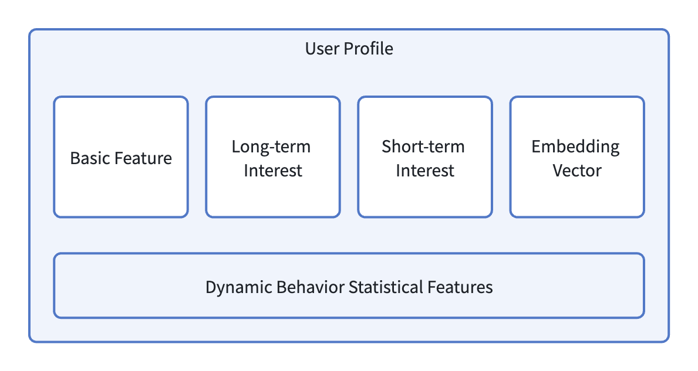
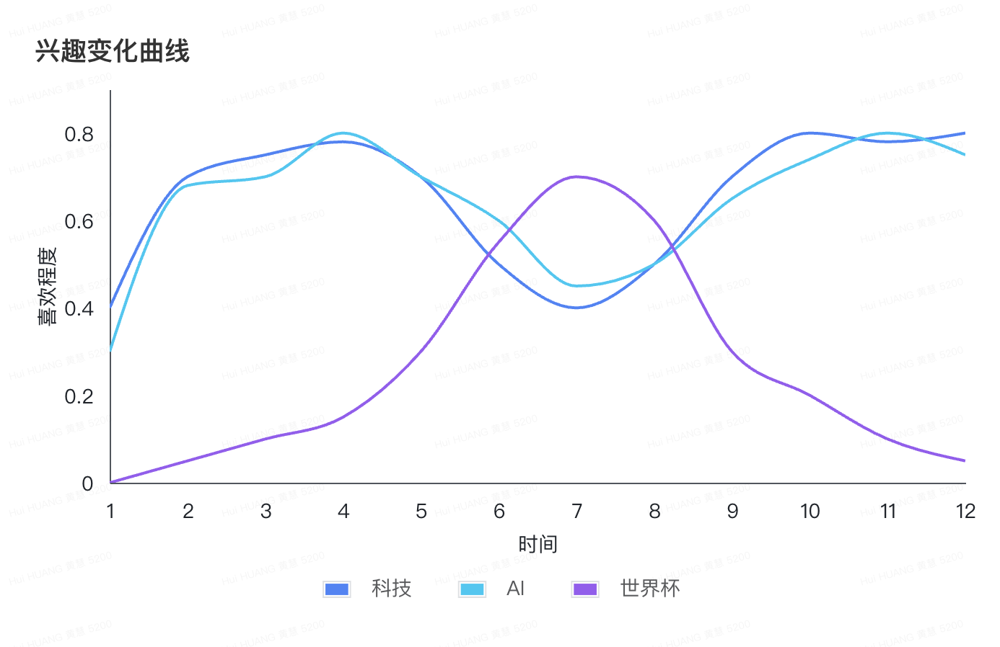
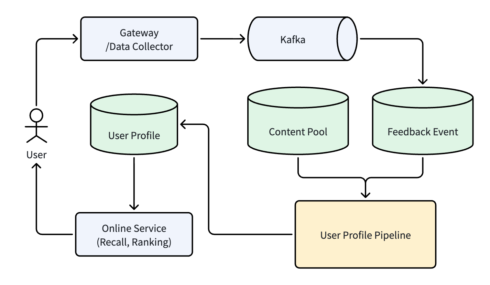
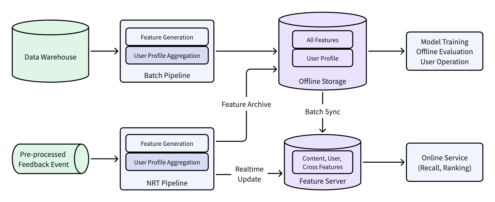

# 推荐系统架构（8）：用户画像系统，持续认识每一位用户

## 1. 用户画像为什么重要

上一篇我们详细讨论了 Feature Pipeline 怎么处理数据，把用户的行为反馈日志和其他数据计算，得到各类的 Feature 然后存在离线存储和在线存储中。这些特征中复杂度最高，迭代最频繁的一类，是用户侧特征。在业务逻辑上，把用户侧特征资产集中管理，持续更新，即用户画像（User Profile）。

用户画像最开始是早于特征工程存在的。在推荐系统的最初期，有了内容，对内容解析得到内容特征，系统根据内容特征进行分发，然后得到用户行为反馈。有了用户行为反馈之后，系统就可以开始对用户建模，构建用户画像。

在有些人的印象中，用户画像是用户的年龄、性别、地域等标签。这也是最开始的用户画像构成，是用户基础信息。随着用户反馈的生成，以及业务发展的需要，需要用一些除了用户基础信息之外的特征来描绘用户的兴趣爱好，所以有了兴趣标签。

从业务价值角度来看，用户画像的作用包括：

- **精细化匹配**：如果没有用户画像，系统只能按内容的热度或内容质量的好坏来给用户分发，不同用户看到的东西都是一样的。有了用户画像，系统才能知道用户的喜好，才能把不同用户喜好的不同内容进行个性化差异分发。用户看到自己喜欢的内容，才会有兴趣去点击、去看完，最后在平台上的停留时间才能变长。

- **负向内容打压**：用户画像不只是能按用户的喜好来筛选合适的内容，另外还可以根据用户的“不喜欢”来过滤掉那些和用户不匹配的内容。例如，一个年龄大的科技类用户，可能对娱乐八卦类内容不喜欢，他的负向兴趣包含“娱乐八卦”这个标签。系统在做内容分发时候，就需要考虑把这类型的内容打压下去，甚至直接过滤掉。负向打压可以改善用户的浏览体验，提升平台内容生态治理的效果。

所以，用户画像是特征 Pipeline 生产出来的资产，但它不是附属品，而是推荐系统最重要的一类资产，是系统了解用户的基础。

## 2. 用户画像的构成

用户画像很重要，下面我们来看一下，现在工业级推荐系统中，用户画像都包含哪些部分。

### 2.1 静态特征

首先是用户的静态特征，也就是用户的基础属性，这类特征是画像体系中最基础、相对稳定的组成部分，在比较长的时间内一般保持不变。

静态特征包括：

- 人口属性：年龄、性别、职业、学历等。
- 设备信息：手机/电脑设备型号、操作系统、网络环境等。
- 注册渠道：自然增长、应用商店、推广等。
- 会员等级：普通会员、付费会员等。
- 地域分层：所处城市、城市分层（一线城市、二三线城市等）。

这些静态特征在一个系统中不一定全部都存在，上面只是一些举例。例如，有的系统可能没有会员等级这类属性。静态特征获取的方式，大部分都是用户注册时候，主动提供的。例如用户的人口属性，只能由用户自己提供。设备信息可以注册时客户端的数据采集和上报，所处城市可以用户自己指定，或者根据 IP、所处经纬度等计算得出。这些静态特征的采集，一定要遵循相关法规，用户允许提供时才能进行收集、处理和存储。

静态特征是最基础的信息，它的价值在于可以为推荐系统的全链路提供基础的上下文特征，离线时能用到、线上推理时也能用到。并且静态特征本身也没有正负向的区分，例如用户是男性，只是一个属性表示，特征本身不带什么偏好，静态特征只能和其他特征组合在一起，才能表现出正负倾向。

### 2.2 长期兴趣和短期兴趣

用户有了基础信息特征，但不能实现完整的个性化推荐。系统做内容分发的时候，还要取决于用户的动态兴趣，也就是兴趣标签。用户的兴趣标签可以通过用户的浏览行为计算的出来。

**长期兴趣**

综合用户过去的（30天或更长）浏览行为，做批量的聚合，可计算出用户的长期兴趣。用户的兴趣分为正向（喜欢什么）和负向（不喜欢什么）两个方面。两个方向的兴趣共同作用在推荐流程中。

举个简单例子，系统给用户 A 分发了 100 篇科技类的文章，用户点击并完整浏览了其中的 80 篇，系统可以简单的计算用户 A 对“科技”分类的喜好程度为 0.8。如果推送了 50 篇娱乐内容，用户直接跳过了（或者点“不感兴趣”）其中的 35 篇，那么系统计算用户 A 对“娱乐”分类不感兴趣程度为 0.7。那么在下次内容分发时，系统就会匹配出更多的科技类内容，减少娱乐类内容数量。

> 注：这个例子只是为了描述怎么计算用户兴趣标签的逻辑，用的是最基本的统计聚合算法。实际系统中计算会比这个复杂，会有语义向量聚合、多兴趣聚类、长序列动态感知等算法。

用户的长期兴趣计算，对应上一篇文章的特征 Pipeline，是由 Batch Pipeline 每天计算更新一次。在系统性的特征 Pipeline 出现之前，一般会有单独的 UPP（User Processing Pipeline）天级计算更新，原理和 Batch Pipeline 类似。

长期兴趣的价值是给推荐系统提供一个相对稳定的基线，即使用户在一天或两天之内没有任何的浏览行为，系统还是知道这个用户喜欢什么。

**短期兴趣**

在用户的浏览过程中，用户可能会突然对某一个分类或者话题感兴趣。如果系统只有长期兴趣，那么就不能很好的满足用户临时浏览的需求。所以需要短期兴趣来捕捉这些临时的兴趣偏好。

短期兴趣一般来自于 NRT Pipeline 计算，基于用户一段时间内（例如几个小时或一天内）的行为得出，更新频率一般在分钟级，少数系统能做到秒级。短期兴趣的计算方法，与长期兴趣类似，也可以采用统计聚合；随着模型的发展，也逐渐演进出会话序列编码、注意力机制等方法。

短期兴趣最简单的计算也是类似长期兴趣那样的统计聚合算法，后来迭代演化有会话序列编码、注意力匹配、SDM模型等算法。

长期兴趣和短期兴趣是互补的，两者缺一不可。只有长期兴趣，系统不能响应热点和场景变化；只有短期兴趣，推荐结果会非常不稳定。

### 2.3 用户 Embedding 向量

前面说的基础静态特征和长短周期的兴趣动态特征，能很好支撑推荐系统的运行，给用户带来比较好的个性化体验。但随着业务的发展，用户对平台的要求也越来越高，这些单纯的标签类特征维度还是比较有限，表达能力不够强、不能挖掘用户的隐性兴趣。因此，用户画像中引入了 Embedding 向量作为一类特征。

统计类特征可能是稀疏的、离散的，不能表达类别之间的语义关联性。例如用户 A 看了很多关于“机器学习”方面的内容，统计特征只能记录“科技类别曝光 100 次点击 80 次”，但实际这个用户可能也对“数学”或“编程工具”感兴趣，模型通过统计特征无法学习到。Embedding 可以将用户映射到稠密向量空间，让系统能计算用户和内容之间的潜在语义相关性。在上面那个例子中，这 100 篇“科技类”机器学习的文章，它们的向量可能就和包含“数学”、“编程工具”的内容会比较相似，这样就能通过这样的用户行为，学习到用户对“数学”、“编程工具”的喜好程度。

在系统落地中，用户侧 Embedding 可能包括：类别 Embedding（用户对内容类别的兴趣向量）、语义 Embedding（用户对内容文本语义融合向量）、全局用户表征向量（端到端训练产出的用户塔输出）。这些向量可以用在召回阶段做向量检索，也可以用做排序时的高阶特征输入。

### 2.4 用户画像整体构成



综合前面的描述，一个用户画像的构成可以总结为：

- 静态基础属性画像（年龄、地域、设备、注册渠道等永久特征）
- 长期正向 / 负向兴趣画像（长期偏好、长期不感兴趣类目）
- 实时短期兴趣画像（当日会话临时偏好、即时负反馈）
- 各类用户 Embedding 表征（类目、内容、语义向量）

在实际的工业级落地中，有的系统在这套四类特征的框架还会补充一层“动态行为统计特征”。它是所有长短期兴趣标签的原始数据源，存储着用户不同周期内的点击次数、平均停留时长、正负向行为占比等这些量化指标，相当于整个用户画像的“数据骨架”。不少中大型平台还会在此基础上衍生出离线快照特征、实时流式特征等细分维度，进一步适配不同业务场景的个性化计算需求。

上面介绍的画像包含哪些内容，下面我们再看看一份画像是如何一步步成长、演化并长期维护的。

## 3. 用户画像的生命周期

用户画像的构建，是一个从零开始不断迭代的过程。一个用户刚注册，属于冷启动用户，画像没有太多特征。随着浏览行为越来越多，兴趣画像慢慢成长到稳定，中间会经历兴趣漂移、兴趣衰减等。最后用户可能进入沉睡，甚至最后退出平台。我们下面对画像生命周期的各个阶段做一些详细描述。
### 3.1 冷启动

 **冷启动难点**：

刚进入平台的用户，没有任何的历史行为日志，可用的特征只有用户注册时提供的静态基础信息。因为其画像特征稀疏，系统完全没有办法判断用户的兴趣爱好，模型预测的置信度也比较低。

为了解决用户冷启动的问题，我们一般可以采用分层方式，逐步建立用户画像：

- **注册即用**：根据用户注册时提供的基础信息，例如设备型号、地域、年龄段等，完成最基础的用户分层，按分层分发热门或者高质量内容。

- **Lookalike 机制**：根据用户的基础信息，在存量用户中寻找相似的人群，然后将相似人群的兴趣标签复制给新用户，根据相似用户的兴趣进行“个性化”分发。

- **探索机制（Explore & Exploit）**：系统在内容分发的时候，可以在返回结果中加入一定比例的探索内容（Exploration），根据用户对这些探索内容的反馈，可以对有初步反馈数据的类别做利用（Exploitation）。这是系统主动试探用户兴趣，快速收集反馈数据。

- **实时画像建立**：经过上面的一系列机制和方法，用户会对分发内容产生行为反馈。NRT Pipeline 可以捕捉这些行为数据，快速建立临时短期画像，初步描绘用户兴趣偏好。

- **长期画像建立**：一天之后，用户积累相对较多的行为数据，Batch Pipeline 开始计算用户的长期画像，冷启动阶段结束。

整个阶段可以形成：0 分钟（注册） -> 5分钟（Lookalike, Explore & Exploit） -> 30 分钟 (NRT Pipeline) -> 1天 (Batch Pipeline) 这样一个时间线，逐步构建用户画像，让用户比较自然的度过冷启动阶段。
 
### 3.2 兴趣成长和稳定

新用户度过冷启动阶段之后，就开始进入兴趣成长阶段，慢慢到兴趣成熟稳定。

新用户一天之后，有了初步的长期兴趣标签，但这个标签置信度还不太高。例如用户可能只是在第一天点击了几篇科技类的内容，系统就会打上“科技”的标签，但这个标签是不是真的被用户喜欢，还需要后续行为来验证。

随着用户更多的浏览行为产生，行为日志逐渐累积，画像的兴趣标签置信度就会慢慢上升。例如，还是这个新用户，第一天点击了5篇科技内容、3篇美食内容、1篇娱乐内容，此时系统给用户打上“科技”、“美食”、“娱乐”的兴趣标签，但置信度不高。积累到第七天，用户总的浏览行为，科技类有80篇、美食20篇、而娱乐只有2篇。这时候“科技”的权重增高，置信度也变稳定，相对应的“娱乐”标签权重就会下降不少。

从系统的角度来看，兴趣成长阶段是画像在下面三个维度上的变化：

- **广度收敛**：冷启动阶段由于 lookalike 和探索机制的存在，用户接触的内容分类会比较多，与之对应用户画像可能会覆盖很多类别。随着行为日志累积越来越多，刚建立的画像中真实的兴趣标签权重会逐渐上升，而不能代表用户真正兴趣的那些标签权重会自然衰退。最后，大部分用户的画像通常包含在 2 ~ 5 个核心分类上，而不会均匀分布在很多类别。

- **深度增强**：在能真正代表用户兴趣的分类上，用户的互动次数，例如点击、停留时长、完读/完播率等，会明显比其他类别高。基于这样更多互动数据的反馈，系统能进一步强化这些兴趣的权重，形成正反馈循环。

- **置信度提升**：刚开始用户的画像分布比较散，只是“能用”。随着反馈日志变多，兴趣画像慢慢会变得“可靠”。例如，基于100次互动行为的兴趣标签，置信度肯定高于只有5次互动行为的兴趣标签。置信度在不同的系统处理方式不一样，有的系统不会把置信度作为单独特征输入模型，有的系统会有单独的置信度特征。不管怎样，置信度在画像上都有重要的意义，低置信度标签更新更激进（容易进入也容易退出）、高置信度标签更新更平滑（不会因为一两次反馈数据而被大幅度调整）。

用户进入稳定期之后，其画像长期兴趣由 Batch Pipeline 按天更新，权重变化幅度一般不会有比较剧烈变化；短期兴趣由 NRT Pipeline 更新，确保短期兴趣能快速反应当天的变化。

### 3.3 兴趣漂移

一个用户的兴趣不会是一成不变的，有的人会因为突然的热点事件而对某些分类的内容感兴趣，等热点过去之后，又回归到他原本兴趣之上。例如：



上图描述了一个典型的用户兴趣变化过程。

用户 A 是一位互联网工程师，他平时喜欢阅读科技、AI 类的内容。根据用户的浏览行为，系统对用户 A 的画像长期兴趣标记为“科技”、“AI”这些分类。6月份世界杯开始，用户 A 随着大家一起，开始关注足球类的内容，主要集中在世界杯这个分类上。通过用户 A 这期间的浏览行为，系统在他的画像中加上了“世界杯”的标签。

对于这个兴趣漂移的用户画像变化，在系统层面，大概是这样一个流程：

- 用户 A 长期的浏览科技、AI 类内容，Batch Pipeline 根据过去30天的行为，计算出用户的长期兴趣：科技:0.8、AI:0.75。
- 6 月中，世界杯开赛，用户 A 开始关注世界杯相关内容。NRT Pipeline 首先从一天的行为反馈中，捕捉到用户临时对“世界杯”感兴趣，在用户的短期兴趣中增加“世界杯”。
- 持续7天的浏览，用户 A 的行为中都有世界杯相关内容，Batch Pipeline 统计出用户这个行为，在用户的长期画像中增加“世界杯:0.55”这样一个标签。同时，科技、AI 标签的权重略有下降。

世界杯这个例子，因为这个赛事持续时间长，所以用户的这个兴趣变化会固化到长期兴趣中。在接下来的两个月左右，用户都会对世界杯内容感兴趣，系统也会持续对用户分发相关内容。

有一些兴趣漂移的例子，例如某个突发社会热点话题，三天后消退，用户的这个漂移的兴趣主要体现在短期兴趣中。在这个期间，长期兴趣保证用户的稳定兴趣分发、短期兴趣及时响应临时突发兴趣。

临时变化的兴趣，在热点事件过去之后，有两种情况。

第一种就是用户会持续关注这个临时兴起的兴趣，继续保持有很多的互动。例如世界杯过后，用户 A 突然对足球感兴趣，同时延伸到篮球、网球等其他体育项目。这就是一个兴趣拓展延伸的表现。之后，系统在用户的长期兴趣中持续标记有 “科技”、“AI”、“世界杯”、“体育”这样的标签。

第二种情况就是临时兴起的兴趣，后面不再关注，在逻辑上就是用户的长期兴趣回归到他之前的“科技”、“AI”上，对“世界杯”不再感兴趣。但此时用户长期画像已经有了“世界杯”这个标签，所以系统需要一种机制，让长期兴趣中的某些标签逐渐衰减退化。这也就引出来下一个话题“兴趣衰减”。

**兴趣漂移回答的是“什么时候新增一个兴趣”，而兴趣衰减回答的是“什么时候删除一个兴趣”。**

### 3.4 兴趣衰减

紧接着上一节讨论的兴趣漂移之后的衰减，其主要原因在于，如果只靠频次统计不能很好的表示兴趣的时效性，久远的行为和近期的行为权重没有差异，也就不知道用户最近真正喜欢的是什么。

在实际的场景中，一般来说用户行为的参考价值与其发生时间距当前时长的远近成反比。上一节中的例子：

世界杯开始期间，用户大量浏览世界杯相关的内容，对科技、AI 类内容的关注程度会略有降低。此时如果不加以区分，只按频次统计，过去30天用户看科技、AI 类内容很多，相对世界杯的内容会少一些。那么系统还是会认为用户偏爱科技、AI，而对世界杯不是那么感兴趣。但实际情况是用户对世界杯的喜欢程度是突发式上升的。

当世界杯过去之后，用户对世界杯的内容互动会大大减少，对科技、AI 类内容阅读会更多。这时候如果只是按频次统计，系统观测不到用户开始对世界杯不感兴趣，而恢复对科技、AI 类内容的喜欢。

上面例子说明，用户的兴趣计算，需要引入衰减机制。工业实践中，指数衰减是一类非常常见的实现方式，很多系统会采用类似牛顿冷却公式（Newton's Law of Cooling）的指数衰减模型来描述兴趣权重随时间的变化。这个公式形式为：

$$ W(t) = W_0 \cdot e^{-k \cdot \Delta t} $$

其中：

- $W(t)$ 是行为在 $\Delta t$ 时间后的权重值。
- $W(0)$ 是行为发生时的初始权重。
- $\Delta t$ 是行为发生时刻距离当前的时间间隔。
- $k$ 是衰减系数，用来控制衰减速度。

衰减系数 $k$ 的选取是业务调参最重要的一个数值。$k$ 越大，衰减越快，近期行为的权重比值越大；$k$ 越小，衰减越慢，历史行为的占比会加大。在目前短视频、资讯类平台中，用户兴趣变化快、热点突发频繁，$k$ 取值偏大（例如 0.1 ~ 0.3），这样可以让昨天的行为权重明显增加。而在知识社区、长视频平台，用户兴趣相对比较稳定，$k$ 取值一般在 0.02 ~ 0.05，保留更长周期的行为作为参考。

有了兴趣衰减公式，上面的例子，在世界杯开始阶段，系统能通过用户最近一两天的浏览行为，快速把“世界杯”这个兴趣给固化到用户兴趣之中。而在世界杯结束之后，如果用户不再浏览相关内容，“世界杯”这个兴趣标签权重迅速衰减，慢慢在用户兴趣中降权甚至最后退出。

在实际的工程落地中，在应用牛顿冷却公式的基础上，还需要注意一些工程约束：

- **权重上下限**：所有兴趣标签权重归一化在 [0,1] 区间，避免新行为的权重爆炸。对于计算之后的一个兴趣标签权重如果低于阈值，可以直接裁剪掉，避免存储和计算资源被无效标签消耗。
- **行为类型初始化权重**：完读完播、长停留、分享、收藏这一类的互动行为，初始的权重 $W(0)$ 应该要明显高于曝光、点击这类。因为用户点击一篇文章可能会被标题党或其他因素影响，而完读完播、长停留等是用户真的喜欢这个内容。
- **衰减重置机制**：如果某一个已经衰减到比较低权重的兴趣标签，在最近又有了互动行为，系统应该酌情提升权重，而不是从衰减之后的低点开始继续累计。这种重置的机制，可以让用户重新兴起的兴趣可以及时被发现。

衰减机制在 Pipeline 中的位置一般有两个：第一是 Batch Pipeline 中，权重计算逻辑中加入衰减公式，每天更新衰减后的兴趣权重。第二是在短期兴趣画像中每个标签设置 TTL（例如 1 ~ 3 天），到期之后如果没有新行为，那么这个临时兴趣标签会很快速的被清理掉。

实际上工业界很多系统并不一定严格采用牛顿冷却，还有：线性衰减、分段衰减、指数衰减等。但思想是一致的：最近行为权重大、历史行为权重低。

### 3.5 生命周期治理

前面几节说的冷启动、兴趣成长、兴趣漂移和兴趣衰减等机制，都是一个用户画像生命周期过程中会用到的策略。下面再说几个在生命周期治理过程需要注意的方面。

**用户分层治理**

根据用户的行为是否活跃，我们可以把用户分为以下几类，对不同活跃度的用户更新频率和存储策略都会不一样。

- **活跃热用户**：当天有登录和浏览行为的用户。这类用户的画像高频率更新，画像全部保存在 KV 存储中，确保毫秒级读取。
- **中度活跃用户**：七天内有登录和浏览行为的用户。这一类用户每天刷新长期兴趣，基本能满足要求；实时增量部分数据可以保留最近 1 ~ 3 天的短期信号。
- **沉睡冷用户**：30天以上未登录的用户。这一类用户降低画像更新频率，长期兴趣甚至可以一周计算一次，并且不触发实时计算。在线的 KV 存储中仅保留基础静态特征，完整的画像数据保存到 HBase 或对象存储。当用户重新激活时，从 HBase 中加载完整画像到在线 KV 存储中。

分层治理在存储成本和计算成本上有比较明显的效果。一般系统中，日活用户占注册用户的总量的 10% ~ 20% 左右（经验值，不一定全部系统都一样）。如果日活用户 5000万，总的注册用户数量可能会在 2.5 亿 ~ 5亿左右。把 80% 不活跃用户画像存储在 HBase 中，能大大节省线上 KV 资源成本。

**画像计算逻辑变更灰度上线和版本回滚**

用户画像计算逻辑的变化是风险比较大的操作，例如调整衰减系数、修改兴趣标签聚合的窗口、升级 Embedding 模型等等，这些都是特征的变更。特征的变更上线都需要遵循灰度发布流程。

- **首先是小流量验证**：先选取一小部分（例如 1%的用户），在他们的画像计算上应用新计算逻辑，然后上线观察 CTR、完播、停留时长等变化。同时监控画像分布的 PSI 是否发生异常漂移。

- **逐步扩量**：指标如果一切正常，流量进行逐级扩大：1% -> 5% -> 20% -> 50% -> 100%。每扩大一次流量，都要观察相关的指标是否正常。因为有些计算逻辑在小流量上变现正常，但在大流量时可能会发生问题。一切正常，扩大到 100% 流量，发布结束。

- **快速回滚**：灰度期间，一旦发现指标显著下降或者系统异常，需要立刻切换回旧版本画像，控制影响范围。

**画像生命周期治理目标**

用户画像生命周期治理的目标，是在有限的系统资源下，持续保留最有价值的用户兴趣信息。总结一下，一套良好的画像系统，应当具备：

- 冷启动阶段能快速建立可用画像。
- 活跃用户画像及时响应兴趣变化。
- 沉睡用户画像低成本存储，按需恢复。
- 过期的兴趣标签及时淘汰或衰减。
- 画像计算逻辑变更可控可回滚。

治理策略是否成熟，是一个用户画像能否长期稳定运行的基础。没有生命周期治理策略的系统，画像只能是“能算出来”，而有治理策略的系统，画像“算的经济、存的合理、改的安全”。

## 4. 用户画像系统设计


### 4.1 画像生产流水线

前面章节说过，用户画像的出现早于特征流水线。在特征 Pipeline 出现之前，用户画像由专门的用户画像处理流水线（User Profile Pipeline，简称 UPP）计算得出。这个时候的架构大概是：



此阶段因为没有特征工程系列实现，用户画像也只有长期兴趣。UPP 每天运行，读取历史的用户反馈数据，关联 Content Pool （内容池，详见《内容资产体系》那篇文章）中的 Content Feature，生成用户对内容（分类、关键词、实体、话题、作者等）的喜欢程度，形成用户画像，存储在 User Profile 系统中。

后来特征 Pipeline 出现，UPP 部分合并进 Pipeline 中，在 Pipeline 生成特征后面，加入一个子模块，对用户画像做聚合（时间衰减、语义聚合、噪声过滤等），生成画像进行保存。此时的用户画像计算架构变成了：



用户画像聚合（User Profile Aggregation）模块作为 Feature Pipeline 子模块，存在于 Batch Pipeline 和 NRT Pipeline 中，在 Feature 生成之后，对画像做聚合操作。离线存储中，会把用户画像单独存储一份，方便后续的用户画像分析、运营圈人、内容标签匹配等操作。在线部分都统一保存为用户侧特征，参与在线推理计算。

### 4.2 用户画像计算示例

结合前面章节描述的画像相关计算逻辑，下面我们用一个简单的例子来说明画像计算的过程：

假设我们有五篇文章：

```
1. 小米SU7试驾测评。分类：新能源汽车，关键词：小米SU7、电动车
2. 比亚迪汉上市解析。分类：新能源汽车，关键词：比亚迪汉、国产车
3. 宝马M4赛道体验。分类：燃油车，关键词：宝马M4、性能车
4. 特斯拉Model Y降价消息。分类：新能源汽车，关键词：特斯拉Model Y、降价
5. 露营装备选购指南。分类：户外生活，关键词：露营、装备
```

用户对这几篇文章的互动行为：

```
1. 10天前，点击第1篇（SU7测评）
2. 5 天前，点赞第2篇（比亚迪解析）
3. 3 天前，收藏第4篇（Model Y降价）
4. 1 天前，点击第3篇（宝马M4）
```

Batch Pipeline 收到上面的行为日志，开始计算。计算之前，我们规定一下各类别互动的权重如下，也就是说有的互动权重高，有的行为权重低。

| 行为类型 | 权重  |
| ---- | --- |
| 点击   | 1   |
| 点赞   | 2   |
| 收藏   | 3   |

计算过程：

**第一步**：关联用户行为和内容特征

| 行为时间 | 交互行为 | 对应标签             | 行为权重 |
| ---- | ---- | ---------------- | ---- |
| 10天前 | 点击1  | 新能源汽车、小米SU7、电动车  | 1    |
| 5天前  | 点赞2  | 新能源汽车、比亚迪汉、国产车   | 2    |
| 3天前  | 收藏4  | 新能源汽车、特斯拉Model Y | 3    |
| 1天前  | 点击3  | 燃油车、宝马M4         | 1    |

**第二步**：计算每个兴趣标签权重

用户画像中保存的是标签权重，表示用户对这个标签喜欢的程度，我们加入前面说的牛顿冷却公式。

$$
S = \sum_{i=1}^{n} \left( w_{b,i} \times w_{c,i} \times e^{-k \cdot \Delta t_i} \right)
$$
其中：

- $S$ ：最终得分
- $w_{b,i}$ ：行为权重，点击、点赞、收藏等行为的权重，参考前面表格。
- $w_{c,i}$ ：文章中标签的权重，这里简单起见，我们都先设置为 1。
- $k$ ：衰减系数，这个例子中我们取 $k=0.01$ ，值越大衰减越快。
- $\Delta t_i$ ：第 i 个行为发生时间与当前时间的间隔，以天为单位。

> 注：为便于演示，本示例暂不对各标签得分做归一化处理，实际系统中通常会压缩至 [0, 1] 区间（例如用 Min-Max 归一化将得分映射到0~1，或用Sigmoid函数将得分平滑压缩）。

根据公式，“新能源汽车”标签得分：

1. 10天前的点击：$1 \times 1 \times e^{-0.01 \times 10} = e^{-0.1} \approx 0.90$ 
2. 5 天前的点赞：$2 \times 1 \times e^{-0.01 \times 5} = 2 \times e^{-0.05} \approx 1.90$
3. 3 天前的收藏：$3 \times 1 \times e^{-0.01 \times 3} = 3 \times e^{-0.03} \approx 2.91$ 

总得分：$0.90 + 1.90 + 2.91 = 5.71$，也即是“新能源汽车”标签权重 5.71。

同样的方法可以其他标签得分（过程忽略），最后所有标签得分如下：

```
新能源汽车: 5.71
小米SU7: 0.90
电动车: 0.90
比亚迪汉: 1.90
国产车: 1.90
特斯拉Model Y: 2.91
燃油车: 0.99
宝马M4: 0.99
```

**第三步**：组装成用户画像

把前面计算结果组装之后，得到用户画像：

```JSON
{
   "基础属性": {
      "城市": "北京",
      "年龄": 28,
      "性别": "男"
   },
   "用户ID": "小A",
   "长期兴趣标签": {
      "国产车": 1.9,
      "宝马M4": 0.99,
      "小米SU7": 0.9,
      "新能源汽车": 5.71,
      "比亚迪汉": 1.9,
      "燃油车": 0.99,
      "特斯拉Model Y": 2.91,
      "电动车": 0.9
   },
   "短期兴趣": { ... },
   "Embedding": [...],
   "行为统计": {...}
}
```

上面例子演示了从用户行为开始，到计算得出用户画像长期兴趣，其他部分流程类似计算逻辑不一样。不过要注意整个过程只描述了主要的计算逻辑，结果也是以 JSON 示例。在实际的工程落地中，逻辑会更复杂。无论具体算法如何变化，大多数工业级画像系统，本质上都遵循”行为 → 特征 → 聚合 → 用户画像”这一基本流程。画像的在线存储一般也不会是 JSON，而是二进制格式，下面我们就接着继续讲解一下画像的工程存储是怎么实现的。

### 4.3 画像在线存储

#### 4.3.1 离线和在线存储

所有用户的画像计算出来之后，会存在离线的存储中。离线存储一般会保存在 Hive / Iceberg / Delta Lake 等离线数据存储中，用于离线训练和数据分析，访问频次低，对延迟不敏感。离线存储时还可以保存多个版本，供以后的回溯使用。Hive 采用列式存储（Parquet/ORC），压缩率高，很适合存储海量的数据。

在线服务所用到的画像，一般是保存在 Feature Server 中（参考上一篇《特征 Pipeline》），内部分 Redis 和 HBase 两个存储。在线画像会保存最新一个版本，以及灰度发布的新版本，通过版本号来区分。按照前面描述的分层策略，对于热用户和中度活跃用户，全部的画像存储在 Redis 中，快速进行查询；沉睡冷用户，画像存储在 HBase 中，如果用户重新激活，从 HBase 中读取转移到 Redis 中。所以 Feature Server 会有部分画像分层读取的逻辑。Redis 支持毫秒级查询，HBase 低成本存储，但也能在合理时间内响应在线查询，在成本和性能之间权衡。

画像的更新方式也即是 Feature 更新的方式，具体参考上一篇文章《特征 Pipeline》，此处不再过多展开。总结一句话即：批量按天刷新、增量实时写入。
#### 4.3.2 存储优化手段

画像的数据量很大，如果都采用 JSON 或者文本方式，会消耗很大的存储空间。一般对于画像，都会采用二进制存储，例如 Protobuf、Thrift 等序列化方式，把文本序列化成二进制保存。读取的时候能方便快速的反序列为原始内容，供后续流程使用。

另外，一个用户有互动的标签可能会很多，离线全量计算之后，兴趣标签会很分散。但其中有很多都是互动量很少的标签，其兴趣权重会比较低。在线推理时，这些低权重标签的作用不是很大。所以系统一般会对兴趣进行裁剪，线上只保存 Top K 兴趣标签。

但兴趣标签裁剪要注意上一篇文章提到因为存储策略带来的训练-服务不一致问题，要保证线上推理用的 Top K 兴趣标签，线下训练时也要使用 Top K，或者对于低权重标签以另外方式作为独立特征作为模型输入。目的都是为了保证训练和服务推理时特征的一致性。

### 4.4 画像读取，长短兴趣融合策略

画像存储在 Feature Server 中，线上推理时会读取到用户画像中的长期兴趣和短期兴趣。长期兴趣回答”一直喜欢什么”；短期兴趣回答”最近喜欢什么”。这两部分在在线推理时候会共同协作，下面介绍一下长短期兴趣融合的一般做法：

**加权融合成统一向量**

读取到长期兴趣和短期兴趣之后，最简单的办法就是按一定权重比例，把长期兴趣和短期兴趣加权融合成一个统一的兴趣向量。而后用统一的兴趣向量参与召回、排序等阶段。这种方法时间简单，计算开销小，在推荐系统初期使用比较多。

但它的缺点是权重一般人工指定或相对固定，不能很好适配不同场景；还有长短兴趣的噪声会对融合结果产生一定影响；最后一个就是融合会丢失长短兴趣各自的特征信息。后来对这种方案有一定的改进，例如场景自适应，不同场景对加权权重做动态调整等。

**分别召回、独立特征**

加权融合有比较多的缺点，现在工业界一般把长短兴趣分开使用。召回阶段，长短兴趣分别召回，然后召回结果再去重合并。例如长期兴趣向量做向量召回（ANN 检索）、短期行为序列做短期兴趣召回（协同过滤、序列召回等）。排序阶段将长短兴趣分开作为独立特征输入到模型进行打分，还可以通过小型门控网络根据场景动态调整权重，一起输入到模型中。

这种方法可以让长期兴趣和短期兴趣发挥各自的优势，保留各自的特征信息，也不需要人工进行调权，适配性更强。多路召回的方式也可以丰富候选内容的多样性。方法的缺点就是对团队技术能力要求比较高，架构方面也需要做调整。离线训练需要区分长短兴趣特征、在线需要多路召回、独立特征输入模型排序等。还有要注意召回时长短兴趣对齐问题，避免两路召回重叠过高浪费召回资源。

### 4.5 配套工程保障

用户画像系统不仅是计算逻辑的设计，还需要配套的工程体系来保障。除了前面说的核心计算和存储逻辑，还需要以下几个方面：

**画像质量监控**：画像的质量直接影响线上的推荐效果，所以需要对画像的全链路进行监控。包括：

- **覆盖率监控**：统计每天用户画像覆盖的比例，并重点关注冷启动用户画像覆盖率。如果某一天画像的覆盖率突然下降，需要人工介入排查问题，看是否行为日志收集出现问题，还是计算任务出现异常。
- **分布稳定性监控**：监控画像标签的 PSI （Population Stability Index），具体方法是统计线上画像和线下基准数据集分布之间的差别，判断画像的分布有没有发生剧烈变化（一般 PSI > 0.2 是剧烈变化）。如果发生变化，需要排查计算 Pipeline 有没有异常、行为日志数据源有没有变化、内容分发策略有没有调整等。灰度发布时也需要监控新版本和旧版本（基准）之间的 PSI 差异。
- **时效性监控**：主要监控行为发生到画像更新之间的端到端延迟，这个监控和上一篇说的特征延迟监控类似，可以放在一起实现。
- **业务指标关联监控**：画像更新或者计算逻辑灰度上线，都需要同步观察核心的业务指标，例如 CTR、停留时长等。画像的更新和业务指标联动分析，能帮助判断是否发生异常、计算逻辑更新有没有带来用户体验提升。

**数据闭环和反馈机制**：用户画像的效果需要线上反馈验证：

- **A/B Test 平台对接**：画像计算逻辑的变更都需要通过 A/B Test 来验证。实验平台要能按用户维度来配置画像版本，保证同一个用户在实验期间画像一致。
- **Bad Case 追踪和分析**：建立用户反馈和 Bad Case 追踪机制。当用户有负反馈（快速划走、举报、点踩）时，系统要能回溯到当时的用户画像快照，分析负反馈的原因，可能是用户画像不准，也可能是内容本身的问题。
- **人工标注和校验**：对于 Embedding 等不好直接解释的特征，要定期抽样进行人工标注校验。这样能保证语义向量的质量没有发生变化。有的平台还可以建立用户调研机制，让真实用户来反馈画像是不是准确。

**资源成本治理**：对用户画像的计算和存储，要有持续的成本优化意识。

- **存储成本**：通过裁剪、冷热分层、二进制优化等方法控制存储量，定期清理过期的画像数据。
- **计算成本**：Batch Pipeline 评估资源使用效率，优化 Spark/Flink 任务的并行度和资源配置。NRT Pipeline 需要控制消息处理吞吐，避免过渡消耗集群资源。
- **读写 QPS 治理**：通过本地缓存、多级缓存策略等降低对 Redis/HBase 直接访问压力。

## 5. 用户序列建模

前面介绍的统计类兴趣标签，通过用户历史行为进行加权聚合得到兴趣权重，是目前工业界用户画像系统的基础组成部分。但这类画像还是存在一些问题，包括：

- **时序信息丢失**：统计聚合只关心发生了什么，不关心先发生什么后发生什么。例如一个用户先看了 5 篇科技文章，又看了 3 篇美食文章，和他先看美食、再看科技文章，统计结果是一样的。但在实际场景中，行为顺序对决策有很大的影响。兴趣衰减机制能解决一部分，但没有办法完整建模这种序列模式。
- **捕捉不到连续决策逻辑**：举个例子，用户点击了“iPhone 17 测评”的文章，然后又点击了“iOS 26 新功能”，最后搜索了“二手 iPhone 17 价格”。这个序列表达了“关注新品 -> 了解系统 -> 考虑购买”的决策过程。统计类画像只能计算得到“iPhone 17、iOS、二手”这些标签，丢失了用户意图演进的过程。
- **精细化匹配能力不足**：在用户兴趣快速变化的场景，例如短视频流，上一秒的兴趣和下一秒可能就不一样，统计画像的粒度不能完成这种精细化的匹配排序，需要用户的最新行为序列来参与预测。

为了解决这些问题，推荐系统引入了一系列序列建模方法，以下是业界几种常用的算法：

- **RNN / GRU 系列**：最早用于序列建模的深度学习方法，将用户行为序列按时间顺序输入，最后一个时间步的隐状态作为用户兴趣的稠密表征。这类模型能初步建模时序依赖，但存在长序列梯度消失问题。
- **DIN（Deep Interest Network）** ：阿里提出的经典模型，已成为精排阶段序列建模的标配方案。其核心是"目标感知注意力"，也就是用户兴趣根据候选内容动态变化，当候选是化妆品时，历史中美妆行为被赋予高权重；候选是电子产品时，科技类行为权重升高。
- **DIEN** ：在 DIN 基础上新增兴趣演化层，用 GRU 建模兴趣随时间的变化过程，能捕捉用户兴趣"形成 -> 强化 -> 转移 -> 衰退"的全过程，在短视频和资讯平台应用广泛。
- **SASRec / BERT4Rec** ：基于 Transformer 架构，SASRec 采用单向自注意力适合在线推理，BERT4Rec 采用双向自注意力离线 AUC 更高，两者在长文本、长视频等序列较长的场景中已成为主流方案。

在工业级落地中，序列模型还需经过多层优化，例如序列长度截断与采样（兼顾效果与延迟 ）、离线预计算与在线轻量推理（序列编码作为向量存入索引库）、多序列融合（不同行为分为多条序列）、序列特征在线缓存等。这些优化一起保证序列模型在工业场景中发挥其优势。需要注意的是，序列建模并不是替代传统画像，而是在传统画像基础上的进一步补充。

## 6. LLM 时代画像

随着大语言模型（LLM）的兴起，用户画像也有了新的变化。前面几代画像技术通过用户看过什么来了解用户喜欢什么，基于 LLM 的画像可以尝试回答用户为什么会喜欢某一个分类，推断用户接下来可能会喜欢什么、可能会有什么动作。

我们先回顾一下用户画像的演进（以下各阶段不是替代关系，而是用户画像表述方式不断丰富的过程）：

- **静态统计标签**：行为的频次统计描述兴趣，最基础的用户画像表达；
- **短时窗口记忆**：长短兴趣体系，系统开始捕捉实时意图；
- **Embedding 向量**：从语义上描述用户画像，有助于挖掘用户的隐性兴趣；
- **深度序列建模**：DIN/DIEN/SASRec 等模型把用户行为序列建模，解决意图演变问题；
- **基于LLM的画像**：这是现在业界正在摸索的，例如让画像从特征走向可交互可推理的智能体。

基于 LLM 的画像在工业界的落地探索，主要集中在以下几个方向：

- **语义画像生成**：利用LLM对用户行为序列进行语义理解和摘要，输出结构化的自然语言描述，例如"用户 A 是互联网从业者，近期关注 AI 芯片和大模型应用"，比标签更丰富，也让人能更直观理解；
- **兴趣推理与隐式意图挖掘**：统计模型只能识别用户看了什么，而 LLM 能推理为什么看和接下来需要什么。例如一个用户连续搜索婴儿奶粉和安全座椅，LLM 可以推断出这个用户是新手父母，可能有有育儿采购需求这样的深层意图；
- **交互式画像探索**：运营人员通过自然语言查询画像分布，LLM 自动生成筛选条件或分析报告，能很大的提升运营人员效率，并降低他们的技术门槛要求。

工程落地方面，LLM 推理的响应时间和成本远高于传统模型，目前没办法在主链路上实时调用。所以目前折中方案主要有：

- **离线批量预生成**：按天对全量活跃用户运行 LLM 生成语义画像并缓存，在线直接读取，这是最成熟的落地方式；
- **两阶段路由**：仅对行为不确定的探索期用户触发 LLM 推理，大多数稳定期用户仍用传统画像；
- **蒸馏为轻量模型**：用 LLM 离线生成高质量训练数据，蒸馏为轻量级模型在线运行，效果接近 LLM 而成本可控。

以上这些方案体现了效果与成本的折中权衡，这也代表目前工业界正在探索的方向，怎么在效果、延迟和成本之间找到最优平衡点。

## 7. 总结和下一篇预告

回顾全文，用户画像从用户的行为反馈日志，关联内容特征，由 Batch Pipeline 计算长期兴趣，NRT Pipeline 分钟级计算短期兴趣，最终汇总到在线 Feature Server 在线存储，供召回和排序等在线服务模块使用。分发的内容给用户，再次产生反馈，然后再进入画像的计算流程。**用户画像并不是一份静态的数据，而是推荐系统对用户持续学习、持续理解的过程。**

用户画像的表述也经历了从静态统计标签、长短期兴趣体系、Embedding向量、再有深度序列建模，到当前基于 LLM 的语义画像。这个过程的演进，目标都是为了让系统更好的理解用户。而整个用户画像系统的设计核心，是在画像的丰富程度、实时更新延迟和存储计算成本三者之间找到一个平衡点。成熟稳定的用户画像系统，考验的不仅有算法能力，还有整个系统工程的持续治理和迭代。

本文讲解了用户画像作为特征 Pipeline 的一个产出资产，以及它的治理和系统工程化过程。下一篇我们将讨论特征 Pipeline 其他产出：样本资产和模型资产，看一下整个模型训练的工程化流程是怎么设计、怎么高效运转的。敬请期待下一篇《模型训练工程化流程》。

