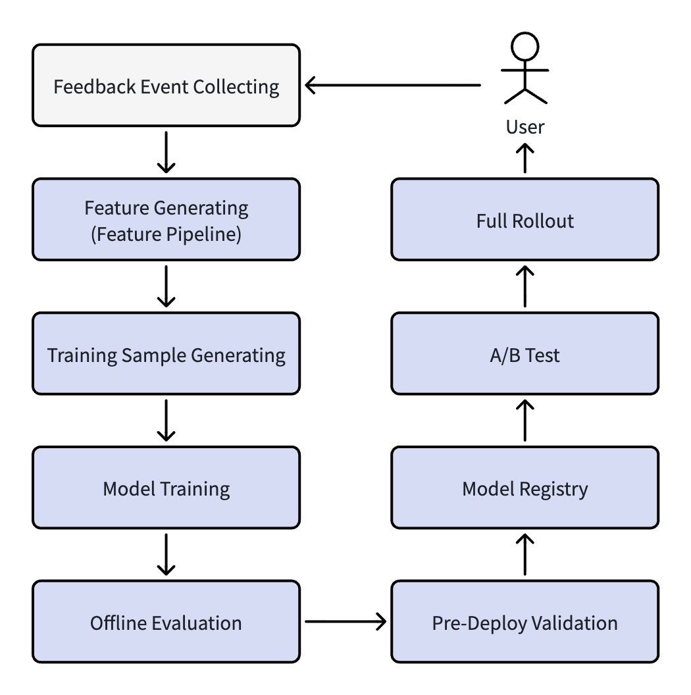
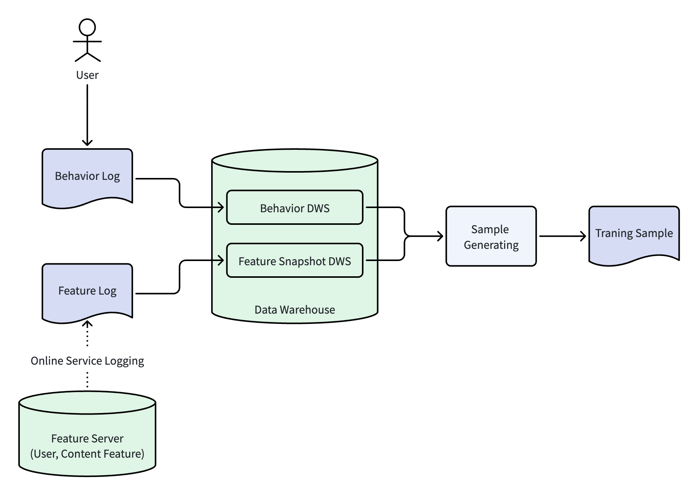
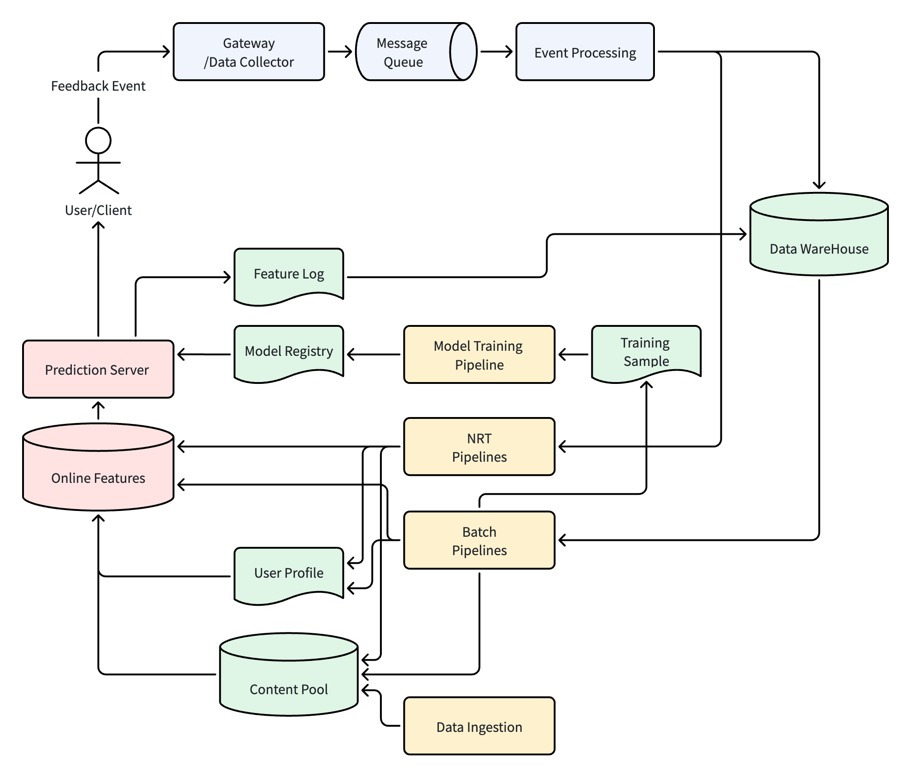

# 推荐系统架构（9）：模型训练流程，从用户行为到模型资产

## 1. 为什么需要模型训练

本系列第二篇《推荐算法的工程演进》，讲述了推荐系统所使用的算法，从最开始的基于规则推荐，逐步演进，经历 LR、GBDT、深度学习到大模型等阶段。最早期的推荐基于规则，完全依赖人工的经验，配置规则做内容分发。从 LR 算法开始，推荐进入机器学习时代，算法模型都是通过训练流程学习得来的。随着算法体系的升级迭代，从 LR 的线性模型，到 GBDT 的树形模型，到深度学习的神经网络模型，最后到现阶段的大语言模型，算法模型变得越来越复杂。随着模型复杂度提升，所使用的特征维度变得越来越大，训练模型所使用的数据量和计算能力都急剧上升。

算法模型迭代的过程，是推荐系统自主学习用户兴趣的演变过程。用户浏览内容产生的点击、停留、点赞、收藏等互动数据都是原始数据。通过模型训练流程，算法可以从这些海量的原始行为中挖掘用户的真正兴趣，从这些零散的原始数据中学习，提升系统的推荐能力。

本篇文章，我和大家一起探讨模型训练的整个流程，看看这些原始的用户行为数据，是怎么一步一步的转换为模型数据，沉淀为模型资产，提升系统的智能化程度。本篇文章更多从工程角度出发，而不会深入讲解模型算法的原理和公式。

## 2. 模型训练整体流程

从用户行为到模型产出上线，整体流程可概述为：


用户浏览产生行为反馈日志，收集上来存储在数据仓库（Data Warehouse）中（参考第六篇《用户反馈系统》）。然后经过特征 Pipeline 处理，生成相应的特征（参考第7篇《特征 Pipeline》）。而后进入我们本篇即将要介绍的模型训练和发布的各个流程环节中。下面简单列举一下各环节的主要功能：

- Training Sample Generating，训练样本生成。把行为日志和用户、内容、上下文等特征进行组合，生成模型训练所需要的正负样本数据。
- Model Training，模型训练。根据样本数据，运行相应流程，训练生成可用于线上推理的模型。
- Offline Evaluation，离线评估。模型训练出来之后，经过线下评估，确定新模型在历史数据上的模拟效果优于当前线上模型，才能进行上线测试验证。
- Pre-Deploy Validation，部署前校验。离线评估之后的模型，正式发布之前需要经过一系列的校验，这样可以提前拦截一些隐性模型问题。
- Model Registry，模型注册。模型正式发布到模型管理平台，线上系统可以从管理平台拉取对应模型进行推理。
- A/B Test，A/B 实验。发布之后的模型，可以在线上划分小流量开始做实际验证，验证结果良好之后逐步扩大流量。
- Full Rollout，全流量发布。多阶段 A/B Test 结果都符合预期，可以把模型发布到全流量上，让所有用户都使用最新模型。

全流量上线新模型之后，用户产生行为反馈，收集上来可以做指标观察，看最终的效果是不是符合预期。有了行为反馈数据，又可以开始新一轮的模型训练流程。后面的章节将对这个流程各个环节展开描述。

## 3. 样本生成

用户行为反馈日志经过特征 Pipeline 加工，会产生用户特征、内容特征、交叉特征和上下文特征的数据。结合用户的行为，就可以产生在一份特定特征组合下用户是否做了某个行为的数据，这份数据就是样本。

### 3.1 什么是样本

**样本的基本结构**

一条样本用结构化的方式来描述用户的行为，作为模型学习的输入，它的形式基本由两个部分组成：

- 特征部分（Feature）：描述这条样本发生条件，可以包括用户特征（用户 ID、年龄性别、兴趣标签、行为序列等）、内容特征（内容 ID、分类、关键词、其他特征等）、交叉特征（例如用户对该分类历史点击率、用户对该作者历史点击率等）、上下文特征（请求时间、设备类型、网络环境、页面位置等）。
- 标签部分（Label）：表示用户实际的动作，也就是模型要预测的目标。例如是否点击某篇文章。

**样本标签（Label）**

样本标签是模型要预测的目标，有以下几种：

- 二分类标签：例如 CTR 预估模型采用“是否点击”，1-点击、0-未点击。其他的还有是否点赞、是否收藏等。
- 数值类型标签：保留原始数值。例如停留时长（秒）、播放进度（0 ~ 1）、观看时长等。

**多目标样本**

如果一条样本只用来预测 CTR，那么它的标签就是“是否点击”（1/0）。但现代的推荐系统大多数都是多目标联合优化，既预测点击率，也预测停留时长，其他还有点赞、收藏、转发等等。多目标模型和单目标的样本，前面特征部分完全一样，只是在最后的标签部分是多个维度的组合值。例如，一条多目标模型样本的标签可能是：

```JSON
{
"click": 1,
"like": 1,
"favorite": 0,
"comment": 0,
"duration": 47
}
```

表示用户点击了这条内容，也有点赞行为，但是没有收藏和评论，文章阅读停留了 47 秒。多任务学习的网络结构（例如 MMOE、PLE 等）可以根据多个目标进行联合优化。

**正负样本**

前面介绍过，一条样本的标签表示了用户的行为。如果用户发生该行为，就是正样本；如果没有对应行为就是负样本。对于 CTR 预估来说，曝光之后有点击就是正样本，曝光之后没点击就是负样本。此时需要注意未曝光内容不能作为负样本，因为未曝光内容没有进入用户决策范围。

在实际的系统中，正样本的比例会比负样本稀疏很多，例如一篇内容点击率通常在 1% ~ 5% 之间，也就意味着正样本占比不到 5%。后面我们再详细讨论负样本采样问题。

### 3.2 样本生成流程

下面是一个样本生成的简化流程图：



- 首先是用户产生的行为日志，同步到数据仓库之后，根据 request_id，可以把一个用户对一篇内容的行为都串联起来，形成 DWS 层的用户行为宽表。
- 在线服务在响应用户推荐请求时，从 Feature Server 中获取用户、内容特征，然后进行推荐计算，得到最终的 item 列表。此时，在线服务需要把这些特征快照和结果记录到 Feature Log 中。Feature Log 也同步进数据仓库，经过处理，形成 Feature Snapshot 表。
- 样本生成 Pipeline，读取用户行为宽表和 Feature Snapshot 表，根据 request_id/trace_id 把用户行为和特征进行拼接，形成样本数据。每一条样本的结构如前所述。

> 为什么一定需要记录 Feature Log？因为 Feature Log 保存的是**请求发生时真实参与排序计算的特征快照**，而不是重新离线计算得到的最新特征。


### 3.3 一个示例

本节我们通过一个具体的例子，来展示一下怎么通过用户行为日志逐步计算变换为样本的过程。注意一下，以下的用户特征、内容特征都进行简化，只取一部分，并且暂时忽略交叉特征。

用户 U1、U2，属性：

| Uid   | Age | Gender     | Interests       |
| ----- | --- | ---------- | --------------- |
| 10001 | 25  | F - Female | Fashion, Beauty |
| 10002 | 29  | M - Male   | Sports, Tech    |

然后有五篇文章，属性如下：

| Item id | Feature           |
| ------- | ----------------- |
| D1      | Fashion, Outfit   |
| D2      | Sports, World Cup |
| D3      | Beauty            |
| D4      | Tech, AI          |
| D5      | Travel            |
在线推荐时，把 D1、D3、D5 推荐给 U1，D2、D4、D5 推荐给 U2。推荐时产生 Feature Log，例如：

```JSON
{
	"request_id": "r0001",
	"trace_id": "t0001",
	"user_id": "U1",
	"item_list": ["D1", "D3", "D5"],
	"user_feature": "U1, 25, F, Fashion, Beauty",
	"item_feature": {
		"D1": "Fashion, Outfit",
		"D3": "Beauty",
		"D5": "Travel"
	}
},
{
	"request_id": "r0002",
	"trace_id": "t0002",
	"user_id": "U2",
	"item_list": ["D2", "D4", "D5"],
	"user_feature": "U2, 29, M, Sports, Tech",
	"item_feature": {
		"D2": "Sports, World Cup",
		"D4": "Tech, AI",
		"D5": "Travel"
	}
}
```

用户对内容进行浏览，产生下面的行为：

| Time     | Event Type | Request ID | Trace ID | User ID | Item ID    | Device | Extra |
| -------- | ---------- | ---------- | -------- | ------- | ---------- | ------ | ----- |
| 11:00:00 | IMPRESSION | r0001      | t0001    | U1      | D1, D3, D5 | Phone  |       |
| 11:00:01 | CLICK      | r0001      | t0001    | U1      | D1         | Phone  |       |
| 11:00:02 | LIKE       | r0001      | t0001    | U1      | D1         | Phone  |       |
| 11:00:47 | DWELL      | r0001      | t0001    | U1      | D1         | Phone  | 46    |
| 11:01:01 | CLICK      | r0001      | t0001    | U1      | D3         | Phone  |       |
| 11:01:04 | FAVORITE   | r0001      | t0001    | U1      | D3         | Phone  |       |
| 11:01:39 | DWELL      | r0001      | t0001    | U1      | D3         | Phone  | 38    |
| 15:00:01 | IMPRESSION | r0002      | t0002    | U2      | D2, D4, D5 | Tablet |       |
| 15:00:03 | CLICK      | r0002      | t0002    | U2      | D2         | Tablet |       |
| 15:00:43 | DWELL      | r0002      | t0002    | U2      | D2         | Tablet | 40    |
| 15:01:03 | CLICK      | r0002      | t0002    | U2      | D4         | Tablet |       |
| 15:01:57 | DWELL      | r0002      | t0002    | U2      | D4         | Tablet | 53    |

> 表格中：IMPRESSION 表示曝光、CLICK 点击、LIKE 点赞、DWELL 停留、FAVORITE 收藏。

以上的行为日志，根据 RequestID/TraceID 和 Feature Log 进行 Join，可以获取到当时的 User Feature、Content Feature 快照，然后生成如下的样本数据：

| User Feature               | Content Feature       | Contextual Feature | Label         |
| -------------------------- | --------------------- | ------------------ | ------------- |
| U1, 25, F, Fashion, Beauty | D1, Fashion, Outfit   | AM, Phone          | [1, 1, 0, 46] |
| U1, 25, F, Fashion, Beauty | D3, Beauty            | AM, Phone          | [1, 0, 1, 38] |
| U1, 25, F, Fashion, Beauty | D5, Travel            | AM, Phone          | [0, 0, 0, 0]  |
| U2, 29, M, Sports, Tech    | D2, Sports, World Cup | PM, Tablet         | [1, 0, 0, 40] |
| U2, 29, M, Sports, Tech    | D4, Tech, AI          | PM, Tablet         | [1, 0, 0, 53] |
| U2, 29, M, Sports, Tech    | D5, Travel            | PM, Tablet         | [0, 0, 0, 0]  |

> 注：表格中 Label 顺序是：[是否点击、是否点赞、是否收藏、停留时长（秒）]

### 3.4 样本集合

全量的样本数据生成之后，一般会被划分三个集合：训练集、验证集和测试集。各集合的作用是：

- 训练集：这个集合占比最大，一般能占到全量集合的 70% ~ 80%，用于模型参数的学习，是模型参数的主要来源。
- 验证集：占比一般是 10% ~ 20% 左右，用来调整学习率、网络结构等超参数，通过早停等策略避免模型过拟合。
- 测试集：占比一般是 10% ~ 20% 左右，在模型训练完成之后，当成未知数据来验证模型的预测能力，这个集合不参与任何的参数调整。

**样本集合的划分**

样本集合划分一般按照 7:2:1 或者 8:1:1 的比例来划分训练集、验证集和测试集。一般划分的原则是：

- 分层抽样优先：不能直接对全量样本进行随机打乱拆分，那样会把时间序列打乱，带来时间穿越等问题。划分时候保证三个集合中，目标的正负样本分布、关键特征的分布基本对齐，避免样本失衡带来的训练评估失效。
- 时间维度拆分：切分时按时间流的先后顺序来进行，规避未来信息泄露，适配线上真实逻辑。

基于上面原则，一种可能的拆分方式是前7天数据用来训练、第8天数据做验证集、第9天数据做测试集。也可以把时间颗粒度拆分的更细一些，每个时间段按比例拆分三个数据集。也可以进一步在各集合中做分层校验，即按时间划分之后，再对每个垂直类型（科技、时尚等）做分层校验，保证三个集合分布基本一致。两种原则需要权衡，实际中优先保证时间顺序，再在允许范围内做分层校准。

### 3.5 样本生成中的几个经典问题

**数据泄露**

数据泄露是指在特征或标签里面无意带了“未来信息”，导致离线评估效果很好，但上线之后效果不符合预期。以下是几种典型场景：

- 特征穿越：例如使用曝光之后产生的特征来预测曝光时刻的标签，一个实际的例子就是用“用户当天总点击”作为特征来预测“用户是否点击一篇内容”，此时当天总点击包含了用户点击这篇内容之后的行为。这一类的问题的解决方案是在特征计算时，要按时间窗口严格切分计算周期，确保只使用窗口之前的数据。
- 全局统计混入局部：计算历史特征时，把当前样本本身也纳入统计范围。这样会导致“历史”统计的不准确，影响当前样本的效果。实际落地中，注意类似的计算要排除当前记录。
- 交叉样本泄露：同一用户的同一条行为，同时出现在训练集、验证集和测试集中的多个里面，这样可能导致模型最后效果虚高。

**负样本采样**

前面已经提到，在实际系统中，正样本占比通常比负样本低很多。如果使用全部的负样本参与训练，正样本信号可能会被“淹没”。并且全量的数据规模过大，会显著的拖慢训练速度。

所以在工程实践中，会对负样本进行采样，只保留一部分负样本参与训练，平衡正负样本的比例。一般负样本采样的策略包括：

- 随机采样：对所有负样本集合进行随机选取，例如采样20% ~ 50%，大部分场景都会使用这种方式。
- 困难负例采样：对那些模型容易判断成正例的负样本优先采样，例如用户滑过但没有点击的高相关度内容。这种策略能有效提升模型的边界区分能力，但实现起来比较复杂，需要在线挖掘或者通过中间模型来筛选。
- 混合采样：结合随机采样和困难采样，兼顾训练稳定性和边界精度。

负采样时需要注意一下几个问题：

- 采样倾斜：热门物品过度采样。
- 采样重复、样本膨胀。
- 信息无效负样本：例如用户本来就不感兴趣的样本。
- 负样本采样时机错误：不能先采样再划分样本，而是需要先划分集合，然后在内部进行采样。
- 隐式正样本丢失：例如只把点击当正样本，忽略停留、收藏、完播等正行为。

此外，采样的比例需要综合判断，不同行业的采样率可能不一样，通常需要结合业务特点和离线评估指标（如 AUC、LogLoss）不断调整，没有统一固定值。

**样本清洗和脏数据**

样本基于用户行为日志生成，在实际系统中，用户行为日志中可能会存在很多噪声和无效信息。对这些异常数据，如果没有经过清洗，模型学习时可能产生错误的映射关系，很可能会导致线上推理时效果发生异常。常见的脏数据包括以下类型：

- 机器人或爬虫流量：被机器人或者爬虫所爬取从而产生和真实用户行为明显不一样的流量，例如一秒内大量请求，或者有曝光，但没有点击、停留等。
- 异常设备和用户：例如测试机、模拟器产生的日志，这些日志产生的样本和正常用户行为不一致。
- 重复曝光：由于 SDK bug 或者网络异常重试导致的日志重复上报。
- 特征缺失或标签异常：某些样本中因为某种原因缺少必要的特征（例如用户特征），或者标签异常（例如停留时长为负数或者超长值）。
- 作弊数据：例如某些内容有明显的刷点击、刷播放量等行为。

对于这些脏数据，在实际工程落地时，一般采用多层次、多步骤的清洗，某些行为基于规则、某些类型基于统计、某些类型也可以基于模型检测。经过这些多层次的清洗，才能保证样本数据的正确性，从而让模型训练能学习到可信的规律。

**样本分布偏移**

样本分布偏移是指离线训练时的训练集、验证集和测试集，和线上实际情况分布不一致的问题。这个问题会导致离线评估时指标很好，但是线上效果不及预期。实际工程中，会有以下几类分布偏移情况存在：

- 样本选择偏差：样本都是基于已曝光内容生成，对于新内容或者长尾内容，存在很多未曝光记录，会导致模型对于这些新内容和长尾内容预测不准。
- 流行度偏差：热门内容的行为反馈能占总日志的90%（经验值），这样会导致模型训练时，热门内容的学习度高，推荐时也会倾向热门内容，加剧马太效应。
- 用户分层分布偏移：高活跃老用户的数据居多，新用户和不是那么活跃的用户数据偏少，最后导致数据分布和实际不一致。
- 场景垂直类别分布偏移：有些垂直类别数据占比比较高，其他类别数据偏少，从而导致模型在多类别上的表现参差不齐。
- 时间分布偏移：工作日和周末、节假日和平时、大促或热点爆发，这些不同时间段内的行为表现会不一致，如果训练集、验证集和测试集划分不好，会导致模型无法适配不同时间段的用户偏好变化。

要解决这些分布偏移的问题，可以采用的办法包括（参考第六篇《用户反馈系统》7.2节）：曝光采样约束，保证样本的采样分布和线上一致；IPS逆向加权，修正低曝光和长尾内容分布偏差；分层采样新内容和长尾内容样本，补充数据缓解不均衡；冷启动机制，小流量随机分配给未曝光和冷门内容，构建更多样本数据。

## 4. 模型训练（Model Training）

样本数据生成之后，下一步就是模型训练。简单来讲，模型训练就是让算法从海量的样本中学习到特征到标签之间的映射规律，最终产物是一个模型文件。下面我们就把模型训练流程中的一些问题详细讨论一下。

### 4.1 训练框架

算法模型从 GBDT 树模型、到深度学习模型、到现在的 LLM 大模型，不同的模型有不同的训练框架。

**GBDT 树模型**

树模型框架主要有 XGBoost、LightGBM 等代表。其中 XGBoost 通过二阶泰勒展开提升拟合精度，内置正则化与缺失值自动处理能力，适用于精度要求严苛的小样本场景。LightGBM 支持分布式训练、GPU加速，可以支持海量的结构化数据，是电商推荐、广告 CTR 预估等场景下主力训练框架。

**深度学习模型**

深度学习的训练框架有 PyTorch、TensorFlow 和基于 TensorFlow 封装的 Keras。其中 PyTorch 有灵活的动态图调试能力和完善的生态支持，是目前业界主流的训练框架。TensorFlow 核心优势是静态图，在一部分大规模分布式训练中使用，亮点在于高可靠的生产部署能力。Keras 有极简的 API 设计，非常适合算法原型的快速验证。

**LLM 大模型**

LLM 在推荐系统中的应用还处于探索阶段，目前业界典型案例一般用于部分模块而不是全链路中。至于大模型的训练框架，目前业界主流组合是 Megatron-LM + DeepSpeed‌，两者配合可以支持 3D 并行、ZeRO-Infinity 等技术，能高效完成千亿级参数模型的分布式训练。国产的框架还有 飞桨3.0、Colossal-AI 等。

### 4.2 分布式训练策略

工业级的推荐系统训练数据都在亿级甚至百亿级别，单台机器基本上没有办法完成训练，所以分布式训练是业界主流。

分布式训练中首要的是并行，有数据并行和模型并行两种模式。数据并行是目前行业最主流方案，它是把海量的训练样本集拆分到多台机器上，每一台机器都会加载完整的模型和一部分训练集，然后每台机器计算梯度，最后汇总更新全局的参数。模型并行一般只用在超大模型的训练，系统把模型网络结构拆分到不同机器，每台机器负责一部分网络层计算。

接下来是参数更新模式，有同步更新和异步更新两种方式。Parameter Server 架构是异步更新方式，这种架构有服务端和客户端，每个客户端负责独立计算梯度，异步上传到服务端更新参数。这种方式优势是容错性高，一个节点的故障不会影响整体的训练；缺点就是参数同步有延迟，梯度更新不是很精确。All-Reduce 架构是主流的同步更新方式，所有的节点统一计算然后统一进行梯度汇总并进行参数更新。这种方式优缺点和异步方式正好相反，优点是参数一致性高、模型收敛效果更好；缺点是容错性差。

### 4.3 训练核心流程

不管是树模型还是深度学习模型，模型训练的主循环流程都是基本一样的，都会有下面几个步骤：

- 第一步，数据加载。训练框架读取样本数据，然后对数据进行分片，按照固定大小构造 Batch 数据。Batch 大小是核心超参数之一，过小时会导致训练收敛缓慢，过大时会占用更多内存/显存。工程上会根据机器的配置、样本数量级来动态调整 Batch 大小。
- 第二步，前向计算（Forward）。把每一个 Batch 的特征输入到模型中，计算当前参数下标签的预测分数（例如 CTR 预估的概率值）。
- 第三步，损失函数（Loss）计算。对比上一步计算出来的模型分数和样本真实标签数据的损失函数差值。推荐场景常用的 Loss 函数有三种：LogLoss 适用于分类预估，例如 CTR、转化率预测；Hinge Loss 最大化正负样本差距，比较适合排序任务；MSE （均方误差）一般用于停留时长、播放量这种回归预测。Loss 越小表示模型计算和结果越接近。
- 第四步，反向传播（Backward）。根据 Loss 值，反向计算模型参数的梯度，确定各参数需要调整的方向和数值。树模型一般通过梯度直方图统计来实现反向传播，而 DNN 模型一般通过链式法则来完成。
- 第五步，优化器更新参数。优化器根据梯度更新模型参数。业界使用的优化器包括：SGD 随机梯度下降收敛稳定、泛化能力强；Adam 收敛速度快，适合深度学习模型；FTRL 适合处理高维稀疏特征，在线学习和大规模推荐训练中用的比较多。
- 第六步，快照（Checkpoint）。训练循环每隔固定轮次，保存当前最优模型权重、参数和训练状态（Optimizer 状态、Epoch、Learning Rate 等）。如果训练过程出现故障，可以加载最近快照继续训练，不用从头开始。

以上步骤反复迭代，到达预定的轮次（Epoch）或者验证集效果不再提升为止。最终输出模型文件，完成当前训练流程。

### 4.4 训练流程中的工程问题

上一节描述的是模型训练算法步骤，下面讨论一些训练流程工程中需要注意的问题。

首先是超参数调参的工程化。模型训练中有一些超参数需要调整，例如学习率、Batch 大小、网络层数、神经元数量等等。在实际训练流程中，这些超参数需要调整让模型训练能快速收敛。但这些超参数数量比较多，如果全部人工调整效率会很低，所以工业界有一些自动化超参数方法。超参数搜索主流策略有随机搜索和贝叶斯优化等。在工程实现方面，常用 Optuna 和 Hyperopt 等工具来自动管理超参数搜索流程。

其次是训练稳定性问题。实际工程中会经常出现训练不稳定情况，例如 Loss 突然变成 NaN、梯度爆炸、收敛速度异常等等。其中一些异常可能是因为异常数据（例如超长停留、特征全0等），这一类问题一般在数据加载环节做校验和过滤。梯度爆炸一般通过梯度裁剪来限制梯度最大值。其他的例如采用合理激活函数、残差网络结构等。

第三是 I/O 优化和显存管理。在大规模的训练场景下，I/O 和显存一般会成为瓶颈，所以要对 I/O 进行优化、对显存进行管理。I/O 优化主要策略就是 CPU 负责准备数据，GPU 负责计算，两者流水线执行。主要方法包括多线程预取、CPU 预处理、高性能存储格式等。显存管理比较麻烦，例如推荐模型的 Embedding 表可能有几十 GB 甚至上百 GB，远超单卡显存容量。这时需要采用 Embedding 分片和动态加载等策略。在实际系统中，一般会持续监控显存使用率，提前识别显存不足风险。

最后一个是训练中断和恢复。分布式训练任务有的可能需要运行几天甚至一周，机器和网络故障都可能让训练任务中断。因此如前所述，训练框架需要有定时保存快照（Checkpoint）的功能，任务重启之后可以加载快照恢复训练。工程实践中，还会结合 K8S 等容器编排的健康检查和重启策略。

模型训练完成之后，并不能直接上线，而是需要先通过离线评估验证模型在历史数据上的效果。

## 5. 模型评估（Offline Evaluation）

离线评估就是在历史数据上模拟一遍线上的预测过程，然后统计各种指标来衡量模型的能力。
### 5.1 离线评估指标

要评估模型的能力，需要使用未参与训练的线下数据集合，用模型打分，然后统计指标。模型预测的目标不一样，统计的指标也会不一样。下面介绍一些常用的离线评估指标：

#### 5.1.1 二分类目标

对于 CTR 预估、是否点赞、是否收藏等二分类的预测任务，模型输出的是一个 0 ~ 1 之间的概率，表示正样本发生的可能性。

**AUC（Area Under the Curve）** 是二分类目标最核心的指标。衡量方式：随机抽取一个正样本和一个负样本，模型给正样本打分高于负样本的概率。AUC 接近 1，表示模型的排序能力越强；0.5 就相当于随机猜测。在实际计算中，全量计算 AUC 的成本很高，一般会采用分桶等近似算法。在成熟推荐系统中，AUC 即使只有很小的提升，也可能带来可观的线上收益。

**准确率（Precision）和召回率（Recall）**。准确率是指模型预测为正样本的数据中，实际上是正的比例，例如预测 `D1,D2,D3,D4` 四个都是正样本，但实际只有 `D1,D2,D4` 三个是用户真正喜欢的，那么准确率就是 `3/4 = 75%`。召回率是指用户真正感兴趣的内容有多少比例被推荐出来。例如用户对 `D1,D2,D3,D4,D5` 五篇内容感兴趣，但结果只有 `D1,D2,D5` 被推荐出来，召回率就是 `3/5 = 60%`。

**F1 分数**。F1 分数是准确率和召回率的调和平均。公式为：

$$F1 = 2 \times \frac{Precision \times Recall}{Precision + Recall}$$

只有当 `Precision` 和 `Recall` 都比较高的时候，`F1` 分数才比较高。因为在实际系统中，如果单独优化 `Precision` 可能导致结果过于保守，而单独优化 `Recall` 可能会牺牲精度导致给用户很多不感兴趣的冷门内容。`F1` 分数引入可以在两者之间找一个平衡。

#### 5.1.2 回归类目标

如果模型预测目标是连续数值时，例如停留时长（秒）、播放进度（0 ~ 1）。这时候需要用回归任务的评估指标。

**MSE（Mean Squared Error，均方误差）** 是最常用的回归评估指标，它计算的是预测值和实际值之间差的平方的平均值。MSE 对异常值会比较敏感，如果某一个样本的预测值和实际值差别比较大，那么它的平方会放大差异，最终结果会变大。在某些场景下这个特点是优点，可以放大极端偏差，但也有可能导致评估结果被少量异常样本所影响。

**MAE（Mean Absolute Error，平均绝对误差）** 是另外一个常用指标，它计算的是预测值和实际值之间绝对差的平均值。相比 MSE，MAE 对异常值不那么敏感。在实际的工程中，一般会同时关注 MSE 和 MAE，一个反映极端偏差情况，另一个反映整体偏差水平。

在某一些场景下，还会使用 **RMSE（Root Mean Squared Error）**，也就是 MSE 的平方根。它的量纲和原始目标是一样的，更容易被业务方理解。例如在预测停留时长时，如果 RMSE 为 35 秒，也就是说模型的预测误差在 35 秒左右，业务方可以直接感受到这个偏差，确定在线上能不能被接受。

#### 5.1.3 多目标场景

现在的推荐系统大部分都是多目标联合优化的，例如一个模型会同时预测 CTR、停留时长、点赞率、收藏率等多个目标。对于这样的模型，评估时对每个目标分别采用对应类型指标，然后汇总展示。

举一个例子，假设一个模型同时预测：是否点击（二分类）、是否点赞（二分类）和停留时长（回归）。那么离线评估报告会包含三组指标：点击目标的 AUC、Precision、Recall、F1；点赞目标的 AUC、Precision、Recall、F1；停留时长目标的 MSE、MAE。

在多目标场景下，还需要注意多目标之间的权衡关系。有时候优化一个目标可能会牺牲另外一个目标，例如提升 CTR 可能会因为标题党而降低停留时长。所以一般多目标评估时不能只看单个指标，而是需要综合观察所有目标的指标变化。通常做法是设定一个主目标（例如停留时长）作为核心标准，观察其他目标指标有没有明显退化。

### 5.2 离线评估的基准和对比

离线评估指标需要对比才有意义，一般是把要评估的新模型和当前线上全流量模型，在同样的测试集上进行评估，对比各项指标。

此外还需要注意长短期指标的平衡。例如有一些模型对短期目标 CTR 提升比较明显，但可能因为过度迎合用户的即时兴趣，会导致推荐的多样性下降、长期用户留存受影响。这一类问题在离线评估时很难完整发现，但可以分析一些辅助指标，例如推荐列表的类别覆盖、内容新鲜度等数据，作为风险提示。

### 5.3 离线评估的陷阱

**离线指标提升不等于线上一定提升**，这是推荐系统工程中大家都有的共同认识，离线评估的效果很好，并不等同于线上效果一样好。很多因素都可能导致离线评估和线上效果产生偏差，下面列举几类常见的情况。

**离线数据和在线流量的分布差异**。离线评估用的是历史数据，历史数据中的用户、内容、上下文分布和线上的实际流量分布会存在差异。还有节假日和日常工作日、热点事件爆发和平时等不一致，都可能改变内容的互动分布。还有模型上线之后，推荐结果变了，也可能改变内容的分布，从而导致后续用户互动分布发生变化。这些分布差异，都可能让离线评估和在线效果产生偏差。

**离线特征和在线特征不一致**。 模型训练用的是 Feature Log 记录的特征快照，在线推理用的是 Feature Server 中实时特征。在离线在线特征计算逻辑一致前提下，线上的实时特征也会和历史快照不一致，从而导致推理时特征分布和训练时不一致，模型效果不能保证完全一致。

**离线指标无法反映真实用户交互**。模型训练和离线评估都是用的历史数据，不能模拟用户看到推荐结果之后的真实反应。用户可能看到同类内容产生疲劳而不愿再点，也可能因为同样内容在不同时间、不同心情下点击意愿不一样。这些复杂的因素，在离线评估中完全体现不了。

举一个例子，现在是世界杯开赛期间，有很多相关的内容，互动率都很不错。基于这些行为进行的模型训练，会把世界杯相关内容权重提的比较高，离线评估的指标也非常不错。然后模型上线，但恰逢世界杯结束，热度过去之后模型的表现会越来越差。这就是一个典型的离线评估和线上效果产生偏差的例子。

此外，离线评估一般只关注单条样本的预估准确性，而没有办法评估整个列表的多样性和探索性。例如一个完全推送热门内容的模型，离线 AUC 可能并不差，但线上会因为缺乏多样性而让用户快速流失。

离线评估是一个让模型通过的门槛，但不是一个模型成功的保证。通过了离线评估之后，模型初步具备上线条件。然后后续会通过标准化的模型管理和前置校验，确保模型从离线环境平稳过渡到线上环境。

## 6. 模型发布（Model Registry & Deployment）

模型从离线训练到在线使用，中间存在一个发布的过程，也就是通过前面说的离线评估之后，通过一定的流程将模型部署到线上环境。

### 6.1 模型注册

模型发布最重要的是模型管理，一个团队同时在维护的模型会有十几个甚至到上百个。它们可能会用在推荐全链路的各个环节中，也可能会有多个不同的版本。对于这么多的模型，系统需要一种方法对它们进行管理。

Model Registry（模型注册）管理平台是推荐系统中心化的一个服务，统一管理所有模型的元数据。模型注册中心是线上服务能拉取到模型的基础。

一般来说，模型注册中心会保存模型的信息有：模型名称、模型版本、模型类型（树模型/深度学习模型/多目标模型等）、适用场景（例如首页列表推荐召回、精排等）、训练时间、迭代说明、模型权重文件、模型配置、依赖特征列表、离线评估报告（AUC/F1/MSE等）、超参数配置等。除了这些元数据之外，注册中心还要管理模型的生命周期状态，例如待上线、A/B Test 中、全量上线、下线、归档等。

我之前经历过的最早的推荐系统开发，没有成熟的模型注册管理平台，那时候使用一个专用的 Git Repo 来记录模型发布信息。Git Repo 中有一个共享的模型登记表，记录前面所述的元数据，然后一个专门的模型目录存放模型的文件、配置、参数等等。上线时，把对应的模型文件上线到 Prediction Server（在线打分服务，后续会有专门章节介绍）机器上，供 Prediction Server 本地加载。

随着技术的发展，后续有比较多成熟的模型注册方案出现。开源方案中，MLFlow Model Registry 和 Kubeflow 的 ModelDB 是比较常见的选择。而大型的互联网公司，一般都会基于自己业务需求来定制开发合适的模型注册中心。不管什么方案，模型管理的目的和存储数据，都和本节前面说的差不多。

有了模型注册中心，线上效果如果出现异常，就可以快速的回溯到这个模型的元数据，找到它训练的时间、所使用的特征、训练代码和样本数据快照等等。这种方式能很大程度上节省查问题的时间。

### 6.2 发布前校验（Pre-deployment Validation）

将模型正式发布到线上环境之前，还需要经过发布前（Pre-Deploy）校验。离线评估时评估了模型的算法能力是不是满足上线条件，而 Pre-Deploy 校验，是看模型适不适合在线上运行。常规的校验包括：

- **模型合法性校验**：校验模型的文件大小和线上的区别有多大，如果差距太大需要检查是不是有错误，还是真的大小变化很多。然后用线上代码加载一下模型看看是否加载成功，输入输出的数据是不是正常等等。
- **特征的分布校验**：静态再检查一次特征是否一致，然后可以通过 Shadow 流量，把线上流量引过来用待部署模型计算一遍，分析特征和打分的分布，和线上基线做 PSI 比较看是不是一致。
- **推理性能校验**：根据上面说的 Shadow 流量打分，统计每次请求的 P99 耗时和平均耗时，和线上对比看是不是差距不大。如果耗时增加，需要检查增加的是否合理？如果合理，则需要计算线上服务容量，看是否需要扩容。

## 7. 在线验证（A/B Test）

模型完成发布后，就可以开始在线上测试效果，一般会采用 A/B Test 的方式，逐步增加流量，测试模型在不同流量下表现。A/B Test 验证模型效果，就是灰度发布的过程。

### 7.1 灰度发布流程

灰度发布，一般都是从小流量开始，因为如果出现问题，可以快速回滚，缩小用户影响的范围。一个典型的灰度发布流程，流量放量过程可能是：

```
Deploy -> 1% -> 5% -> 10% -> 20% -> 50% -> 100%
```

最开始，在线上划分两个流量桶（Bucket），线上基线模型在 Bucket A，新模型在 Bucket B。每一个 Bucket 都分配 1% 的流量，然后运行一段时间，对比两个 Bucket 的指标，这个过程叫 A/B Test。

1% 流量的阶段主要是用于测试模型的系统层面问题，例如推理延迟、错误率、资源占用率等是否有异常。然后后续的 5% ~ 20% 阶段，是为了验证在不同流量下业务指标的变化，观察新模型 Bucket 中，核心指标（CTR、停留时长等）有没有提升。当新模型放量到 50% 时，A、B 两个 Bucket 各占 50% 流量，整个线上流量实际上已经全部参与了实验，这是最后确认新模型指标无误的阶段。最后完成 100% 全流量发布，新模型替换原来的基线模型。在实际的操作中，全流量发布新模型之后，会保留一个 Reverse Bucket，即保留一小部分流量继续运行旧基线模型，作为长期对照组，用来持续观察新旧模型的长期指标变化。

每一个流量阶段持续的时间，一般按业务规则来确定，主要的原则是要观察足够长的时间（小流量一般至少24小时、大流量一般三天起），累积出足够的业务指标来对比。下面我们说一下 A/B Test 的表现怎么来判断的。

### 7.2 A/B Test 指标判断标准

A/B Test 的判定，一般会把相关指标分成主要指标、辅助指标和长期指标。

在早期的资讯类推荐，一般以点击率为目标，所以会把 CTR 当成主要指标，然后停留时长、点赞、收藏等作为辅助指标。现在的内容推荐，一般都不追求 CTR 了，主要指标一般都是选取停留时长、播放时长作为主要指标，点击率、点赞、收藏等作为辅助指标。而长期指标一般选取内容的多样性、次日/7日留存率、长尾内容覆盖率等能增加用户体验的指标。

对于 A/B Test 效果的判定标准，主要是保证核心指标明显正向提升、辅助指标没有明显负向退步、长期指标平稳或有提升。例如在现在的推荐系统中，如果只是 CTR 上升，但停留时长、留存率下降的情况，不能判定这个新模型对用户体验有提升。

除了业务指标之外，还需要关注一些系统指标，例如请求延迟（Latency），如果增加太多，SLA 得不到保障；错误率（Error Rate）如果太高，用户体验会下降。

> 注：Error Rate 过高，一般都会导致用户看到 Fallback 内容，个性化体验会下降，从而影响业务指标。所以在观察业务指标下降时一部分原因可能就是 Error Rate 升高。

### 7.3 回滚机制

在灰度放量的过程中，如果出现了服务异常、业务指标显著降低，需要立刻进行回滚（Rollback）。此时新模型和基线模型都在线上服务，回滚只需要把分配给新模型 Bucket 的流量变为 0 即可。

回滚之后，需要分析问题出现的原因是什么？区分模型训练问题、还是部署问题、或者是业务场景变化等等。找到问题之后再修复、上线继续 A/B Test。如果连续出现问题，那么这个模型可能需要重新设计并评估。

本章简单介绍了一下 A/B Test 的一些方法和流程，具体的线上实验框架和更多细节问题，后面规划了专题文章来介绍，敬请期待。

## 8. 模型训练的发展趋势

回顾前面的模型算法发展过程，从 LR/GBDT 到深度学习再到大模型。每一次算法的升级，模型训练流程都随之发生很大变化。目前行业有几个发展趋势：

- **训练和推理一体化（MLOps）**：在以前训练和推理是两个环节，一般都是不同的团队负责，代码开发也是独立的。模型从训练到上线这个流程一般需要几天甚至一周以上时间。现在的发展趋势，用 MLOps 理念把整个流程，从数据准备一直到发布监控各个环节，整合成一个自动化流水线。

- **在线学习和增量训练代替全量训练**：以前的训练都是全量数据、批量训练。随着用户兴趣的变化加快（特别在短视频和资讯类场景），在线学习和增量训练开始被广泛使用，也就是在全量模型基础之上，用一天的数据做参数更新。还有的更激进，仿照 NRT Pipeline，采用流式训练（Streaming Training），把模型从以前的天级更新变为分钟级更新。

- **多目标联合训练成为主流**：最早的推荐以 CTR 为主要目标进行优化，然后发展到停留时长，现在基本都是多目标（CTR、停留时长、点赞、收藏等）联合优化训练。模型训练从以前的单任务转向 MMOE、PLE 等多目标网络结构。多目标联合训练，要求样本标签多维度、损失函数要设计多目标加权、离线评估也要综合所有目标。

- **大模型（LLM）深度融合到推荐流程**：现在 LLM 在推荐系统的应用更多是生成更丰富的用户兴趣和内容语义特征来提升推荐效果。一个发展趋势是把 LLM 本身作为推荐模型的一部分参与推理。这种趋势对于模型训练要求更高，首先训练数据规模可能会上升几十倍甚至百倍，计算资源和分布式训练能力都要求更高；然后是训练之后的模型需要优化（量化、剪枝、蒸馏）来让线上推理延迟变得更合理从而减小线上资源消耗。

总结一下，现在的模型训练发展目标是实时化、自动化和更大规模化，工程师的角色也从以前的手工调参，转变为现在设计自动化策略和搭建更好的训练架构。

## 9. 总结

本篇文章主要讲了模型训练的整个流程，对其中的一些细节做了讨论。到本篇为止，全部的离线系统部分基本就讲完了，相关的数据资产也陆陆续续介绍完了。我们再来回顾一下这张图：



整个数据资产流转形成一个闭环：

```
内容资产 -> 推荐给用户 -> 反馈数据 -> 特征 -> 用户画像 -> 样本数据 -> 模型 -> 再次推荐
```

每一个步骤，都是积累更多的数据到对应资产中，让系统的内容资产变得更丰富，对内容的理解和表述更详细；特征资产变得维度更多、数据量更大；用户资产中画像内容细节变得更详细，更好的理解用户；样本资产特征变得更多、标签变成组合、数据记录累积更多；模型资产中模型变得更复杂，预测的方法变得更智能。整体的过程，都是让推荐系统变得更智能化，给用户推荐更多体验更好的内容。

下一部分，我们将进入推荐系统的在线架构，看看这些离线产出的数据和模型，是如何在毫秒级完成一次真正的推荐请求。

