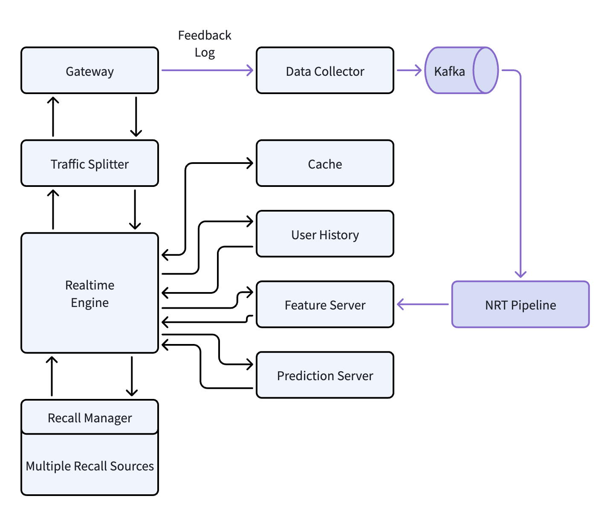
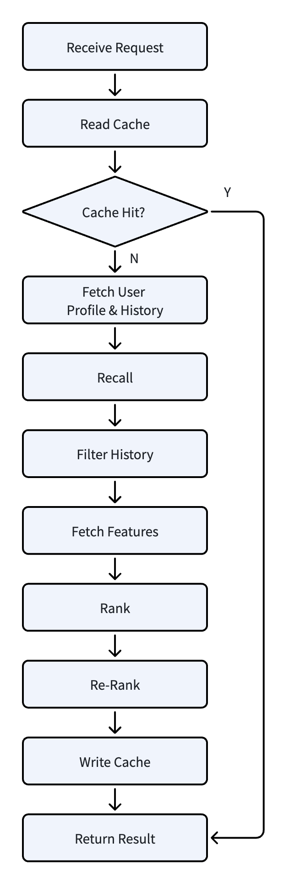

# 推荐系统架构（10）：在线系统总览，100毫秒内完成一次推荐

## 1. 总体架构

前面的系列文章，从第4篇《离线系统总览》一直到第9篇《模型训练流程》，我们把整个离线系统主要的模块都介绍完了。离线系统这个生产工厂把数据加工好之后，要把它展现给用户，接下来就需要在线系统发挥作用力。

在线系统收到用户的请求，需要在百毫秒级别的时间内，完成检索、排序、过滤等一系列动作，从海量的内容中，找到用户感兴趣的一批结果。同时，系统还要支持千万日活，保证 7x24 小时的稳定运行。所以在线系统的核心诉求有三个：低延迟、高吞吐、高可用。这些核心诉求对整个系统的架构设计提出了极高的要求。下面我们来看一个典型的推荐系统在线架构：



整个在线系统的主要设计思路是模块化、分层解耦，每个模块负责其自身的功能。在上面这个架构中，链路中的模块包括：

- 网关层 Gateway
- 流量分流层 Traffic Splitter
- 实时推荐引擎 Realtime Engine
- 多路召回系统 Recall Manager & Multiple Recall Sources
- 精排服务 Prediction Server
- 特征服务 Feature Server
- 缓存体系 Cache
- 数据闭环 Feedback Loop

这些模块的职责相互独立，支持独立的部署扩容、独立的迭代发布、独立的性能优化等。这样可以保证整个在线系统在高并发场景下的服务稳定性和响应速度，并且也保障系统的可维护性和迭代效率。

下面，我们将对各模块展开做介绍，让大家了解每一个模块的功能是什么，其中包含的一些设计思想是什么。本文最后还会将这些模块统一串联起来，让大家对完整的推荐链路有更清晰的认识。

## 2. 网关层 Gateway

网关是推荐系统的流量入口，客户端的所有请求，包括推荐请求、数据上报等，都经过网关处理。所以这一模块，是保证整个系统安全、统一链路的第一道关卡。网关层本身不参与推荐相关的业务逻辑，只处理流量相关的事务，它的主要功能包括：

**请求接收**

作为推荐系统的统一入口，网关接收来自客户端（App、小程序、网页等多端）请求，屏蔽客户端和后端业务的直接连接。网关还处理连接池管理、长连接会话、超时熔断等流量层面的逻辑。

**权限鉴权**

请求在进入后续业务链路之前，网关会完成该请求的统一权限校验。最简单例如在请求中添加签名，网关通过签名校验是否有效。其他的可以通过 JWT Token、设备标识等验证用户身份合法性。有的推荐系统网关还会对接权限中心，校验当前用户是否有权限访问对应场景推荐，防止越权访问敏感数据。

**请求路由**

根据规则，把不同的请求转发到不同的后端服务。例如推荐请求转发到 Traffic Splitter，数据上报请求转发到 Data Collector，实现不同流量的隔离。

**协议解析和适配**

兼容客户端或可能的第三方服务等各类请求，完成协议的解析。例如，客户端可能使用 HTTP/HTTPS，第三方服务端请求可能是 RPC 协议。网关负责将这些请求协议统一转换成后端服务的 gRPC 或 Dubbo 等内部协议，从而实现客户端协议和内部协议解耦。协议解析的同时，网关还会完成参数校验、缺失参数补齐等工作，把请求转换成标准统一格式。

**流量控制和熔断**

网关在入口层实现全局限流和熔断能力，可以在 API 级基于 QPS 限制最大请求量，对于突发流量、异常请求能快速进行拦截，防止这些请求打垮后端的业务模块，保证核心服务的稳定运行。也可以按用户的维度进行限制，避免恶意用户或伪装的机器流量高频访问占用系统资源，保障其他大部分用户的正常请求响应速度。

**结果压缩和返回**

网关根据客户端的能力，可以把推荐结果数据选择合适的算法进行压缩，降低网络传输时间，提升用户体验。网关还会统一封装返回结果的格式，自动填充公共字段、状态码等，保证各端获取到的响应格式一致。

**全链路跟踪**

网关作为全链路的起点，收到用户请求之后，会生成唯一的 Trace ID，透传到后续的所有业务模块。网关在处理推荐请求时，还可以记录请求到达时间、处理时间、客户端 IP、设备信息等，和 Trace ID 一起写入日志。业务模块记录日志时需要记录 Trace ID，后续排查链路的请求异常、推荐效果异常等，都可以根据 Trace ID 来串联全链路的各种日志，提升排查的效率。

> 注：现在业界有一些推荐系统，因为日活太大，上报请求量非常大。这些系统会把数据上报链路独立出来，由独立域名独立服务来承接。这样做的目的是为了保障推荐请求的链路稳定，让数据上报的海量流量不对主业务流程产生影响。本文采取单一 Gateway 的设计方式，推荐请求和数据上报都经过同一入口。

网关层的具体工程实现，可以采用 Nginx 或者 Apache APISIX 这类高性能网关。依托于事件驱动的异步非阻塞模型，这类网关单机可以很轻松的支撑到 10 万级别 QPS。业务上，它们都支持扩展（Lua 或 WASM 插件），可以把鉴权类业务很方便集成进来。此外，这类网关天然集成了限流熔断、Gzip 压缩等功能，能很好满足上面所介绍的网关需求。除了这类 C/C++ 系网关，还有 Java 生态响应式网关（例如 Spring Cloud Gateway）、云原生 Sidecar 类网关。

## 3. 流量分流层 Traffic Splitter

Traffic Splitter 是推荐系统的流量调度和实验入口，它承接 Gateway 转发过来的推荐请求，在模块内完成流量治理、实验参数填充、容灾兜底等操作。Traffic Splitter 是连接 Gateway 和后面的推荐业务模块的中转站，核心功能包括：

**流量复制和镜像**

Traffic Splitter 支持将线上的真实流量复制到其他环境，例如测试环境、Canary 环境等。这些复制的流量一般可以用于功能测试、性能测试、模型验证等。流量的复制都是异步进行，不影响正常推荐流程。

**多场景流量控制**

一般一个推荐系统会支持很多场景（例如平台首页、详情页、推荐流等）的推荐业务，也可能支持第三方请求。Traffic Splitter 针对这些多场景需求，分场景进行流量的隔离以及流量配比，保障各推荐场景的数据正确性以及业务稳定性不受其他场景所影响。

**实验参数填充**

Traffic Splitter 集成实验框架，根据预定义好的规则，例如用户 Hash 或其他规则，把当前请求划入到对应流量 Bucket 中。然后从实验框架配置中，读取这个流量 Bucket 对应的参数，包括模型配置、Feature 列表、其他实验参数等等，连同实验 ID、实验版本等元数据填入到请求的上下文中。这些上下文数据，会一直透传到后续的所有模块，实现 A/B Test、灰度放量等操作。

**容灾兜底**

Traffic Splitter 作为推荐流量入口，如果它发现后面的 Realtime Engine 返回错误或者响应超时，那么将触发降级策略。也即是，推荐引擎没有返回动态推荐结果的情况下，Traffic Splitter 将给用户返回静态兜底内容，保证用户端能收到结果，尽量保证用户的体验。但降级内容体验还是不如动态推荐结果，Traffic Splitter 触发降级时需要记录日志，并在降级率超过阈值时进行告警。

本节对 Traffic Splitter 的核心功能做了大概介绍，后续安排了专题文章，对更多的细节进行介绍，包括流量复制、实验框架等工程细节。如果有人对这部分感兴趣，可以关注后续发布的文章。

## 4. 实时推荐引擎 Realtime Engine

Realtime Engine 是推荐系统的中控调度模块，从这个模块开始也正式进入推荐系统的核心业务。Traffic Splitter 已经根据流量 Bucket 配置，把相应的参数填入到上下文，Realtime Engine 将根据这些参数，开始编排整个推荐流程。

所以 Realtime Engine 本身不负责召回、排序的具体计算，它只负责动态编排流程，协调链路中各模块的有序工作。

Realtime Engine 把推荐链路看成一系列可配置的步骤（Stage），每个 Stage 对应一个独立的业务逻辑处理单元，整个流程参考如下：



从图中可以看出链路中 Stage 可以包括：读取缓存、获取画像、多路召回、过滤、特征获取、排序、重排、写入缓存等。这些 Stage 有一些代码是直接在 Realtime Engine 中实现，有一些 Stage 是调用下游服务完成。

分 Stage 设计的好处包括：

- **灵活可配置**：不同的场景（首页推荐、相似推荐、热门流等），可以配置不同的 Stage，例如热门流可以配置不需要获取用户画像、首页推荐需要全部 10 个召回源等。这种配置只需要写入到场景、实验参数配置中，不需要修改代码。

- **便于监控**：每个 Stage 的指标，例如耗时、成功率、返回数据量等都可以单独统计并上报，便于后续定位链路的瓶颈。

- **多级降级**：当某些 Stage 发生故障时，如果不是核心步骤，可以跳过或者使用默认值，进行降级返回，保证用户体验。

关于 Realtime Engine 更多的设计和工程落地细节，后面也规划了专题文章进行探讨，如果对这部分感兴趣，敬请关注。

## 5. 多路召回 Multiple Recall

召回模块是推荐系统的候选内容筛选入口，它的目标是从海量的内容池中，快速筛选出一个和用户相关、数据量相对较小的候选集合，供后续的精排模型进行打分。一个推荐请求全流程一般在百毫秒级别返回，因此留给召回阶段的时间一般在 20 ~ 30 毫秒左右。所以召回阶段一般需要在效率和覆盖率之间找一个平衡点。为了达到这个目标，目前业界推荐系统一般都是采用多路召回同时进行。
### 5.1 多路召回源

多路召回是从多个召回源中同时取数据，能保证覆盖率和多样性尽可能的高，并且耗时不会太长。常见的召回源包括：

- **兴趣标签召回**：根据用户画像中的兴趣标签（长期兴趣、短期兴趣），从内容池中匹配类似的内容，这是推荐系统最基础召回源。

- **ANN 向量召回**：根据用户和内容 Embedding 向量进行近似最近相邻搜索，这样可以挖掘隐性兴趣匹配，是目前业界最常用召回源之一。

- **热门召回**：根据内容的全局热度或突增的热度趋势进行召回，保障热点内容的快速分发，也给冷启动用户或低活跃用户提供合适的内容源。

- **协同过滤召回**：协同过滤包括有 User-CF（相似的用户也在看的内容）、Item-CF（相似的内容关联推荐），这是推荐系统经典的推荐方法，现在主要作用在于根据群体规律挖掘潜在兴趣。

- **探索召回**：把新内容、低曝光内容，按比例或规则插入到用户的推荐列表中，一方面给新内容快速曝光机会收集反馈数据，另一方面一定程度帮助用户进行兴趣探索。

### 5.2 Recall Manager

多路召回的数据，由 Recall Manager 进行处理，然后再返回给 Realtime Engine。Recall Manager 的处理包括：

- **合并去重**：将多路结果合并到一个列表中，把重复的内容去掉只保留一个。

- **初步过滤**：在这个阶段做一些轻量级过滤，例如屏蔽黑名单内容、过滤不符合展示标准的内容。有些系统，Realtime Engine 会把用户历史传递过来，在此处进行已读历史过滤。

- **比例调控**：Recall Manager 根据配置对各召回源的数据进行比例控制（例如 兴趣占比 35%、ANN 占比 30%、热门 20%、CF 占比 10%、探索 5%），保证最终结果和上游模块要求的比例一致。

- **召回源时间控制和熔断**：不同召回源的时间消耗不一样，Recall Manager 根据总的召回时间配额，限定各召回源的超时和熔断阈值，避免某一路召回源太慢拖垮整个推荐流程。

召回阶段目标是尽可能把用户感兴趣的内容都筛选出来，然后从这些筛选出来的内容取最适合当前请求上下文的一个相对较小候选集作为下游模块输入。所以召回一般从百万甚至到亿级的内容中，选取出几千到一万级别的候选集合。关于召回源和 Recall Manager 更多更细节的内容，后续也规划了专题文章，感兴趣的朋友们可以关注一下。

## 6. 结果排序  Ranking（粗排、精排和重排）

收到召回阶段筛选出来的内容，Realtime Engine 会对候选进行已读过滤，然后接下来就是排序阶段，有的系统在召回的候选集上，会安排粗排和精排两轮排序。

### 6.1 粗排

召回阶段返回的结果可能会在千级别甚至万级别，如果全部送到精排服务，会对整体的耗时产生影响。因此，中大型的推荐系统一般会在召回和精排中间插入一个粗排过程。

粗排的目标是低成本快速排序过滤，把召回阶段的千级别内容截断为几百级别更小集合。所以在粗排这个阶段，一般会用相对轻量化的模型，例如 LR、FM、DeepFM 简化版、双塔向量匹配模型等。使用的特征也相对较少，一般会有用户基础画像、内容基础特征、简单统计特征，不会使用复杂的交叉特征等。

本文为了简化整体链路讲解，暂时忽略粗排流程，直接用精排模型对召回候选集进行打分排序。但在业界高并发、大召回池的情况下，基本都会有粗排阶段，可以提升系统整体性能同时，不影响用户推荐体验。

### 6.2 精排（Rank by Prediction Server）

精排阶段是推荐系统智能化的核心阶段，一般会使用复杂的模型（例如 DCN、DIN、MMoE多任务模型等），结合 User, Content, Cross, Context Feature，对候选集合中每一条内容进行打分预测，精准的预测用户对每一条内容的喜好程度。在工程实现上，Realtime Engine 收到召回候选集，会从 Feature Server 中批量获取特征，然后把候选集和 Feature List 一起送到 Prediction Server 进行打分。

Prediction Server 作为一个核心打分服务，职责包括：

- **模型加载和管理**：加载离线训练的模型文件和相关的元数据，有的 Prediction Server 还支持热更新，在不重启情况下更新模型文件。Prediction Server 加载的模型，正是第9篇《模型训练流程》的产物。

- **批量推理**：Realtime Engine 送给 Prediction Server 的打分请求中一般包含千级别或者百级别的候选，Prediction Server需要批量对这些内容进行打分，降低单次请求延迟。

- **多模型支持**：不同的场景、不同的实验都可能会配置不同的模型，Prediction Server 要支持不同的模型、不同的特征集合进行推理打分。

- **打分结果返回**：根据模型推理结果，把每个候选内容的一个或多个预测分数（例如 CTR 预估、停留时长预估等），组装成打分结果返回给 Realtime Engine。

### 6.3 重排（Re-rank）

Prediction Server 打分完成之后，返回到 Realtime Engine，排序之后会根据规则再进行重排（Re-rank）。精排（Prediction Server）一般是逐条内容打分，而重排不局限于单条内容，而是从整体列表范围做调整。一般的重排会做：多样性打散、插入运营内容、再次过滤已曝光或者已禁止内容、应用业务规则（例如广告位预留、生态内容占比要求等）。重排的目的是为了兼顾用户体验和平台长期生态要求。

## 7. 特征服务 Feature Server 和 KV 存储

上一章介绍说排序之前，Realtime Engine 会批量获取内容相关的所有特征，这些特征都是保存在 Feature Server 中。另外还有 User History、Cache 的模块，都是 KV 存储，根据指定的 Key 快速获取对应的 Value。但这几个系统的功能、数据来源、更新频率和过期策略等都不一样，下面分别介绍一下。

### 7.1  Feature Server

Feature Server 是在线特征存储的核心服务，它存储了模型打分所需要的全部特征数据，可能包括用户侧、内容侧、交叉等特征。Feature Server 的具体设计和实现可以参考第7篇《特征 Pipeline》的第4章 Feature Server。本节简要摘录如下：

- 存储内容：批量特征和实时特征，涵盖用户侧、内容侧和交叉特征。
- 数据来源更新频率：Batch & NRT Feature Pipeline 生成，Batch Feature 天级更新，Realtime Feature 分钟级更新。
- 内部实时存储为 Redis，另外搭配 HBase 存储海量特征。

### 7.2 User History

这个模块主要保存用户的已读列表，防止重复推荐。其内部保存的内容分两部分：短期“已推荐”列表和长期的“已曝光”列表。

- **短期已推荐列表**：在每次推荐结果返回用户前实时更新，记录短时间内已推荐过的内容。这部分内容 TTL 一般为分钟/小时级，主要用于解决短时间内重复刷到相同内容的问题。

- **长期已曝光列表**：由 NRT Pipeline 的已曝光历史子模块消费用户曝光日志更新，这部分表示的是真正呈现给用户的内容，支持长期存储或按存储容量自动截断。长期已曝光列表用于长期兴趣过滤，避免反复推送用户已看过、不感兴趣的内容。

在工程实现上，User History 基本都是采用分布式 Redis 集群方式，Key 为用户 ID，Value 为内容 ID 列表。对于那些重度使用用户，需要额外注意其 History 列表的长度，避免过长列表影响推荐业务模块的性能。

### 7.3 Cache

Cache 是请求结果的缓存模块，它的主要作用是降低响应的耗时，加快请求响应速度，从而增加系统整体的吞吐量。每次推荐请求，最终处理结果一般会在百级别，而一次返回给客户端可能只有 10 条或 20 条，在用户翻页时，请求结果可以直接从这推荐结果中获取而不用重新计算。具体的工程实现，Realtime Engine 收到用户请求，会先查缓存，如果命中直接返回；未命中情况下继续后续的推荐流程，等流程结束把结果写入缓存，加速下次请求。

Cache 的 TTL 需要平衡系统性能和推荐体验，如果设置过小，对系统的加速功能有限；如果设置过大，用户的推荐体验会受到影响（例如实时兴趣没有反映在推荐结果中）。所以一般 Cache TTL 都设置在分钟级，保证推荐结果的新鲜性，同时减少对后续推荐业务模块的计算压力。

实际的线上部署中，Cache 一般会采用分布式 Redis 集群，Cache key 中会包含推荐场景和用户标识，保证缓存只在同场景下生效。缓存的数据一般也会做二进制序列化（例如 Protobuf 等），保证数据占用空间不会过大。

## 8.  数据闭环 Feedback Loop

之前离线系统相关文章讲述过（第6篇《用户反馈闭环》、第7篇《特征Pipeline》），推荐系统不仅是单向的内容分发过程，而是一个持续反馈的数据闭环。系统推荐内容给用户，用户浏览形成反馈数据。反馈数据经过 Pipeline 处理之后，形成特征、模型训练数据，最终回流到线上系统，让推荐系统持续优化和演进。

我们这里再简单回顾一下实时反馈的闭环：

```
客户端上报 -> Data Collector -> Kafka -> NRT Pipeline -> Feature Server
```

客户端产生浏览行为记录，上报到服务端；Gateway 收到上报请求，转发到 Data Collector；Data Collector 对数据进行预处理，然后写入 Kafka；NRT Pipeline 从 Kafka 中读取返回数据，计算实时特征，然后实时更新到线上的 Feature Server 中。

NRT Pipeline 中，有很多子模块，其中一些就是上面说的生成实时特征，还有一个在之前文章中没有介绍的，即用户曝光历史模块。这个子模块消费曝光、点击等反馈日志，整理成用户的“已曝光”历史。曝光日志在客户端上报逻辑中有明确定义，例如展现给用户超过一半的内容才计算曝光，所以曝光日志内容能确定这些内容已经呈现给用户。而点击日志是为了兜底，万一有一些曝光日志因为某些原因丢失，需要计算用户的点击日志，这些是用户明确已经看过的内容。这些日志合在一起，计算出用户的“已曝光”历史，然后更新到线上的 User History 存储中。

## 9. 一个请求的完整处理流程

以上章节，我们已经把在线系统的主要模块给大家做了简单介绍。本节中，我们用一个用户推荐请求的实例，把前面介绍的这些模块串联起来，帮助大家更好理解各模块功能以及它们之间怎么协作的。

**第一步：用户发起请求**

用户打开 App，进入首页，首页内容开始刷新。此时，客户端向推荐平台发起推荐请求，携带参数包括设备信息、用户标识（Token）、场景 ID 等。

**第二步：Gateway 鉴权与解析**

请求到达 Gateway。网关层校验请求签名无误，然后从 Token 中解析用户 ID，对用户权限进行相关校验，确定用户有这个场景的推荐请求权限。然后网关把用户端的请求转换为内部的请求格式，标准化参数名称、补齐非必须的缺失参数值，生成全局唯一的 Trace ID，然后把请求转发给 Traffic Splitter。

**第三步：Traffic Splitter 实验分流**

Traffic Splitter 接收到请求后，根据用户 ID 进行 Hash 计算，将请求划分到对应的实验 Bucket。然后从实验框架配置中心拉取该 Bucket 对应的实验参数（模型版本、特征列表、召回策略配置等），将这些参数连同实验 ID、实验版本等元数据注入请求上下文，转发给 Realtime Engine。

**第四步：Realtime Engine 读取缓存**

Realtime Engine 收到请求之后，首先根据用户 ID 和场景 ID 读取 Cache。如果命中缓存，则直接把缓存中的结果反序列化，组装成返回数据，结束流程。如果未命中缓存，继续执行后续的完整推荐流程。

**第五步：获取用户画像和历史记录**

Realtime Engine 同时向 Feature Server 和 User History 发起查询请求。从 Feature Server 获取该用户的画像和实时特征，用来做数据召回；从 User History 获取用户的已推荐列表和已曝光列表，用于后续的过滤环节。

**第六步：多路召回**

Realtime Engine 将请求发送给 Recall Manager，Recall Manager 同时向多个召回源发起召回请求。各召回源返回候选集合后，Recall Manager 执行合并、去重和比例调控，最终产生一个相对较小的候选内容集合（通常在数百到上千级别），返回给 Engine。

**第七步：过滤已读历史**

Realtime Engine 拿到召回候选集后，使用前面步骤获取到的已推荐列表和已曝光列表进行过滤，将用户已经看过或近期推荐过的内容从候选集中剔除，优化用户体验。

**第八步：批量获取特征**

Realtime Engine 遍历过滤后的候选内容列表，向 Feature Server 发起批量特征获取请求，获取每个候选内容对应的内容侧特征和交叉特征。Feature Server 将批量结果一次性返回。

**第九步：Prediction Server 精排打分**

Realtime Engine 将用户特征、内容特征和交叉特征组装，连同需要使用的模型 ID，提交给 Prediction Server 进行批量打分。Prediction Server 根据要求，加载对应模型，对所有候选内容进行打分，输出每个内容的预测分数。

**第十步：业务重排（Re-Rank）**

Realtime Engine 收到 Prediction Server 的返回之后，对结果列表进行多样性控制，确保同一类型内容、同一作者内容不会连续出现多条；然后对接运营平台，把可能存在的运营强插内容放入到合适位置；最后按比例插入混排广告或赞助内容。

**第十一步：写入缓存并逐层返回**

Realtime Engine 将最终排好序的结果列表（一般在一两百条左右）以及对应的 Trace ID 等元数据写入 Cache，供后续请求使用。然后根据请求的结果数量，将其中部分结果返回给 Traffic Splitter，然后到 Gateway。Gateway 完成结果压缩和格式封装后，把推荐结果返回给客户端。客户端展示内容，用户查看内容并产生行为日志，异步上报到服务端，然后进入数据闭环流程。

以上就是一次完整的推荐请求的全链路过程。可以看到，每个模块都完成其自身设计的功能，通过标准化的接口进行协作，共同在百毫秒级别内完成了从海量内容筛选出用户感兴趣的个性化推荐结果。

## 10. 总结和下一篇预告

本篇文章是推荐系统在线系统的总览性文章，主要从整体架构出发，介绍了 Gateway、Traffic Splitter、Realtime Engine、Recall、Rank（Prediction Server）、Feature Server 和其他 KV Store、以及数据闭环等主要的模块和流程。有些模块介绍的比较粗略，后续会有专题文章对其中的细节进行进一步讨论和描述。

在线系统作为响应用户的实时服务，具有低延迟、高吞吐、高可用的特点，然后在这个约束下，要精准的根据用户兴趣，找到合适的内容进行推荐。所以整个系统需要进行模块化分层设计，让每一个模块功能独立，每一个模块都能独立部署扩容，然后制定精细化的超时和降级策略，搭配高效的缓存和批量化等方法，让系统能够在承载千万级日活的同时，仍然在百毫秒内完成精准推荐。

本文作为在线系统第一篇，只能介绍系统大致轮廓，从下一篇开始，我们将深入介绍模块内的设计细节。下一篇《Traffic Splitter》，我们将详解介绍流量复制的实现方案、多场景流量隔离治理、实验框架分流和参数填充，以及容灾兜底降级方案的设计，敬请期待。
