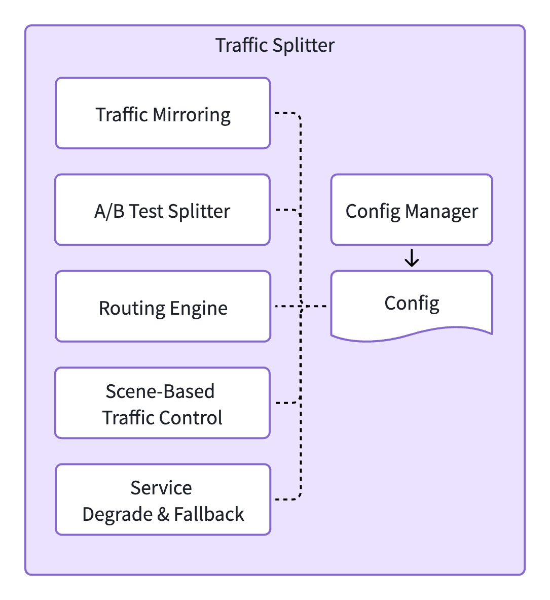
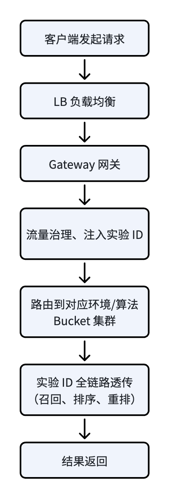
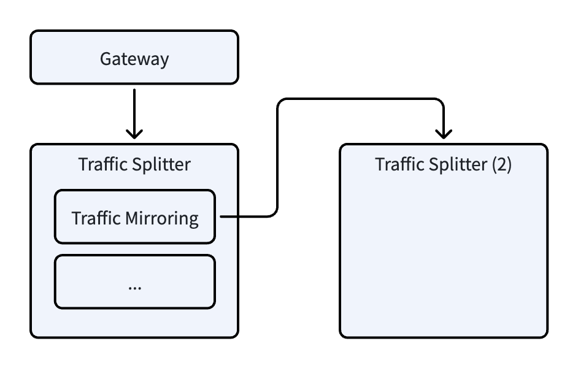
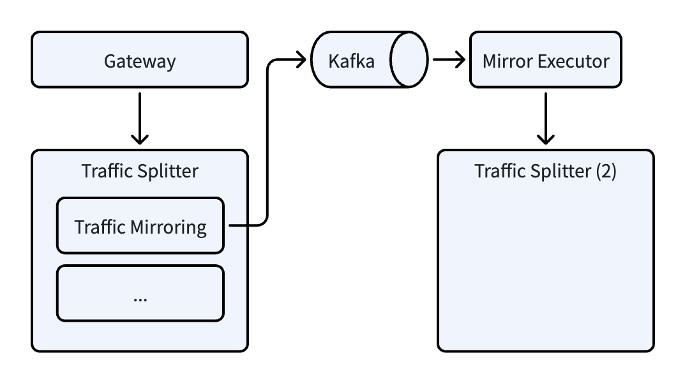

# 推荐系统架构（11）：Traffic Splitter，推荐系统流量治理

## 1. 概述

上一篇我们已经把推荐系统在线部分的架构做了概要性介绍。最前端的 Gateway 负责承接用户流量接入。Gateway 网关模块的功能相对比较单一，在上一篇已经介绍过，不再单独展开。顺着流量往后走，推荐请求下一个节点是 Traffic Splitter。Traffic Splitter 是推荐系统的流量治理模块，本篇将对这个模块内部设计和工程细节进行讲解。

推荐系统的主要功能是给用户提供符合其兴趣的个性化内容，其核心是推荐算法。为了让推荐系统越来越智能，推荐算法也在每周甚至每天在迭代。我们在离线篇已经讲过，推荐算法的迭代先经过离线评估，而后会上到线上进行 A/B Test。那在线上怎么实现精准分流、怎么让灰度风险最小化？这些问题的解决，就需要有一个单独的模块来处理，也就是本篇文章介绍的 Traffic Splitter。

Traffic Splitter 接收 Gateway 传递过来的推荐请求，做精细化的流量治理，然后把请求往后续的 Realtime Engine 传递。此处的流量治理和 Gateway 的简单限流、负载均衡不一样，更聚焦于推荐业务级别的流量治理，其主要职责包括：多环境流量复制、场景化的实验分流、Bucket 级别灰度、服务熔断降级、故障的快速止血等。

本篇文章将从 Traffic Splitter 的总体架构、多环境流量复制、场景化 A/B Test 分流、流量管控和降级兜底等方面，把这个模块的设计理念和细节进行介绍。大家如果只对其中某一部分感兴趣，可以直接跳转到相应章节进行阅读。

## 2. 总体架构

### 2.1 部署模式

根据整个平台流量的大小，Traffic Splitter 可以有不同的部署方式。

**网关内嵌模式**

如果流量治理不需要那么精细，用户请求的流量也不是那么大，为了降低运维成本、节省硬件资源，可以把 Traffic Splitter 作为一个子模块嵌入到 Gateway 中。也就是 Gateway 和 Traffic Splitter 是同一个服务，只是把推荐流量治理当成子模块进行设计和开发。如果日活不超过千万、QPS 在万级别或以下，这种模式是一个相对比较好的选择。

**独立服务模式**

如果日活达到几千万甚至亿级别，QPS 突破十万甚至更高时，为了避免流量治理和网关的逻辑争抢 CPU、内存等资源，通常会把 Traffic Splitter 部署为独立服务。这种情况也就是我们上一篇文章所介绍的架构，Gateway 负责请求的接收和转发、Traffic Splitter 负责推荐流量治理。通过这种拆分，让两个服务可以分别做性能优化、独立扩容、独立监控，从而在大流量场景下有更好的稳定性和可维护性。

### 2.2 总体架构

不管是内嵌网关方式还是独立服务部署模式，Traffic Splitter 的主要功能都一样，内部的子模块划分也大同小异。下面是一个典型的模块划分架构图：



**配置模块（Config Manager）** 

对接 Apollo、Nacos 等外部配置中心，监听并加载 Traffic Splitter 使用的各类配置，同时负责配置校验、版本切换、本地缓存和热更新。配置可能包括：流量复制采样比例、场景和实验 ID 绑定关系、Bucket 流量比例、降级策略等等。支持热更新的配置，不需要重启服务，能很好支持线上快速的调整流量等场景。

**流量复制（Traffic Mirroring）**

把生产环境的流量复制到其他环境，可以定义复制的场景、流量比例、目标集群等等。复制的目标可以是 STG 或 Canary 环境等（环境的定义参考本文后续章节）。

**实验流量切分（A/B Test Splitter）**

这是 Traffic Splitter 最核心的业务模块，这个模块解析用户请求中的相关参数，根据配置好的场景实验绑定、Bucket 流量配比、用户分流规则等参数，把请求和对应的实验 ID 匹配。匹配的实验 ID 以及相关元数据，写入到请求的上下文（HTTP Header 或 RPC 请求参数等），传递给后续的 Realtime Engine、召回、排序等模块。各模块记录相关的实验 ID 参数，从而实现全链路的 A/B Test 流量切分和管控。

**路由引擎（Routing Engine）**

根据预定义的规则，路由到对应的目标。路由规则至少包含场景、实验 ID，Traffic Splitter 依据这些规则配置的目标，进行流量路由。

**场景化流量控制（Scene-Based Traffic Control）**

分场景进行精细化流量管控，包括场景化路由、场景化限流、场景化实验流量切分、场景化降级等业务逻辑。

**熔断降级（Service Degrade & Fallback）**

在推荐业务 Realtime Engine 超时或没有响应时，Traffic Splitter 进行降级策略，给用户返回静态的非个性化数据，防止客户端收到空数据影响用户体验。其他还有 Bucket 止损、跨机房多活切换、接口熔断等功能，都是为了在发生各类故障时，保证用户端还能获取数据，有稳定的服务保障。

### 2.3 全链路数据流

一个请求，从客户端发出，到接收服务端返回，流经 Traffic Splitter 的完整链路如下：



在这个链路中，流量治理都在 Traffic Splitter 中完成，下游其他的模块不需要处理分流逻辑和实验规则，只需要读取已经分流完的结果即可。这样各模块的逻辑解耦，简化后续的业务架构。

## 3. 流量复制

### 3.1 CI/CD 多环境部署

在讲流量复制之前，我们先简单介绍一下工业界开发的 CI/CD （持续集成/持续部署）流程的多环境部署。关于 CI/CD 流程本身此处不再过多展开，大家可以参阅其他相关资料。此处主要介绍各环境以及其主要功能。在大型的软件开发过程中，标准链路如下：

```
本地开发 -> DEV 开发环境 -> TEST 测试环境（QA）-> INT 跨团队集成环境 -> PERF 性能压测环境 -> STG 预发布环境 -> Canary 金丝雀/灰度环境 -> PROD 生产环境
```

各环境的核心能力如下：

1. **DEV 开发环境**：一般用于研发人员日常的开发自测，代码实时部署，数据可以随便的修改、构造。这个环境没有严格的稳定性要求。

2. **TEST 测试环境**：一般是 QA 团队专用的，代码提交之后自动部署、自动启动测试，完成新功能测试以及已有功能的回归测试。这个环境的数据一般由测试脚本自动构建，有相对高一些的稳定性要求（因为 TEST 环境失败会阻塞整个 CI/CD 流程）。

3. **INT 集成环境**：一般用于跨团队、多服务间的集成测试，验证多个服务和模块之间的联动性、兼容性，解决联调问题。INT 环境一般不在 CI/CD 流程的关键路径上，有的团队会在 TEST 环境之前部署，有的是在 TEST 环境成功之后再部署，取决于团队间协作的方式。

4. **PERF 压测环境**：TEST 测试通过之后，会进入 PERF 环境，通过模拟高并发流量，验证系统的单次请求耗时、吞吐量、CPU、内存使用率等，提前发现性能瓶颈。一般大公司会把 PERF 环境设置在 CI/CD 流程关键路径上；而小型公司或团队，PERF 环境是按需部署，只在大版本发布时候测试，不阻塞 CI/CD 流程。

5. **STG 预发布环境**：STG 是 Staging 的简称，这个环境完全复刻生产环境的配置和架构（例如保持各服务部署配比等）。这个环境不会承接真实用户请求，但可能会复制小部分的线上流量来验证整个链路的可用性。

6. **Canary 灰度环境**：Canary 中文是金丝雀，所以有的团队把它叫做金丝雀环境。这个环境软件版本部署和 PROD 一致，一般用来承接新算法新功能的初始灰度流量。例如刚开始的 1% Bucket 流量，一般指向 Canary 环境，来验证正确性和用户真实场景的效果。它和 PROD 隔离，万一新版本出现问题，不会影响线上大部分正常用户的流量。当新版本验证成功之后，流量可以切换回 PROD 环境。Canary 环境的稳定性要求和 PROD 是一致的，所有的监控、告警都是生产级别。

7. **PROD 生产环境**：全量承接线上用户流量的正式环境，它的稳定性和可用性要求最高，部署所用的资源也是最多的。

对于有的中小团队，Canary 环境可能不会单独部署，而是和 PROD 合在一起。PROD 环境和 Canary 环境都承接真实用户流量，它们之间的数据库是共享的。除了这两个环境之外，其他各环境的存储、缓存、配置、权限等等都需要隔离，避免各环境之间的数据相互影响。

### 3.2 流量复制规范

Traffic Splitter 提供流量复制的功能，用来把线上真实的请求流量复制到其他环境进行功能、效果的验证。在复制时，需要遵守一定规范。

#### 3.2.1  流量复制流向规范

流量复制本身没有限制，但从使用上建议只允许这三类复制： PROD -> Canary、PROD -> STG、PROD -> PERF。禁止把生产流量复制到 DEV、TEST、INT 环境。

主要原因：

- 首先是生产环境流量巨大，把这些流量（即使按比例复制）复制到线下环境，会对这些环境造成很大的冲击。
- 其次是线上真实用户的请求可能会包含敏感数据，复制到线下环境，可能会引起不必要的数据泄露，引发安全事故。
- 第三各环境的用户数据是隔离的，生产流量复制过来，在线下环境找不到对应的下游数据，引发一系列不必要的报错。

### 3.2.2 流量复制约束

流量复制时，Traffic Splitter 需要增加一些约束：

- **只读不写**：所有复制的流量只用来做请求模拟，验证链路功能的正确性、新旧算法输出差异及相关代理指标等，不能更新用户状态、推荐历史、曝光记录等业务数据。这样能避免复制过来的流量污染实际的生产统计数据，保证数据的准确性。为了排查请求执行情况，可以保留访问日志和诊断日志，但必须携带 Mirror 标记，并在后续分析中与正常流量隔离。

- **限流约束**：Canary、STG 环境的部署机器数量一般都远小于 PROD 环境，从生产环境复制流量时，要限制采样比例或限制最大的 QPS 阈值。例如仅复制生产 5% 流量到 STG 来验证链路正确性。

- **场景过滤**：要支持按需指定复制的场景，例如首页、信息流等分场景来复制，满足效果验证的需求。

所有复制的流量都会被打上特定标记。目标集群在处理这类影子流量时，需要进行特殊的隔离，保证不写入改变用户状态的数据。如果要输出系统日志，需要把对应的特定标记一起记录。这样在后续的日志分析时，可以很方便的区分正常流量和影子流量。

### 3.3 流量复制方式对比

对于流量复制，一般会有两种方式：TCP 四层复制和 HTTP/RPC 应用层复制。先说结论，Traffic Splitter 采用的是应用层复制方案。两种复制方式各有优缺点，适用的场景不一样，对比如下：

- 实现层级：
	- TCP 复制在网络四层、操作系统内核层实现；
	- 应用层复制需要自研代码实现；

- 优缺点：
	- TCP 复制不占用应用服务的 CPU、内存，性能损耗很低，支持全流量复制。但这种方式无法解析业务字段，不能支持业务级别过滤，无业务感知能力。
	- 应用层复制可以识别所有业务参数，支持多种精细化控制，可以支持热更新配置动态进行调控。缺点是会消耗少量应用层的机器资源，高并发场景下会有一些性能损耗。

- 推荐链路适配度：
	- TCP 复制适配度低，只适合一次性全链路压测使用，不支持日常迭代验证。
	- 应用层复制适配推荐系统日常算法迭代，可以进行灰度验证、全链路功能验证等场景。

> 注：原文对比内容用表格更适合呈现，但为了提升移动端阅读体验，改成了现在的列表样式。如果有人喜欢表格版本，可以联系我另行提供。

### 3.4 Traffic Splitter 复制方案

Traffic Splitter 流量复制的示意图如下：



在具体实现时，会先配置流量复制规则，类似：

```JSON
{
  "scene_id": "newsfeed",
  "mirror_rules": [
    {
      "destination": "rpc://canary-cluster-1:7070/com.example.trafficsplitter",
      "sample_ratio": 0.2,
      "request_filter": "device=android;app_ver>=5.3.0",
      "readonly": true
    },
    {
      "destination": "rpc://stg-cluster:7070/com.example.trafficsplitter",
      "sample_ratio": 0.1,
      "readonly": true
    }
  ],
  "enable_mirror": true
}
```

整体的流程如下：

1. 服务收到请求，进行参数的解析，解析出场景 ID（scene_id）、用户 ID（user_id）、设备（device）等。
2. 查找内部的流量复制配置，首先匹配场景 ID，查找复制规则。
3. 如果有多个目标，顺序执行复制到逐个目标。
4. 对于每个目标，如果有采样率限定，进行采样匹配（例如生成随机数和采样率对比），如果在采样率范围外跳过，在采样率范围内继续。
5. 在请求头中添加流量复制标记，例如 HTTP Header 或 gRPC 的 Metadata 中增加 `X-Traffic-Mirror:true`。
6. 异步发起 HTTP/RPC（根据配置），把请求转发到目标集群。
7. 结束流量复制流程，继续后续业务逻辑。

对于上面流程的第6步，Traffic Splitter 异步发出请求之后不等待结果，这样不阻塞主流程。但该方案在一些极端情况下可能存在风险：

- **容量传导风险**：源集群如果存在流量尖峰，会立刻同步到目标集群。如果目标集群容量不够可能引发过载，甚至导致雪崩；
- **故障丢包风险**：如果目标集群发生网络瞬断、服务重启或者临时过载等故障，复制的请求将无法送达。

需要说明的是，这两种风险都不影响主流程的正常响应，但会降低复制流量的完整性和对比分析的准确性。有的系统为了规避这些风险，会采用下面的方案：



在此方案中，流量复制模块不直接发起异步 HTTP/RPC 调用，而是把请求序列化然后存放在 Kafka 队列中。在 Kafka 下游用一个轻量级的流量执行器（Mirror Executor）消费数据，把请求再发送给目标集群。这种方式依靠 Kafka 的持久化能力，能保证请求不丢失。并且流量执行器可以按目标集群的承载能力进行流量 QPS 控制，达到更精细化控制的能力。不过这种方式成本会相对高一些，只在有特定需求的场景下使用。一般来说，方案一（异步 HTTP/RPC）适用于对实时性要求高、目标集群稳定的场景；方案二（Kafka 队列）适用于目标集群容量有限、需要流量削峰的场景。

## 4. A/B Test 分流

### 4.1 A/B Test 核心价值

推荐系统的全链路功能迭代改进，例如个性化的策略、新算法模型、模型参数调整、召回源增减、召回源内部策略、业务规则等等，最终的效果都需要在线上进行验证。A/B Test 机制是迭代上线验证效果的主要手段，刚开始上线时，会划分小流量进行验证，然后逐步放量。这个过程可以验证各规模流量阶段下，系统的各项指标，包括点击率、停留时长、完读/完播率、留存率等，判断新的功能和策略是否优于现有版本。

Traffic Splitter 核心业务能力之一，就是支持 A/B Test 分流。Traffic Splitter 把所有的分流逻辑统一在这个模块内部，下游的引擎、召回、排序等阶段不需要知道分流的规则等，在设计上实现实验统一管控。

### 4.2 分流规则设计

在 Traffic Splitter 中，每一个请求都会和一个“实验” ID 绑定。而相关的参数，包括推荐流程编排、使用的模型 ID、召回源以及各召回源数量、业务规则等等，是和“实验” ID 绑定。此时的“实验” ID 应该称之为“配置” ID，为了和 A/B Test 逻辑保持一致，此处以及后续，还都以“实验” ID 命名。

对于一个业务场景（例如首页、新闻流、相关推荐等），会对应一个总实验 ID，即 GA 实验（General Availability，用作基线总流量池）。各场景之间实验配置相互隔离，避免交叉污染。所以前面所述的几个场景，对应关系为：首页场景对应 homepage_ga，新闻流场景对应 newsfeed_ga，相关推荐对应 related_ga。

在一个场景内部，可以进行实验分流，一般是拆分多个细分的算法 Bucket，和主流量 GA Bucket，一起承载新版实验算法和稳定基线版本。所有的 Bucket 与 GA 流量占比之和为 100%。

以信息流场景为例，假设线上稳定基线模型版本 v2.0，新实验模型版本分别为 v2.1、v2.2，此时会划分四个流量 Bucket：

1. newsfeed_v20：基线算法小流量对比 Bucket，模型版本是 v2.0； 
2. newsfeed_v21：v2.1 新模型实验 Bucket；
3. newsfeed_v22：v2.2 新模型实验 Bucket；
4. newsfeed_ga：主流量 Bucket，模型版本 v2.0。

分配 newsfeed_v20 Bucket 的目的是为了在相同流量下，进行新老版本效果对比。

算法刚开始上线，采用小流量灰度策略，例如分配 1% 流量（如果系统流量非常大，初次上线流量可能是 0.1%），此时各 Bucket 流量配比：newsfeed_v20 (1%)、newsfeed_v21 (1%)、newsfeed_v22 (1%)、newsfeed_ga (97%)。如果系统设置有 Canary 环境，初始 bucket newsfeed_v21、newsfeed_v22 一般指向 Canary 环境，以防止新版本故障影响 GA 流量。

### 4.3 实验配置示例

``` JSON
{
  "scene_id": "newsfeed",
  "ga_id": "newsfeed_ga",
  "endpoint": "rpc://prod-cluster:7070/com.example.realtime_engine",
  "bucket_list": [
    {
      "exp_id": "newsfeed_v20",
      "bucket_weight": 0.01,
      "enable": true,
      "start_time": "2026-07-01",
      "expire_time": "2026-10-01"
    },
    {
      "exp_id": "newsfeed_v21",
      "bucket_weight": 0.01,
      "endpoint": "rpc://canary-cluster:7070/com.example.realtime_engine",
      "enable": true,
      "start_time": "2026-07-01",
      "expire_time": "2026-10-01"
    },
    {
      "exp_id": "newsfeed_v22",
      "bucket_weight": 0.01,
      "endpoint": "rpc://canary-cluster:7070/com.example.realtime_engine",
      "enable": true,
      "start_time": "2026-07-01",
      "expire_time": "2026-10-01"
    }
  ]
}
```

以上为信息流场景 `scene_id: newsfeed` 配置，顶层配置 GA 对应的实验 ID 是 newsfeed_ga，目标集群是 `rpc://prod-cluster:7070/com.example.realtime_engine`。下面配置各 Bucket 列表，在每一个 Bucket 中，各项配置如下：

- exp_id：实验 ID；
- bucket_weight：配置的流量占比，0.01 即 1%；
- endpoint：目标集群地址，如果 Bucket 中配置，请求发送到配置的 endpoint；如果没有配置，请求发送到默认的 GA endpoint；
- enable：Bucket 是否启用，如果线上实验出现严重问题，可以通过该配置快速关闭；
- start_time/expire_time：Bucket 开始和到期时间；

> 注：在 Traffic Splitter 中，只会给流量分配对应的实验 ID，然后写入到请求上下文，传递给下游 Realtime Engine 模块。Realtime Engine 收到实验 ID，会从配置中心获取到详细的参数，包括模型 ID、召回源以及召回候选数量等。

### 4.4 分流实现

Traffic Splitter 对于 Bucket 的分流，基本上是基于 User ID 哈希取模实现。这个方案是为了保证用户的稳定性，同一个用户经过哈希计算之后，会固定分配在同一个 Bucket 中，保证用户的多次访问体验一致。在用户 ID 分 Bucket 基础下，还可以辅助于设备 ID、App 版本、渠道、城市等进行分流。

在实际工程落地中，还会设置特殊名单等机制，例如把内部员工名单分配到新实验，提前进行内测，也可以把特定用户拉进内测组、拉黑用户不参与实验等方式。

下面介绍一种具体的请求分流方案，核心是 user_id 哈希然后对 10000 取模，余数落在 0 ~ 9999 区间，即划分成 10000 段，然后根据比例落入到对应的 Bucket 中。整个流程为：

1. 规则预处理：
	1. Traffic Splitter 读取 Bucket 配置同时，也从配置中心读取分流 traffic_salt 值（作用见后续描述）。
	2. 在每个场景内部，展开所有 Bucket 配置，校验 bucket_weight 之和是否不超过 1。如果和超过 1 表示配置错误，丢弃并告警。
	3. 校验通过之后，给每一个 Bucket 按 bucket_weight 分配余数段。例如前面 4.3 节配置，newsfeed_v20 分配余数段 0 ~ 99，newsfeed_v21 分配 100 ~ 199 余数段， newsfeed_v22 分配 200 ~ 299 余数段。剩余请求都由 GA 兜底。
2. 处理请求时，Traffic Splitter 解析 scene_id、user_id 等参数，根据 scene_id 找到 newsfeed 相关配置。
3. user_id 拼接 traffic_salt 值，哈希取模，例如 `md5(user_id + traffic_salt) % 10000` ，获取到当前请求用户哈希之后的余数值 hash_remainder。此处采用 md5 或者其他哈希算法都可以，哈希算法只要有足够的分散性即可，但一旦确定，不能随便更改。
4. 顺序遍历所有 Bucket，比较 hash_remainder 和各 Bucket 余数值段是否匹配，如果匹配则命中该 Bucket。
5. 检查 Bucket 的 enable 值，如果为 false，表示该 Bucket 因为某些原因被关闭，流量退回到 GA。如果 enable 为 true，标记该流量实验 ID 为对应 Bucket exp_id。
6. 如果没有命中任何 Bucket （或者因为 enable = false 而退回），标记该流量实验 ID 为 GA 对应 ID。
7. 把实验 ID 写入到请求上下文，然后发送给对应配置的 endpoint，流程结束。

设计 traffic_salt 值的意义，是在某些情况下，需要对流量进行重新打乱（re-shuffle），此时修改保存在配置中心的 traffic_salt 值，然后下发给所有 Traffic Splitter 实例。该值不建议频繁修改，也不建议热更新，以免打乱线上正在运行的实例分流逻辑，导致实验数据前后不连贯。如需修改，建议在低峰期进行并统一重启所有实例。

Bucket 的 enable 设计目的是为了能快速关闭一个 Bucket，把流量退回到 GA，但是不打乱其他 Bucket 的分流逻辑。这个配置建议支持热更新，能快速把线上有问题流量关闭。

本文描述的实验是单层实验，即一个场景下 100% 的流量按互斥关系，分配给若干个 Bucket。目前在规模较大的工业级实验平台中，通常还会采用多层实验框架。例如召回层可以分层实验、精排层也可以做流量划分实验，这两层实验之间互相不影响。关于多层实验框架，如果大家感兴趣，可以在评论区留言或者私信告诉我，后续可以安排专题文章详细介绍。

### 4.5 实验 ID 生命周期

Traffic Splitter 分流完成之后，把实验 ID 注入到上下文，一直透传到下游流程，完整的生命周期如下：

1. Traffic Splitter 分流映射到一个实验 ID（exp_id），随请求发送给 Realtime Engine。
2. Realtime Engine 根据 exp_id 从配置中心获取对应参数。然后根据参数获取 User Feature、获取召回候选，然后再获取对应的 Content Feature、Cross Feature，加上 Context Feature 进行精排，最后再进行业务规则重排。
3. Realtime Engine 根据过程结果，组装相应的 Feature Log ，带上 exp_id，写入到日志中。然后把 exp_id 和 trace_id 序列化，附在每一条 Content Item 上，逐级返回给客户端。
4. Feature Log 通过一定策略收集并写入 Data Warehouse，其中 exp_id, trace_id 作为单独字段保存。
5. 客户端收到返回 Content 列表，展示给用户，然后根据用户浏览行为，上报对应反馈日志，上报数据时，把附在 Content Item 上的 exp_id/trace_id 一起上报。此时客户端不需要理解 exp_id/trace_id 含义，只是把它们作为 Content Item 的一个属性附在上报数据中。
6. 反馈流程收到上报日志，解析其中的 exp_id 和 trace_id，写入到 Data Warehouse。
7. 通过 Data Warehouse 的数据，就可以统计每一个 exp_id 下用户指标表现。延续之前的例子，统计时加上过滤条件 exp_id=newsfeed_v22，就可以统计这个 Bucket 下用户的点击率、停留时长、完读率等一系列指标。
8. 在上报数据完整的情况下，可以根据 exp_id 和 trace_id，把反馈日志和 Feature Log 匹配，进行后续的特征分析、进一步的模型训练优化等操作。

本节大概介绍了 exp_id 在整个链路中的生命周期。如果大家对实验数据统计计算的细节感兴趣，可以在评论区留言或者私信告诉我，后续在新文章中继续介绍，也可以和前面说的多层实验框架合在一起形成一篇新的专题文章。

### 4.6 新版本上线完整流程

前面已经介绍了流量复制和分流逻辑，本节基于这些机制，介绍新版本上线的整个完整流程。还是以前面所述的 newsfeed，v2.1、v2.2 版本为例。

1. 新版本模型离线评估没问题之后，上线发布，将新代码和模型部署到 Canary 环境，同时可以提前部署到 PROD 环境，但保持未启用状态。
2. 用流量复制方式，从 PROD 复制小比例流量到 Canary，对新版本进行 Shadow 验证。重点检查链路正确性、结果分布、空结果率、模型分数以及延迟和资源消耗等指标，确认和离线评估和预期基本一致。由于复制结果不会真实展示给用户，这一阶段不能替代正式的线上 A/B Test。
3. 复制流量验证没问题之后，正式开始 A/B Test，此时在 PROD 环境配置 Bucket。如上面的例子，newsfeed_v20、newsfeed_v21、newsfeed_v22 分别分配 1% 流量，新版本目标 endpoint 指向 Canary 环境，保证新版本故障不影响 PROD 环境。
4. 持续观察若干天（根据业务规定，可能是 1 ~ 3 天），确认新版本运行没有报错，功能正常，用户指标没有下跌，可以提升 Bucket 流量。此时 newsfeed_v20、newsfeed_v21、newsfeed_v22 三个 Bucket 分别提升到 5%，继续观察用户指标。
5. 在 5% 流量下运行若干天，观察到 v2.2 的指标优于基线 v2.0 以及 v2.1，则把 v2.2 当成优胜版本继续扩大流量，v2.1 Bucket 可以下线。此时 newsfeed_v22 目标 endpoint 可以切换回 PROD （根据系统 Canary 容量确定）。newsfeed_v20 和 newsfeed_v22 同步进行流量提升：5% -> 10% -> 20% -> 50%。持续观察流量上升情况下用户指标和系统稳定性。
6. 50% 流量长时间运行没问题，长短期指标都正向（主要指标提升、辅助指标无下降），可以把 v2.2 当成新基线。此时把 v2.2 的配置复制到 newsfeed_ga 中，全量上线。
7. newsfeed_v20 和 newsfeed_v22 流量收缩到 1%，修改对应的描述，此时 newsfeed_v22 是新基线，newsfeed_v20 是 Reverse Bucket。Reverse Bucket（反向验证桶）是指用小流量运行旧版本，持续监控其指标是否出现异常回升，用于交叉验证新版本的提升确实来自算法改进而非外部环境变化。

> 注：如果系统没有配置 Canary 环境，复制流量验证可以用临时搭建的环境线下进行，而线上 Bucket 目标直接指向 PROD 而不是 Canary。

## 5. 分场景控制和降级回退

Traffic Splitter 除了流量复制、流量分流功能之外，另一大核心职责是保障线上稳定性，保证用户体验。结合前面介绍的功能，Traffic Splitter 能做到分场景精细化控制、多层故障降级、Bucket 级别回退 等完整体系，来应对可能出现的各类线上故障。

### 5.1 分场景控制

依托 scene_id 和实验ID 绑定的设计，Traffic Splitter 可以做到分场景的流量治理，不需要对全局流量做粗放统一的控制。

首先是分场景进行实验配置、灰度放量等操作，让各场景之间互相独立，例如首页保持全量基线稳定运行，信息流可以实验多个新模型。这样能很好的隔离可能出现的迭代风险。

其次是可以分场景进行流量控制，可以在热点事件或者大促活动期间，不同场景部署不同的集群进行单独扩容。Traffic Splitter 会根据不同的场景进行路由，并且可以分场景来控制最大请求量，超过限额部分返回降级内容或者直接返回错误。

前面所述的分流策略主要是根据用户ID，Traffic Splitter 也可以在某些场景把分流策略更改为地域优先，这样可以在小范围对一些地域相关功能做灰度实验，然后再逐步放开到全量。这样分场景多策略分流可以进一步降低迭代风险。 

### 5.2 多层故障降级

Traffic Splitter 可以做到全局降级和 Bucket 级别的降级两种模式，兼顾稳定性和迭代的灵活性。 

全局降级能力包括：

1. **服务熔断降级**：Traffic Splitter 监控下游推荐引擎的报错率和耗时，如果发现错误率急剧上升或超时请求明显增加，可以触发熔断降级。降级的策略可以通过配置制定，不同的场景返回不同的静态内容，保证推荐服务不中断，从而改善用户的体验。

2. **多活机房降级**：在发现本机房部署服务发生故障时，Traffic Splitter 也支持把推荐流量转发到其他机房相同服务上，只需要改变目标请求地址即可。也可以通过 Bucket 方式，把流量切分，按比例转发到多个机房。这样可以在紧急情况下保证服务不中断。跨机房调用会引入额外的网络延迟（例如增加 10~30ms），如果下游服务本身耗时已经接近超时阈值，跨机房调用后，整体超时概率会显著上升，进而触发熔断。因此该方案通常只作为应急手段，不建议长期使用。

Bucket 级别的应急处理包括：

1. Bucket 如果出现大量错误或超时，可以把该 Bucket 关闭，通过设置 Bucket.enable 参数为 false，就可以自动把流量回退到 GA。这种操作不需要修改代码，不需要重新上线，能快速止血恢复。

2. 可以增强流量控制，在 Bucket 级别统计 QPS，控制其最大配额。这样防止单个异常版本占用过多系统资源而影响其他服务。

Bucket 级别的控制、降级，可以把影响范围降到最小，只隔离有故障的版本。并且止血恢复的速度很快，通过配置的热更新，能在秒级（取决于配置热更新速度）生效，快速恢复。故障解决之后，可以重新激活对应 Bucket，继续进行实验。

## 6. 总结

Traffic Splitter 作为推荐系统的流量治理核心组件，把流量相关的功能集中在一个单独服务中处理，解决传统架构中流量管控混乱、代码分散的问题。流量复制、分流、故障降级等功能，保证了快速迭代和系统稳定性之间的平衡。从职责上看，Traffic Splitter 承担了推荐系统中相当一部分业务控制平面的能力：配置实验规则、控制灰度比例、选择目标集群并执行降级策略；与此同时，它也处于在线请求链路中，是这些控制策略真正落地的流量执行节点。相比之下，Realtime Engine、Recall、Ranking 等模块更聚焦于推荐计算本身。

整体架构上，Traffic Splitter 把所有的流量路由、实验打标、灰度放量、降级回退等逻辑前置，简化了下游相关服务和模块的复杂度。由 Traffic Splitter 确定的实验 ID，将一路透传到下游所有模块，接下来的一个核心组件就是《在线引擎 Realtime Engine》。下一篇文章将对这个服务进行介绍，包括整个推荐步骤编排、全链路执行的设计和实现，这些服务和模块共同构成推荐系统在线服务的核心架构体系。
