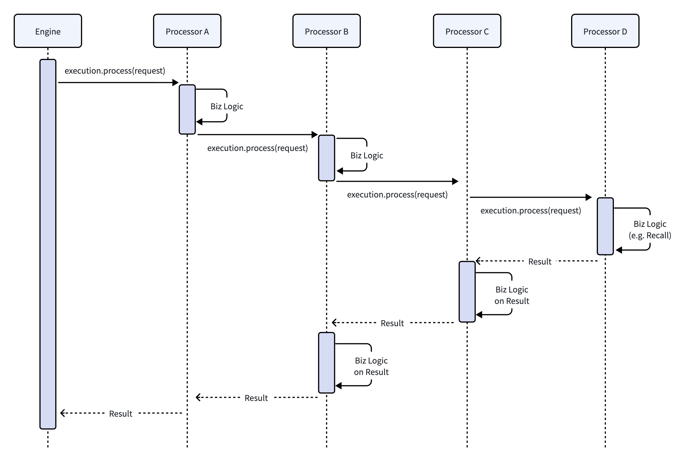
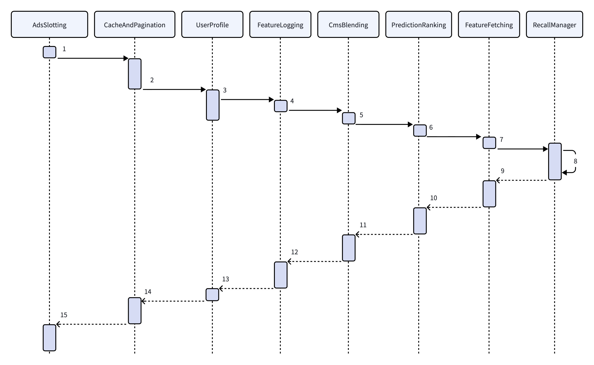

# 推荐系统架构（12）：实时推荐引擎，链路的调度中枢


阅读导览：本文全文一万字左右，以下是各章节大标题，其中第 3 章和第 8 章篇幅最长，大家可以挑选自己感兴趣章节阅读。不过如果时间允许，还是建议从头到尾顺序阅读。

1. 从 Traffic Splitter 到 Realtime Engine ： 介绍 Traffic Splitter 和 Engine 功能边界划分。
2. 实时推荐引擎的核心功能 ：引擎的五大核心功能概述。
3. 配置驱动的流程编排 ：讲解 Process Chain 设计。
4. 下游服务调度与执行控制 ： 下游服务调度的优点、超时控制等。
5. 轻量业务规则与重排 ： 业务重排相关介绍。
6. 多级容灾与优雅降级
7. 结果封装
8. 一次完整推荐请求是如何执行的
9. 总结


## 1. 从 Traffic Splitter 到 Realtime Engine

前一篇推荐系统架构系列文章《[Traffic Splitter](https://mp.weixin.qq.com/s/-nCFe01t82-lc-rJT29mGg)》介绍了 Traffic Splitter（以下简称 TS）是推荐系统的流量入口，负责流量切分和实验分流等操作，不参与推荐相关的业务逻辑。简单回顾一下 TS 的主要作用：所有用户请求经过这个模块完成分流、实验 ID 填充，保证进入下游的流量都有明确的实验标识，实现多场景多实验和后续业务的解耦。

TS 的下一个节点即实时推荐引擎（Realtime Engine）。实时推荐引擎是整个链路的调度中枢，负责实际推荐业务的流程编排和资源管控。实时推荐引擎是推荐业务的第一个核心环节，它根据请求中的实验 ID 参数，获取该实验对应的所有配置参数，然后根据配置确定执行链路（也即是第 10 篇文章《[在线系统概览](https://mp.weixin.qq.com/s/p8oAzAxys9MvKxARuQdUvw)》里面说的 Stage），启动链式调度流程，完成用户画像获取、多路召回、特征拉取、排序、规则重排、广告适配等多个环节。全链路执行完成之后，引擎会把返回的结果封装成标准结果，返回给 TS，然后最终返回给用户端。

在这整套链路中，TS 决定哪些流量走哪些实验，是推荐系统的流量门卫；实时推荐引擎决定对请求怎么计算推荐结果，是系统的调度中枢。

## 2. 实时推荐引擎的核心功能

实时推荐引擎作为整条链路的调度中枢，它的架构首先要满足链路的性能以及系统稳定性，同时还要兼顾业务的迭代效率。如果推荐流程都是硬编码成固定的流程，执行过程非常容易出现问题，导致系统不稳定；并且硬编码的迭代效率非常低，每次新需求上线都需要慎之又慎，导致迭代周期被拉得很长。

基于这些实际需求，实时推荐引擎的设计有以下几大核心功能：

### 2.1 可配置化的执行流程

一个推荐系统可以服务多个产品、多个场景，每一个场景内部也需要频繁的迭代升级，有很多算法、模型等改进。所以在整体的执行链路、召回策略、排序模型版本、运营规则等方面都有不同的需求。如果都采用传统硬编码的方式，每个场景、每个实验都需要写相应的代码，导致大量重复代码；或者用一份代码适配多个场景，引入大量的 if-else 判断，导致代码的可维护性下降。

所以，引擎的首要设计目标就是可配置化的执行流程。推荐链路中的各业务逻辑，封装成多个小模块（Processor），在不同的产品、不同的场景中，可以通过配置的方式来指定要执行哪些模块以及模块的执行顺序等。例如，首页的推荐，内容质量要求比较高，运营人工指定内容占比可能高一些。而专门的信息流页面，完全是个性化推荐，人工内容占比少，也可以插入一些探索性内容拓展用户兴趣。

模块内的开发，有些逻辑需要支持参数化定制。例如召回的数量可以根据请求中的参数来确定；业务重排的一些调整策略也可以用参数来控制。这样不同的实验中，可以在线上对这些参数进行 A/B Test 来调优。

### 2.2 下游服务统一调度

推荐系统全链路包括用户画像、Feature Server、召回源、模型打分服务、运营配置等多个环节。引擎设计的第二个功能，就是作为一个总控中心，把这些服务的调用都集中在一个地方。这样可以保证下游业务模块功能相对单一，不需要互相调用完成业务逻辑。另外一个优点是业务模块的调用超时控制比较集中，可以在一个模块内完成。

### 2.3 灵活的业务重排模块

推荐结果在模型精排之后，还需要经过业务规则的处理。例如排序结果的去重、多样性控制、运营规则（置顶、内容过滤、黑白名单）等等。这些处理规则一般比较轻量，可以包装成一个子模块，直接嵌入到引擎中运行。如果以后业务规则变得很复杂，计算量突增，引擎也保留相应能力，可以把类似业务规则部署为独立服务，然后从引擎侧进行调用。

### 2.4 多重降级方案

推荐链路下游的业务模块众多，服务的瞬时抖动、硬件引起的偶然超时、网络瞬断等都可能发生。引擎作为调度和执行中心，需要处理下游业务模块的这些突发异常，因此需要构建一个多层级的故障降级和熔断机制。

### 2.5 结果统一封装

推荐链路各业务模块处理的数据字段不太一样，在最终计算完成之后，需要有一个模块对数据进行最终的处理封装，返回给网关直至用户客户端。引擎是链路的集中调用中心，在链路的末端需要做推荐结果的标准化封装。同时，对接多场景时，可以针对不同场景进行不同的数据字段封装。例如首页场景可能搭配大图，文章的相关阅读为了保证列表紧凑性搭配小图。

## 3. 配置驱动的流程编排

流程编排是实时推荐引擎的最核心功能，是平台支持多产品、多场景的基础，也是业务能灵活迭代的支撑。本文介绍的实时推荐引擎采用 Process Chain 链式调用的方式，把推荐链路中的业务节点抽象成 Processor，然后用链式执行机制，以配置方式驱动，灵活实现推荐流程的动态编排。
### 3.1 配置驱动

实时推荐引擎执行的流程都是配置驱动，这样只要把业务节点抽象好，每个场景只需要通过配置来指定节点组合和执行顺序，实现流程和代码的解耦。

系统所有的配置保存在配置中心，引擎启动时会从配置中心同步所有配置到本地。在服务运行期间，也可以通过热更新的方式，保持本地配置和远程配置中心的同步。如果特定场景或实验的配置存在问题，可以通过修改配置快速修正，而不需要重启服务。

和流程编排、执行相关的配置包括两部分。第一部分是链路配置（Chain Config），保存流程执行链路中的所有 Processor、执行顺序以及链路执行相关的参数（例如超时阈值等）。第二部分是实验参数，如上一篇《Traffic Splitter》文章 4.2 节所述，所有的请求都会对应到一个实验 ID 上，而实验 ID 绑定一系列配置，例如使用的召回源、模型 ID 等。具体的配置后续章节会继续介绍。
### 3.2 Execution Context

推荐流程拆分成多个模块，为了解决模块之间流程状态共享问题，引擎设计了 Execution Context 全局执行上下文。这个上下文是请求全生命周期共享的唯一数据，透传到 Chain 中的所有节点。

Execution Context 保存了该次请求全部的核心信息，数据主要包括：

- 首先是 Execution 对象，Execution Context 保存一个 Execution 对象，该对象维护链路调度和控制信息。其中链路调度信息，包括链路的全部 Processor 节点指针，当前执行的节点指针等。链路控制信息，包括请求全局超时时间、单节点超时设置、链路执行状态等。
- 第二类是请求信息，包括原始的客户端请求，以及解析之后的场景标识、用户标识、设备标识、实验 ID、请求时间等。
- 第三类是业务中间数据，包括用户画像、多路召回候选、特征数据、模型打分等。

第二类请求信息中，实验 ID 是由上游 TS 传入，然后引擎会从配置中把实验所有的参数取出来，附加到请求参数中。全链路所有 Processor 都可以读取这些参数。

通过这样统一的 Execution Context，所有 Processor 不用再单独定义入参出参，节点间数据交互逻辑也相对比较简单。

需要注意的是，Execution Context 是所有 Processor 共享的可变上下文，因此对数据的写入需要有明确约束。一般由负责生成该类数据的 Processor 写入，其他 Processor 以读取为主，避免多个节点随意修改同一份中间状态，增加链路耦合和问题排查难度。
### 3.3 Process Chain 设计

引擎执行所依赖的 Process Chain，是在搜索引擎系统 Search Chain 架构基础上，根据推荐业务进行重构和定制化升级而来。整体执行的核心是链式调度思想，以适配多阶段计算的业务特性。

Process Chain 设计中，首先定义统一的 Processor 抽象接口。推荐链路中的每一个独立业务环节都实现该接口，封装成一个标准化的 Processor 单元。在一个 Processor 单元中，不需要知道上下游节点的逻辑，只需要按照该单元的业务逻辑，对请求或结果进行处理即可。其中 Processor 接口主要执行函数定义为：

```JAVA
Response process(Request request, ExecutionContext context);
```

Processor 定义好之后，由配置指定其组合和顺序，引擎根据设定好的组合，以**正向线性执行、反向回栈收尾**的栈式方式完成整个流程。假设我们在一个 Process Chain 中定义四个 Processor：A、B、C、D，那么执行的时序如下图所示：




上图中的 Processor A、B、C、D 分别对应四类处理模块：

- 第一类，形如 Processor A，只对请求侧信息做处理。例如：Request 中的 Query 改写和扩展，获取用户画像等操作，处理完之后把请求往后传递即可，没有其他额外处理逻辑。
- 第二类，形如 Processor B，请求时处理一部分逻辑，等结果返回之后再处理一部分业务逻辑。例如 CMS 运营规则处理，在请求时，可以异步发出请求把运营规则取出来，然后同时把请求传递给后续推荐业务节点处理。等后续 Recall、Ranking 等模块处理完成、排序结果回栈时，运营规则也已经获取完成，此时可以继续在结果上应用这些规则。（注：此处只是举例，运营规则也可以后台异步同步或推送到本地缓存，主流程直接取本地缓存）
- 第三类，形如 Processor C，只对结果做处理。例如调用 Prediction Server 对结果进行打分排序，或者对结果进行重排等，就是属于这一类处理逻辑。
- 第四类，形如 Processor D，链路的最后一个节点，自身处理业务逻辑（可能会同步等待访问外部请求），没有更多后续业务节点了。例如 RecallManager 就属于这个类型。RecallManager 从多召回源取数据回来，合并去重之后返回。

### 3.4 配置和流程动态调整能力

前面一节大概介绍了 Chain 模型的原理，此处来看一下 Process Chain 怎么配置，以及如何达到动态调整的目的。以信息流推荐为例，一个典型的 Process Chain 配置如下：

```JSON
{
    "name" : "NewsFeedGAChain",
    "renderer" : "NewsFeedRenderer",
    "processors" : [
        { "name" : "AdsSlottingProcessor" },
        { "name" : "CacheAndPaginationProcessor" },
        {
            "name" : "UserProfileProcessor",
            "config" : { "timeout" : 10 }
        },
        {
            "name" : "FeatureLoggingProcessor",
            "config" : { "maxLogSize" : 65536 }
        },
        { "name" : "CmsBlendingProcessor" },
        { "name" : "PredictionRankingProcessor" },
        { "name" : "FeatureFetchingProcessor" },
        {
            "name" : "RecallManagerProcessor",
            "config" : { "timeout" : 100 }
        }
    ]
}
```

这个配置中，结果封装采用 NewsFeedRenderer，根据 NewsFeed 场景来组装返回数据格式。（关于格式封装，后续章节还有详细介绍）

细心的读者可能已经发现，配置中的 PredictionRankingProcessor 和 FeatureFetchingProcessor 排在 RecallManagerProcessor 之前，这和通常理解的“召回 -> 特征 -> 排序”业务顺序似乎相反。这是因为 Process Chain 的配置描述的是 Processor 的调用栈顺序：请求正向执行到 RecallManagerProcessor 后产生候选结果，再沿调用栈反向返回，依次完成特征获取、模型排序和业务重排。第 8 章会结合完整示例进一步说明这一执行过程。

基于这个配置，引擎执行时会创建流程实例，然后按顺序依次执行所有 Processor。在运行过程中，假设我们发现输出的 Feature Log 过大，系统 IO 过高导致机器变慢，此时可以通过修改 Process Chain 配置，临时把 FeatureLoggingProcessor 从 Chain 中移除（或调小最大 Log Size，对日志进行截断），保证线上服务能稳定运行。

这类配置的变更，不需要修改代码、不需要重启服务，只需要配置变更就能快速对 Process Chain 进行调整，其他的 Processor 继续执行各自业务逻辑，无需感知整体 Chain 的变化。

### 3.5 引擎调度模型选型

对于推荐链路这样的执行流程，引擎可以选择多种调度模型，包括链式调度（本文方案）、状态机、工作流方式等。在当初做架构选型时，对这些模型也做了对比。

**链式调度**

Processor 通过配置顺序形成链路，然后以正向线性执行、反向回栈收尾的方式运行。

- 优点：有现成的搜索引擎 Search Chain 设计案例和引擎，简单改造即可。模型执行路径清晰，单次请求通过调用栈的方式，设计开发问题定位都比较容易。节点间耦合度低，适合团队多人并行开发，运行时增删节点只需要配置更改即可。
- 缺点：调度逻辑和业务逻辑在同一个线程，复杂的条件分支、循环节点等支持的不是很好。Chain 节点之间默认按调用栈串行推进，不直接表达节点级并行关系。

**状态机调度**

状态机模型需要将推荐流程规划成若干有状态节点，状态之间转移通过配置定义。引擎维护当前流程状态，并据此确定下一个要执行的节点。

- 优点：天然支持分支和循环，比较适合流程分支复杂的场景。状态转移配置化程度比较高，可以实现按条件的动态路由跳转。
- 缺点：随着状态和状态转移关系增加，配置复杂度会快速上升。状态转移逻辑可能会分散在多个地方，执行路径不如前面说的链式调度那么直观。在出现问题时，因为可能存在隐式跳转条件，排查的难度会加大。

**工作流引擎调度**

推荐业务节点通过构建有向无环图（DAG），引擎按拓扑排序执行。

- 优点：更容易显式表达节点依赖关系和并行执行。通过拓扑排序之后无依赖的节点可以并行执行，单次请求延迟能降低。
- 缺点：相比简单的链式调用，DAG 调度需要维护节点依赖、执行状态以及并发调度等额外机制，工程复杂度和运行时开销都会有所增加。对于本文这种百毫秒级、主流程相对固定的在线推荐链路，引入通用 DAG 调度框架的收益有限；如果自研，又需要额外研发投入和稳定性验证。

在推荐链路中，流程基本固定：取画像 -> 召回 -> 特征 -> 排序 -> 重排 -> 封装，其中分支情况比较少。综合这几个调度模型的优缺点，链式调度的简洁性和可追踪性优势远大于其并行能力的不足。其中并行部分，最核心是并行请求多召回源。此处的并行方案是 RecallManagerProcessor 中同时向多个召回源发起异步请求，然后等待所有结果一起返回。

所以本文描述的引擎最终使用链式调用作为引擎核心，配以某些特定 Processor 内部实现并行能力。

> 注：本章向大家简单介绍了 Process Chain 模式的设计，关于该设计的更多细节，后续计划更新一篇专门的工程实践类文章深入讨论。

## 4. 下游服务调度与执行控制

实时推荐引擎作为链路调度中枢，把下游服务调度放在一起，有以下几个收益：

1. 可以保证下游业务模块功能相对单一，不需要互相调用完成业务逻辑。
2. 整体系统的架构更标准规范，减少因模块依赖带来隐蔽性问题。
3. 业务模块的调用超时控制比较集中，可以在引擎内统一完成。

### 4.1 下游业务集中调度

Process Chain 定义的流程，引擎以“串行”的方式顺序执行 Processor。而在 Processor 内部（例如 RecallManagerProcessor）可以实现并行调度。这样从宏观流程上，实现了引擎级别对下游服务的串行与并行调度。

引擎级别对下游服务的调度，让下游服务内部不需要关心其他服务的逻辑。例如 Ranking 服务（Prediction Server）只需要知道它的输入是一个待排序列表，不需要知道这个数据来源是否来自于召回阶段，也不需要知道是不是经历过预排序。

对于特征获取节点，它的输入是召回返回的列表，它不关心这些结果来自哪些召回源，也不关心是并行还是串行获取的。

### 4.2 Timeout / Deadline

下游服务调用的超时控制，是引擎稳定性运行的基础。在引擎设计中，我们采用了双层超时控制。

首先是单个业务节点 Processor 的超时控制。如前面的配置例子所示，画像获取节点超时设置为 10 毫秒，召回节点超时设置为 100 毫秒。每个 Processor 执行时，系统判断执行时间是否超过预设超时时间，如果超过阈值则标记这个 Processor 执行失败。后续的节点处理会根据业务逻辑判断是整体返回失败还是采用降级结果。

其次是全局的请求超时 Deadline，例如一个请求必须在 200 毫秒内返回，那么这个全局 Deadline 设置为 200 毫秒。引擎在开始流程时记录请求 Deadline，后续每个 Processor 执行前根据当前时间计算剩余可用时间。如果超过 Deadline 限制直接返回失败或执行降级逻辑。

在后续的迭代实践中，我们也尝试过“超时传播”机制，即记录每个 Processor 长期运行的 P99 消耗时间。引擎在开始执行某个 Processor 时，发现剩余时间小于该 Processor P99 时间，则跳过其执行，使用降级结果快速返回。

## 5. 轻量业务规则与重排

推荐结果经过模型打分之后，还需要经历重排阶段，一般是对整个列表范围做多样性调整，并且会应用一些运营规则。以下说的“业务重排（Re-rank）”就是指代这一阶段。
### 5.1 业务重排为何不独立拆服务

从架构设计上来说，业务重排是一个相对独立的阶段，因此很容易想到将它拆分成独立的 Re-rank 服务来处理。

但目前已知的业务重排逻辑，主要包括：多样性调整、去重、过滤、置顶、广告占位等。这些处理逻辑相对比较简单，计算量不是很大，并且非常依赖上下文数据（召回、排序打分、用户行为等）。如果拆分为单独的服务，需要多一次网络请求，传递的数据加上网络请求，所花费的时间一般在毫秒级。而业务重排逻辑本身的平均运行时间可能也就不超过 10 毫秒。因此对于目前已知的业务重排逻辑，都是内嵌在引擎内部，作为独立 Processor 直接执行。

通过上面的分析，我们得出对于业务重排要不要拆分独立服务的准则如下：对于简单、低耗时、强业务相关的逻辑，一般放在引擎内部处理；对于计算复杂、有独立模型、需要独立扩容、独立迭代的逻辑，一般拆分为单独的 Re-rank 服务。

所以当前场景下，业务重排内嵌在引擎内部可省去一次网络往返，大幅降低链路耗时。如之前所示配置示例，CmsBlendingProcessor、AdsSlottingProcessor 都属于业务重排范围。在这种设计下，如果以后要拆分独立的 Re-rank 服务，只需要把当前的内嵌 Processor 换成调用远程服务 Processor 即可，对上下游透明。

### 5.2 业务重排功能

目前推荐引擎承担的业务重排一般可以分为以下几类：

**通用业务规则**

- 内容去重：根据内容 ID 和相似度指纹去重，避免同样内容在一次推荐中重复出现。 
- 多样性调控：根据内容分类、来源、关键词、作者等维度，在滑动窗口内做调整，防止类似的结果集中在一起。
- 时效过滤：在某些场景下对发布时间超过阈值的内容进行过滤（例如时效性新闻控制在 48 小时内）。
- 个性化约束：包括已读过滤、负反馈过滤、敏感品类屏蔽等逻辑。

**CMS 运营规则**

- 内容置顶：将运营指定的内容放置在首位，一般重大事件时放置。
- 运营强插：例如在第一屏内强制插入一条运营指定的内容，一般在重大事件，或者新用户冷启动等场景下使用。
- 违规内容下线：违规的内容，运营手工封禁，需要从推荐列表中强制下线。

**广告服务**

- 在推荐引擎侧，在特定场景下，根据规则插入广告占位符。该占位符返回给客户端之后，由客户端再向广告服务发起请求，获取对应的广告内容。也有的推荐系统会在服务端做广告混排，即在组装返回数据时，请求广告服务器获取实际广告内容填充到结果中。

## 6. 多级容灾与优雅降级

如 2.4 节概述所说，推荐链路业务模块很多，引擎需要处理业务模块的超时和瞬断，提供多层次的降级策略，保障用户体验。
### 6.1 多层次降级

按照故障的影响范围，引擎设计了多个层次的降级策略：

**单节点降级**

引擎与各 Processor 配合，实现节点级的失败降级策略。包括：

- 画像服务异常：如果画像服务异常，尝试从缓存取数据，若有则用缓存数据；若缓存也没有数据则把该用户当作新用户，尝试用新用户策略继续后续业务流程。
- 单路召回源失败：尝试从缓存中获取召回数据，如果没有则放弃该路召回源的数据。如果全部召回源都失败，采取后面描述的服务层级降级策略。
- 特征数据获取失败：如果全部特征获取失败，则等同为排序服务不可用。如果部分特征获取失败，尝试填充默认值，或者直接把该特征置空，让模型对其进行处理。

**服务级降级**

- 召回源失效：全部召回源都失败，没有数据返回，系统采用缓存的默认召回列表（一般为热门列表）当成召回数据，继续后续的业务流程。即在默认召回列表基础上，继续执行后续排序和业务重排等逻辑。
- 排序服务不可用：跳过模型排序阶段，使用召回阶段的原始分数做粗略排序。在后续迭代时，也尝试过引擎内置一个简单的 LR 模型，当 Prediction Server 不可用时，用内置 LR 打分代替。

**全链路降级**

- 整体链路失效：在结束调用时，如果引擎发现全部服务都调用失败，会使用默认的热门列表，当成最终推荐结果返回给上层 TS。

降级不是简单地返回一个备用结果，而是根据故障影响范围逐层牺牲个性化程度，以换取链路可用性。

### 6.2 熔断和隔离

除了前面所述的降级策略，引擎对下游服务还设计了主动隔离机制，即熔断器模式（Circuit Breaker）。

每个下游服务的调用都封装独立的熔断器。如果监控到某服务的错误请求率和超时率超过指定阈值，熔断器生效，后续该服务的调用都失败从而触发降级机制。经过设定的冷却时间之后，熔断器进入半开状态，把少量请求转发过去探测服务是否恢复正常。若请求成功则关闭熔断器，否则继续打开。

熔断器的关键参数，例如错误率阈值、冷却时间、半开探测请求数量等，都可以通过配置来调整，可以根据调用的服务特性和重要性来单独设置。

### 6.3 兜底缓存策略

如 6.1 所述的降级策略，会用到多种缓存结果，因此缓存也是降级机制的核心环节之一。引擎在以下几个节点设置缓存：

- 默认召回缓存：可以按类别、地域、时间等维度设置多个召回缓存列表。当召回服务异常时，根据用户画像中的分类、地域，结合上下文中的时间，获取对应召回列表来模拟适合该用户的召回列表。
- 本地用户画像缓存：引擎执行 Processor 时，可以在本地维护一个小容量的用户画像缓存。以用户 ID 为 Key，TTL 设置分钟级，限定总容量，能在用户画像服务抖动时提供缓存结果。
- 用户结果缓存：根据用户 ID 为 Key 设置的推荐结果缓存（详情可以参考《推荐工程实践1：Cache》）。该缓存也可在后续服务发生故障时，当做降级结果。
- 全局热门缓存：当所有服务执行失败时，会尝试用全局热门缓存作为推荐结果返回，保证用户能看到结果，一定程度上保障用户体验。

以上的召回缓存、全局热门缓存，由离线流水线定期计算并发布，引擎周期性同步到本地内存。

## 7. 结果封装

推荐链路各业务模块执行完之后，计算出当前的推荐结果列表，然后进入最后一道工序，结果封装（Result Rendering）。

结果封装位于链路的最末端，在所有 Processor 执行完之后，由配置中的 “renderer” 指定。Renderer 是内部数据到外部 API 定义的协议适配层，它的主要作用是保证结果的完整性以及协议兼容性。

在不同的场景中，客户端需要的数据可能会有一定差异，例如：

- 首页：以大图模式展示，需要返回内容的高清封面图、标题、来源、点赞等数据。
- 信息流：列表相对紧凑，一般配以小图，字段相对精简一些。
- 相关阅读：只返回内容 ID 和标题，或者搭配一句话简介，客户端以列表形式展现。
- 搜索联想、下拉推荐：返回极简字段，响应速度要快。

这些需求可以通过配置不同的 Renderer 来实现，Renderer 内部主要包括以下功能：

- 数据裁剪：根据场景需要，输出客户端需要的字段，过滤掉多余字段以及内部调试字段。
- 字段映射：将内部结构的名称转换为 API 约定名字，例如 itemID 转换为 content_id 等。
- 类型转换：将内部数据格式转换为 API 约定格式，例如 long 转换为 string，避免 JS 精度丢失等问题。
- 结构化组装：有的 API 需要结构化数据，此时需要将扁平数据转为嵌套结构，例如：authorName、authorAvatar 转换为 author 对象。

一个典型的封装结果（JSON 示意）可能是：

```JSON
{
    "code": 0,
    "msg": "success",
    "data": {
        "items": [
            {
                "content_id": "29279",
                "title": "推荐系统架构（12）：实时推荐引擎",
                "summary": "本文详细介绍推荐系统的实时引擎设计...",
                "cover_url": "https://cdn.example.com/img/123456.jpg",
                "source": "技术社区",
                "publish_time": 1785549601,
                "tags": ["推荐系统", "架构设计", "实时引擎"],
                "category": "技术",
                "score": 0.892,
                "is_ad": false
            }
        ],
        "trace_id": "1f75854e6cec469db9f1a10fca6c1fff",
        "exp_id": "exp_001",
        "total": 20
    }
}
```

## 8. 一次完整推荐请求是如何执行的

前面几章我们从设计理念、核心功能、流程编排、服务调度、业务重排、容灾降级、结果封装等角度，对实时推荐引擎的各个模块进行了讲解。这一章我们通过一个实际的例子，把相关的模块串在一起，把引擎执行过程完整介绍一下。

### 8.1 配置示例

实验相关配置：

```JSON
{
    "experiment": {
        "id": "exp_001",
        "version": 20260801,
        "owner": "algo_team",
        "description": "Newsfeed P2 model with updated ranking and diversity parameters"
    },
    "processChain": "NewsFeedGAChain",
    "diversity": {
        "categoryPenalty": 0.75,
        "publisherPenalty": 0.9,
        "keywordPenalty": 0.4,
        "slidingWindow": 6
    },
    "ranking": {
        "model": "newsfeed_p2_v20260801",
        "predictionAgeDecay": -0.006,
        "skipNewUser": false,
        "importantNum": 3
    },
    "recall": {
        "sources": [
            {"name": "cf", "size": 200},
            {"name": "relevance", "size": 500},
            {"name": "popular", "size": 100},
            {"name": "embedding", "size": 200}
        ],
        "recallAgeDecay": -0.035,
        "recallGmpWeight": 1.0
    },
    "profile": {
        "profileVersion": 304,
        "profileKeys": ["category", "keyword", "source", "topic", "embedding"]
    },
    "feature": {
        "featureKeys": ["D001","D002","D003","D004","U001","U002","U003","C001","C002"],
        "contextGenerator": "GeneralContextGenerator"
    }
}
```

其中的 `processChain` 指向 3.4 节描述的 Process Chain 配置。此处再复制一遍方便阅读。

```JSON
{
    "name" : "NewsFeedGAChain",
    "renderer" : "NewsFeedRenderer",
    "processors" : [
        { "name" : "AdsSlottingProcessor" },
        { "name" : "CacheAndPaginationProcessor" },
        {
            "name" : "UserProfileProcessor",
            "config" : { "timeout" : 10 }
        },
        {
            "name" : "FeatureLoggingProcessor",
            "config" : { "maxLogSize" : 65536 }
        },
        { "name" : "CmsBlendingProcessor" },
        { "name" : "PredictionRankingProcessor" },
        { "name" : "FeatureFetchingProcessor" },
        {
            "name" : "RecallManagerProcessor",
            "config" : { "timeout" : 100 }
        }
    ]
}
```

上面的实验参数和 Chain 配置，共同决定了本地请求执行流程以及执行参数。
### 8.2 Chain 初始化

引擎启动，从配置中心同步所有 Chain 配置和实验配置到本地。随后完成 Chain 的预编译，根据所有 Chain 配置，构建多个 Chain 实例，每个 Chain 实例中会根据配置完成各 Processor 的实例化，并放入执行链表中。如果 Chain 实例构建失败，例如 Processor 类实例化失败等，会报错并取消该 Chain 实例构建。

当引擎收到一个推荐请求时，执行以下初始化步骤：

1. 从请求中解析出实验 ID（exp_id），以及其他场景标识、用户标识、设备标识等参数。
2. 根据 exp_id 从本地配置缓存获取对应实验参数配置，并提取出 processChain 名称。
3. 根据 processChain 名称获取对应的 Chain 实例（包含已实例化的 Processor 链表）。
4. 创建 Execution 对象，把 Chain 实例和执行状态初始化到 Execution 对象中。创建 Execution Context 对象，初始化对应的请求参数、实验参数、Execution 对象实例。
5. 初始化完成之后，引擎获取 Chain 中的第一个 Processor，把 Execution Context 对象传入，启动整个链式执行流程。

### 8.3 完整执行过程

以下按照上面配置的 Process Chain，逐步进行完整的处理流程：




**第一步：AdsSlottingProcessor 正向执行**

AdsSlottingProcessor 是处理结果的 Processor，正向执行直接把请求往后传递。

**第二步：CacheAndPaginationProcessor** 正向执行

该节点负责缓存和分页逻辑。首先从 Request 中获取用户标识和分页参数（页码、每页数量），然后尝试从用户结果缓存中取数据。

如果缓存中读取到数据，并且分页参数落在当前缓存中（缓存保存起始页码和 Content ID List），则从缓存中取对应数据，然后直接返回，请求不往后传递。此时结果直接返回到 AdsSlottingProcessor，进入其回栈执行步骤（参见后面的第十五步）。

如果缓存命中，CacheAndPaginationProcessor 不再调用后续 Processor，而是直接返回结果进入回栈流程。这也是 Process Chain 的一个重要特性：任意 Processor 都可以根据自身执行结果决定是否继续执行后续节点，从而支持 Short-circuit（短路）执行。

如果缓存未命中，或者分页参数超过缓存范围，则继续后续流程，等待结果返回再进行本 Processor 回栈处理部分。

**第三步：UserProfileProcessor 正向执行**

根据 Request 中的用户 ID 和实验参数中的 profile 参数（此例中的 profileVersion 为 304，profileKeys 为 "category", "keyword", "source", "topic", "embedding"），向用户画像服务发起请求，超时时间设置为 10 毫秒。

画像结果成功返回，Processor 把数据写入到 Context 的 profileData 字段，供后续召回和排序使用。同时尝试将获取到的画像写入本地缓存。

如果画像服务超时或失败，触发降级逻辑，尝试从本地缓存读取，如果读取成功也写入 profileData 字段，并标识是缓存版本；如果读取失败，则将其标记为新用户，并记录画像读取失败状态。

然后把请求转发给下一个节点继续执行。

接下来 **第四步到第七步**，依次是 FeatureLoggingProcessor、CmsBlendingProcessor、PredictionRankingProcessor、FeatureFetchingProcessor 的正向执行，这些 Processor 都是对结果进行处理，正向执行没有业务逻辑，直接把请求转发给下一个 Processor。

**第八步：RecallManagerProcessor 正向执行**

RecallManager 是链路中第一个核心计算节点，负责多路召回。收到请求之后，RecallManager 从 Context 中读取用户画像，以及实验配置中的召回源和相关参数。

根据 recall.sources，RecallManager 初始化多个 RecallSource 对象，每个对象填入相应参数，包括召回源目标地址、召回数量，以及用户画像、全局召回参数等。然后多个 RecallSource 实例异步发出网络请求，最后统一等待结果返回。

如果等待超时后，仍有召回源没有返回数据，则把该路召回源丢弃，尝试取其他几路召回结果。如果全部召回源都没有返回，触发降级逻辑，从缓存中加载默认召回列表返回。

召回源数据如果正常返回，RecallManager 把多路召回源结果综合在一起，按内容的 ID 进行去重。然后根据配置的各路权重和召回原始分数，计算一个合并分数，作为后续排序参考。最后组装结果，每条内容保存：itemID、recallSource、recallOriginalScore、recallScore。

RecallManagerProcessor 处于链路最后一个节点，后续节点为空，引擎开始进行回栈执行。

**第九步：FeatureFetchingProcessor 回栈执行**

本节点从 Context 读取到实验相关的配置 feature.featureKeys（需要拉取的特征列表），然后根据 RecallManager 计算出的召回列表，向 Feature Server 发起请求，获取每个 Item 的特征向量。

特征服务返回结果后，节点将特征数据按内容 ID 组装成特征数据结构，写入到 Context 的 featureData 字段。如果部分 Item 的特征获取失败，尝试填充默认值。如果全部失败，则标记排序阶段需要降级处理。

最后，继续回栈执行下一个节点。

**第十步：PredictionRankingProcessor 回栈执行**

本节点收到回栈数据，从 Context 获取到 featureData，以及对应的召回候选列表。然后再读取实验配置中的 ranking.model 和其他参数。

所有配置获取完之后，节点将相关数据组装成约定的请求格式，向 Prediction Server 发起请求。Prediction Server 对每个 Item 打分并排序之后返回，节点把排序之后的结果组装好继续回栈执行。

如果排序服务不可用，触发降级。初期使用召回阶段的 recallScore 进行简单排序，确保流程能正常继续执行。在后续的迭代中，我们尝试过在引擎中内置一个简单的 LR 模型进行打分。相比直接使用召回阶段的 recallScore 排序，内置 LR 模型的效果有明显提升。

**第十一步：CmsBlendingProcessor 回栈执行**

> 注：为了简化，本示例把通用规则重排也放到该节点一起执行，实际落地一般会配置单独的 PostRankingProcessor 或 ReRankingProcessor 来做通用规则处理。

本节点负责通用业务规则和运营规则处理。节点收到排序完之后的结果，从缓存（定期从运营平台同步，或接收运营平台推送）中获取运营规则，然后依次执行：

- 多样性打散
- 按场景需要做旧新闻过滤或降权
- 内容置顶
- 违规内容过滤

本节点操作都是内存操作，操作对象是排序完之后的内容列表，一般是200 条左右。根据之前线上实际运行数据统计，在这个列表上循环操作几遍，整体耗时一般都在毫秒级，最多不超过 10 毫秒。

本节点处理完之后，继续回栈到下一个节点执行。

**第十二步：FeatureLoggingProcessor 回栈执行**

本节点主要负责输出特征日志。收到上一步的回栈结果后，可以获取 featureData、Prediction Server 的精排分数，以及业务重排之后的最终排序结果。本节点把这些特征数据、召回分数、精排分数、重排调整步骤等组装成特征日志，输出到本地，然后通过日志收集器收集写入到数据仓库。

这些特征日志后续会与曝光、点击等用户反馈数据关联，用于训练样本生成和线上问题分析。关于这部分更多细节可以参考我之前的文章《推荐系统架构（6）：用户反馈闭环》。

写完特征日志之后，继续回栈执行。

**第十三步：UserProfileProcessor 回栈执行**

无动作，继续回栈。

**第十四步：CacheAndPaginationProcessor 回栈执行**

如果流程执行到 CacheAndPaginationProcessor 回栈阶段，表示前面没有命中缓存或者分页参数没在缓存范围。此时继续执行剩余逻辑。

首先，节点收到的回栈结果是经过业务重排之后的列表，本节点把该列表写入到缓存。然后根据分页参数，截取特定一段内容回栈继续执行。

**第十五步：AdsSlottingProcessor 回栈执行**

本节点收到结果之后，根据广告插入的策略（例如首页第3位、其他页第2位），在列表中相应位置插入一个广告占位符。广告占位符只标识该位置是预留的广告位置，本节点不负责实际广告内容填充。

**第十六步：NewsFeedRenderer 结果封装**

上图中没有编号为 16 的步骤，因为执行到第十五步，前面所有 Processor 都顺利完成了。此刻第十六步是结果封装。Renderer 根据需求，对流程计算出的推荐结果进行数据裁剪、字段映射和结构化组装，生成最终的响应结果。返回给上游 TS 服务，最终返回给客户端。

## 9. 总结

本文从架构设计到工程细节，把实时推荐引擎的主要功能介绍了一遍。回顾一下实时推荐引擎的核心，就是通过一系列的设计，兼顾系统运行的稳定性、高效性以及业务开发的灵活性。

流程编排层面，采用链式调度模型，用配置驱动的方式实现 Processor 的动态编排。服务调度方面，引擎将所有的下游服务调用统一管理，规范了系统架构的设计。业务重排、多层降级、熔断隔离以及多级缓存体系，都是用来保证系统运行的稳定性和高效性，保障用户体验。

最终，这些设计合在一起，让实时推荐引擎成为整个链路的调度中枢。引擎接收 TS 的标准化请求，TS 决定哪些流量进入哪个实验，而引擎决定在这个实验中请求应该怎么处理、结果怎么计算。引擎按照配置完成画像、召回、特征、排序、重排和封装等各个环节，在百毫秒级时间内返回个性化的推荐结果。

大家对文中内容有问题或者有可以讨论的话题，欢迎评论区留言或者给我发私信沟通。

