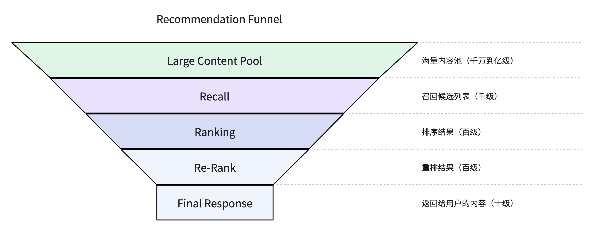
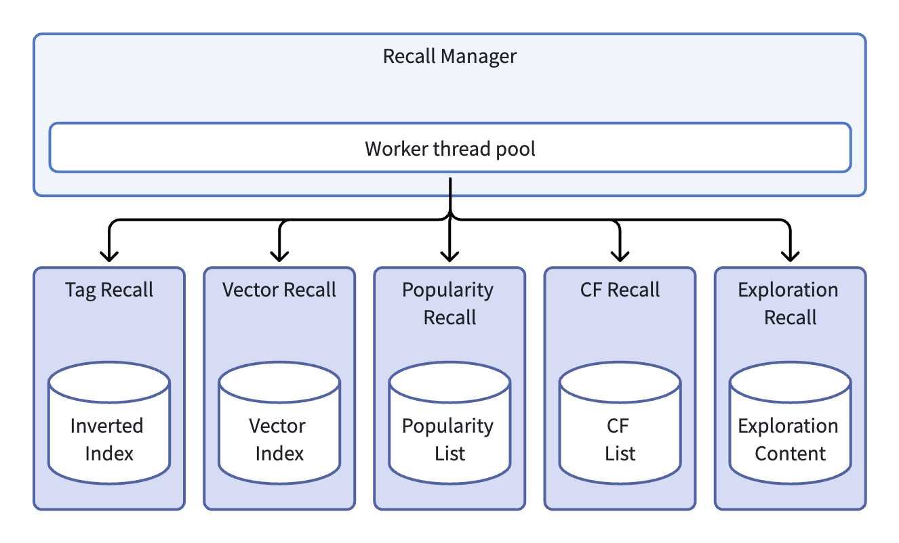
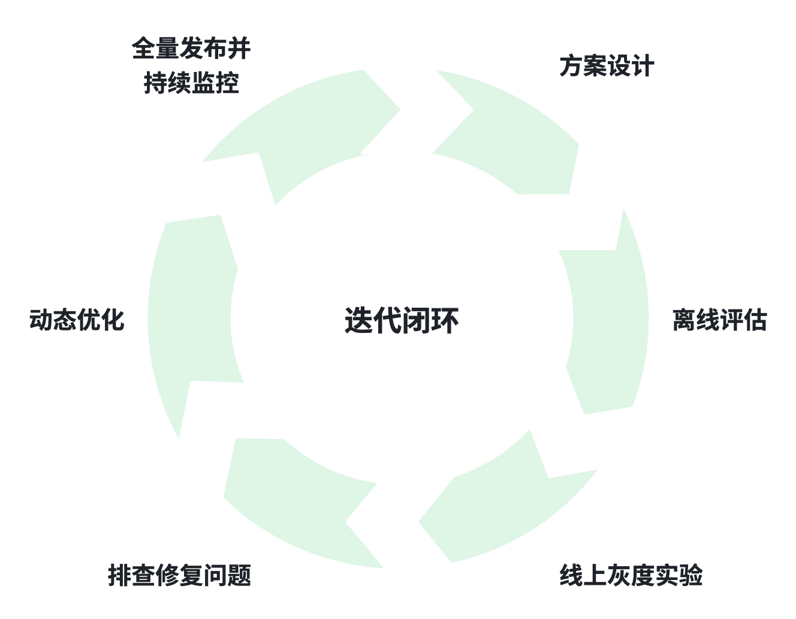

# 推荐系统架构（13）：多路召回，多源互补候选生成体系


**太长不看版**

面对海量（百万甚至亿级）的内容池，我们不可能把全部候选送入精排模型做打分计算。受在线请求时延的约束，召回层必须快速从海量内容里筛选出千级别高质量候选，交给后续排序模块处理。

只依靠单一召回源，往往会遇到兴趣窄化、冷启动效果差、单点故障、千人千面不足等问题。因此工业界几乎都采用多路召回架构：不同召回源各司其职，互相补足短板，再由 Recall Manager 完成统一调度、合并过滤、熔断保护。

本文从原理、各类召回源、工程调度、上线流程以及前沿演进，详细介绍这套海量内容池的高速筛选体系。

## 1. 多路召回必要性
### 1.1 推荐系统的漏斗结构

如本系列前面文章所说，推荐系统的目标是从海量数据中找到符合用户兴趣的内容，这个推荐的过程，就是一个信息筛选的漏斗。最开始的数据源是海量的内容池，经过召回、排序、重排等多个阶段。每个阶段从一个大的数据集过滤出来一个小的候选集，最终只返回给用户少数几十条数据。整个过程的漏斗模型可参考下图：



在这个漏斗中，召回层处于海量内容池之下最上游位置。召回阶段输入是百万乃至亿级的内容池，从中快速选出几千个候选，然后再进行后续的排序和重排。前面讲过，在线系统平均一次请求要在百毫秒级别完成，召回作为第一道筛选关卡，通常只能占用几十毫秒的时间预算。

所以，召回层的最大问题，就是怎么从海量的数据中，在极短时间内，尽可能把符合用户习惯的数据筛选出来。这里面两个核心关键词是快速响应和全面筛选，这也是召回层的首要目标。

### 1.2 单一召回源的缺陷

如果整个推荐系统只有一个召回源，那么会面临很多问题，首先是很难满足“全面筛选”条件。假如只存在以下某一种召回源：

- 兴趣标签召回：兴趣召回依赖准确的内容标签和用户画像，如果内容标签或用户画像不准确，召回质量会受很大影响。并且如果只存在兴趣标签召回，会把用户困在“信息茧房”中，最终的结果是兴趣面越来越窄。

- ANN 向量召回：ANN（Approximate Nearest Neighbor，近似最近邻）向量召回是在语义空间中寻找最相近结果，它的泛化能力很强。但对于新用户，可能不存在用户的向量表示，或者其向量表示非常有限，那么召回结果就很不准确。此外在热点爆发的场景下，向量索引的更新不是那么及时，对召回结果也会有影响。

- 热门召回：这是全局的热门内容集合，能保证内容的热度和时效性。但这类全局数据，所有用户看到的都类似，很难做到千人千面个性化。如果长期使用热门召回，还可能会加剧头部内容的马太效应，也就是越热的内容曝光越多，其他内容逐渐被淘汰。

- 协同过滤：协同过滤作为初代推荐系统最常用的算法之一，能很好地利用相似内容和相似用户关联，找到合适的内容。但它的短板很明显，Item‑CF 难以处理新内容，User‑CF 难以处理新用户，新内容、新用户场景下很难构建可靠的相似关系矩阵。

以上是从效果层面的影响。在系统方面，如果只存在单一召回源，也会带来一些问题：一旦该召回源发生故障，系统只能全面降级，完全失去个性化能力。另外，对于新老用户等不同场景，单一召回源也很难通过系统层面的配置返回差异化的召回结果。

### 1.3 多路召回的核心

从上面可以看到，单一召回源从策略到系统都存在很大问题，因此现在的推荐系统大部分都是采用多路召回策略，让各召回源的能力互补。多路召回的核心思想可以概括成一句话：**通过多种召回源的能力互补，在可控的计算成本下扩大候选集的覆盖面，并提升召回系统的健壮性。**

所以，多路召回的价值主要体现在：

- 能力互补：不同的召回源负责不同的策略，例如兴趣标签召回负责精准匹配、ANN 向量召回负责泛化、热门召回负责内容的时效性、协同过滤利用相似人群拓展兴趣。这些召回源共同协作，一起满足用户的浏览需求。

- 系统健壮性：因为多路召回源的存在，即使某一路召回发生故障或超时，剩余的其他路召回源还能给用户提供正常的推荐结果。虽然最终效果会受一定影响，但整个推荐流程不会因为某一路召回失败而中断。

- 精细化调度：通过调整召回源策略，可以满足不同的场景需求。例如新用户可以加大热门召回数量，老用户增加兴趣标签和 ANN 向量召回权重等，从而满足新老用户的不同需求。系统层面还可以给不同的召回源分配不同的时间预算配额，适配不同召回源计算成本和延时特性。

## 2. 常见召回源

### 2.1 兴趣标签召回

兴趣标签召回通过把用户的兴趣标签和内容中的标签进行匹配，然后计算匹配分数进行内容召回。这是实现用户个性化推荐的最基础的一种方式。

**离线数据处理**

系统对内容进行分析，解析出内容的关键词、分类、实体、主题等标签（参见《推荐系统架构（5）：内容资产体系，系统认知能力》）。每个内容标签都有置信度分数作为其权重，最终形成内容标签向量。处理完成之后，通过类似 Feeder 等模块，把离线数据推送到线上建立倒排索引。这个倒排索引建立的过程和搜索引擎非常类似。

当分发的内容产生用户反馈之后，系统根据用户的行为反馈数据计算其兴趣标签，包括长期兴趣和短期兴趣（参见《推荐系统架构（8）：用户画像系统，持续认识每一位用户》）。兴趣标签中包含用户对该标签感兴趣的程度作为权重，形成用户兴趣标签向量。

**在线检索**

在线请求进入推荐引擎之后，首先会取出用户兴趣标签，传到兴趣召回源。本召回源根据用户兴趣标签列表，从倒排索引中找到匹配的内容 ID 列表作为初步候选。所有初步候选找到之后，系统计算兴趣向量和内容向量的匹配分数，截断 Top K 个作为本召回源最终候选返回。

匹配分数的算法也是不断迭代演进，最开始用向量点积（Dot Product），后来引入 LR 模型、GBDT 模型。近年来，随着深度学习技术的普及，兴趣标签召回也开始采用 DNN 模型来学习兴趣标签和内容标签之间的匹配关系。这里使用的模型通常需要控制复杂度，只对倒排检索得到的有限候选进行轻量打分，本质仍然服务于召回阶段的 Top K 截断。

**优点和不足**

兴趣标签召回的优势是实现很直观，结果的解释性很强，结果候选和用户兴趣是强关联的。它的不足之处在于对用户明确的兴趣表现很好，但对于潜在兴趣覆盖不足。因为兴趣标签主要从行为反馈中计算得到，只能表达用户已经表现出来的兴趣，对于用户尚未明确表达的潜在兴趣，这类方法的挖掘能力相对有限。

### 2.2 ANN 向量召回

向量召回应该是目前业界推荐系统最主流的召回方式之一。向量召回的核心是把内容和用户都映射到一个语义向量空间，然后以用户向量为请求主体，通过近似最近邻搜索找到距离较近的内容向量。

**离线阶段**

在离线处理时，系统一般采用双塔模型（用户塔 User Tower、内容塔 Item Tower）。用户塔输入包括用户基础属性、行为反馈（浏览、点击等）以及相关上下文特征，经过用户塔的多层神经网络处理，输出表示用户的用户 Embedding 向量（User Vector）。内容塔的输入是内容相关的各类特征，可以处理图文、视频等多种内容，输出表示内容的内容 Embedding 向量（Item Vector）。

离线训练时，双塔模型通过海量的用户和内容交互数据，让发生过正向交互的用户向量和内容向量尽可能靠近。训练完之后，对所有的内容进行计算，生成内容向量，推送到线上建立向量索引。

**在线阶段**

常用的向量索引技术一般有 IVF-PQ 和 HNSW 两类，各自在检索的精度、内存占用和查询耗时等方面不一样。在线阶段使用离线预先计算好的内容向量构建向量索引。

请求进来之后，根据用户信息实时计算用户向量。然后通过向量检索的方式，在内容向量索引中找到和输入的用户向量关系最近的 Top K 返回。

**优点和不足**

向量检索召回的优势在于它的泛化能力很强，和兴趣标签召回不同，向量检索是通过高维的语义向量来计算用户和内容之间关联，不需要依赖显式的标签匹配。其不足之处在于对瞬时热点不敏感，主要原因在于新内容没有足够用户交互数据的情况下，计算出来的向量质量会相对较低。另一个问题是向量索引的构建更新需要比较多的计算资源，成本会相对高一些。

近年来，兴趣标签召回和 ANN 向量召回正在走向融合。前面说过，兴趣标签召回在演进过程中，也会通过 Embedding 将标签向量化，从而计算匹配度。这和双塔模型的输出非常类似，只是处理过程、所用算法不一样。从向量表示的角度看，传统标签匹配也可以表示为高维稀疏向量之间的匹配；而现代双塔召回通常使用低维稠密向量。两者在表示方式上逐渐融合，但在线索引结构和检索算法仍存在明显差异。

### 2.3 热门召回

热门召回即把全局内容按热度进行计算排序，选取排在最前面的 Top K 数据作为候选列表。热门召回主要作为推荐系统时效性的最重要补充，同时也是新用户或冷启动用户最重要的召回候选源之一。

**离线阶段**

系统定期（例如 5 分钟）计算每个内容的热度，一般会按浏览量、点击量，加上时间衰减（例如牛顿冷却），综合成一个热度分。对计算结果排序后取 Top K 放入热门池。现在的推荐系统一般会计算多维度的热门池，例如全局热门、同城热门、分类热门、实时热点等。在不同的场景下，可以根据策略获取不同热门池中的内容。

**在线阶段**

热门池在离线已经计算好，在线部分的逻辑相对比较简单。首先系统会根据热门池维度把内容列表保存在缓存的不同 Key 中。请求过来之后，系统根据一定策略（例如按地域分类）找到对应的热门内容列表，经过简单的处理然后返回。

**优点和不足**

热门召回的最大优点就是能保证用户的基础体验，能召回热点内容。因为在线处理逻辑简单，热门召回在常规推荐中作为时效性内容补充，在其他召回源出问题时也作为降级兜底方案。

热门内容在召回时需要注意控制比例。如果占比过高会加剧马太效应，即热度分靠前的内容得到的展示机会更多，后面可能更热门；而排在后面的内容越来越难得到曝光机会。


### 2.4 协同过滤召回

协同过滤（Collaborative Filtering, CF）召回是推荐系统最经典，也是历史最悠久的推荐方法之一。早在 20 世纪 90 年代，Tapestry 和 GroupLens 系统就已经有协同过滤的具体实现。协同过滤的核心假设：如果两个用户在过去有相似爱好，那么他们将来也能喜欢相似的内容；如果两个内容经常被同一类用户查看，那么它们之间通常存在一定关联。

所以在推荐系统召回源中，协同过滤一般有两种形式：

- Item-CF：这是基于内容关系的协同过滤。离线阶段，根据用户行为记录计算内容之间的相似度，构建“内容ID -> 相似内容列表 + 相似度分值”的映射表。在线请求时，根据用户最近交互过的内容 ID 查表获得候选内容列表。

- User-CF：这是基于用户相似行为的协同过滤。离线阶段，根据用户与内容的交互行为计算用户之间的相似度，为每个用户构建 Top K 相似用户列表。在线请求时，首先找到当前用户的相似用户，然后获取这些用户近期交互过的内容，根据用户相似度、内容交互强度等进行加权，得到候选内容列表。在用户规模很大的系统中，直接维护“用户 -> 相似用户”的关系成本较高，工程上也可以进一步对用户进行聚类，把具有相似兴趣的用户划分到同一个群体，并离线计算每个群体的候选内容池。在线阶段只需要根据用户所属群体直接查表获取候选。这种方式牺牲了一部分个性化精度，但可以显著降低存储和在线计算成本。

现在随着深度学习技术的发展，协同过滤思想也在向图表示学习方向延伸，衍生出 Graph Embedding、图神经网络 CF 等方案。这类方案将用户、内容视为图节点，交互行为作为节点之间的边，借助 Node2Vec、GraphSAGE、LightGCN 等算法挖掘图上的高阶协同信号。

工程实践中，Node2Vec 这类浅层图嵌入产生的向量，既可以直接用于 ANN 召回，也可以作为辅助特征输入双塔模型，或者离线计算得到 item-item 相似关系，复用传统 CF 查表逻辑。它可以保留协同过滤挖掘群体行为的能力，同时捕获图结构里的高阶连通信息。

### 2.5 探索召回

探索召回即经典的 EE 问题（Exploration vs Exploitation），是给用户明确感兴趣的内容（Exploitation）还是给用户推荐一些可能感兴趣的内容（Exploration）呢？为了避免用户陷入信息茧房，有必要加入一些探索性内容拓展用户兴趣，探索召回就是为了解决这个问题引入的。

探索召回的实现很简单，每次请求来之后，通过一定的算法找到一批探索内容返回。最基础的就是把新内容、长尾内容做成一个列表，在线时从中随机选取内容。其他方式还包括随机扰动召回，即在向量检索时对用户向量增加随机噪声；Bandit 算法，将内容/类别看成一个“臂”，通过汤普森采样或 UCB 算法动态决定每个臂探索的概率。

因为探索召回短期可能降低推荐质量，因此探索候选占比不宜过高，例如可以只分配较小比例的召回配额。但探索召回是很有必要的，它能让新内容、长尾内容获得曝光机会从而调整权重，也让用户有机会发现自己新的兴趣点，从而提升用户留存和活跃度。

### 2.6 召回源的统一抽象

前面介绍了五类常见的召回源，它们内部的实现逻辑和数据来源都不一样，但在 Recall Manager 层，这些召回源都会封装成统一接口。在工程实现中，召回源都封装成 RecallSource 接口，实现 recall 方法。

```java
List<RecallItem> recall(ExecutionContext context);
```

参数中的 ExecutionContext 对象保存了请求的信息、用户画像等数据（参考《推荐系统架构（12）：实时推荐引擎，链路的调度中枢》）。各召回源根据这些上下文信息执行各自的召回逻辑，然后返回 `RecallItem` 列表，每个 `RecallItem` 保存内容 ID、召回打分以及其他相关信息。

基于这个接口封装，前面几类召回源可抽象为：

```
RecallSource
 |-- TagRecall
 |-- VectorRecall
 |-- PopularityRecall
 |-- CFRecall
 `-- ExplorationRecall
```

统一抽象之后，Recall Manager 不用关心各召回源内部的具体实现，只需要按约定接口，并行发起各路召回调用，然后对返回的结果统一进行后续处理。每个场景、实验中，只需要在配置中指定需要哪些召回源，以及召回数量等参数，Recall Manager 就能很方便地完成调度。下一章开始介绍 Recall Manager 的更多细节。

## 3. Recall Manager

多路召回结果并不是简单的拼接在一起，而是需要进行一系列的处理，包括合并、去重、过滤、按比例截断等。这些处理发生在 Recall Manager 中。除了这些业务逻辑处理，Recall Manager 还需要进行稳定性方面保障，例如怎么防止某一路召回失败拖垮整个请求。

在架构层面，Recall Manager 以 Realtime Engine 中的一个 Processor 形式存在，即 RecallManagerProcessor，嵌入在推荐请求的处理链中运行。



### 3.1 并行调度和熔断降级

前面说过，召回阶段只有几十毫秒的时间预算。如果对所有召回源串行调用，就算只有五路召回源存在的情况下，每一路也只能分配不到 10 毫秒时间，很多召回源无法在这个时间内完成。因此，并行调用是最基本的运行模式。

在工程实现上，Recall Manager 使用独立的线程池来发起多路召回。例如，某个请求的参数如下：

```JSON
"recall": {
    "sources": [
        {"name": "tag", "size": 400},
        {"name": "vector", "size": 400},
        {"name": "cf", "size": 100},
        {"name": "popularity", "size": 100}
    ]
}
```

Recall Manager 根据请求配置选择已经注册的 RecallSource，并为本次调用设置召回数量、超时等参数。然后并行发出四个请求，由四个线程分别执行。每个召回源的超时可以分开设置，对于兴趣标签、向量召回，耗时长一些，例如设置超时为 50 毫秒；而 CF 和热门召回都是内存查表，超时设置 10 毫秒或 20 毫秒即可。对于这样的设置，总的召回获取候选阶段最慢会到 50 毫秒。如果超时还没有结果返回，会把对应失败那路召回放弃，继续后续处理。

如果某路召回持续超时或失败，则触发熔断策略，以免后续该路请求都失败，从而浪费线程池资源。熔断策略就按通用的滑动窗口统计，例如最近 100 次请求中错误率超过 20% 则触发熔断，之后定期（例如每隔 30 秒）允许少量请求探测服务是否恢复。对应的熔断参数可以由配置中心设置管理。

超时和熔断策略保证了召回系统的健壮性，整体请求不会因为某一路失败而被拖垮。

### 3.2 合并去重和多层过滤

各路召回源的结果返回之后，Recall Manager 需要把结果合并在一起，此时需要做去重和过滤等操作。

首先是去重，同一个内容可能会从多个召回源中获取。例如用户喜欢娱乐新闻，而某娱乐新闻正好是热点事件，那么某条娱乐新闻就可能同时存在于热门召回列表和兴趣召回列表中。Recall Manager 收到各路结果之后，需要根据内容 ID 做去重。

去重的实现比较直接，维持一个内容 ID 的哈希集合，如果内容 ID 尚未出现在集合中，则加入候选集并记录；如果已经存在，则视为重复，只保留一个 Item 实体。

此处扩展出一个问题：如果多个召回源都返回同一个 Item，应该保留哪个来源和分数？对于这个问题，我们之前的做法是只保留一个 Item 实体，但所有来源的分数都需要合并记录。例如：

```
Item A
recall_sources = [ANN, CF]
recall_scores = [0.83, 0.71]
```

来源信息和召回分数会继续传递给精排模型，在排序时可以根据多来源以及分数进行相应的打分。如果排序模型没有处理多来源情况，那么可以选择一个最高分作为模型输入。多来源和分数还可以用来做分析和故障排查，例如后续分析某一路的线上打分和离线评估是否一致，或者分析某个 Item 会被哪些召回源同时命中等。

> 补充：除透传多路分数给精排之外，工业也常用 RRF 等融合算法，在 Recall Manager 阶段直接对多路结果做分数融合重排，再截断输出候选集。

合并去重之后，还需要对候选集做过滤。召回层的过滤通常比较轻量，执行速度较快，主要包含以下几类：

- 业务规则过滤：黑名单（作者被封禁、内容被举报等）、不符合展示标准的内容（例如图片不清晰、时长不符合要求等）。
- 用户已读历史过滤：用户已经看过的内容不应该再重复出现。用户已读历史包括短期已推荐、长期已曝光（参考《推荐系统架构（10）：在线系统总览，100毫秒内完成一次推荐》 7.2 User History 章节）。如果已读历史太长，为了性能考虑，会根据时间进行 Top N 截断。
- 内容质量过滤：内容质量分如果低于阈值会被过滤掉，避免低质量内容进入候选集合。

### 3.3 召回配额和动态调度

3.1 节展示的配置，每个召回源可以配置返回条目数，这种策略是静态配额配置。但在实际的推荐系统中，场景是动态变化的，用户的兴趣爱好也会实时变化。例如，如果有突发的热点事件，热门的召回比例应该临时放大；晚上时间段，很多用户倾向于娱乐休闲内容，这时候兴趣标签或协同过滤的召回权重应该提高。因此，对于每个召回源返回条目数的动态调配是 Recall Manager 中一个重要的进阶功能。

动态调配可以有两种实现方式：

- 规则化配置：在配置中心可以设置规则，例如：某类突发事件标签命中时，热门召回配额提升 20%，或 23:00 - 6:00 时间段，探索召回配额下调为 0。Recall Manager 在处理召回源配额时，会读取该规则然后执行。

- 实时信号自动调节：Recall Manager 接入实时的热度信号，根据人工或者自动训练的算法模型，来调整各路配额权重。

在推荐系统的初期，或者体量不是很大的情况下，静态配置各召回源配额应该能满足业务需求，此时不一定需要追求动态调配。只有当系统规模达到一定程度，需要对不同用户和场景进行更精细化的体验优化时，动态调配才能真正发挥作用。

## 4. 召回源的工程化上线

前面章节主要介绍了召回源本身的策略和工程实现，以及 Recall Manager 的核心功能。本章来看一个新的召回源，或者已有召回源算法模型升级之后，怎么发布到线上。

### 4.1 线下方案设计

任何一路新的召回源，或者已有召回源的升级，在进入线上之前，都需要完成线下的方案设计和数据准备。

方案设计首先考虑这个新增的召回源是为了解决推荐环节中的哪一类问题、或者召回源升级的目标是什么？例如计划新增一个“多索引混合”召回源，并行使用稀疏向量、密集向量和不同 Embedding 模型生成的多套索引分别检索，然后再用 RRF 等算法将结果融合。这个新增召回源的目的是为了兼顾不同向量模型的优势，避免单一 Embedding 模型的语义偏差。

方案设计好之后，下一步是数据准备，根据历史行为反馈数据，构建合适的训练样本。样本生成代码和正负样本规则确定后，将其加入样本生成和模型训练 Pipeline，同时确定 Pipeline 的运行周期和训练数据时间范围。例如上面说的多索引混合召回，可以采用和传统向量召回的双塔模型类似的 7 ~ 14 天数据。

样本生成和模型训练完之后，需要确定索引方案。如上面所述的几类召回源，使用的索引结构不一样：

- 倒排索引，初期可以直接使用 Elasticsearch 这类开源搜索引擎，利用其倒排索引机制进行服务。规模上升之后，也可以自研专用的倒排索引系统。

- 向量索引，使用 IVF-PQ 或 HNSW 算法对所有内容的 Embedding 向量创建索引。

- 协同过滤、热门等，这些数据都是提前离线计算好，在线时可以直接存储到类似 Redis 这样的 KV 存储，然后通过 Key 查询获取候选集合。

在样本生成、模型训练、索引结构等环节，还需要注意版本管理，让各个模块使用的处理逻辑都保持一致。

### 4.2 离线评估

在《推荐系统架构（9）：模型训练流程，从用户行为到模型资产》，介绍过模型在发布之前需要进行离线评估，并介绍了几个常用的评估指标。召回源的上线，本质也是模型的发布，所以同样也要经过离线评估。离线评估主要评价指标包括：

- 召回率（Recall）：评估用户真正感兴趣的内容有多少比例被选择出来，这个是直接关乎到召回源有效性的指标。
- 准确率（Precision）：召回源返回的数据中，有多少是用户真正感兴趣的，这个指标反映召回源返回的精准度，避免无效的候选浪费后续流程的计算资源。
- F1 分数：召回率和准确率的调和平均值，综合评价一个召回源的整体基础效果。
- 命中率（Hit Rate）：一般统计 Hit Rate@K，即对于每个用户，判断 Top K 召回结果中是否至少包含一个该用户真实交互过的正样本，再统计发生命中的用户比例。这个指标反映召回源命中用户真实行为的能力。

除了以上几个通用的模型评估指标，还有如下两个召回源特有的评估指标：

- 覆盖率：统计这个召回源返回的所有候选内容，覆盖全平台可推荐内容的比例。这个指标可以衡量一个召回源对长尾内容的挖掘潜力，避免马太效应。
- 独立召回占比：统计一个召回源能单独命中，而其他召回源覆盖不到的内容比例。这个指标反映该召回源的不可替代性，也是判断一个召回源是否冗余的重要依据之一。这个指标有的系统也会称作“唯一贡献度”指标。

在做完以上离线评估之后，如果该召回源的离线指标达到预期，下面就进入在线 A/B Test 阶段。

### 4.3 在线 A/B Test 验证

召回源通过离线评估之后，就可以进入线上 A/B Test 验证阶段。

整个推荐链路有多个环节，召回、排序、规则重排等，每个阶段都有相应的算法、模型、策略。召回层如果要进行线上的 A/B Test，一个办法就是固定其他变量，例如采用相同的排序模型、相同的重排策略，然后只在召回层把新召回源和线上已有召回源分 Bucket 做对比实验。这种办法可行，但可能存在一些局限性：

- 首先是召回层的实验和排序、重排等实验是平铺成一层排列，如果召回、排序、重排的实验都共享同一个互斥实验空间，随着各层实验数量增加，可用于单个实验的流量会不断被切碎；如果进一步验证不同层策略的组合效果，还会产生组合爆炸问题。

- 召回源的实验是在某一个排序模型、某一种重排策略固定的情况下进行。如果召回源和后面的排序模型可能有关联，可能会导致这个召回源在这个排序模型下表现好，换一个排序模型之后表现就不太好了。解决这个问题的办法，就是在多组排序模型下进行召回源的实验。如果有 N 组排序模型、M 个召回源，那么就需要 N x M 个实验组合，又遇到上面第一点那个实验流量不够用的问题。

因此，在大型推荐系统中，通常会采用分层实验框架，召回层、排序层、重排层，都有自己单独的实验空间划分。这个实验空间内的流量都是正交的，即某一个召回源的实验，后续可能落在 N 个排序层实验 Bucket 中。这样可以缓解前面所说的实验流量不足问题，并允许不同层实验共享流量。

> **正交分层实验的前提：假设两层实验之间无显著交互效应；当召回与排序存在强交互时，分层实验会带来偏差**。关于多层实验框架，后续可以规划专题文章继续进行介绍。

在线实验运行一段时间之后（不同流量运行周期不一样，一般和业务团队一起协商），对线上的指标进行评估，评估包括：

- 系统指标：CPU、内存、召回源耗时（平均值和 P99）、错误率等。
- 召回质量指标：召回率、准确率、命中率、覆盖率、独立召回占比等。
- 业务指标：CTR、停留时长、次日留存、人均浏览类别等。

系统指标用于评估召回源运行是否稳定；召回质量指标用于判断该召回源是否具有增量价值；业务指标则用于衡量召回源上线后对实际业务的影响。一般来说，业务指标是决定一个新召回源最终是否全量上线的核心依据。

### 4.4 线上工程难点

召回源上线之后，运行过程中会遇到各类工程挑战，以下是几个典型的问题：

**耗时抖动**

某些召回源（例如向量检索）的耗时受索引大小、流量情况的影响，可能会偶尔出现耗时飙升的现象。这类问题我们是通过 Recall Manager 给各召回源设置独立超时控制和线程池隔离，避免单路召回源耗时抖动影响整个链路请求。

**冷热用户适配**

新用户的兴趣为空或者很少，老用户的兴趣很丰富。Recall Manager 可以根据用户活跃度来动态调整召回配额。例如对于新用户可以加大热门召回的比例；对于老用户则召回更多兴趣标签、向量匹配数据，然后用协同过滤和探索来辅助拓展兴趣。

**级联雪崩风险**

某一路召回源异常超时，大量超时请求堆积占满线程池，会拖垮整个召回层，进而拖垮整个推荐流程，引发全链路的雪崩。对于这类问题，需要在 Recall Manager 中为每一路召回设置独立的熔断策略，不同召回源的熔断阈值也单独设置。这种分级熔断的机制能更好保护整体的推荐链路稳定性。

**索引热更新冲突**

这类问题一般会发生在兴趣标签和向量召回源这类索引比较大的召回源中。其主要表现是索引更新的过程中，容易出现请求返回空结果或重复数据。要避免发生更新冲突，系统一般会采用双版本机制，将当前服务索引和待更新索引分开。新索引更新完之后，通过原子操作来切换新版本；旧版本索引要确认已经没有请求之后，再进行释放。不过，双版本机制在切换期间最多可能会占用双倍的存储资源，因此需要根据线上数据规模和资源成本确定具体方案。一种可能的优化办法是对索引进行分块更新，把大数据量的双版本索引更新为小批量双版本索引，能显著降低占用的存储资源。

以上介绍了几种常见的召回系统线上工程问题，实际运行过程中还会遇到其他问题。不过解决这些问题的根本原则就是保证系统稳定性、尽可能给用户提供更好的体验，同时还要权衡系统的成本。

### 4.5 标准化工程迭代闭环

召回系统的建设和优化不是一次性的工作，而是不断迭代的过程。通过前面几个小节，可以总结出一个标准化的迭代流程：




这个闭环由数据驱动，并在线上快速验证。方案设计阶段，明确业务目标之后，基于历史数据进行实验，确定优化方向；线上灰度实验时，在不同流量下观察新策略对业务指标的影响。如果过程中发现问题，进行问题排查，继续调优，直至达到预设的业务目标。这个过程不是简单的线性推进，而是多个环节的相互反馈，最终全量发布，开始下一轮的业务迭代。

## 5. 未来演进和总结

### 5.1 未来演进

召回作为推荐系统第一道筛选关卡，是推荐结果能否满足用户需求的基础。业界也在持续研究和迭代召回系统。对于召回系统未来演进的方向，目前有以下几个：

**智能动态路由**

前面 3.3 节讲解了动态调配，未来的演进方向是更智能，达到自适应多路召回的目标。其核心是根据用户的实时状态、设备性能、当前流量水位等，动态决定当前请求启用哪些召回源，以及各召回源分配多少候选配额。这个演进方向是之前介绍的智能调配进阶版，接收更多输入信号，进行更多的智能化判断。这样可以从全局维度优化召回层的资源利用率和服务稳定性，是兼顾效果和工程稳定性的重要方向。

**深度召回与长序列建模**

随着深度学习技术的发展，召回模型也在不断增强对用户兴趣和内容语义的建模能力。相比传统双塔模型主要依赖相对固定的用户特征和行为聚合，新一代深度召回开始引入 Transformer、SIM 等序列建模技术，从更长的用户行为历史中学习兴趣变化，生成更丰富的用户兴趣表示。对于超长行为序列，还可以通过分阶段检索和建模，先筛选与当前请求更相关的历史行为，再进行深度兴趣建模。这类技术可以增强召回系统对用户长期兴趣和兴趣演化的捕捉能力，并与向量检索等候选生成方式结合，提升大规模内容池中的召回效果。

**生成式推荐/生成式召回**

这是大模型时代对推荐系统的一次颠覆性探索，它打破了传统的从已有候选池中检索匹配的模式，直接用大语言模型根据用户的历史行为、上下文，自回归生成用户接下来可能感兴趣的内容 ID。不过从当前工业落地来看，“生成 + 检索”的混合架构仍然是更具可操作性的方案之一。该方案先生成兴趣关键词、Embedding 向量，再从现有内容池中搜索，这样既能保留生成式召回的探索性，又能避免大模型的幻觉问题。

**可学习稀疏表征召回（以 SPLADE 为代表）**

这个方法是利用预训练语言模型为每一个内容和用户 Query 生成可学习的稀疏权重向量，然后复用成熟的倒排索引架构来进行匹配召回。该方法主要通过模型学习实现了语义泛化能力，解决传统 BM25 在语义匹配上的不足。该方法不需要依赖向量数据库的复杂索引，可以复用成熟的倒排索引基础设施，并通过稀疏化控制在线检索成本，是兼顾效率、成本和效果的高性价比方案。

**召回-排序联合优化**

这个方向是为了打破传统推荐系统召回、排序两阶段割裂的方式，让召回环节也能感知后续排序模型的打分偏好。一种常见实现方式是将排序模型的知识蒸馏到召回模型中，这样召回阶段筛选出来的候选就是后续排序模型打分比较高的优质内容。这种两阶段联合优化的方式，是工业界提升全链路推荐效率的重要研究方向之一。

### 5.2 总结

推荐系统的召回层，需要从百万乃至亿级内容池中，在几十毫秒内筛选出符合要求的候选集合。无论未来召回技术如何演进，在如此短的时间内进行复杂运算获取合适结果集，都需要多路具有不同能力的召回源共同协作来完成，才能在满足业务需求的同时保证服务稳定性。

本文基于多路召回的理念，从为什么需要多路召回、常见的召回源、Recall Manager、召回源上线流程以及未来演进方向，系统介绍了召回系统的理论和实践。这些内容可以归结为一句话：**工业推荐系统的召回，本质上是把多个能力边界不同的候选生成器，通过统一抽象、并行调度、配额控制、去重过滤和熔断降级，组合成一个稳定、健壮、可扩展的候选生成系统。**

## 附录：实战思考题

看完文章，大家可以尝试回答下面两个问题：

1. 如果召回总的时间预算是 50 毫秒，系统配置了兴趣标签、向量、协同过滤、热门和探索五路召回。你会怎么去分配各路召回的时间？为什么会这么设置？
2. 冷启动用户没有任何兴趣标签，那么在召回层你会设定什么策略来进行结果的召回？设定这些策略的依据是什么？

以上问题没有标准答案，文中给出了部分实践思路，欢迎大家在评论区一起来探讨。

> 本系列还在持续更新，建议收藏，方便后续对照阅读。
