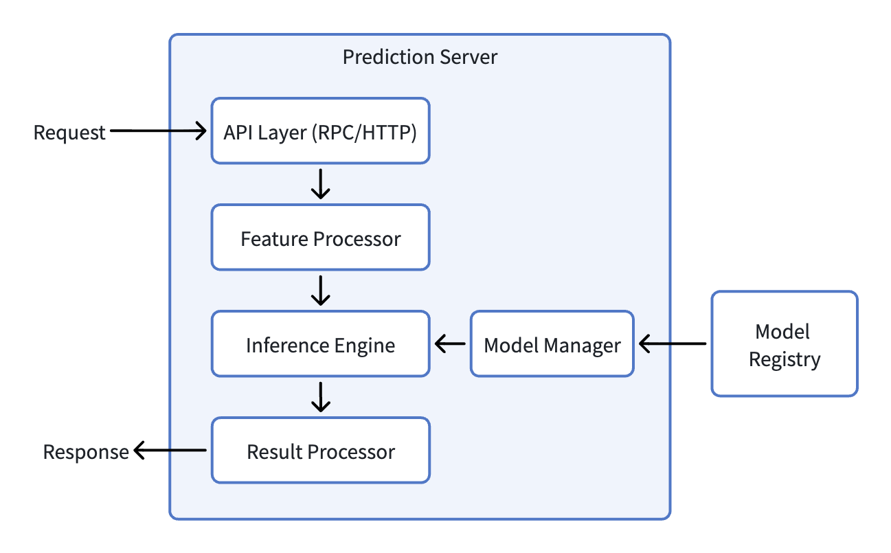
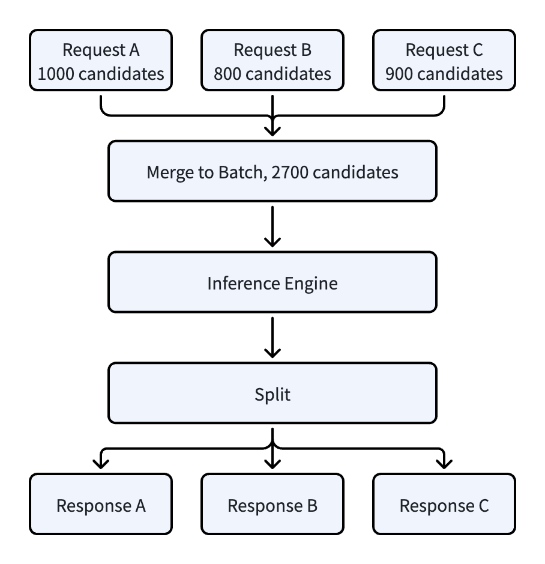
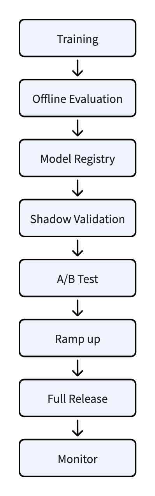

# 推荐系统架构（14）：精排与 Prediction Server，千级候选的毫秒级打分引擎

**太长不看版**

召回阶段从海量内容池中筛选出约 1000 条候选条目，精排阶段对这 1000 个内容进行精细化打分，排序后选出 200～300 条进行重排。精排阶段模型比召回复杂得多，计算成本显著增加，因此需要独立的高性能推理服务，即 Prediction Server。

Prediction Server 是一个无状态的模型推理服务，内部主要模块有：API 层、特征处理、模型管理、推理引擎、结果处理等。它支持多模型共存、热更新、Batch 推理。Prediction Server 由 Realtime Engine 调用，成为推荐链路中最重要的环节之一。

本文从精排定位、模型体系回顾、Prediction Server 架构、性能优化、多目标融合、高可用治理、新模型上线流程等方面，系统介绍这套千级候选的毫秒级打分体系。

## 1. 精排在推荐链路中的定位

### 1.1 从召回到精排

上篇文章展示了推荐系统信息筛选漏斗：海量内容池 -> 召回（约 1000 条候选）-> 精排（Top 200～300）-> 重排，最终展示几十条。精排位于这个漏斗第二层，负责把 1000 条候选进行精细化打分，然后筛选头部 200 多条进行重排，最后返回。

召回阶段需要从海量内容池中筛选候选集，通常依靠索引检索、预计算向量等方式控制在线计算成本。到了精排阶段，候选一般只有千级别，需要计算的规模大大缩减，因此可以用更复杂的模型以及更丰富的特征做精细化打分。

### 1.2 精排与召回的区别

精排和召回阶段，可以从三个维度进行对比：

- 目标不同。召回要从海量内容中尽可能把用户可能感兴趣的内容找到，追求覆盖率；而精排是从少量候选中把最符合用户兴趣的内容排在前面，追求“排得准”。

- 计算规模不同。召回数据来源是百万乃至亿级内容，通常通过索引检索、向量预计算和轻量在线计算控制成本；精排的数据来源只有千级候选，可以用精细模型（多目标 DNN、序列模型），单条计算量变大但总体可控。

- 特征丰富度不同。召回通常优先使用可预计算、可索引的特征表示；精排可以使用交叉特征、实时行为序列特征、上下文特征等更丰富的组合。

### 1.3 粗排和精排

当召回计算出来的候选集合比较大（数千到上万）时，一般会在召回和精排之间增加一层粗排，用比精排轻量但比召回重的模型将候选从数千压缩到数百。本文介绍的系统召回阶段只返回 1000 条，没有设计独立的粗排层。

精排阶段对召回或者粗排返回的候选集，用更复杂的模型为每条候选精准打分，现代推荐系统一般都是针对每条内容输出多目标预估值，然后综合排序取前 200～300 条。

## 2. 精排模型体系

> 本章只做简要回顾，算法原理参考第2篇，特征工程参考第3篇，模型训练参考第9篇。

### 2.1 精排模型的工程演进

精排模型经历了如下演进：

- **LR 时代**：线性模型，特征工程为主，推理极快、可解释性强，但表达能力有限。
- **GBDT 时代**：树模型自动学习特征交叉（XGBoost/LightGBM），大幅减少人工特征工程，推理仍很快，但高维稀疏特征处理能力有限。
- **深度学习时代**：主要使用深度学习模型（Wide&Deep、DeepFM、DIN 等），Embedding 自动学习高维稀疏特征，表达能力大幅提升。但推理成本也显著增加，需要专门推理服务支撑。

随着深度学习模型广泛应用，推荐排序也逐渐从单一 CTR 优化走向多目标联合优化。也就是一个模型，可以同时输出 CTR、停留时长、点赞率、收藏率等多个预估值。这种多目标输出能更好地对用户体验进行综合优化。多目标优化模型的表达能力增强，对应的在线推理基础设施也要进行相应升级来支持。

### 2.2 多目标精排模型

首先我们来看为什么需要多目标模型。之前排序模型的单一 CTR 优化会导致标题党泛滥，因为模型只关心用户会不会点，不关心点了之后体验好不好。而用户体验是综合的，用户点击内容之后马上退出是负体验，点击并且长时间停留才是正体验，还有点赞收藏评论是深度正体验。所以我们需要多目标模型，对多个指标进行预测，综合之后再行排序。

多目标模型的常见结构有：

- **Shared Bottom**：底层共享，顶层每个目标一个 Tower。最简单，但目标差异大时存在负迁移。
- **MMOE**：多个 Expert 共享，每个目标有独立 Gate 动态决定 Expert 组合。缓解负迁移，工业界常用。
- **PLE**：通过共享和目标专属 Expert 逐层提取信息，有助于缓解任务间干扰，但结构更复杂，效果需结合业务验证。
- **ESMM**：针对点击后 CVR 预估的样本选择偏差和数据稀疏问题，通过 pCTR × pCVR = pCTCVR，在全曝光样本上联合训练 CTR 和 CTCVR 任务；这里 pCVR 指点击后的条件转化概率。

在实际工程实现时，需要注意目标数量并不是越多越好，相关性强的适合联合训练，弱的分开建模效果可能更好。多目标模型在线推理成本比单目标高，需要在 Prediction Server 中优化。离线评估时，也需要综合看所有目标指标，不能只看单一 AUC。

### 2.3 精排特征体系

精排特征分为四类（特征工程原理参考第3篇，此处侧重精排特有使用方式）：

- **用户特征**：基础属性、兴趣画像（长期/短期标签、兴趣 Embedding）、行为序列（最近点击/浏览序列）、统计特征（历史 CTR、平均停留时长）等。
- **内容特征**：基础属性（分类、关键词、实体、作者）、内容 Embedding、统计特征（历史曝光量、点击率、热度分）、质量特征（内容质量分、低俗检测分）。
- **交叉特征**：用户-内容交叉（用户对该分类/作者/关键词的历史 CTR）、召回来源特征（该内容被哪些召回源召回、各源打分）。召回来源特征可用于粗排和精排，同一内容从兴趣标签召回和从热门召回，用户点击意愿可能不同。
- **上下文特征**：请求时间、时间段、场景（首页/信息流/搜索）、实时热点信号等。若使用位置特征，需要处理位置偏差，并明确推理时的位置取值，不能直接使用排序后才确定的展示位置。

### 2.4 模型输入输出结构

模型的输入是待排序的候选内容集合（本文为召回返回的 1000 条候选）、上节描述的各类特征。其中可共享的用户特征和上下文特征在请求内准备一次，和每个 Item 的内容特征、交叉特征拼接形成 Batch 输入（用户/上下文特征在 Batch 内广播）。

多目标模型输出每个 Item 的多个目标预估值，示例如下：

```JSON
{ "item_id": "D0001", "predictions": { "ctr": 0.083, "dwell": 47.5, "like": 0.012 } }
```

这些原始预估值传给多目标融合模块计算最终排序分。多目标融合逻辑在第 5 章详细讨论。

## 3. Prediction Server 架构设计

### 3.1 独立 Prediction Server 设计

在 LR、GBDT 模型时代，在线推理的计算成本很低，精排的模型可以内嵌在 Realtime Engine 中（例如可以设计 LRRankingProcessor、GBDTRankingProcessor 等）。但到深度学习时代，随着多目标模型的普及，在线推理计算成本增加，所以需要拆分独立服务，即 Prediction Server。独立拆分服务的优势有：

- 计算资源隔离。深度学习模型推理是 CPU/GPU 密集型操作，和其他业务逻辑（召回、特征获取、重排规则）同进程会互相影响。独立部署 Prediction Server，可以让该服务独立扩缩容，在系统因计算资源不足时进行扩容，不影响推荐流程其他节点。

- 技术栈解耦。模型在线推理由 C++/Python 和推理引擎（例如 ONNX Runtime、TensorRT）实现，追求的是计算性能；而 Realtime Engine 可能用 Java/Go/C++ 等开发，主要专注开发效率。独立拆分让引擎和排序服务可以各自选择最合适的技术栈。

- 多模型统一管理。系统中存在多个模型（精排、粗排、多个场景、多个实验），统一的 Prediction Server 集中管理模型加载、版本切换、多版本共存等能力，为 A/B Test 提供模型执行支持。

- 独立迭代节奏。排序模型有多个，更新很频繁（天级甚至小时级），业务逻辑更新相对较慢。独立部署后，模型的更新只需处理 Prediction Server 服务，不影响推荐流程的其他环节。

从架构层面来说，Prediction Server 是一个无状态的模型推理服务，它接收特征输入，返回模型打分结果。这里的“无状态”指不保存跨请求的用户会话状态，实例内仍会驻留模型和缓存。模型文件从 Model Registry 拉取。

### 3.2 服务整体架构

Prediction Server 架构如下：


主要模块职责：

- API Layer：负责接收推理请求，解析请求中的模型名称、版本、特征数据，然后路由到对应模型实例。API 层可以使用 RPC 或 HTTP 协议，高性能场景下一般用 RPC。
- Feature Processor：特征预处理，包括：类型转换、缺失值填充、特征校验，同时准备排序侧 Feature Log 数据随响应返回。
- Model Manager：管理模型生命周期，包括：加载、热更新、多版本共存、内存管理等。这是 Prediction Server 内部最复杂的模块之一，后面会展开细节。
- Inference Engine：核心推理模块，负责模型的推理执行，第 4 章详细讨论。
- Result Processor：模型输出后处理，例如：概率校准、多目标分数封装等，然后把封装好的内容返回给调用方。

### 3.3 模型管理与加载

不同框架产出格式不同（TensorFlow SavedModel、PyTorch TorchScript/ONNX、LightGBM 原生文件）。本文选择在算子和格式兼容的前提下，将模型导出或转换为 ONNX，并使用 ONNX Runtime 作为统一推理后端，适配 CPU、GPU 等硬件，减少多框架维护成本。转换后仍需验证算子支持、数值一致性和性能；无法兼容的模型需要保留相应后端。

对于模型加载策略，一般可以有以下方式：

- 启动加载：服务启动时加载全量模型，全部就绪之后开始接收请求。这种方式缺点是启动时间会被拉长，尤其是大模型，加载可能需要分钟级，导致机器启动时不能快速提供对外服务。

- 异步加载与预热：服务进程启动后异步加载模型，并用代表性输入执行预热。K8s readiness probe 应在必需模型加载并预热完成后才标记实例就绪；如果需要按模型分别接流量，还要配合模型级就绪检查和路由。

模型如果有迭代，可以在不停服的情况下热更新。一般更新流程如下：

1. Model Manager 监听 Model Registry 的版本变更（或者定时查询）。
2. 下载模型及配套元数据到本地，校验完整性和兼容性。
3. 把模型加载进内存，执行预热并校验输出。
4. 新模型就绪且发布策略允许切换后，原子切换默认版本（例如切换指针）；显式指定版本的实验请求仍路由到对应版本。
5. 旧版本不再承接实验或对照流量、在途请求全部完成后，再按回滚保留策略释放。

这种双版本同时服务的机制能保证更新期间服务不间断，保留旧版本实例或可快速重新加载的模型制品后，也便于回滚。不过该机制需要注意，热更新期间新旧模型会同时存在，占用额外内存，在估算内存容量时要预留这部分余量。加载过程中也会导致 CPU 使用率升高，所以一般建议在低峰期进行模型更新。

### 3.4 特征拼接与校验

Realtime Engine 传入的特征是结构化 Key-Value 数据，在 Prediction Server 内部需要把它们转换为模型输入 Tensor：

- 稀疏特征（ID 类）：先按训练时的词表或哈希规则编码成整数 Tensor。Embedding 查找通常由模型图内的算子完成；若使用外置 Embedding，也可以先查表得到稠密向量，再传入模型。Embedding 表可内置在模型文件中，也可放到外部的参数服务器。推荐模型 Embedding 表通常占模型体积一大半以上，外置可减小模型文件但增加一次网络查询。
- 稠密特征（统计值）：直接转浮点 Tensor，可能需要归一化，如果进行归一化要和训练时参数保持一致，对应参数保存在模型元数据中。
- 序列特征：按时间排列，做 Padding/Masking，截断到训练时最大长度。
- 多值特征：转多热向量或 Bag Embedding。

> 注：模型推理的过程可以大概理解为“接收 Tensor -> 完成图内算子处理 -> 输出 Tensor”。所以特征需要转换为推理执行引擎能识别的 Tensor。

特征处理需要对特征进行校验：

- 特征缺失时可以用默认值填充，此填充需要和训练时处理逻辑一致；
- 类型错误尝试转换或用默认值；
- 值域异常（例如停留时长为负、CTR 超 1）做截断或标记告警；

此处的特征处理逻辑要和离线训练保持一致，然后通过 PSI 监控在线特征分布和训练时差异，当分布偏移超过预设阈值时告警并排查。PSI 只能提示分布变化，不能单独证明逐样本特征一致，还需按同一事件时点抽样核对取值。

按本文的日志设计，每次推理时，Prediction Server 会把排序侧 Feature Log 数据，包括：request_id、模型版本、每个候选特征快照、模型原始输出等准备好，作为响应的一部分返回给 Realtime Engine。Engine 收到排序的日志，和召回阶段以及后续的重排阶段日志合并在一起，写入到完整的 Feature Log 中。特征快照可能显著增加响应体积，需要将日志序列化和传输开销计入延迟、带宽预算，并明确采样和字段裁剪策略。

### 3.5 推理执行引擎

推理执行引擎是 Prediction Server 的核心，执行流程可以概括为：

```
接收 Tensor -> Batch 调度 -> 推理后端（Backend）执行 -> 返回 Tensor
```

**推理后端与服务框架选型**：

- **ONNX Runtime**：微软开源跨平台推理引擎，CPU/GPU 都有优化，工业界比较常用的统一后端。
- **TensorRT**：针对 NVIDIA GPU 优化的推理引擎，适合 GPU 部署，需验证模型转换兼容性和实际性能。
- **TensorFlow Serving / TorchServe**：分别面向 TensorFlow 和 PyTorch 生态的模型服务框架，与 ONNX Runtime、TensorRT 这类推理后端所处层级不同。TensorFlow Serving 可用于生产部署；TorchServe 已进入有限维护状态，新项目选型时需考虑维护现状。
- **自研推理引擎**：大公司、有能力的大团队，针对推荐模型特点（大量 Embedding 查找、稀疏特征）进行自研深度优化。

在早期 GBDT 模型时代，我们曾经自己实现过轻量的 GBDT 执行引擎，直接集成在 Prediction Server 中。后来到了深度学习模型时代，模型执行逐渐交给 TensorFlow Serving 等专业推理框架；ONNX Runtime 出现后，又可以进一步解耦训练框架和在线推理框架。本文介绍的 Prediction Server 架构，主要采用以 ONNX Runtime 作为统一推理后端的设计思路。

对希望统一模型格式、兼顾 CPU/GPU 部署的团队，ONNX Runtime 是值得优先评估的选择，具体性能和成本仍需压测验证。在工程实现中，Batch 调度是推理引擎最关键的一个环节，它直接决定吞吐和延迟，第 4 章详细展开。

### 3.6 Prediction Server 与上下游的协作

**与 Realtime Engine 的协作流程**：

1. Realtime Engine 进行多路召回，获得约 1000 条候选。
2. 请求 1000 条候选内容对应的特征。
3. 构造推理请求，根据当前实验的配置，指定模型名称和版本，发给 Prediction Server。
4. Prediction Server 执行推理，返回多目标预估值。
5. Realtime Engine 做多目标融合计算最终排序分，取 Top 200～300 交给重排。
6. Realtime Engine 在重排结束之后，拼接完整 Feature Log 写入文件或 Kafka。

在上面流程中的第 2 步，是获取候选内容的特征。关于特征获取有两种设计：

**第一种（本文主设计）：Realtime Engine 获取全部特征，发送给 Prediction Server。**

Realtime Engine 从 Feature Server 批量获取用户、内容、交叉、上下文特征，随请求一起发给 Prediction Server。Prediction Server 只负责推理，不关心特征来源。

这样做的优点是特征获取和推理解耦，Prediction Server 的职责比较单一。在特征获取时，也能复用一部分召回阶段已有的特征，例如用户画像、部分内容基础属性等。如果特征获取失败时，Realtime Engine 可以统一做降级。但这个方案最大的缺点就是请求传输量比较大，以 1000 候选为例，特征可能会有几百 KB 甚至到 MB 级别。

**第二种：Realtime Engine 发送实体标识和特征需求，Prediction Server 自行获取特征。**

Realtime Engine 请求 Prediction Server 提供用户 ID、候选 Item ID、必要的请求上下文，以及需要哪些特征（Feature Name List），Prediction Server 根据这些信息从 Feature Server 获取。

这种设计的优点是 Engine 到 Prediction Server 的请求传输量小，特征依赖由 Prediction Server 管理，模型特征变更不影响调用方，在 Prediction Server 内部也可以做特征预取和缓存优化。但缺点就是 Prediction Server 和 Feature Server 耦合相对较紧，Feature Server 的抖动会影响整个推理请求的延迟。

在实际的工程实践中，也可把两种设计混合使用。用户和上下文特征由 Realtime Engine 传入（复用缓存），内容和交叉特征 Prediction Server 从 Feature Server 中获取（减少传输量）。本文描述的是我之前具体实践过的推荐系统，以第一种设计为主。

**Prediction Server 与 Model Registry 的协作**。

Prediction Server 启动时从 Model Registry 拉取当前线上模型，运行时按发布策略检查待加载版本并触发热更新。此外，模型元数据（特征列表、输入输出格式、校准参数）也从 Model Registry 获取，用于特征校验和请求解析。上面说的第二种特征获取设计中的 Feature Name List 可以从元数据中自动获取。

## 4. 在线推理性能优化

### 4.1 推理性能的核心指标

- **延迟**：单次推理端到端耗时，一般关注平均值和 P99（尾部延迟）。在部分高性能在线推荐场景中，精排阶段 P99 延迟预算可能只有几十毫秒，例如 20～50 ms。
- **吞吐量**：单位时间处理的请求数或候选数（QPS/CPS）。这个指标可用来评估需要多少机器服务当前线上流量。
- **资源利用率**：CPU/GPU 利用率、内存占用等。高的资源利用率表示成本降低，但过高的 CPU 使用率会导致排队增多、P99 恶化。
- **性价比**：单次推理的计算资源成本，这是大规模系统的核心优化目标，怎么用尽可能低的成本来服务线上流量。

在线系统都希望能在满足延迟 SLA 的前提下，增加系统吞吐量、降低机器成本。但在工程实践中，如果想降低延迟，可能需要减小 Batch，从而导致吞吐下降成本上升；而提升吞吐量可能需要增大 Batch，会导致延迟上升。所以需要通过不断的优化，找到系统平衡点。

### 4.2 Batch 推理优化

Batch 推理优化是把多个推理请求合成一个 Batch（批次），一次性送入计算单元完成运算。它是提升 GPU 利用率和吞吐最有效的手段，也是 Prediction Server 性能优化的核心之一。其优化的核心原理是 GPU 的优势是大规模并行矩阵运算，单条小请求的计算量无法填满 GPU 的计算流水线。通过 Batch 合并可以把多个请求的 Tensor 拼接成大矩阵，充分利用 GPU 的并行算力。

**请求内 Batch**

一次请求的候选（1000 条内容）共享用户和上下文特征，组成 Batch 一次性输入模型。最基础的形式，每个请求内部完成。

**跨请求 Dynamic Batching**

如果请求内 Batch 仍不足以充分利用 GPU，可以将多个用户请求的候选合并成更大的 Batch。千级候选是否还需要跨请求合批，要通过压测确定：



实现方式：请求到达之后不是立即执行，而是放入一个队列。在最大等待窗口内收集请求，达到目标 Batch 大小或等待窗口耗尽时执行。最大等待窗口需结合请求剩余的延迟预算和压测结果确定。对于一些高优先级请求可以插队或用更小时间窗口。使用这种方式时需要注意合批等待、资源排队、特征处理、推理和网络传输等总耗时不能超过请求剩余的超时预算。合批请求必须使用相同模型版本且输入形状兼容，各用户的特征和候选边界需要保留，推理后按 request_id 和候选顺序拆回结果，不能把不同用户的行为序列混在一起。

Batch 大小也需要权衡，太小则 GPU 利用率低、吞吐上不去；太大则单次推理时间长、请求等待增加、P99 恶化。最优 Batch 大小需要通过压测确定，压测时观察吞吐量和 P99 延迟，找到“P99 延迟满足 SLA 前提下吞吐最大”的 Batch 大小。

### 4.3 模型优化技术

除了优化 Prediction Server 本身，还可以从模型这个维度来优化降低在线推理成本。模型优化的常见方法包括低精度推理、量化、剪枝和知识蒸馏。FP16 低精度推理、INT8 量化等方法可通过降低数值表示精度减少内存和计算开销；剪枝则是通过移除不重要的参数或结构来降低模型复杂度；知识蒸馏是利用复杂的模型来指导轻量模型训练，这样可以在尽量保持效果的同时降低在线推理成本。

模型优化的这些方法本质上都在做效果和性能之间的权衡，具体有多大收益和模型的结构、推理使用的硬件、执行引擎都有关系，一般需要结合离线评估和线上压测确定最终结果。本文重点在于 Prediction Server 的系统工程设计，对模型压缩技术不再过多展开。

## 5. 多目标融合与排序输出

### 5.1 多目标分数的业务含义

多目标的排序模型会输出多个目标预估值，例如：

- **CTR**：点击概率预估，反映内容对用户的点击吸引力，也受标题、封面、展示位置等因素影响。
- **停留时长**：点击内容之后的预期观看/阅读停留时间，是衡量消费深度和兴趣的重要信号，但也受内容长度等因素影响。
- **完播率/完读率**：把整个视频/文章看完的概率，这个指标反映内容的完整性和吸引力。
- **点赞/收藏/评论/转发率**：这些是对内容深度互动的概率，它们反映内容价值和用户认可度。
- **负反馈率**：不感兴趣、举报、拉黑概率，反映内容负面风险。

不同场景下各目标重要性不同，例如资讯类通常会综合关注 CTR、停留时长和互动率；短视频更关注完播率、停留时长等；电商则更加关注转化率。

排序模型输出多个目标，最终需要融合成一个分数进行排序，让排在前面的内容综合体验最优。

### 5.2 多目标融合实现位置

多目标预估值融合成一个排序分数，这个逻辑可以在多个地方实现，例如可以放在 Prediction Server，也可以放在 Realtime Engine，这是一个架构设计选择问题。下面分析一下这两种方式的优缺点：

**融合放在 Prediction Server** 

Prediction Server 中，在多目标预估值计算完之后直接执行融合，计算最终排序分。Realtime Engine 接收最终的分数即可。

这种方式的优点是 Realtime Engine 更轻量，分数融合的逻辑和模型绑定，在模型更新时可以把融合策略一起发布。

但它的缺点在于融合策略属于业务层策略，权重调整、公式变更等可能会相对比较频繁。如果融合策略与服务代码绑定，调整时需要重新部署；即使支持动态配置，也需要由 Prediction Server 承担策略配置和版本管理。此外，融合策略放到 Prediction Server，其职责会变得更重，从纯推理服务变成“推理+业务策略”，一定程度上违背了单一职责设计原则。

**融合放在 Realtime Engine（本文采用）** 

在这种方式下，Prediction Server 负责推理及必要的概率校准，输出各目标预估值（prediction）。Realtime Engine 收到后进行融合计算最终排序分（objective）。

其优点在于 Realtime Engine 和 Prediction Server 职责都比较清晰。分数融合策略的变化只需在 Realtime Engine 侧修改配置或代码。并且融合逻辑可以在 Realtime Engine 侧灵活地做 A/B Test，实验不同的融合策略（公式、参数）。这些变更都不需要更改 Prediction Server，可以避免排序服务进行不必要的重启。

该方式的缺点就是 Realtime Engine 需知道各目标含义和融合逻辑，职责更重。另外 Prediction Server 也需要返回多目标预估值，返回数据量会略微变大。不过这个数据量增加也相对可控，以 1000 候选为例，每个候选 5 个目标值，也就 5000 个浮点数，采用 float32 时数值本身约占 20 KB，实际响应还需加上 ID、字段和协议开销。

本文采用第二种设计，融合策略放在 Realtime Engine 中实现。这样两者边界很清晰：模型负责 prediction，业务层负责 objective。

### 5.3 多目标融合策略

多目标模型输出的多个预估值，需要经过融合成一个分数之后才能用于排序。融合的策略一般会有以下方法：

- 基础线性加权：给每个目标预估值分配一个权重，相乘之后加起来，例如：`final_score = ctr × w1 + dwell × w2 ...`。这种方式实现简单、可解释性强。权重可以通过离线评估然后 A/B Test 选择更合适的组合。缺点是各目标的量纲不太一样（例如 CTR 是 0～1、停留时长是几十秒这样的连续值）。可以先归一化或做尺度变换，也可以通过权重吸收量纲差异，但要保持尺度和权重口径一致。负反馈目标应作为惩罚项处理。

- 乘积融合：所有预估值相乘得到最终分数，即：`final_score = ctr × dwell × (1 + like_rate) × ...`。这种方式符合用户体验直觉，点击并且停留长才是好内容，如果有一个目标值低总分就会变低。缺点是直接相乘的因子为 0 时总分变 0（公式中的 1 + like_rate 不存在这个问题），这时需要加平滑项（例如 ctr + 0.001）。类似的乘积形式也出现在电商场景的行为链路建模中，例如 pCTR × pCVR = pCTCVR 是典型应用，其中 pCVR 是点击后的条件转化概率。这是行为链路的概率分解，不能把任意两个目标概率相乘都理解为联合概率。

- 公式化融合：每个目标分配一个指数权重，进行指数运算之后再相乘得到最终分数。即：`final_score = ctr^α × dwell^β × exp(γ × like_rate) × quality_boost`。α、β、γ 是指数权重，也是通过离线评估和线上 A/B Test 调优获得。指数权重比线性更灵活，例如：CTR 指数设 0.5 可以压缩其比例差异，降低它在乘积中的相对影响，但不能单靠这一设置避免标题党；停留时长指数可以设置 1.5 放大影响。quality_boost 是业务调整项（例如：内容质量加权、新内容扶持、作者权重）。公式化融合兼顾灵活性和可解释性，是工业界常用的一种方式。

- 模型化融合（Learning to Rank）：用轻量模型（GBDT、小 DNN）学习多目标分数到最终排序分的映射，输入是精排各目标预估值 + 部分业务特征，输出最终排序分，训练标签是用户综合反馈。这种方式优点是有能力学习人工公式难以表达的非线性关系，在部分复杂场景可能获得更好的效果；缺点是可解释性差、出问题不好排查、需额外模型训练和维护。当业务发展到比较复杂、有能力的大团队可以采用这种方式。

对于一般团队，融合策略选择：初期用线性加权或乘积快速上线；后期根据业务复杂度演进到公式化或模型化。

### 5.4 概率校准与输出结构

模型输出的 CTR 等概率预估值不一定经过良好校准。模型在离线训练时用AUC 来评估排序能力，但 AUC 较高并不一定意味着概率准确。样本采样、分布变化和模型误差等，都可能导致预估概率整体偏高、偏低，或在不同区间出现不同偏差。

在多目标融合（需要各目标概率数值可靠）、广告竞价（CTR 直接影响出价）、业务分析等场景需要准确概率，需要进行概率校准。校准方法有：

- Platt Scaling：对原始分数做仿射变换后接 Sigmoid，学习两个参数（a, b）改善概率校准。若输入已是概率 p，可先转为 logit（需对 0 和 1 做截断）。`calibrated_p = sigmoid(a × logit(p) + b)`，这个方法适用于二分类，简单有效。
- Isotonic Regression：该方法学习单调非递减映射，更灵活但需更多数据、并且要注意过拟合问题。
- 分箱校准：按输出分位数分箱，每箱统计实际正样本比例作为校准值。简单直观。

在工程落地时，校准模型使用独立于模型训练集、尽量代表线上分布的数据离线拟合，参数会作为模型一部分存到 Model Registry 中。Prediction Server 获取模型后，在 Result Processor 阶段（推理后）进行校准。

上述二分类概率校准方法不能直接用于停留时长的点估计，概率校准也不等同于融合前的尺度归一化。

有了概率校准，Prediction Server 对每个 Item 可以返回原始预估值和校准后预估值。Realtime Engine 基于校准后的值做融合计算最终排序分，然后按分数排序取 Top 200～300 交给重排。

## 6. 模型工程化上线

### 6.1 新模型上线

第9篇《模型训练流程》介绍了模型训练到上线的过程，此处从在线服务的角度，再把新模型上线流程梳理一下。如下所示：



- Training，模型训练：离线训练模型，产出模型文件。
- Offline Evaluation，离线评估：新模型在测试集上评估各类指标（例如 AUC、MSE 等），达到预期后继续下一阶段。
- Model Registry，模型注册：把模型发布到模型管理平台，Prediction Server 从此刻起可以从模型管理平台拉取模型和元数据。
- Shadow Validation，Shadow 流量验证：Traffic Splitter 复制少量线上真实流量到新模型，在不影响用户实际结果的情况下验证模型能否正常执行，并检查推理延迟、错误率、特征和模型输出分布等指标。
- A/B Test：Traffic Splitter 配置实验，开始真实的小流量验证。运行一段时间之后观察系统指标和业务指标，看是否符合预期。
- Ramp up，逐步放量：小流量验证新模型表现符合预期之后，可以逐步放大流量，例如先扩大到 50%，再根据评估结果继续放量。放量期间同步观察系统指标和业务指标是否正常。
- Full Release，全量发布：放量过程一切正常之后，就是全量发布。新模型代替旧模型作为线上基线，如需长期对照，可以保留旧模型的小流量 Reverse Bucket；此时“全量”指除保留对照流量外的主流量。
- Monitoring，持续监控：全量发布之后，持续监控各类指标，并且关注长期指标变化。

在整个流程中，Prediction Server 的主要职责是：模型加载与版本管理、推理执行、为 Shadow、A/B Test 提供多模型、多版本推理能力。Prediction Server 负责模型上线各阶段所需要的技术支撑，算法和业务团队根据新模型的线上指标决策是否全量上线。系统和人工的配合，一起让模型安全、平稳地从离线到全量发布。

### 6.2 线上监控

前一节讲述了模型上线流程，监控是其中很重要的一个环节。对于 Prediction Server，监控可以划分四个层面：

- **系统层**：QPS、延迟（P50/P99）、错误率、超时率；CPU/内存/GPU/显存利用率；网络带宽、连接数等。
- **模型层**：分版本的调用量、延迟、错误率；打分分布（各目标均值、分位数）和历史基线对比；模型加载状态（当前版本、加载时间、内存占用）；热更新事件等。
- **特征层**：特征缺失率（突然升高说明 Feature Server 可能有问题）；特征分布 PSI（在线和训练差异）。
- **业务层**：精排后 Top K 内容分布（分类、热度、新旧比例）；各召回源候选进入精排 Top K 的比例；降级触发率等。

对于其中一些重要的监控指标，可以设置告警。例如：错误率 > 1% 持续 1 分钟、P99 延迟 > 50 ms 持续 3 分钟、特征缺失率 > 5%、打分分布突变（均值偏移 > 20%）等。

此处重点介绍一下特征一致性问题。如果在线和离线的特征计算逻辑、时间范围不一样，会造成线上线下特征不一致，这会严重影响精排效果。特征一致性的保障措施可以参考第3篇 5.2 节。在线运行时，一般通过监控特征分布的 PSI，定期抽样对比在线离线取值。

### 6.3 线上高可用保障

如果 Prediction Server 发生故障，会影响推荐流程的精排阶段，极端情况下引起雪崩而影响整个推荐链路。所以需要一些保障措施来避免 Prediction Server 失效对其他业务的影响。包括：

**超时控制**

Realtime Engine 调用 Prediction Server 时设置超时（例如 50 ms），超时后不再等待直接降级。Prediction Server 内部也应传递请求截止时间，在入队和执行前剔除过期请求。已开始执行的推理能否取消取决于后端，不能假设超时就能立即中止 GPU 运算，更不能因一个请求超时而取消合批中的其他有效请求；过期结果应丢弃，并通过有界队列、并发限制和过载拒绝避免请求持续堆积。推理超时需要根据模型大小、硬件、业务 SLA 综合确定，通过压测找到最合适的值。如果推理超时设置太短会导致大量超时降级，太长可能导致整条链路延迟过高。

**熔断**

Prediction Server 错误率过高、或延迟连续超过设定阈值时，Realtime Engine 侧触发熔断，暂停调用直接降级。熔断逻辑采用 Realtime Engine 端的通用逻辑，即最近请求错误率或超时率超过指定阈值触发熔断，然后每隔一段时间放少量请求探测服务是否恢复。熔断能防止因 Prediction Server 错误而引发的全链路雪崩。

**降级策略**（Prediction Server 不可用时在 Realtime Engine 侧执行）：

- 一级降级：使用 Realtime Engine 内置的轻量模型（例如：LR或简单公式），本地快速计算。
- 二级降级：如果轻量模型不可用，则使用召回结果兜底。使用召回源的融合分数进行降级，这个方式排序效果会下降，但能尽量保留个性化结果。
- 三级降级：如果召回结果也不可用，返回默认的热门列表或用户缓存推荐结果，保证用户能看到内容。

## 7. 未来演进与总结

### 7.1 LLM 对精排的影响

大语言模型 LLM 的发展，已经开始渗透到推荐系统中。目前 LLM 对精排阶段的尝试有以下三类：

- 首先是 LLM 作为特征生成器，可批量生成更细粒度的语义特征，表示用户隐性兴趣和内容的深层语义，作为精排模型的特征输入。
- 第二是小尺寸的排序专用 LLM 模型，可以直接基于用户行为、候选内容全量语义信息进行排序。但 LLM 作为精排模型推理成本还是比较高，通常需要控制候选规模，并结合模型大小、硬件和 QPS 验证可行性。
- 第三是采用 LLM 和传统模型的混合架构，用 LLM 对少量候选（例如头部若干个）做深度理解，用传统 DNN 对大量候选打分。这样能兼顾效果和运行效率。

### 7.2 工程演进方向

前面介绍了 LLM 对精排的影响，此处简单描述两个工程方面可能的演进方向：

- 软硬协同的极致推理优化演进：前面介绍了很多软件方面的优化来降低在线推理延迟和成本，未来可以结合推荐模型特点，通过 GPU/NPU/专用 AI 加速硬件以及软硬件协同优化，进一步降低推理延迟和计算成本。

- 自动化精排模型自迭代体系：目前的模型上线流程需要大量人工介入，未来可以构建自动化的闭环体系。这个体系把模型上线的每一个步骤都自动化起来，在评估门槛、灰度和回滚机制完善的前提下，减少人工操作并加快模型迭代，模型的迭代周期甚至可以从天级降到小时级。

### 7.3 总结

从早期内嵌在推荐引擎的轻量 LR、GBDT 排序逻辑，到支持多目标等复杂模型的独立 Prediction Server，这个演进过程的目标一直没有变化，就是“在毫秒级延迟下实现更精准的用户匹配”。

本文把精排和 Prediction Server 的设计，从服务拆分、推理性能优化、灵活的多目标融合策略、全链路模型上线和高可用治理机制等几个方面，详细给大家介绍了一遍。关于整篇文章，可以用一句话总结：**精排与 Prediction Server，本质上是把离线训练好的复杂模型，通过高性能、高可用的在线推理服务，在毫秒级对千级候选完成打分，为用户提供更符合兴趣和业务目标的排序结果。**

---
## 附录：实战思考题

1. 如果 Prediction Server 的 P99 延迟从 20 ms 突然涨到 80 ms，你会怎么来排查这个问题？可能的原因有哪些？
2. 多目标融合中，CTR 和停留时长的量级差异很大，其中 CTR 是 0～1 的概率，而停留时长是几十秒这类数值，你会用什么方法来对它们进行处理？具体归一化的方法怎么实现？

以上问题没有标准答案，文中给出了部分实践思路，欢迎在评论区一起探讨。

> 本系列还在持续更新，建议收藏，方便后续对照阅读。
