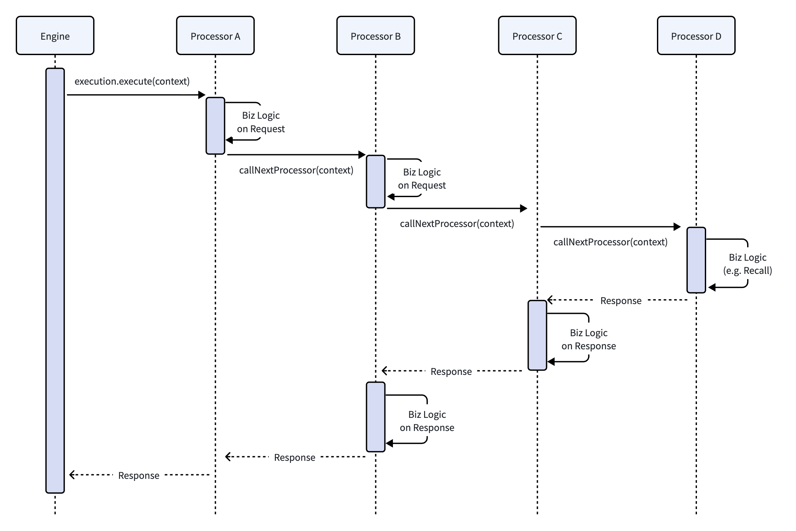

# 《推荐工程实践（2）：链式调度模型设计和实现》


**写在前面**

在《推荐系统架构（12）：Realtime Engine》中，我们介绍了 Process Chain 调度模型，是推荐引擎中的流程编排核心。本次继续更新一篇推荐工程实践系列文章，将从工程实践层面，对 Process Chain 模型的设计和实现，做更深入的介绍。

## 1. Process Chain 和 Processor 示例

本节从一个实际示例开始，让大家对 Process Chain 调度模型的应用有个初步的认识。在讲具体示例之前，先简单介绍一下为什么会选择 Chain 调度这种模式。
### 1.1 从 Search Chain 到 Process Chain

在搜索引擎中，Search Chain（搜索链）是经典的流程调度模型。通过 Search Chain 来组织多个 Searcher（搜索处理器），完成搜索流程中的筛选（召回）、排序，并最终返回结果。推荐系统典型流程是取用户画像、召回、排序、重排，其核心流程和搜索引擎很类似，主要的区别在于搜索有特定的搜索 Query，推荐系统只有用户 ID 而没有显性查询意图。

由于这两类场景流程的相似性，我们在考虑推荐流程调度模型时，首先考虑的就是 Chain 链式调度模型。基于 Search Chain 调度模型，增加推荐系统特有的业务处理逻辑，将 Searcher 转换为 Processor 作为最小业务处理单元，整体的 Search Chain 升级为 Process Chain 概念。

### 1.2 Process Chain 基础配置示例

下面来看一个完整的 Process Chain 配置示例：

``` JSON
{
  "name" : "ASimpleChain",
  "renderer" : "ResultRenderer",
  "processors" : [
    { "name" : "ProcessorA" },
    { "name" : "ProcessorB" },
    { "name" : "ProcessorC" },
    { "name" : "ProcessorD" }
  ]
}
```

配置中，name 作为这个 Process Chain 的唯一标识，是框架进行 Chain 实例化和引用的核心；renderer 是链路的结果封装器，负责把内部的数据封装成对外的标准结构；processors 是所有 Processor 的有序列表，上面这个配置包含 ProcessorA、ProcessorB、ProcessorC、ProcessorD，组成一个链。请求到达时，引擎调起链路首位的 ProcessorA，开始流程执行，然后通过 Processor 内部的 callNextProcessor 依次调用后续节点。processors 列表支持动态调整，可以新增、删除和替换 Processor，让整个流程编排更加灵活。

### 1.3 一个业务 Processor 示例

Processor 是最小业务执行单元，所有的 Processor 类都继承自基类 Processor，主要的业务方法是 process。下面是一个 Processor 示例：

```JAVA
public abstract class Processor {
    public abstract Response process(ExecutionContext context);
    public Response callNextProcessor(ExecutionContext context) {
        return context.getExecution().execute(context, this);
    }
}

public class CacheProcessor extends Processor {
    @Override
    public Response process(ExecutionContext context) {
        // Pre-processing: 前置处理 - 读取缓存，可以快速短路
        String userId = context.getRequest().getParameter("user_id");
        Result result = CacheManager.getInstance().getUserData(userId);
        if (result != null) {
            return ResponseBuilder.buildSuccessResponse(result);
        }

        // 调起链路中的下一个 Processor 执行
        Response response = callNextProcessor(context);

        // Post Processing: 回栈处理 - 计算结果成功时写入缓存
        if (response.isSuccessful()) {
            CacheManager.getInstance().cacheUserData(userId, response.getResult());
            return response;
        }

        return ResponseBuilder.buildErrorResponse("User data not found");
    }
}
```

这部分代码示例清晰展示了 Processor 的执行模式：

- 在 callNextProcessor 方法之前的代码都属于正向前置处理，主要针对请求侧做处理。
- callNextProcessor 方法把控制权返回给 Execution。Execution 对象会从链路中找到下一个 Processor 实例，并调用其 process 方法。
- 调用 callNextProcessor 方法之后的代码，针对 Response 做处理，属于回栈处理逻辑。

## 2. 链式调度模型核心设计思想

### 2.1 核心对象

**ChainConfig 链路配置**

对应上文所说的 JSON 配置文件，负责解析所有的配置信息，是链路初始化的基础。

**Processor 抽象类**

这是所有业务节点的抽象类，如上面代码示例所述，它定义了标准的 process 执行方法，传入 ExecutionContext 对象，返回 Response。所有的业务逻辑都继承自该抽象类，保证框架的统一调度。

**ExecutionContext 上下文**

这是请求中唯一用于链路数据共享的全局数据容器，每个请求都会创建一个独立的 ExecutionContext 实例。该对象中包含请求 Request 对象、中间临时业务数据、执行日志等信息。这个对象贯穿整个链路的执行生命周期，也是 Processor 抽象类业务方法 process 的唯一参数。

**Execution 链路调度对象**

这是框架的核心调度器，负责整个链路的执行和管理。这个对象负责维护该次链路调度的 Processor 列表、各 Processor 计时器、链路状态等。每次调起 Processor 执行时进行检查，例如 Deadline 处理等。Execution 是整个流程控制的核心。

### 2.2 栈式执行语义

Process Chain 采用正向顺序执行、反向回栈收尾的调用模型。我们结合第 1.2 节展示的 Process Chain 配置示例来解释一下执行语义，假设四个 Processor 伪代码如下：

``` JAVA
class ProcessorA extends Processor {
    @Override
    public Response process(ExecutionContext context) {
        // 处理 Request 的代码块
        // ...
        return callNextProcessor(context);
    }
}

class ProcessorB extends Processor {
    @Override
    public Response process(ExecutionContext context) {
        // 处理 Request 的代码块
        // ...
        Response response = callNextProcessor(context);
        // 处理 Response 的代码块
        // ...
        return response;
    }
}

class ProcessorC extends Processor {
    @Override
    public Response process(ExecutionContext context) {
        Response response = callNextProcessor(context);
        // 处理 Response 的代码块
        // ...
        return response;
    }
}

class ProcessorD extends Processor {
    @Override
    public Response process(ExecutionContext context) {
        Response response = callNextProcessor(context);
        if (response.status == Status.NO_MORE_PROCESSOR) {
            Result result = doBizLogic();
            return ResponseBuilder.buildSuccessResponse(result);
        }
        return response;
    }
}
```

根据上面所示的代码，对应的执行时序如下：



正向执行阶段：框架调用 ProcessorA.process 方法，开始链路执行。ProcessorA 中 callNextProcessor 把控制权交还给 Execution 调度器，调度器找到下一个节点为 ProcessorB，然后调用 ProcessorB.process 方法。后续通过 callNextProcessor 依次调用 ProcessorC、ProcessorD。链尾 ProcessorD 调用完之后，开始返回，进入回栈。

反向回栈阶段：ProcessorD 返回 Response，依次返回给 ProcessorC、ProcessorB、ProcessorA，进行回栈部分代码执行。如果没有后置业务逻辑处理代码则继续往后回栈，最后结果返回给框架，进入 Rendering 阶段。

这个模型中，所有的执行逻辑都在单次请求流程中完成，没有复杂的额外调度机制，整体调度开销很低。一个业务逻辑单元的正向、回栈处理都在一个 Processor 内部完成，开发起来比较方便。

但该模型也有一个明显缺点，Processor 执行并不是按配置那样的顺序执行，而是存在回栈逻辑。对于 Response 处理，排在前面的 Processor 反而比后面的 Processor 执行得更晚。因此，业务开发人员需要充分理解这种栈式执行语义，才能正确组织 Processor 中的前置和后置逻辑。

### 2.3 模型扩展特性

链式调度模型的基础是串行执行，但随着业务慢慢变复杂，会有分支、并行需求。在不破坏模型核心的前提下，框架提供了一些轻量化的扩展能力，以下是几个比较重要的能力：

**Processor 短路执行**

如前面的 CacheProcessor 示例所述，在 Processor 中，可以根据 Request 参数以及本地状态，决定是否对后续所有 Processor 进行短路。这个非常适合缓存的场景，当命中缓存时，从缓存取数据快速返回，很大程度上节省链路的整体执行时间。

**分支执行**

框架在 ExecutionContext 中保存变量控制 Processor 是否要跳过（例如 ProcessorB.skip = true）。Execution 执行某个 Processor 前，检查对应的 skip 标志；如果需要跳过，则直接找到该 Processor 的下一个节点执行。因为这个跳过的 Processor 没被执行，回栈逻辑也不经过它。

而后在配置链路时，配置两个分支 Processor1 和 Processor2，根据 ExecutionContext 的标识，来控制是否要跳过 Processor1 或 Processor2。这样框架能一定程度上支持简单的分支执行。

**并行子链扩展**

对于一些并行处理场景，框架提供了一个特殊的 ParallelChainsProcessor。在链路配置的最末端，配置该 Processor，可以并行执行多个子链，等待所有结果返回后进行合并，再将结果返回上一层。这样可以解决基础模型无法并行的短板。不过这个 Processor 有严格的约束，只能放在链路最后位置，以免打乱主体链路的执行逻辑。

使用该 Processor 的完整配置示例如下：

```JSON
{
  "name" : "AChainWithSubChains",
  "renderer" : "ResultRenderer",
  "processors" : [
    { "name" : "ProcessorA" },
    { "name" : "ProcessorB" },
    { "name" : "ProcessorC" },
    {
      "name" : "ParallelChainsProcessor" ,
      "config": { "chains" : ["subChain1", "subChain2"] }
    }
  ],
  "subChains": {
    "subChain1": {
        "processors": [
            {"name": "ProcessorE"},
            {"name": "ProcessorF"}
        ]
    },
    "subChain2": {
        "processors": [
            {"name": "ProcessorE"},
            {"name": "ProcessorG"}
        ]
    }
  }
}
```

核心逻辑：主链路执行到末端 ParallelChainsProcessor 时，框架读取配置，找到即将执行的两个子链。此时框架从主链的 ExecutionContext 中复制出两个新实例，再创建两个新 Execution 对象，并行发起 subChain1、subChain2 的执行。两个子链异步并行执行，互相不影响。等所有子链执行完之后，ParallelChainsProcessor 收集处理之后的 ExecutionContext 和 Response，汇总到主链的 ExecutionContext 和 Response 中，逐级回栈返回。这样，框架在不改动基础模型调度的基础上实现了并行能力。

## 3. 调度执行器核心实现

前面在介绍 Processor 抽象类和 Chain 执行语义时，已经涉及了调度器的一部分核心实现。本节继续介绍其余几个核心部分。
### 3.1 链路初始化

在系统启动或者配置更新时，会对 Process Chain 进行初始化动作。主要动作包括：

- 解析所有的 Processor 名称，根据名称创建 Processor 实例。
- 根据 Chain 配置，创建 Chain 实例，把 Processor 实例组织成列表，存储在 Chain 实例中。

### 3.2 请求初始化

每次请求进来，进行请求的初始化：

- 将 exp_id 展开成实际参数，其中包括 Chain 名称。
- 创建 Execution 调度对象，根据配置 Chain 名称找到 Chain 实例，把 Processor 列表复制到 Execution 对象中。
- 对于每个 Processor 实例，创建一个计时器（Stopwatch），放入 Execution 对象。根据请求的 Deadline 配置和当前时间，计算请求最终的 Deadline 时间戳，存入 Execution 对象中。
- 创建 ExecutionContext 对象，把 Request 请求、exp_id 扩展出来的参数、Execution 对象都附加在 ExecutionContext 对象中。
- Execution 以新创建的 ExecutionContext 为参数调用 execute 方法，开始执行第一个 Processor。
### 3.3 Execution 调度器

Execution 调度器的核心执行方法是 execute，其大概执行过程伪代码如下：

``` JAVA
Response execute(ExecutionContext context, Processor currentProcessor) {
    Processor nextProcessor = null;
    if (currentProcessor == null) {
        nextProcessor = processorList.get(0);
    } else {
        int currentIndex = processorList.indexOf(currentProcessor);
        if (currentIndex + 1 < processorList.size()) {
            nextProcessor = processorList.get(currentIndex + 1);
        }
    }

    if (nextProcessor == null) {
        return ResponseBuilder.buildNoMoreProcessorResponse();
    }

    if (System.currentTimeMillis() > context.getDeadline()) {
        return ResponseBuilder.buildErrorResponse("Deadline exceeded");
    }

    StopWatch nextStopWatch = stopWatches.get(nextProcessor);
    if (currentProcessor != null) {
        stopWatches.get(currentProcessor).stop();
    }
    nextStopWatch.resume();
    Response response = nextProcessor.process(context);
    nextStopWatch.stop();
    if (currentProcessor != null) {
        stopWatches.get(currentProcessor).resume();
    }

    return response;
}
```

> 注：此处仅是伪代码，异常处理、Deadline 具体处理逻辑、StopWatch 边界条件等都经过简化。此代码仅展示大概的调度逻辑。

- 链路最开始调用时：Execution.execute(context, null)，此时没有传入正在执行的 Processor，Execution 对象找到链路第一个 Processor 开始执行。
- 第一个 Processor 执行 callNextProcessor 时，控制权转回 Execution.execute 方法，此时 currentProcessor 指向正在执行的 Processor。然后 Execution 能找到它的下一个节点。
- 如果下一个节点为空，直接返回 NoMoreProcessor，回栈处理时，上一个 Processor 知道自己处于链路最末尾。
- 每次执行 Processor 之前，都检查 Deadline 是否到达，超时直接返回错误。
- 因为是栈式调用，执行下一个 Processor.process 方法之前把当前 Processor 的计时器暂停，然后开始下一个 Processor 计时器。下一个 Processor 返回之后再继续当前 Processor 计时器。这样统计的执行时间，是当前 Processor 真正执行消耗的时间。

### 3.4 跨语言实现

Process Chain 是一套与编程语言无关的模型架构，Vespa 引擎基于 Java 语言实现了完整的链式调度框架。关于 Vespa Chain 框架可以参考文末的链接。这套框架可以同时支持搜索和推荐业务，以后有时间，我可以再单开一系列文章基于 Vespa 讲讲搜索引擎到推荐引擎的演进。

后来在另外一家公司，推荐业务后端是 C++。基于 C++ 语言，我们也实现了类似的 Chain 调度模型，适配高并发、低延时场景，并提供灵活的业务流程编排能力。两套实现的核心调度逻辑、栈式调用语义、扩展能力都是一样的，只是语言实现不一样。

## 4. 设计与工程实现权衡

架构设计的核心是取舍和权衡，Process Chain 模型的选择以及后续的落地，也是一系列权衡的过程。

### 4.1 流程编排模型选择

在选择编排模型时，我们对多种模型进行过对比：

| **模型** | **适合场景**   | **优点**         | **局限**   |
| ------ | ---------- | -------------- | -------- |
| Chain  | 主流程线性、少量扩展 | 架构简单、调度开销低、可插拔 | 复杂分支较弱   |
| 状态机    | 状态转换明显     | 状态语义清晰         | 流程编排不够直观 |
| DAG    | 复杂依赖、并行任务  | 表达能力强          | 实现和调度复杂  |

推荐请求流程本身是一个相对稳定的流水线，因此 Chain 模型的表达能力足够，同时它源自于 Search Chain，实现成本相对较低。

### 4.2 Processor 运行实例策略权衡

Processor 实例创建有两种方案：一个实例复用到所有请求、每个请求创建新实例。经过业务逻辑分析和对比，我们最终采用全局单实例的模式。这样选择的主要原因是 Processor 本身只处理业务逻辑，因此应该设计为无状态对象。所有的请求数据和业务中间数据，都应该保存在 ExecutionContext 上下文中。Processor 对象本身不存储请求级中间数据，从而可以在多个请求之间安全复用，这样不需要频繁的创建、销毁对象，在内存管理方面有很大帮助。这种模式需要告知所有的开发人员，不能使用 Processor 的实例成员变量存储请求级中间数据，只能通过 ExecutionContext 传递。

### 4.3 配置热更新，灵活性和稳定性的权衡

如果链路配置支持热更新，那么在不重启服务的情况下可以对 Process Chain 进行修改，这样能很大程度上提升其灵活性，并且在线上出现问题时也可以进行快速修复。但热更新会带来一些问题，影响稳定性，配置写错了可能会导致整个链路异常。

经过讨论和权衡，最终确定还是保持热更新策略，然后在框架中增加配置前置校验机制。在配置有变更的情况下，自动校验配置格式、实例化 Chain 和 Processor，然后分析链路的合法性以及拓扑合理性。如果这些校验步骤失败，则配置更新失败，从而最大限度地兼顾链路配置的灵活性和运行稳定性。

### 4.4 模型局限性与扩展

如 2.3 节所述，Chain 模型的核心短板对分支、并行的支持不是很好。随着业务逐渐复杂，对分支和并行的需求开始增加。当时主要讨论了两种方案：更换表达能力更强的调度模型，或者在现有 Chain 模型上进行扩展。更换模型不太现实，因为调度框架、所有的业务 Processor 都需要重新开发，代价太大。经过权衡，最终选择是在已有框架下进行有限扩展，支持必要的分支和并行能力，具体实现如 2.3 节所述。这类扩展，已经能满足已知和未来某个阶段的需求，并且不需要对模型进行变更，所有业务 Processor 都无感知，代价最小。

## 5. 总结和工程延伸

Process Chain 链式调度模型架构简洁、调度高效，业务 Processor 可以灵活插拔，并能在基础模型之上进行有限的能力扩展，非常适合推荐系统相对稳定的在线处理流程。

在设计和实现模型框架之外，工程上还有两个延伸方向。首先是单元测试体系，对模型的核心对象 ExecutionContext、Execution 提供 Mock 能力，可以对 Processor 和 Chain 进行可控的单元测试，保证开发的正确性。其次是线上监控和故障排查，Execution 调度器记录各 Processor 相关指标（耗时、调用次数、错误率等），然后记录链路调用日志，集中收集之后能够很好地辅助问题排查，提高故障定位和解决效率。

## References

- Vespa Chain 设计：[https://docs.vespa.ai/en/applications/chaining.html](https://docs.vespa.ai/en/applications/chaining.html)
 
